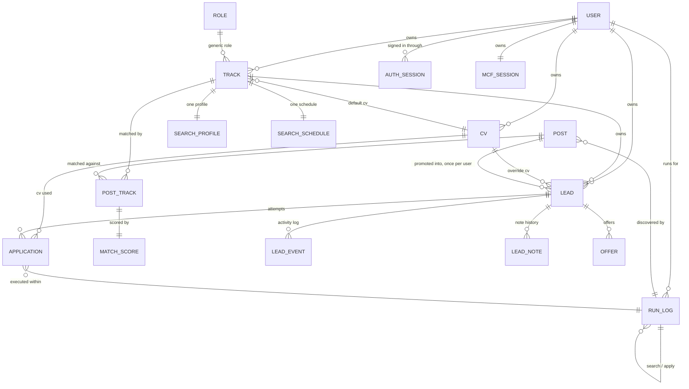

# Easy MCF POC Local - Data Model

Release `010` design. Source: [docs/releases/010/design/010-data-model.md](https://github.com/yayfalafels/easymcf/blob/main/docs/releases/010/design/010-data-model.md).

## Contents

- [Purpose](#purpose)
- [References](#references)
- [Entity-relationship overview](#entity-relationship-overview)
- [Entities](#entities)
  - [`user`](#user)
  - [`auth_session`](#auth_session)
  - [`role`](#role)
  - [`track`](#track)
  - [`search_profile`](#search_profile)
  - [`search_schedule`](#search_schedule)
  - [`cv`](#cv)
  - [`post`](#post)
  - [`post_track`](#post_track)
  - [`match_score`](#match_score)
  - [`lead`](#lead)
  - [`lead_note`](#lead_note)
  - [`lead_event`](#lead_event)
  - [`offer`](#offer)
  - [`application`](#application)
  - [`run_log`](#run_log)
  - [`mcf_session`](#mcf_session)
- [Design notes](#design-notes)
  - [Schema versions](#schema-versions)

## Purpose

Entities and relationships for the SQLite database (REQ-PLAT-02), derived from the **workflows**. Read that first. Every entity/field below exists to support a specific step in one of its workflows. Field lists here are conceptual, covering name, intent, and source requirement. Column types, indexes, and the generic CRUD envelope (REQ-PLAT-01) are the architecture/design milestone's job.

## References

- **workflows**: [010-workflows.md](workflows.md) — the process steps each entity and field below exists to support.
- **prototype extraction**: [010-prototype.md](https://github.com/yayfalafels/easymcf/blob/main/docs/releases/010/design/010-prototype.md) — the `cv_select()` substring-match mechanics the `cv` entity's label is matched against.
- **architecture**: [010-architecture.md](architecture.md) — `ARCH-STO-02/03` for the recreate-don't-migrate rule the Schema versions table below records, and `ARCH-SCHED-01..06` for the runtime behind the `search_schedule` table and `run_log.trigger_source`.

## Entity-relationship overview

`MCF_SESSION`, the MCF credential store, has no FK relationship to domain data beyond its owner. It is one row per user that the apply run checks (Workflow 8). `AUTH_SESSION` is the sign-in session store and is unrelated to `MCF_SESSION`.

## Entities

### `user`

A person with an account. Every `track`, `cv`, `lead`, `run_log`, and `mcf_session` row belongs to exactly one user, and a user sees only their own rows (REQ-AUTH-06). A user signs in with an email and password, with a linked Google identity, or with both (REQ-AUTH-01..04).

| field           | notes                                                                             |
| --------------- | --------------------------------------------------------------------------------- |
| `id`            | PK                                                                                |
| `name`          | display name, 1 to 80 characters                                                  |
| `email`         | unique, stored lowercase, REQ-AUTH-01                                             |
| `status`        | `active` \| `disabled`, a disabled user cannot sign in                            |
| `password_hash` | nullable scrypt hash, null for a Google-only account, REQ-AUTH-09                 |
| `google_sub`    | nullable unique Google subject identifier, REQ-AUTH-04                            |
| `photo_ref`     | nullable path of the stored profile photo relative to the photo store, REQ-AUTH-08 |
| `created_at`    | creation timestamp                                                                |

A table constraint requires at least one of `password_hash` and `google_sub`, so every account has a way to sign in. The hash and the subject are never serialized by the API. The photo bytes live on disk outside the database, and the row holds the reference only.

### `auth_session`

A signed-in browser session (REQ-AUTH-05). One row per sign-in, deleted at sign-out and purged after expiry.

| field        | notes                                                        |
| ------------ | ------------------------------------------------------------ |
| `id`         | PK                                                           |
| `user_id`    | FK → `user`, cascades on delete                              |
| `token_hash` | unique SHA-256 digest of the random session token            |
| `created_at` | sign-in timestamp                                            |
| `expires_at` | absolute expiry, the session is valid while now is before it |

The database stores the digest and never the token, so reading the file yields no usable cookie. The token travels only in the signed `easymcf_session` cookie (`ARCH-AUTH-02`).

### `role`

Generic job title/domain, not user-specific (glossary, REQ-SRCH-01 implicitly).

| field         | notes                |
| ------------- | -------------------- |
| `id`          | PK                   |
| `name`        | e.g. "Data Engineer" |
| `description` | optional             |

### `track`

A user's role at a seniority level (glossary), owned by one `user` through `user_id`. Search profiles, schedules, post matches, and leads reach their owner through the track.

| field           | notes                                     |
| --------------- | ----------------------------------------- |
| `id`            | PK                                        |
| `user_id`       | FK → `user`                               |
| `role_id`       | FK → `role`                               |
| `seniority`     | e.g. junior/mid/senior, or a level number |
| `default_cv_id` | FK → `cv`, nullable — REQ-APPLY-02        |
| `is_active`     | bool, default true — false ⇒ archived (REQ-SRCH-10), hidden from active track selectors |

An archived (`is_active = false`) track is not physically deleted, mirroring the `post.is_open` pattern below. Its historical `post_track`, `lead`, and `application` rows stay readable. Only its availability in active selectors, such as search run, manual lead add, or apply default CV, changes.

### `search_profile`

Exactly one per track (REQ-SRCH-01). Modeled as a 1:1 extension of `track` rather than a separate PK, since it has no independent lifecycle.

| field             | notes                                |
| ----------------- | ------------------------------------- |
| `track_id`        | PK, FK → `track`                      |
| `keywords`        | one or more search keyword strings    |
| `min_salary`      | REQ-SRCH-01                           |
| `max_age_weeks`   | REQ-SRCH-01                           |
| `min_match_score` | user-set threshold, dormant until a differentiating scoring method exists, REQ-SRCH-09 |
| `employment_type` | defaults `'Full Time'`, REQ-SRCH-01   |

### `search_schedule`

Exactly one per track (REQ-SRCH-11), a 1:1 extension of `track` the same way `search_profile` is, since a schedule has no lifecycle independent of the track it belongs to. See `ARCH-SCHED-02` for the table-shape decision.

| field                     | notes                                                                        |
| ------------------------- | ---------------------------------------------------------------------------- |
| `track_id`                | PK, FK → `track`                                                             |
| `schedule_enabled`        | bool, default false — scheduled-run switch                                   |
| `schedule_interval_hours` | int, default 24, must be > 0 — spacing between runs                          |
| `next_run_at`             | timestamp, nullable — next due instant, scheduler-owned after the first fire |

These three fields are the complete definition of a schedule. `schedule_enabled = false` on every seeded row, so scheduling is opt-in per track and a freshly reset database never fires an unattended run. `next_run_at` is writable by the user, which is how the first fire time is chosen: "every night at 8pm" is `next_run_at` = tonight 20:00 with `schedule_interval_hours = 24`, so no separate time-of-day column exists. Leaving it null while enabling the schedule means "due now", after which the scheduler owns the column and advances it (`ARCH-SCHED-03`). There is no `last_run_at` here — `run_log` already records every run against its `track_id`, and a second copy could only drift from it.

### `cv`

A named CV/resume version, unique by label within its owner, that the user can assign as a track default or a per-lead override (REQ-APPLY-02). The actual file lives on MCF's own profile. 010 only needs to remember the label the apply run matches against MCF's resume-selector options by substring, per the **prototype extraction**'s `cv_select()`. This table is a small label catalog.

| field     | notes                                                               |
| --------- | ------------------------------------------------------------------- |
| `id`      | PK                                                                  |
| `user_id` | FK → `user`                                                        |
| `label`   | unique per user, matched by substring against MCF's resume card titles at apply time |
| `is_active` | 1, or 0 once retired: removed while only attempt history or an archived track uses it  |

### `post`

Source-of-truth listing shared by every user (glossary, REQ-SRCH-03/06/07). One row per posting regardless of how many tracks match it or how many leads it spawns. A post is read-only to every user. Only the search run, the detail pass, and the manual entry endpoints write it, always on the server. A user sees a post through a `post_track` row on one of their tracks or through one of their leads.

| field                     | notes                                                                          |
| ------------------------- | ------------------------------------------------------------------------------ |
| `id`                      | PK — stable dedup id: `source + posting_reference + posted_date` (REQ-SRCH-05) |
| `source`                  | e.g. `"MyCareerFutures"`                                                       |
| `position_title`          | REQ-SRCH-03                                                                    |
| `company_name`            | REQ-SRCH-03                                                                    |
| `url_ref`                 | posting reference/URL, REQ-SRCH-03                                             |
| `posted_date`             | REQ-SRCH-03                                                                    |
| `salary_high`             | from card if shown, REQ-SRCH-03                                                |
| `is_open`                 | bool, false ⇒ removed from active set (REQ-SRCH-06)                            |
| `closing_date`            | detail pass, REQ-SRCH-06                                                       |
| `applicants`              | detail pass, REQ-SRCH-06                                                       |
| `industry_classification` | detail pass, REQ-SRCH-06                                                       |
| `description`             | detail pass, REQ-SRCH-06                                                       |
| `mcf_ref`                 | detail pass, REQ-SRCH-06                                                       |
| `src_method`              | `scraped` \| `manual` — REQ-SRCH-07/08                                         |
| `run_id`                  | FK → `run_log`, nullable — REQ-SRCH-08                                         |

An `is_open = false` post is not physically deleted. History stays available to any lead already promoted from it. Only its active-set membership changes. `run_id` is null for manually entered posts.

### `post_track`

One row per post: the track its search found it under, or the track a manual entry names (REQ-SRCH-08/09). The shape is a join table, but `010` never writes more than one pairing per post — see Decision 2.

| field          | notes                                                                        |
| -------------- | ----------------------------------------------------------------------------- |
| `post_id`      | PK part, FK → `post`                                                         |
| `track_id`     | PK part, FK → `track`                                                        |
| `search_match` | bool — true if found by this track's search, false if named on manual entry |

The one track a resulting lead belongs to is simply this row's `track_id`, since a post carries only one (Decision 2), and no separate track flag lives on the post. Each pairing's score lives in `match_score` below rather than on this row, so a rescoring pass can replace a score without touching the association itself.

### `match_score`

Exactly one row per `post_track` pairing, each scored independently (REQ-SRCH-09). Modeled as a 1:1 extension of `post_track` rather than a separate PK, since it has no independent lifecycle. Split out from `post_track` so the association, `search_match`, and the scoring result can change independently of each other.

| field          | notes                                  |
| -------------- | --------------------------------------- |
| `post_id`      | PK part, FK → `post_track.post_id`     |
| `track_id`     | PK part, FK → `post_track.track_id`    |
| `match_score`  | 0–1, REQ-SRCH-09                       |
| `score_method` | e.g. `title_keyword_v1` — REQ-SRCH-09  |

`score_method` is recorded alongside the score so a future NLP-based method can be added later without a schema change (REQ-SRCH-09).

### `lead`

One user's personal, trackable instance of a post for one track (glossary, REQ-CRM-01..06). The lead holds its own copies of the post's display fields, so the user edits the lead and never the post.

| field                 | notes                                                                                |
| --------------------- | ------------------------------------------------------------------------------------ |
| `id`                  | PK, the lead's own unique identifier                                                 |
| `user_id`             | FK → `user`, the owner, always equal to the owner of `track_id`                      |
| `post_id`             | FK → `post`, the promoted post                                                       |
| `track_id`            | FK → `track`, the promoting run's track, editable (REQ-CRM-12)                       |
| `cv_id`               | FK → `cv`, nullable per-lead override of `track.default_cv_id`, REQ-APPLY-02         |
| `status`              | `OPEN` \| `CLOSED`, REQ-CRM-02                                                       |
| `stage`               | enum, see Workflow 5 stage diagram                                                   |
| `close_reason`        | enum, set when `status = CLOSED` — see Workflow 5                                    |
| `position_title`      | copied from the post at creation, user-editable, REQ-CRM-03/04                       |
| `company_name`        | copied from the post at creation, user-editable, REQ-CRM-03/04                       |
| `url_ref`             | nullable, copied from the post at creation, user-editable, `http` or `https`         |
| `deadline`            | REQ-CRM-03, system-maintained (REQ-CRM-05), see `lead_event`                         |
| `applied_date`        | REQ-CRM-03                                                                           |
| `first_attempt_date`  | REQ-CRM-03, the date of the lead's first `application` attempt                       |
| `last_contact_date`   | REQ-CRM-03                                                                           |
| `expected_salary_sgd` | nullable integer `>= 0`, REQ-CRM-09, copied from profile `min_salary` at creation    |
| `created_at`          | creation timestamp (promotion or manual add)                                         |
| `updated_at`          | refreshed by each `lead_event` written for the lead, drives auto-expiry (REQ-CRM-05) |

Uniqueness: `(user_id, post_id)`. A post can be promoted into at most one lead per user, and two users can each hold a lead on the same post. Once a user has promoted a post, it is excluded from that user's further promotion under any track (Workflow 4). A trigger rejects a lead whose `user_id` differs from the owner of its `track_id`, so the ownership shortcut on the lead cannot drift from the track. The four display fields `position_title`, `company_name`, `url_ref`, and `deadline` are the only values the Leads screens show, and the post row is never read for display after promotion. A later change to the post, such as a detail pass filling its `closing_date`, never rewrites a lead. The CV an apply run uses for a lead is its effective CV, `COALESCE(lead.cv_id, track.default_cv_id)`. The override lives on the lead because the user sets it before an attempt exists, and `application` rows are append-only attempt records the apply service writes. Free-text notes are not a field on this row. They live in `lead_note` below, so a lead can carry a history of multiple notes rather than one that overwrites the last.

### `lead_note`

An append-only note history for a lead (REQ-CRM-03). One-to-many from `lead`: each note the user adds is a new row rather than an overwrite of a single `lead.notes` field, so earlier notes stay readable alongside later ones.

| field        | notes                                              |
| ------------ | --------------------------------------------------- |
| `id`         | PK                                                  |
| `lead_id`    | FK → `lead`                                         |
| `note`       | free text                                          |
| `created_at` | timestamp — pairs with a `lead_event(event_type='note_edited')` row |

### `lead_event`

An append-only activity log entry for a lead (REQ-CRM-08). One-to-many from `lead`: every stage transition, contact logged, note added, deadline change, or other field edit writes a new row rather than mutating a summary field, so the lead's full activity history is reconstructable and its `deadline` maintenance (feeding auto-expiry, REQ-CRM-05) has a source of truth beyond a bare field mutation. Scheduled interview/callback details, such as an interview's date/time, are captured as free text in an event's `detail` or in a `lead_note`, rather than as a dedicated structured field. `lead.deadline` is maintained by the system across the lead's lifecycle rather than fixed once at creation: derived from the post at promotion (its `closing_date`, else `posted_date` plus 28 days, else the promotion date plus 1 week when `closing_date` is on or before the promotion date) and refreshed to 28 days from the most recent activity on every update from `CALLBACK` onward (REQ-CRM-05). Each automatic reset is itself written here as a `deadline_changed` row, the same event type a user's manual edit uses.

| field         | notes                                                                    |
| ------------- | -------------------------------------------------------------------------- |
| `id`          | PK                                                                       |
| `lead_id`     | FK → `lead`                                                              |
| `event_type`  | `stage_change` \| `contact_logged` \| `note_edited` \| `deadline_changed` \| `field_edited` |
| `detail`      | free text: the changed fields other than `stage` with old and new values, or a note excerpt |
| `stage_from`  | stage before the update, `NULL` only on the creation event              |
| `stage_to`    | stage after the update                                                  |
| `occurred_at` | timestamp — the value that refreshes `lead.updated_at`                  |

**Stage context.** Every event states the stage the lead held before the update in `stage_from` and after it in `stage_to`, so the history reads as a chain and shows the stage at which each update happened. The values follow the event's source:

| id | event source                                | stage_from        | stage_to          |
| -- | ------------------------------------------- | ----------------- | ----------------- |
| 01 | system promotion                            | `NULL`            | `TOAPPLY`         |
| 02 | manual lead add                             | `NULL`            | `APPLIED`         |
| 03 | stage transition or close (user, apply)     | stage before      | stage after       |
| 04 | offer attached                              | `INTERVIEW`       | `OFFER`           |
| 05 | offer final status, or auto-expiry close    | stage at close    | `CLOSED`          |
| 06 | re-open of a lead closed from `OFFER`       | `CLOSED`          | `INTERVIEW`       |
| 07 | contact, field edit, deadline edit, note    | current stage     | current stage     |
| 08 | automatic deadline refresh                  | stage after write | stage after write |

Two constraints in `schema.sql` enforce the shape. Both columns hold only the six stage values (`stage_from` also allows `NULL`), and a `stage_change` event always changes the stage while every other event type holds it, with `NULL` allowed only in a `stage_change` from the creation. Across a lead's events ordered by `id`, each `stage_from` equals the previous `stage_to`, the first `stage_from` is `NULL` with `stage_to` `TOAPPLY` (system promotion) or `APPLIED` (manual add), and the last `stage_to` equals `lead.stage`. The re-open of a lead closed from `OFFER` is a `stage_change` from `CLOSED` to `INTERVIEW`, and the chain continues from there.

### `offer`

A job offer made on a lead (REQ-CRM-10). One-to-many from `lead`: a lead can carry several offers over its life, since a lead closed from an offer can be re-opened and given a new one, and every offer stays as history.

| field        | notes                                                                       |
| ------------ | --------------------------------------------------------------------------- |
| `id`         | PK                                                                          |
| `lead_id`    | FK → `lead`                                                                 |
| `offer_date` | ISO date the offer was made                                                 |
| `deadline`   | ISO date, defaults to the lead's `deadline` when the offer is created       |
| `amount_sgd` | integer, `> 0`                                                              |
| `status`     | `open` \| `accepted` \| `rejected` \| `withdrawn` \| `expired`, default `open` |
| `created_at` | creation timestamp                                                          |
| `updated_at` | refreshed on each write to the offer                                        |

An index on `lead_id` serves the history reads, and a partial unique index (`UNIQUE (lead_id) WHERE status = 'open'`) allows one open offer per lead. A lead at stage `OFFER` has exactly one open offer, because attaching the offer and moving the lead happen in one transaction (`POST /api/v1/offer`). Its final status maps to the lead's close reason: `accepted` to `offer_accepted`, `rejected` to `rejected`, `withdrawn` to `withdrawn`, and `expired` to `expired`. While `open`, `amount_sgd` and `deadline` are editable, and `lead.deadline` follows the offer deadline. A final status makes the offer read-only, and the `offer` resource has no delete.

### `application`

An automated apply attempt against a lead (glossary, REQ-APPLY-01..09). One-to-many from `lead`: a retried attempt, for example after fixing a `cv_not_found`, is a new row rather than an overwrite. REQ-APPLY-08 requires each application's outcome to leave every other application's outcome untouched, and Workflow 7 relies on retry history being preserved.

| field          | notes                                                    |
| -------------- | -------------------------------------------------------- |
| `id`           | PK                                                       |
| `lead_id`      | FK → `lead`                                              |
| `cv_id`        | FK → `cv`, nullable, the effective CV this attempt used  |
| `status`       | enum, see REQ-APPLY-04 / Workflow 6 for full vocabulary  |
| `error_detail` | nullable free text, REQ-PLAT-03                          |
| `attempted_at` | timestamp of this attempt                                |
| `run_id`       | FK → `run_log` — which apply run this attempt belongs to |

### `run_log`

Every automated run: search or apply (REQ-PLAT-03). Scoring is not a separate run type — it happens inline within a search run (Workflow 2).

| field            | notes                                                          |
| ---------------- | -------------------------------------------------------------- |
| `id`             | PK                                                             |
| `run_type`       | `search` \| `apply`                                            |
| `track_id`       | FK → `track`, nullable — null for apply runs (may span tracks) |
| `user_id`        | FK → `user`, the run's owner                                   |
| `trigger_source` | `manual` \| `scheduled`, default `manual` — ARCH-SCHED-05      |
| `started_at`     | REQ-PLAT-03                                                    |
| `ended_at`       | nullable while running                                         |
| `status`         | `running` \| `success` \| `partial` \| `failed`                |
| `outcome_counts` | JSON text, search-run keys below — REQ-PLAT-03                 |
| `error_detail`   | nullable, REQ-PLAT-03                                          |

Each run belongs to one user, and at most one run of each type per user is `running` at a time (`ARCH-RUN-03`). A search run is always track-scoped. An apply run can span leads queued across multiple tracks, so `track_id` may be null there. `trigger_source` distinguishes a run the user started (REQ-SRCH-02) from one the scheduler fired (REQ-SRCH-11); apply runs are always `manual` in `010`, since nothing schedules them. `status` gains no `skipped` value: a scheduled trigger that collided with an in-flight run never started a run, so it writes no row here at all (`ARCH-SCHED-05`).

A search run's `outcome_counts` holds the pipeline counters `keywords`, `pages`, `cards`, `new_posts`, `existing_posts`, `detailed`, `closed`, `detail_errors`, `promoted`, `promote_errors`, and `mcf_mode`. It also holds the progress keys the Posts page's progress display reads while the run is `running` (feature 10, `10.IS.16`): `stage` (`searching`, `detailing`, `done`), `keywords_total`, and `detail_total`. The run commits these as it goes, so a poll mid-run sees live progress. A run that crashes keeps the counts and `stage` it had reached.

### `mcf_session`

One row per user tracking browser state established through Workflow 8 and consumed by apply automation and authenticated MCF links. The credential payload is sensitive and stored outside SQLite as one Playwright storage-state file plus one sessionStorage sidecar per user. This row stores only the primary filename and confirmed account identity. A seeded row starts `missing` because seed data creates no credential files.

| field                     | notes                                                   |
| ------------------------- | ------------------------------------------------------- |
| `id`                      | PK                                                      |
| `user_id`                 | unique FK → `user`, one row per user, created at sign-up |
| `status`                  | `valid` \| `expired` \| `missing`                      |
| `uploaded_at`             | when authenticated browser state was last saved         |
| `cookie_ref`              | storage-state filename, never the credential payload     |
| `confirmed_account_email` | nullable MCF account identity confirmed by the user      |
| `confirmed_at`            | nullable ISO-8601 timestamp of identity confirmation     |

## Design notes

- `cv` is its own small catalog table rather than a free-text field on `track`/`application`, so the UI can offer a dropdown of known CVs rather than free text.
- `run_log` unifies search and apply run logging into one table (`run_type` discriminator) rather than two, since both need the same start/end/outcome/error shape (REQ-PLAT-03).
- `track.is_active` follows the same soft-delete shape as `post.is_open` — a bool flip rather than a row deletion, so archived tracks keep every dependent row (`post_track`, `lead`, `application`) intact.
- `lead_event` makes lead activity an append-only log rather than a single mutable `updated_at` column, mirroring why `application` is one-to-many from `lead` rather than a single overwritten row (REQ-APPLY-08). Both exist so retry/activity history survives rather than being clobbered by the next update.
- ownership is a `user_id` column on `track`, `cv`, `lead`, `run_log`, and `mcf_session`. Every other table reaches its owner through one of those, `search_profile`, `search_schedule`, `post_track`, and `match_score` through the track, and `lead_note`, `lead_event`, `offer`, and `application` through the lead. `lead` carries its own `user_id` so the one-lead-per-user-per-post rule is a plain unique constraint. The `post` table has no owner, and `role` is a shared catalog.
- `lead` holds copies of the post's display fields rather than reading them through a join, so a user edits the lead and the shared post stays read-only. The copy happens once at creation.
- `auth_session` stores a token digest rather than the token, and `mcf_session` is a separate table because the two sessions serve unrelated purposes.
- `match_score` is split out of `post_track` as its own 1:1 extension, the same shape `search_profile` already uses against `track`. This keeps the association and the scoring result independently replaceable, so a rescoring pass can update `match_score`/`score_method` without touching `post_track`'s `search_match` provenance flag.
- `lead_note` replaces the single `lead.notes` field with an append-only history table, the same shape as `lead_event`, so a lead can carry more than one note over its lifetime instead of the latest edit overwriting every earlier one. Adding a `lead_note` still writes a paired `lead_event(event_type='note_edited')` row, so the unified activity timeline is unaffected.
- scheduled runs (REQ-SRCH-11) are modeled as `search_schedule`, a 1:1 extension of `track` the same shape as `search_profile`, plus one discriminator on `run_log`. A schedule has no lifecycle independent of the track it belongs to, exactly as `search_profile` has none, so it gets the same 1:1-extension treatment. The consequence that matters downstream: REQ-SRCH-11 adds no write hook and no named endpoint — `search_schedule` is `API-CAT-01` pure generic, the same shape `search_profile` already uses. `ARCH-SCHED-01..06` cover the runtime side.

### Schema versions

`schema.sql` is hand-maintained with no migration chain (`ARCH-STO-02`), so each change to this document that reaches the database is recorded as a `meta.schema_version` bump rather than as a migration file. The table is the changelog.

| id | version | milestone | change                                                                        |
| -- | ------- | --------- | ----------------------------------------------------------------------------- |
| 01 | 1       | 07        | `meta` only — milestone-07 placeholder                                        |
| 02 | 2       | 08        | the 13-table release-010 data model                                           |
| 03 | 3       | 08        | adds `user`, `match_score`, `lead_note`, `user_id` ownership columns          |
| 04 | 4       | 09        | adds `search_schedule` table, `field_edited` in `lead_event.event_type`       |
| 05 | 5       | 09        | adds `lead_event.stage_from` and `lead_event.stage_to`                        |
| 06 | 6       | 09        | `lead.expected_salary_sgd`, `offer`, six stage values, `dropped` close reason |
| 07 | 7       | 13        | accounts, `auth_session`, `mcf_session`, `lead.user_id`, `run_log.user_id`    |
| 08 | 8       | 17        | adds `mcf_attempt`, `mcf_session.confirmed_account_email`/`confirmed_at`      |
| 09 | 9       | 10        | adds `run_log.trigger_source`, `lead.close_reason` `track_not_matched`        |
| 10 | 10      | 11        | adds `lead.cv_id`, the per-lead CV override                                   |
| 11 | 11      | 11        | adds `cv.is_active`, retiring a label history still uses (11.IS.19)           |

Versions 4 and 5 are implemented by milestone 09, version 6 is specified by task 09.13 of milestone 09, version 7 is specified for feature 13, version 8 is specified for feature 17, version 9 is specified for milestone 10 to implement, and version 10 is specified and implemented by task 11.10 of feature 11. Version 7 renames `session` to `mcf_session`, replaces `lead.title_override` and `lead.company_override` with `lead.position_title`, `lead.company_name`, and `lead.url_ref`, changes the `lead` uniqueness to `(user_id, post_id)`, replaces `cv.label`'s global uniqueness with uniqueness per user, and adds `run_log.user_id`. Version 8 adds the Google connect-attempt table and the two account-confirmation columns `mcf_session` gained for that flow. Version 10 moves the CV override from `application` to `lead`, since an override must exist before the lead's first attempt. Version 11 lets a CV label leave every picker while `application.cv_id` keeps naming the CV each attempt used. The remedy for a version mismatch is always `scripts/resetdb.py --seed` (`ARCH-STO-03`).
