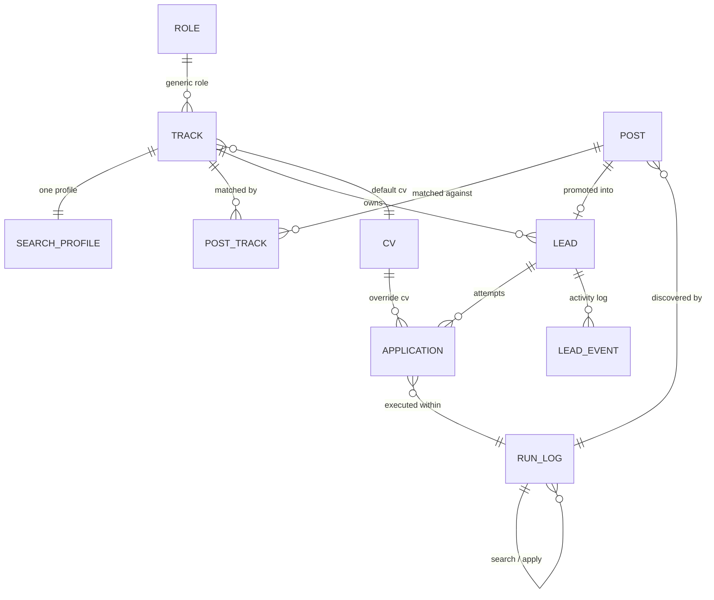

# Easy MCF POC Local - Data Model

## Purpose

Entities and relationships for the SQLite database (REQ-PLAT-02), derived from [010-workflows.md](010-workflows.md) — read that first; every entity/field below exists to support a specific step in one of its workflows. Field lists here are conceptual (name + intent + source requirement), not literal SQL DDL — column types, indexes, and the generic CRUD envelope (REQ-PLAT-01) are the architecture/design milestone's job.

## Entity-relationship overview

`SESSION` (the MCF credential store) is intentionally not in this diagram — it has no FK relationship to domain data, it's a singleton the apply run checks (Workflow 8).

## Entities

### `role`

Generic job title/domain, not user-specific (glossary; REQ-SRCH-01 implicitly).

| field         | notes                |
| ------------- | -------------------- |
| `id`          | PK                   |
| `name`        | e.g. "Data Engineer" |
| `description` | optional             |

### `track`

A user's role at a seniority level (glossary). 010 is single-user (REQ-DEV boundary / requirements "end user" section), so no `user_id` column is needed yet — that's the one place 010's model diverges from `mcfpipe`'s multi-user `track` table, deliberately, per Decision 1 in [010-workflows.md](010-workflows.md).

| field           | notes                                     |
| --------------- | ----------------------------------------- |
| `id`            | PK                                        |
| `role_id`       | FK → `role`                               |
| `seniority`     | e.g. junior/mid/senior, or a level number |
| `default_cv_id` | FK → `cv`, nullable — REQ-APPLY-02        |
| `is_active`     | bool, default true — false ⇒ archived (REQ-SRCH-10), hidden from active track selectors |

An archived (`is_active = false`) track is not physically deleted, mirroring the `post.is_open` pattern below — its historical `post_track`, `lead`, and `application` rows stay readable, only its availability in active selectors (search run, promote-to-lead, apply default CV) changes.

### `search_profile`

Exactly one per track (REQ-SRCH-01). Modeled as a 1:1 extension of `track` rather than a separate PK, since it has no independent lifecycle.

| field             | notes                               |
| ----------------- | ----------------------------------- |
| `track_id`        | PK, FK → `track`                    |
| `keywords`        | one or more search keyword strings  |
| `min_salary`      | REQ-SRCH-01                         |
| `max_age_weeks`   | REQ-SRCH-01                         |
| `min_match_score` | screening threshold, REQ-SRCH-09    |
| `employment_type` | defaults `'Full Time'`, REQ-SRCH-01 |

### `cv`

A named CV/resume version the user can assign as a track default or an application override (REQ-APPLY-02). The actual file lives on MCF's own profile — 010 only needs to remember the label the apply run matches against MCF's resume-selector options by substring (see [010-prototype.md](010-prototype.md) `cv_select()`), so this table is a small label catalog, not file storage.

| field   | notes                                                               |
| ------- | ------------------------------------------------------------------- |
| `id`    | PK                                                                  |
| `label` | matched by substring against MCF's resume card titles at apply time |

### `post`

Source-of-truth listing, not user-specific (glossary; REQ-SRCH-03/06/07). One row per posting regardless of how many tracks match it or how many leads it spawns.

| field                     | notes                                                                          |
| ------------------------- | ------------------------------------------------------------------------------ |
| `id`                      | PK — stable dedup id: `source + posting_reference + posted_date` (REQ-SRCH-05) |
| `source`                  | e.g. `"MyCareerFutures"`                                                       |
| `position_title`          | REQ-SRCH-03                                                                    |
| `company_name`            | REQ-SRCH-03                                                                    |
| `url_ref`                 | posting reference/URL, REQ-SRCH-03                                             |
| `posted_date`             | REQ-SRCH-03                                                                    |
| `salary_high`             | from card if shown, REQ-SRCH-03                                                |
| `is_open`                 | bool; false ⇒ removed from active set (REQ-SRCH-06)                            |
| `closing_date`            | detail pass, REQ-SRCH-06                                                       |
| `applicants`              | detail pass, REQ-SRCH-06                                                       |
| `industry_classification` | detail pass, REQ-SRCH-06                                                       |
| `description`             | detail pass, REQ-SRCH-06                                                       |
| `mcf_ref`                 | detail pass, REQ-SRCH-06                                                       |
| `src_method`              | `scraped` \| `manual` — REQ-SRCH-07/08                                         |
| `run_id`                  | FK → `run_log`, nullable — REQ-SRCH-08                                         |

An `is_open = false` post is not physically deleted — history stays available to any lead already promoted from it, only its active-set membership changes. `run_id` is null for manually entered posts.

### `post_track`

Many-to-many: a post can match more than one track, each scored independently (REQ-SRCH-08/09).

| field          | notes                                                                              |
| -------------- | ---------------------------------------------------------------------------------- |
| `post_id`      | PK part, FK → `post`                                                               |
| `track_id`     | PK part, FK → `track`                                                              |
| `match_score`  | 0–1, REQ-SRCH-09                                                                   |
| `score_method` | e.g. `title_keyword_v1` — REQ-SRCH-09                                              |
| `search_match` | bool — true if found by this track's search, false if auto-assigned (manual entry) |

`score_method` is recorded alongside the score so a future NLP-based method can be added later without a schema change (REQ-SRCH-09). No "assigned"/primary flag lives here — which track a resulting lead belongs to is chosen by the user at promotion time (Decision 2), not pre-computed on the post.

### `lead`

The user's personal, trackable instance of a post for one track (glossary; REQ-CRM-01..06).

| field                | notes                                                   |
| -------------------- | ------------------------------------------------------- |
| `id`                 | PK                                                      |
| `post_id`            | FK → `post`                                             |
| `track_id`           | FK → `track`, chosen at promotion (Workflow 4)          |
| `status`             | `OPEN` \| `CLOSED`, REQ-CRM-02                          |
| `stage`              | enum, see Workflow 5 stage diagram                      |
| `close_reason`       | enum, set when `status = CLOSED` — see Workflow 5       |
| `title_override`     | nullable, REQ-CRM-04                                    |
| `company_override`   | nullable, REQ-CRM-04                                    |
| `deadline`           | REQ-CRM-03                                              |
| `applied_date`       | REQ-CRM-03                                              |
| `first_attempt_date` | REQ-CRM-03                                              |
| `last_contact_date`  | REQ-CRM-03                                              |
| `notes`              | free text, REQ-CRM-03                                   |
| `created_at`         | promotion timestamp                                     |
| `updated_at`         | refreshed by each new `lead_event` written for this lead; drives auto-expiry, REQ-CRM-05 |

Uniqueness: `post_id` — a post can be promoted into at most one lead; once promoted, it is excluded from further promotion under any track (Workflow 4).

### `lead_event`

An append-only activity log entry for a lead (REQ-CRM-08). One-to-many from `lead`: every stage transition, contact logged, note edit, or deadline change writes a new row rather than mutating a summary field, so the lead's full activity history is reconstructable and its last-activity time (feeding auto-expiry, REQ-CRM-05) has a source of truth beyond a bare timestamp. Scheduled interview/callback details (e.g. an interview's date/time) are captured as free text in an event's `detail` or in `lead.notes`, not as a dedicated structured field — `lead.deadline` keeps one consistent meaning throughout the lead's lifecycle rather than being repurposed per stage.

| field         | notes                                                                    |
| ------------- | -------------------------------------------------------------------------- |
| `id`          | PK                                                                       |
| `lead_id`     | FK → `lead`                                                              |
| `event_type`  | `stage_change` \| `contact_logged` \| `note_edited` \| `deadline_changed` |
| `detail`      | free text, e.g. old/new stage, or a note excerpt                        |
| `occurred_at` | timestamp — the value that refreshes `lead.updated_at`                  |

### `application`

An automated apply attempt against a lead (glossary; REQ-APPLY-01..09). One-to-many from `lead`: a retried attempt (e.g. after fixing a `cv_not_found`) is a new row, not an overwrite — REQ-APPLY-08 requires each application's outcome to not overwrite another's, and Workflow 7 relies on retry history being preserved.

| field          | notes                                                    |
| -------------- | -------------------------------------------------------- |
| `id`           | PK                                                       |
| `lead_id`      | FK → `lead`                                              |
| `cv_id`        | FK → `cv`, nullable override of `track.default_cv_id`    |
| `status`       | enum, see REQ-APPLY-04 / Workflow 6 for full vocabulary  |
| `error_detail` | nullable free text, REQ-PLAT-03                          |
| `attempted_at` | timestamp of this attempt                                |
| `run_id`       | FK → `run_log` — which apply run this attempt belongs to |

### `run_log`

Every automated run: search or apply (REQ-PLAT-03). Scoring is not a separate run type — it happens inline within a search run (Workflow 2).

| field            | notes                                                          |
| ---------------- | -------------------------------------------------------------- |
| `id`             | PK                                                             |
| `run_type`       | `search` \| `apply`                                            |
| `track_id`       | FK → `track`, nullable — null for apply runs (may span tracks) |
| `started_at`     | REQ-PLAT-03                                                    |
| `ended_at`       | nullable while running                                         |
| `status`         | `running` \| `success` \| `partial` \| `failed`                |
| `outcome_counts` | e.g. `{new_posts: 12, updated: 3}` — REQ-PLAT-03               |
| `error_detail`   | nullable, REQ-PLAT-03                                          |

A search run is always track-scoped; an apply run can span leads queued across multiple tracks, so `track_id` may be null there.

### `session`

Singleton row tracking the uploaded MCF session credential (Workflow 8, REQ-APPLY-06). The cookie payload itself is treated as sensitive material handled like `jobsearch`'s `cookies_mcf.json` — stored as a local file/blob the backend reads, referenced (not embedded) from this row, consistent with the project boundary against committing real session exports.

| field         | notes                                                                      |
| ------------- | -------------------------------------------------------------------------- |
| `id`          | singleton                                                                  |
| `status`      | `valid` \| `expired` \| `missing`                                          |
| `uploaded_at` | when the user last uploaded a cookie                                       |
| `cookie_ref`  | opaque reference to where the payload is stored (not the raw cookie value) |

## Design notes

- `cv` is its own small catalog table (vs. a free-text field on `track`/`application`), so the UI can offer a dropdown of known CVs rather than free text.
- `run_log` unifies search and apply run logging into one table (`run_type` discriminator) rather than two, since both need the same start/end/outcome/error shape (REQ-PLAT-03).
- `track.is_active` follows the same soft-delete shape as `post.is_open` — a bool flip rather than a row deletion, so archived tracks keep every dependent row (`post_track`, `lead`, `application`) intact.
- `lead_event` makes lead activity an append-only log rather than a single mutable `updated_at` column, mirroring why `application` is one-to-many from `lead` rather than a single overwritten row (REQ-APPLY-08) — both exist so retry/activity history survives rather than being clobbered by the next update.
