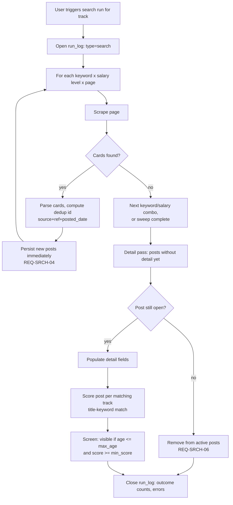
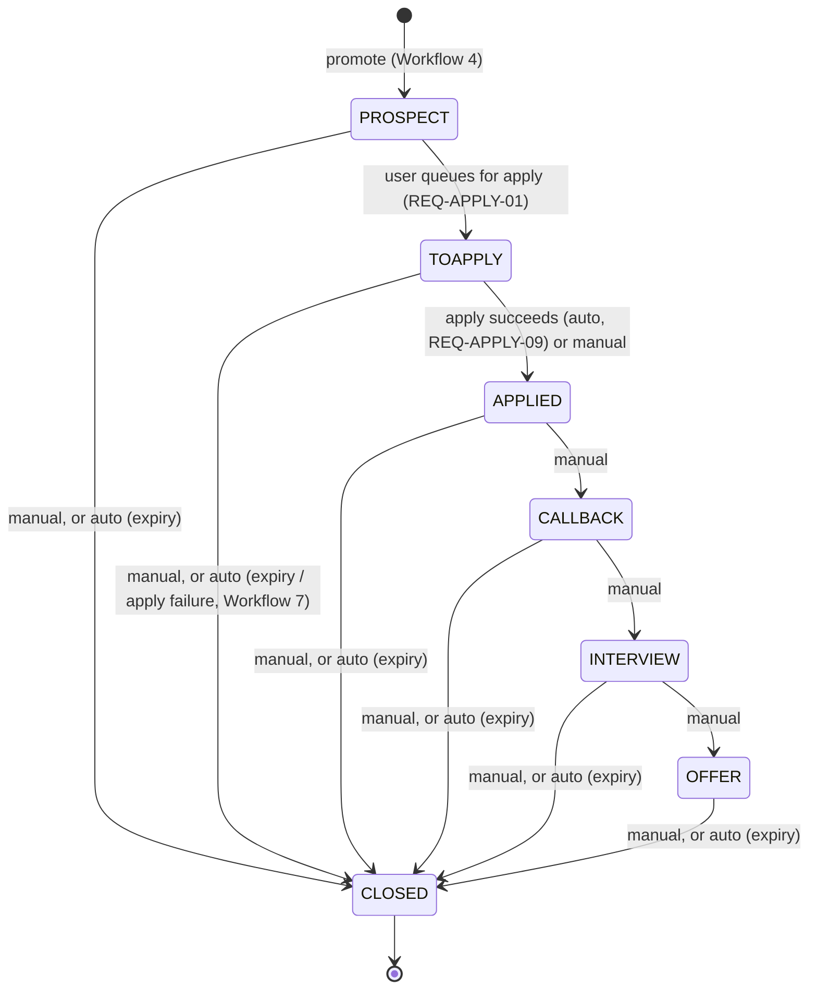
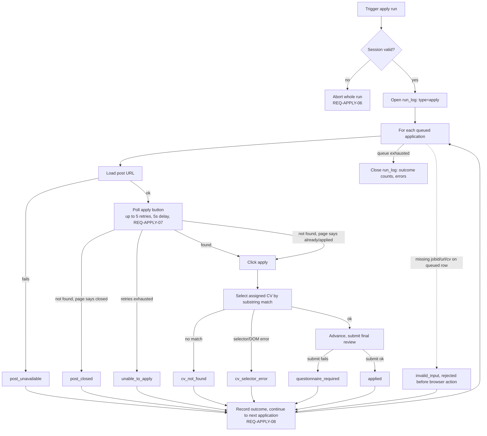

# Easy MCF POC Local - Workflows

## Purpose

This document describes the business logic and process flows release `010` implements, derived from [010-01-requirements.md](010-01-requirements.md). It is the source document: [010-data-model.md](010-data-model.md) (entities/schema) and [010-user-interface.md](010-user-interface.md) (pages/UX) are both derived from the workflows below, not the other way around — a change here should be checked against both.

Read [010-01-requirements.md](010-01-requirements.md) first for the requirement IDs (`REQ-*`) referenced throughout, and [010-prototype.md](010-prototype.md) for the `jobsearch`/`mcfpipe` mechanics these workflows carry forward or correct.

## Design decisions 

1. **Post vs. lead split.** 010 keeps the two-entity split already implied by the requirements glossary — `post` (source-of-truth listing, not user-specific) and `lead` (the user's personal trackable instance, created on promotion) — rather than importing `mcfpipe`'s three-entity `post`/`job`/`crm_status` split. There is no per-user `job` wrapper entity; per-track scoring attaches directly to `post` via a join (see [010-data-model.md](010-data-model.md)).
2. **Primary track assignment.** When a post matches more than one track, the track a resulting lead belongs to is **chosen by the user at promotion time** (Workflow 4), not computed automatically from the highest score.
3. **Apply-failure → lead effect.** Not a single blanket rule — it depends on whether the *post* is the problem or the *apply mechanics/config* are the problem (Workflow 7 has the full table): `post_closed` and `post_unavailable` auto-close the lead as `apply failed`; other failure outcomes (`cv_not_found`, `cv_selector_error`, `unable_to_apply`, `invalid_input`) leave the lead open at `TOAPPLY` for the user to fix and retry.
4. **Session establishment UX.** There is in-app UI for this (Workflow 8): the app redirects the user to MCF's Singpass-federated login (login/MFA itself stays manual and out of scope per REQ-APPLY-06), and a custom upload dialog lets the user paste/upload the exported session cookie afterward.
5. **Track archival.** Track deletion is a soft delete (REQ-SRCH-10): an archived track is hidden from active track selectors (search run, promote-to-lead, apply default CV) but its historical posts, leads, and applications remain intact and readable.
6. **Apply-queue removal.** Removing a queued (not yet run) application from the queue closes the owning lead with close reason `withdrawn` (REQ-APPLY-11) rather than reverting it to stage `PROSPECT` — a removed application is not recycled into a future batch.
7. **Lead activity as an event log.** A lead's activity (stage transitions, contact logged, note edits, deadline changes) is recorded as an append-only per-lead event log (REQ-CRM-08), which is the basis for the lead's last-activity timestamp feeding auto-expiry (REQ-CRM-05) and for its activity history view. Scheduled interview/callback details are captured as free text within notes or an event entry, not as dedicated per-stage date fields — the lead's `deadline` field keeps one consistent meaning throughout its lifecycle rather than being repurposed per stage.

## 1. Track & search profile setup

- User creates a **track** = role + seniority (REQ-SRCH-01). Creating a track creates its one **search profile** in the same step: keyword(s), minimum salary, maximum posting age, minimum match score, employment type (defaults to Full Time).
- User may set a **default CV** for the track (REQ-APPLY-02), used by the apply run unless overridden per application.
- User can archive a track (REQ-SRCH-10, **Decision 5**): a soft delete that hides it from active track selectors while preserving its historical posts, leads, and applications.

## 2. Search run

Trigger: user-initiated per track from the UI (REQ-SRCH-02) — no scheduler exists in 010.

- Incremental persistence (REQ-SRCH-04) means a crash mid-run keeps whatever was already saved — this is the one deliberate improvement over the `jobsearch` prototype's all-or-nothing write (see [010-prototype.md](010-prototype.md)).
- Dedup id, the title-keyword match-score formula, and screening thresholds reuse the `jobsearch` mechanics as-is (see [010-prototype.md](010-prototype.md)) — 010 does not change the algorithm, only where/when results are persisted.
- Score is stored with its `method` string (REQ-SRCH-09) so a future semantic-scoring method can be added without a schema change.

## 3. Manual posting entry

- User submits a posting MCF search didn't find, via a form using the same fields as a scraped post (REQ-SRCH-07): position title, company, URL/reference, salary, etc.
- On save, the system auto-assigns the posting's matching track(s) using the same match-scoring logic as a search run (REQ-SRCH-09), creating the same `post_track` association a search match would, with `search_match = false`. The user can update this track assignment afterward via the UI.
- Manual postings bypass the match-score filter in screening (REQ-SRCH-07) for the track(s) they're assigned to — they're still visible for promotion regardless of score.

## 4. Promote post to lead

- From any posting-browse context, user selects a post and **one** of its associated tracks (Decision 2 above) to pursue it under.
- System creates a **lead**: `status = OPEN`, `stage = PROSPECT`, `post_id`, `track_id` = the chosen track, title/company initially mirroring the post (REQ-CRM-01).
- The post record itself is never mutated by this step (REQ-CRM-04 keeps lead-level title/company overrides separate from the post).
- A post can be promoted into at most one lead. Once promoted, it is no longer available for promotion under a different track — Search & Results shows it as already promoted rather than offering the promote action again.

## 5. Lead lifecycle / stage transitions

- `CLOSED` records one of: offer accepted, rejected, withdrawn, expired, cancelled, duplicate, apply failed (REQ-CRM-02).
- **Activity log** (REQ-CRM-08, **Decision 7**): every update to a lead — stage change, contact logged, notes edited, deadline changed — is recorded as a timestamped event in an append-only per-lead log, rather than only mutating a bare `updated_at` field. This log is the basis for both the lead's last-activity time (feeding auto-expiry below) and the activity history shown to the user (see [010-user-interface.md](010-user-interface.md) Lead Detail). Scheduled interview/callback details are captured as free text within notes or an event entry, not as dedicated per-stage date fields.
- **Auto-expiry** (REQ-CRM-05): a lead auto-closes as `expired` once 28 days pass with no activity on it. The expiry threshold is the lead's latest activity-log entry plus 28 days, and applies at every open stage, `PROSPECT` through `OFFER`. Evaluated on each backend list call (e.g. `GET /lead/search`, REQ-PLAT-01) rather than by a background job — 010 has no scheduler — so the UI reflects current expiry state on every page load or refresh.
- **Auto apply-failed close**: see Workflow 7 for the specific outcomes that trigger this vs. leave the lead open.
- **Manual withdrawal via queue removal** (REQ-APPLY-11, **Decision 6**): removing a queued application from the Applications page closes its lead as `withdrawn` rather than reverting it to `PROSPECT` — see Workflow 6.

## 6. Automated apply run

Two-step model, matching REQ-FE-01's explicit "apply-queue review and results" screen (i.e. queueing and running are separate user actions, not one):

1. **Queue.** From the pipeline view, user selects one or more `PROSPECT` leads and queues them (REQ-APPLY-01): each advances to `TOAPPLY`, and an `application` row is created per lead (`status = queued`).
2. **Run.** From the apply-queue view, user reviews the queue (confirms/overrides CV per application, REQ-APPLY-02), then triggers the run.
3. **Remove (optional, before running).** User can remove a queued application from the queue instead of running it (REQ-APPLY-11, **Decision 6**): the `application` row is discarded and its lead closes with reason `withdrawn` — it does not revert to `PROSPECT` and is not available to be re-queued.

- A single application's failure never stops the batch and never overwrites another application's recorded outcome (REQ-APPLY-08).
- Questionnaire-required postings are deliberately left for the user to complete manually on MCF — not automated, not retried (REQ-APPLY-05).

## 7. Apply-outcome → lead propagation

- **`applied`** — auto-transitions lead to `APPLIED` (REQ-APPLY-09).
- **`questionnaire_required`** — lead stays `TOAPPLY`. User completes the questionnaire manually on MCF, then manually sets the lead to `APPLIED`.
- **`post_closed`** — lead auto-closes as `CLOSED (apply failed)`: the post is gone, retrying is pointless.
- **`post_unavailable`** — same treatment as `post_closed`: post couldn't even load, equally unpursuable.
- **`cv_not_found`** — lead stays `TOAPPLY`. User fixes the CV assignment and re-queues.
- **`cv_selector_error`** — lead stays `TOAPPLY`, retryable: likely a transient DOM/selector issue, not a dead post.
- **`unable_to_apply`** — lead stays `TOAPPLY`, retryable: may be a slow page load, not a dead post.
- **`invalid_input`** — lead stays `TOAPPLY`. User fixes the missing required field(s) and re-queues.

## 8. MCF session establishment

1. User clicks "Log in to MCF" in-app.
2. App opens MCF's login flow (Singpass-federated). Login/MFA/CAPTCHA itself is a manual step the user completes outside app control — automating it is explicitly out of scope (REQ-APPLY-06, out-of-scope list).
3. User manually exports the resulting session cookie from their browser (external step, same pattern as `jobsearch`'s `cookies_mcf.json` — see [010-prototype.md](010-prototype.md)).
4. User returns to the app and uploads/pastes the cookie via a custom dialog (**Decision 4**).
5. Backend validates at least one loaded cookie matches the MCF domain (same check `jobsearch` performs) and stores it. Session status (valid / expired / missing) is shown in the UI; an apply run aborts up front if the session isn't valid (Workflow 6, REQ-APPLY-06).

## 9. Run logging & status

Every user-triggered run (search, apply) is logged with start/end time, outcome counts, and errors (REQ-PLAT-03), so a failure is diagnosable without re-running. Scoring is not a separately-triggered run — it happens inline as part of a search run (REQ-SRCH-09). Run status and any errors are surfaced in the UI, not just written to a log file (REQ-FE-02).
