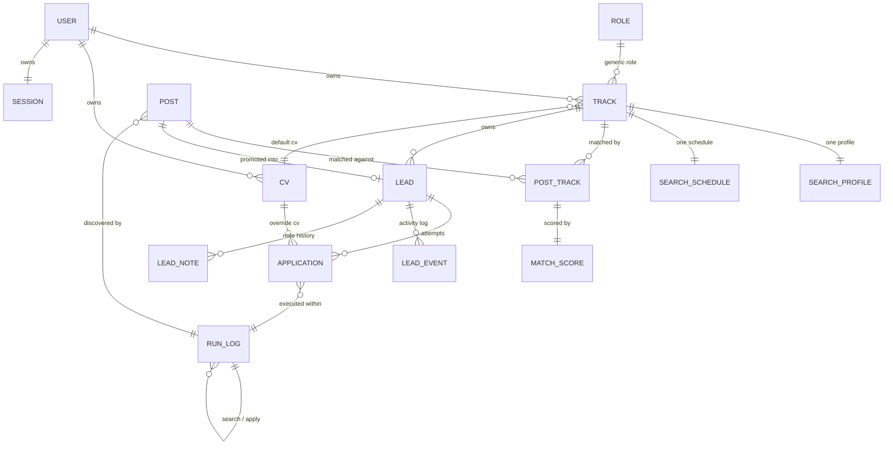

# Easy MCF POC Local - Data Model

## Contents

- [Purpose](#purpose)
- [References](#references)
- [Entity-relationship overview](#entity-relationship-overview)
- [Entities](#entities)
  - [`user`](#user)
  - [`role`](#role)
  - [`track`](#track)
  - [`search_profile`](#search_profile)
  - [`search_schedule`](#search_schedule)
  - [`cv`](#cv)
  - [`post`](#post)
  - [`post_track`](#post_track)
  - [`match_score`](#match_score)
  - [`lead`](#lead)
  - [`lead_note`](#lead_note)
  - [`lead_event`](#lead_event)
  - [`application`](#application)
  - [`run_log`](#run_log)
  - [`session`](#session)
- [Design notes](#design-notes)
  - [Schema versions](#schema-versions)

## Purpose

Entities and relationships for the SQLite database (REQ-PLAT-02), derived from the **workflows**. Read that first. Every entity/field below exists to support a specific step in one of its workflows. Field lists here are conceptual, covering name, intent, and source requirement. Column types, indexes, and the generic CRUD envelope (REQ-PLAT-01) are the architecture/design milestone's job.

## References

- **workflows**: [010-workflows.md](010-workflows.md) — the process steps each entity and field below exists to support.
- **prototype extraction**: [010-prototype.md](010-prototype.md) — the `cv_select()` substring-match mechanics the `cv` entity's label is matched against.
- **architecture**: [010-architecture.md](010-architecture.md) — `ARCH-STO-02/03` for the recreate-don't-migrate rule the Schema versions table below records, and `ARCH-SCHED-01..06` for the runtime behind the `search_schedule` table and `run_log.trigger_source`.

## Entity-relationship overview

`SESSION`, the MCF credential store, is intentionally not in this diagram. It has no FK relationship to domain data. It's a singleton the apply run checks (Workflow 8).

## Entities

### `user`

The person the app runs for. 010 remains single-user in every functional sense, no auth, no multi-tenancy, no per-request identity resolution, but the schema names the ownership boundary explicitly rather than leaving it implicit. Seed data initializes exactly one row.

| field    | notes                        |
| -------- | ----------------------------- |
| `id`     | PK                            |
| `name`   | display name                  |
| `email`  | contact address                |
| `status` | e.g. `active`                  |

### `role`

Generic job title/domain, not user-specific (glossary, REQ-SRCH-01 implicitly).

| field         | notes                |
| ------------- | -------------------- |
| `id`          | PK                   |
| `name`        | e.g. "Data Engineer" |
| `description` | optional             |

### `track`

A user's role at a seniority level (glossary), owned by the single `user` row. Naming the ownership column explicitly is what this milestone adds. 010's functional behavior stays single-user regardless.

| field           | notes                                     |
| --------------- | ----------------------------------------- |
| `id`            | PK                                        |
| `user_id`       | FK → `user`                               |
| `role_id`       | FK → `role`                               |
| `seniority`     | e.g. junior/mid/senior, or a level number |
| `default_cv_id` | FK → `cv`, nullable — REQ-APPLY-02        |
| `is_active`     | bool, default true — false ⇒ archived (REQ-SRCH-10), hidden from active track selectors |

An archived (`is_active = false`) track is not physically deleted, mirroring the `post.is_open` pattern below. Its historical `post_track`, `lead`, and `application` rows stay readable. Only its availability in active selectors, such as search run, promote-to-lead, or apply default CV, changes.

### `search_profile`

Exactly one per track (REQ-SRCH-01). Modeled as a 1:1 extension of `track` rather than a separate PK, since it has no independent lifecycle.

| field             | notes                                |
| ----------------- | ------------------------------------- |
| `track_id`        | PK, FK → `track`                      |
| `keywords`        | one or more search keyword strings    |
| `min_salary`      | REQ-SRCH-01                           |
| `max_age_weeks`   | REQ-SRCH-01                           |
| `min_match_score` | screening threshold, REQ-SRCH-09      |
| `employment_type` | defaults `'Full Time'`, REQ-SRCH-01   |

### `search_schedule`

Exactly one per track (REQ-SRCH-11), a 1:1 extension of `track` the same way `search_profile` is, since a schedule has no lifecycle independent of the track it belongs to. See `ARCH-SCHED-02` for the table-shape decision.

| field                     | notes                                                                        |
| ------------------------- | ---------------------------------------------------------------------------- |
| `track_id`                | PK, FK → `track`                                                             |
| `schedule_enabled`        | bool, default false — scheduled-run switch                                   |
| `schedule_interval_hours` | int, default 24, must be > 0 — spacing between runs                          |
| `next_run_at`             | timestamp, nullable — next due instant, scheduler-owned after the first fire |

These three fields are the complete definition of a schedule. `schedule_enabled = false` on every seeded row, so scheduling is opt-in per track and a freshly reset database never fires an unattended run. `next_run_at` is writable by the user, which is how the first fire time is chosen: "every night at 8pm" is `next_run_at` = tonight 20:00 with `schedule_interval_hours = 24`, so no separate time-of-day column exists. Leaving it null while enabling the schedule means "due now", after which the scheduler owns the column and advances it (`ARCH-SCHED-03`). There is no `last_run_at` here — `run_log` already records every run against its `track_id`, and a second copy could only drift from it.

### `cv`

A named CV/resume version the user can assign as a track default or an application override (REQ-APPLY-02). The actual file lives on MCF's own profile. 010 only needs to remember the label the apply run matches against MCF's resume-selector options by substring, per the **prototype extraction**'s `cv_select()`. This table is a small label catalog.

| field     | notes                                                               |
| --------- | ------------------------------------------------------------------- |
| `id`      | PK                                                                  |
| `user_id` | FK → `user`                                                        |
| `label`   | matched by substring against MCF's resume card titles at apply time |

### `post`

Source-of-truth listing, not user-specific (glossary, REQ-SRCH-03/06/07). One row per posting regardless of how many tracks match it or how many leads it spawns.

| field                     | notes                                                                          |
| ------------------------- | ------------------------------------------------------------------------------ |
| `id`                      | PK — stable dedup id: `source + posting_reference + posted_date` (REQ-SRCH-05) |
| `source`                  | e.g. `"MyCareerFutures"`                                                       |
| `position_title`          | REQ-SRCH-03                                                                    |
| `company_name`            | REQ-SRCH-03                                                                    |
| `url_ref`                 | posting reference/URL, REQ-SRCH-03                                             |
| `posted_date`             | REQ-SRCH-03                                                                    |
| `salary_high`             | from card if shown, REQ-SRCH-03                                                |
| `is_open`                 | bool, false ⇒ removed from active set (REQ-SRCH-06)                            |
| `closing_date`            | detail pass, REQ-SRCH-06                                                       |
| `applicants`              | detail pass, REQ-SRCH-06                                                       |
| `industry_classification` | detail pass, REQ-SRCH-06                                                       |
| `description`             | detail pass, REQ-SRCH-06                                                       |
| `mcf_ref`                 | detail pass, REQ-SRCH-06                                                       |
| `src_method`              | `scraped` \| `manual` — REQ-SRCH-07/08                                         |
| `run_id`                  | FK → `run_log`, nullable — REQ-SRCH-08                                         |

An `is_open = false` post is not physically deleted. History stays available to any lead already promoted from it. Only its active-set membership changes. `run_id` is null for manually entered posts.

### `post_track`

Many-to-many: a post can match more than one track (REQ-SRCH-08/09).

| field          | notes                                                                              |
| -------------- | ---------------------------------------------------------------------------------- |
| `post_id`      | PK part, FK → `post`                                                               |
| `track_id`     | PK part, FK → `track`                                                              |
| `search_match` | bool — true if found by this track's search, false if auto-assigned (manual entry) |

No "assigned"/primary flag lives here. Which track a resulting lead belongs to is chosen by the user at promotion time (Decision 2), never pre-computed on the post. Each pairing's score lives in `match_score` below rather than on this row, so a rescoring pass can replace a score without touching the association itself.

### `match_score`

Exactly one row per `post_track` pairing, each scored independently (REQ-SRCH-09). Modeled as a 1:1 extension of `post_track` rather than a separate PK, since it has no independent lifecycle. Split out from `post_track` so the association, `search_match`, and the scoring result can change independently of each other.

| field          | notes                                  |
| -------------- | --------------------------------------- |
| `post_id`      | PK part, FK → `post_track.post_id`     |
| `track_id`     | PK part, FK → `post_track.track_id`    |
| `match_score`  | 0–1, REQ-SRCH-09                       |
| `score_method` | e.g. `title_keyword_v1` — REQ-SRCH-09  |

`score_method` is recorded alongside the score so a future NLP-based method can be added later without a schema change (REQ-SRCH-09).

### `lead`

The user's personal, trackable instance of a post for one track (glossary, REQ-CRM-01..06).

| field                | notes                                                   |
| -------------------- | ------------------------------------------------------- |
| `id`                 | PK                                                      |
| `post_id`            | FK → `post`                                             |
| `track_id`           | FK → `track`, chosen at promotion (Workflow 4)          |
| `status`             | `OPEN` \| `CLOSED`, REQ-CRM-02                          |
| `stage`              | enum, see Workflow 5 stage diagram                      |
| `close_reason`       | enum, set when `status = CLOSED` — see Workflow 5       |
| `title_override`     | nullable, REQ-CRM-04                                    |
| `company_override`   | nullable, REQ-CRM-04                                    |
| `deadline`           | REQ-CRM-03; system-maintained across the lifecycle, REQ-CRM-05 — see `lead_event` below |
| `applied_date`       | REQ-CRM-03                                              |
| `first_attempt_date` | REQ-CRM-03                                              |
| `last_contact_date`  | REQ-CRM-03                                              |
| `created_at`         | promotion timestamp                                     |
| `updated_at`         | refreshed by each new `lead_event` written for this lead, drives auto-expiry, REQ-CRM-05 |

Uniqueness: `post_id`. A post can be promoted into at most one lead. Once promoted, it is excluded from further promotion under any track (Workflow 4). Free-text notes are not a field on this row. They live in `lead_note` below, so a lead can carry a history of multiple notes rather than one that overwrites the last.

### `lead_note`

An append-only note history for a lead (REQ-CRM-03). One-to-many from `lead`: each note the user adds is a new row rather than an overwrite of a single `lead.notes` field, so earlier notes stay readable alongside later ones.

| field        | notes                                              |
| ------------ | --------------------------------------------------- |
| `id`         | PK                                                  |
| `lead_id`    | FK → `lead`                                         |
| `note`       | free text                                          |
| `created_at` | timestamp — pairs with a `lead_event(event_type='note_edited')` row |

### `lead_event`

An append-only activity log entry for a lead (REQ-CRM-08). One-to-many from `lead`: every stage transition, contact logged, note added, deadline change, or other field edit writes a new row rather than mutating a summary field, so the lead's full activity history is reconstructable and its `deadline` maintenance (feeding auto-expiry, REQ-CRM-05) has a source of truth beyond a bare field mutation. Scheduled interview/callback details, such as an interview's date/time, are captured as free text in an event's `detail` or in a `lead_note`, rather than as a dedicated structured field. `lead.deadline` is maintained by the system across the lead's lifecycle rather than fixed once at creation: derived from the post at promotion (its `closing_date`, else `posted_date` plus 28 days, else the promotion date plus 1 week when `closing_date` is on or before the promotion date) and refreshed to 28 days from the most recent activity on every update from `CALLBACK` onward (REQ-CRM-05). Each automatic reset is itself written here as a `deadline_changed` row, the same event type a user's manual edit uses.

| field         | notes                                                                    |
| ------------- | -------------------------------------------------------------------------- |
| `id`          | PK                                                                       |
| `lead_id`     | FK → `lead`                                                              |
| `event_type`  | `stage_change` \| `contact_logged` \| `note_edited` \| `deadline_changed` \| `field_edited` |
| `detail`      | free text, e.g. old/new stage, or a note excerpt                        |
| `occurred_at` | timestamp — the value that refreshes `lead.updated_at`                  |

### `application`

An automated apply attempt against a lead (glossary, REQ-APPLY-01..09). One-to-many from `lead`: a retried attempt, for example after fixing a `cv_not_found`, is a new row rather than an overwrite. REQ-APPLY-08 requires each application's outcome to leave every other application's outcome untouched, and Workflow 7 relies on retry history being preserved.

| field          | notes                                                    |
| -------------- | -------------------------------------------------------- |
| `id`           | PK                                                       |
| `lead_id`      | FK → `lead`                                              |
| `cv_id`        | FK → `cv`, nullable override of `track.default_cv_id`    |
| `status`       | enum, see REQ-APPLY-04 / Workflow 6 for full vocabulary  |
| `error_detail` | nullable free text, REQ-PLAT-03                          |
| `attempted_at` | timestamp of this attempt                                |
| `run_id`       | FK → `run_log` — which apply run this attempt belongs to |

### `run_log`

Every automated run: search or apply (REQ-PLAT-03). Scoring is not a separate run type — it happens inline within a search run (Workflow 2).

| field            | notes                                                          |
| ---------------- | -------------------------------------------------------------- |
| `id`             | PK                                                             |
| `run_type`       | `search` \| `apply`                                            |
| `track_id`       | FK → `track`, nullable — null for apply runs (may span tracks) |
| `trigger_source` | `manual` \| `scheduled`, default `manual` — ARCH-SCHED-05      |
| `started_at`     | REQ-PLAT-03                                                    |
| `ended_at`       | nullable while running                                         |
| `status`         | `running` \| `success` \| `partial` \| `failed`                |
| `outcome_counts` | e.g. `{new_posts: 12, updated: 3}` — REQ-PLAT-03               |
| `error_detail`   | nullable, REQ-PLAT-03                                          |

A search run is always track-scoped. An apply run can span leads queued across multiple tracks, so `track_id` may be null there. `trigger_source` distinguishes a run the user started (REQ-SRCH-02) from one the scheduler fired (REQ-SRCH-11); apply runs are always `manual` in `010`, since nothing schedules them. `status` gains no `skipped` value: a scheduled trigger that collided with an in-flight run never started a run, so it writes no row here at all (`ARCH-SCHED-05`).

### `session`

Singleton row tracking the uploaded MCF session credential (Workflow 8, REQ-APPLY-06). The cookie payload itself is treated as sensitive material handled like `jobsearch`'s `cookies_mcf.json`. It is stored as a local file/blob the backend reads, referenced rather than embedded from this row, consistent with the project boundary against committing real session exports.

| field         | notes                                                                      |
| ------------- | -------------------------------------------------------------------------- |
| `id`          | singleton                                                                  |
| `user_id`     | FK → `user`                                                                |
| `status`      | `valid` \| `expired` \| `missing`                                          |
| `uploaded_at` | when the user last uploaded a cookie                                       |
| `cookie_ref`  | opaque reference to where the payload is stored (not the raw cookie value) |

## Design notes

- `cv` is its own small catalog table rather than a free-text field on `track`/`application`, so the UI can offer a dropdown of known CVs rather than free text.
- `run_log` unifies search and apply run logging into one table (`run_type` discriminator) rather than two, since both need the same start/end/outcome/error shape (REQ-PLAT-03).
- `track.is_active` follows the same soft-delete shape as `post.is_open` — a bool flip rather than a row deletion, so archived tracks keep every dependent row (`post_track`, `lead`, `application`) intact.
- `lead_event` makes lead activity an append-only log rather than a single mutable `updated_at` column, mirroring why `application` is one-to-many from `lead` rather than a single overwritten row (REQ-APPLY-08). Both exist so retry/activity history survives rather than being clobbered by the next update.
- `user` exists so `track`, `cv`, and `session` can carry an explicit `user_id` rather than an implicit single-user assumption baked into application code. 010 still seeds exactly one row and adds no auth or per-request identity resolution. The column names the boundary. It does not activate multi-tenancy.
- `match_score` is split out of `post_track` as its own 1:1 extension, the same shape `search_profile` already uses against `track`. This keeps the association and the scoring result independently replaceable, so a rescoring pass can update `match_score`/`score_method` without touching `post_track`'s `search_match` provenance flag.
- `lead_note` replaces the single `lead.notes` field with an append-only history table, the same shape as `lead_event`, so a lead can carry more than one note over its lifetime instead of the latest edit overwriting every earlier one. Adding a `lead_note` still writes a paired `lead_event(event_type='note_edited')` row, so the unified activity timeline is unaffected.
- scheduled runs (REQ-SRCH-11) are modeled as `search_schedule`, a 1:1 extension of `track` the same shape as `search_profile`, plus one discriminator on `run_log`. A schedule has no lifecycle independent of the track it belongs to, exactly as `search_profile` has none, so it gets the same 1:1-extension treatment. The consequence that matters downstream: REQ-SRCH-11 adds no write hook and no named endpoint — `search_schedule` is `API-CAT-01` pure generic, the same shape `search_profile` already uses. `ARCH-SCHED-01..06` cover the runtime side.

### Schema versions

`schema.sql` is hand-maintained with no migration chain (`ARCH-STO-02`), so each change to this document that reaches the database is recorded as a `meta.schema_version` bump rather than as a migration file. The table is the changelog.

| id | version | milestone | change                                                               |
| -- | ------- | --------- | --------------------------------------------------------------------- |
| 01 | 1       | 07        | `meta` only — milestone-07 placeholder                                 |
| 02 | 2       | 08        | the 13-table release-010 data model                                    |
| 03 | 3       | 08        | adds `user`, `match_score`, `lead_note`, `user_id` ownership columns   |
| 04 | 4       | 09        | adds `search_schedule` table, `field_edited` in `lead_event.event_type` |
| 05 | 5       | 10        | adds `run_log.trigger_source`                                          |

Version 4 is implemented by milestone 09 and version 5 is specified here for milestone 10 to implement. The remedy for a version mismatch is always `scripts/resetdb.py --seed` (`ARCH-STO-03`).
