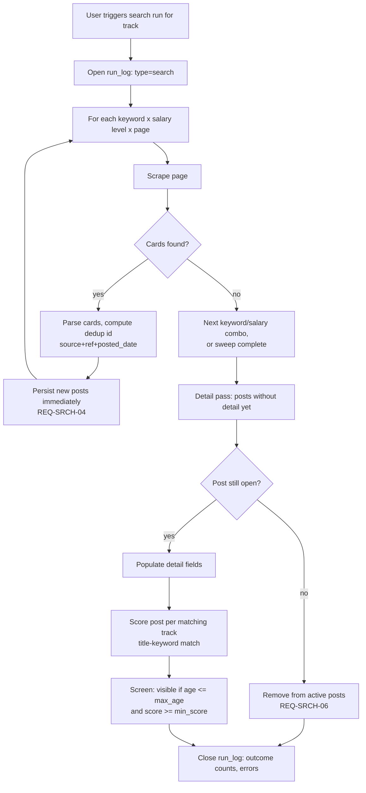
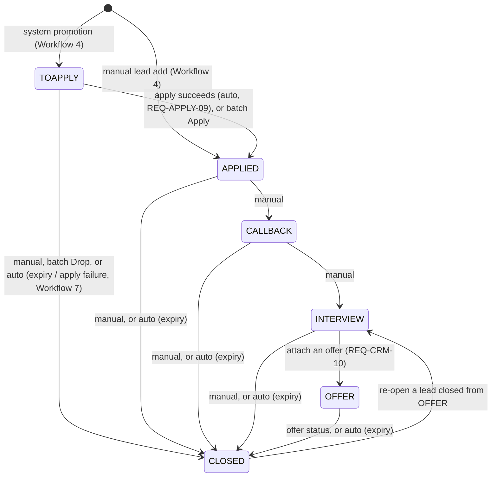
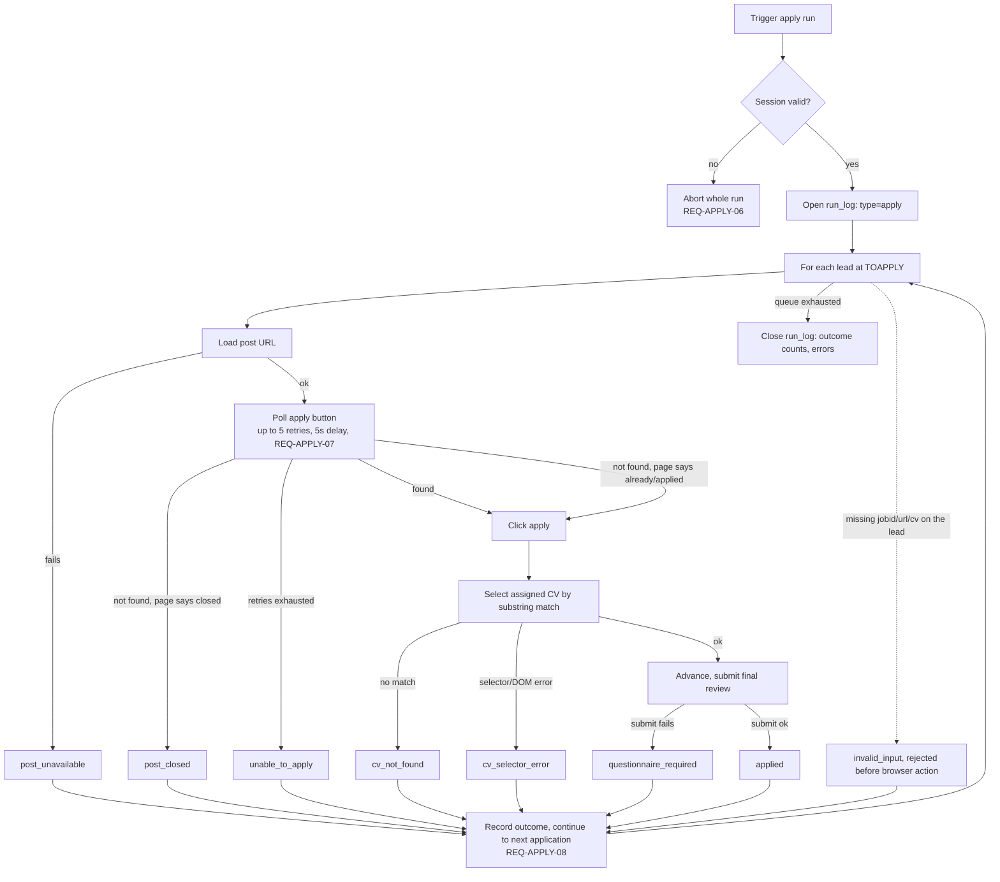
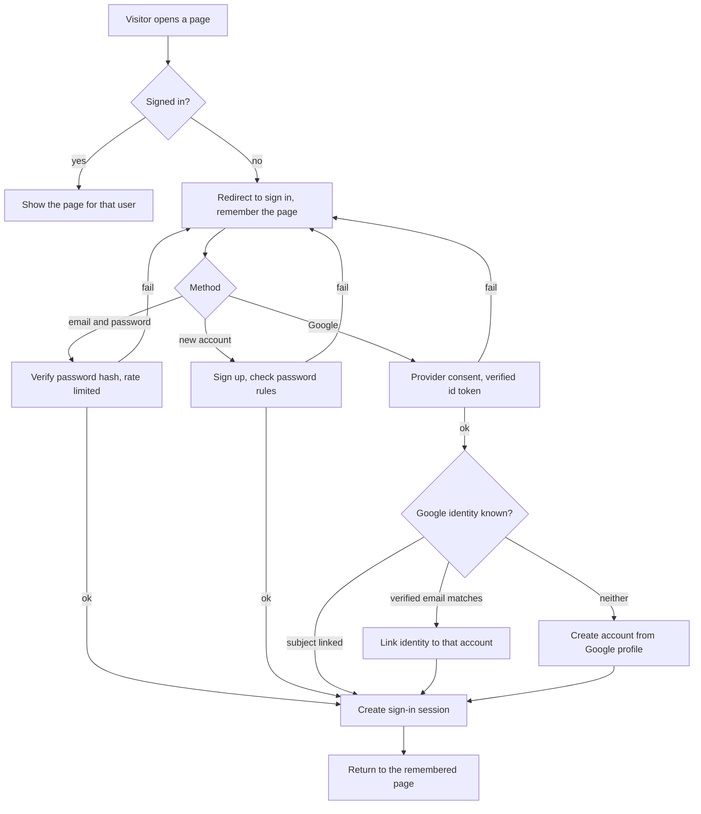

# Easy MCF POC Local - Workflows

## Contents

- [Purpose](#purpose)
- [References](#references)
- [Design decisions](#design-decisions)
- [1. Track & search profile setup](#1-track--search-profile-setup)
- [2. Search run](#2-search-run)
- [3. Manual posting entry](#3-manual-posting-entry)
- [4. Promote post to lead](#4-promote-post-to-lead)
- [5. Lead lifecycle / stage transitions](#5-lead-lifecycle--stage-transitions)
- [6. Automated apply run](#6-automated-apply-run)
- [7. Apply-outcome → lead propagation](#7-apply-outcome--lead-propagation)
- [8. MCF session establishment](#8-mcf-session-establishment)
- [9. Run logging & status](#9-run-logging--status)
- [10. Accounts, sign-in, and sign-out](#10-accounts-sign-in-and-sign-out)

## Purpose

This document describes the business logic and process flows release `010` implements, derived from the **requirements** doc. It is the source document. The **data model**, covering entities and schema, and the **user interface** design, covering pages and UX, are both derived from the workflows below. A change here should be checked against both.

Read the **requirements** doc first for the requirement IDs, `REQ-*`, referenced throughout, and the **prototype extraction** for the `jobsearch`/`mcfpipe` mechanics these workflows carry forward or correct.

## References

- **requirements** [010-01-requirements.md](010-01-requirements.md): the `REQ-*` ids referenced throughout this document.
- **data model** [010-data-model.md](010-data-model.md): entities and schema, derived from the workflows below.
- **user interface** [010-user-interface.md](010-user-interface.md): pages and UX, derived from the workflows below.
- **prototype extraction** [010-prototype.md](010-prototype.md): the `jobsearch`/`mcfpipe` mechanics these workflows carry forward or correct.

## Design decisions 

1. **Post vs. lead split.** 010 keeps the two-entity split already implied by the requirements glossary: `post`, the source-of-truth listing shared by every user and read-only to them, and `lead`, one user's personal trackable instance created on promotion, rather than importing `mcfpipe`'s three-entity `post`/`job`/`crm_status` split. There is no per-user `job` wrapper entity. The lead holds its own copies of the post's position title, company name, and URL, and its own deadline, so the user edits the lead and the shared post is never touched. Per-track scoring attaches directly to `post` via a join, per the **data model**.
2. **Primary track assignment.** When a post matches more than one track, the track a resulting lead belongs to is **the track of the search run that promotes the post**, Workflow 4. A post becomes at most one lead, so a post that matches several tracks is filed under the first run that promotes it and is not re-filed under the others by the system. The user can re-assign the lead to another active track from Lead Detail, REQ-CRM-12, which logs a field edit and leaves the stage, deadline, and expected salary unchanged.
3. **Apply-failure → lead effect.** This isn't a single blanket rule. It depends on whether the *post* is the problem or the *apply mechanics/config* are the problem, per Workflow 7's full table. `post_closed` and `post_unavailable` auto-close the lead as `apply failed`. Other failure outcomes, `cv_not_found`, `cv_selector_error`, `unable_to_apply`, and `invalid_input`, leave the lead open at `TOAPPLY` for the user to fix and retry.
4. **Session establishment UX.** There is in-app UI for this, Workflow 8: the app redirects the user to MCF's Singpass-federated login. Login and MFA itself stays manual and out of scope per REQ-APPLY-06. A custom upload dialog lets the user paste or upload the exported session cookie afterward.
5. **Track archival.** Track deletion is a soft delete, REQ-SRCH-10: an archived track is hidden from active track selectors, including search run, manual lead add, and apply default CV, but its historical posts, leads, and applications remain intact and readable.
6. **Apply-queue drop.** Dropping a lead from the apply queue closes it with close reason `dropped`, per REQ-APPLY-11. A dropped lead is not recycled into a future run.
7. **Lead activity as an event log.** A lead's activity, such as stage transitions, contact logged, note additions, and deadline changes, is recorded as an append-only per-lead event log, REQ-CRM-08, which is the basis for the lead's `deadline` maintenance feeding auto-expiry, REQ-CRM-05, and for its activity history view. Scheduled interview and callback details are captured as free text within a `lead_note` or an event entry rather than as dedicated per-stage date fields. The lead's `deadline` field is maintained by the system across its lifecycle per REQ-CRM-05 — derived from the post at promotion and refreshed on every activity from `CALLBACK` onward — rather than a value fixed once at creation. Each event also records the stage the lead held before and after the update (`stage_from`, `stage_to`), so the history shows the stage at which every update happened.
8. **Offer-gated stage.** A lead reaches `OFFER` only through an attached offer, REQ-CRM-10, so the stage and its offer always exist together. The offer's status, and not a direct close, ends a lead at `OFFER`, which keeps the offer history consistent with the lead's outcome. A lead closed from an offer can be re-opened at `INTERVIEW` and given a new offer.

9. **Per-user ownership.** Every track, CV, lead, run, and MCF session belongs to one user, and every workflow below acts for the signed-in user only, REQ-AUTH-06 and REQ-AUTH-07. Another user's record is indistinguishable from a missing one. Background runs and the scheduler carry the owning user explicitly, since no request exists to identify one.
10. **Sign-in methods.** A user signs in with an email and password, with Google, or with both on one account, Workflow 10. A Google identity links to an existing account only when Google reports its email verified, which stops an unverified address from taking over an account.

## 1. Track & search profile setup

- User creates a **track**, role plus seniority, per REQ-SRCH-01. Creating a track creates its one **search profile** in the same step: keyword(s), minimum salary, maximum posting age, minimum match score, and employment type, defaulting to Full Time.
- User may set a **default CV** for the track, per REQ-APPLY-02, used by the apply run unless overridden per application.
- User can archive a track, REQ-SRCH-10 and **Decision 5**: a soft delete that hides it from active track selectors while preserving its historical posts, leads, and applications.
- User can switch on a repeating schedule for the track's search run, REQ-SRCH-11: on/off, an interval, and the next run time, edited on the same form as the rest of the search profile.

## 2. Search run

Trigger: user-initiated per track from the UI, REQ-SRCH-02, or fired automatically once a track's schedule comes due, REQ-SRCH-11 and `ARCH-SCHED-01..06`, an in-process tick thread rather than an OS-level cron/scheduler. Either trigger runs the identical flow below and writes the same `run_log` row, distinguished only by `trigger_source`. A run acts for the user who owns the track. It scores against that user's tracks only, fetches detail only for posts visible to that user, and proceeds independently of other users' runs, with at most one search run in flight per user.

- Incremental persistence, per REQ-SRCH-04, means a crash mid-run keeps whatever was already saved. This is the one deliberate improvement over the `jobsearch` prototype's all-or-nothing write, per the **prototype extraction**.
- Dedup id, the title-keyword match-score formula, and screening thresholds reuse the `jobsearch` mechanics as-is, per the **prototype extraction**. 010 does not change the algorithm. It only changes where and when results are persisted.
- Score is stored with its `method` string, per REQ-SRCH-09, so a future semantic-scoring method can be added without a schema change.

## 3. Manual posting entry

- User submits a posting MCF search didn't find, via a form using the same fields as a scraped post, per REQ-SRCH-07: position title, company, URL/reference, salary, and so on.
- The post is created on the server. A posting whose id already exists and is not visible to the user reuses the existing shared post, and only the user's own `post_track` associations are written. A posting the user already sees is rejected as a duplicate.
- On save, the system auto-assigns the posting's matching tracks using the same match-scoring logic as a search run, per REQ-SRCH-09, creating the same `post_track` association a search match would, with `search_match = false`. The user can update this track assignment afterward via the UI.
- Manual postings bypass the match-score filter in screening, per REQ-SRCH-07, for the tracks they're assigned to. They are promoted to leads on save, regardless of score, so they enter the apply queue at `TOAPPLY` like any system-created lead.

## 4. Promote post to lead

- The search process (Workflow 2) ends with a promotion step: each post that passes the track's screen (REQ-SRCH-09) and is not yet a lead becomes a lead under the track of that run, Decision 2 above. Manually entered posts (Workflow 3) are promoted the same way on save. Promotion is a system action, and no page offers the user a promote control.
- System creates a **lead**: `status = OPEN`, `stage = TOAPPLY`, `user_id` set to the track's owner, `post_id`, `track_id` set to the track of the run, `position_title`, `company_name`, and `url_ref` copied from the post, a computed `deadline`, and `expected_salary_sgd` copied from the track's search profile `min_salary`, per REQ-CRM-01, REQ-CRM-03, and REQ-CRM-09. The copy happens once. A later change to the post never rewrites the lead. Its first activity event records the promotion, from no stage to `TOAPPLY`.
- The user adds a lead manually from the Leads page. The form creates a copy of the post (`source = 'Manual'`) and the lead together, at `stage = APPLIED` with `applied_date` set to the creation date, because the user applied outside the tool. Its first activity event runs from no stage to `APPLIED`.
- The post record itself is never mutated by this step, and no user can edit a post. REQ-CRM-04 gives the lead its own editable title, company, URL, and deadline, separate from the post.
- A post can be promoted into at most one lead per user. Once a user has promoted it, it is no longer available for that user's promotion under a different track, and the Posts page shows it as already a lead. Another user's lead on the same post does not affect it.

## 5. Lead lifecycle / stage transitions

This diagram is the complete, closed list of legal `stage` transitions. `API-HOOK-01`'s `PUT /api/v1/lead/{id}` and each row of `POST /api/v1/lead/batch` answer `409` to any transition not drawn here. Each stage advances one adjacent step forward (`TOAPPLY` to `APPLIED`, `APPLIED` to `CALLBACK`, `CALLBACK` to `INTERVIEW`), `INTERVIEW` reaches `OFFER` only through an offer, `OFFER` closes only through its offer's status, and `CLOSED` is reachable from every open stage. The one exit from `CLOSED` is the re-open of a lead closed from `OFFER`, back to `INTERVIEW`.

- `CLOSED` records one close reason, per REQ-CRM-02:
  01. offer accepted
  02. rejected
  03. withdrawn
  04. expired
  05. cancelled
  06. duplicate
  07. apply failed
  08. dropped
- **Activity log**, REQ-CRM-08 and **Decision 7**: every update to a lead, whether a stage change, contact logged, note added, or deadline changed, is recorded as a timestamped event in an append-only per-lead log, rather than only mutating a bare `updated_at` field. This log is the basis for both the lead's `deadline` maintenance, feeding auto-expiry below, and the activity history shown to the user, per the **user interface** design's Lead Detail. Scheduled interview and callback details are captured as free text within a `lead_note` or an event entry rather than as dedicated per-stage date fields. Every event carries `stage_from` and `stage_to`: the promotion runs from no stage to `TOAPPLY` (or `APPLIED` for a manual lead), a transition from the old stage to the new one, and every other update holds the current stage in both.
- **Auto-expiry**, REQ-CRM-05: a lead auto-closes (`close_reason='expired'`) once the current date passes its `deadline`. `deadline` is set at promotion to the post's `closing_date` when that date is after the promotion date, `posted_date` plus 28 days when the post has no `closing_date`, and the promotion date plus 1 week when `closing_date` is on or before the promotion date, and refreshed to 28 days from the most recent activity on every update at `CALLBACK` and `INTERVIEW`, set to the deadline of the open offer at `OFFER`, and evaluated on each backend list call, for example `GET /lead/search` per REQ-PLAT-01, so the UI reflects current expiry state on every page load or refresh. Only a lead with `status='OPEN'` is evaluated.
- **Auto apply-failed close**: see Workflow 7 for the specific outcomes that trigger this and the ones that leave the lead open.
- **Drop from the apply queue**, REQ-APPLY-11 and **Decision 6**: a batch `Drop` on the Leads page closes the selected `TOAPPLY` leads as `dropped`, after one confirmation that names the number of leads. See Workflow 6.
- **Offer lifecycle**, REQ-CRM-10 and **Decision 8**: `POST /api/v1/offer` attaches an offer to an `INTERVIEW` lead and moves it to `OFFER` in one transaction, and `lead.deadline` becomes the offer deadline. While the offer is `open`, its amount and deadline are editable. A final offer status (`accepted`, `rejected`, `withdrawn`, or `expired`) closes the lead in the same transaction with the mapped reason (`offer_accepted`, `rejected`, `withdrawn`, or `expired`), and an offer whose deadline passes expires with its lead. A lead closed from `OFFER` can return to `INTERVIEW`, and a new offer moves it to `OFFER` again, with the earlier offers kept as history.

## 6. Automated apply run

Two-step model, matching REQ-FE-01's explicit "apply-queue review and results" screen. The apply queue is the set of open leads at `TOAPPLY`, so reviewing the queue and running it are separate user steps. The queue, the CV choices, and the MCF session are the signed-in user's own, and a run touches no other user's leads:

1. **Queue.** The search process creates leads at `TOAPPLY` (Workflow 4), which puts them in the queue. From the Leads page the user prunes it, per REQ-APPLY-01: a batch `Apply` moves leads the user already applied to on to `APPLIED`, which removes them from the queue, and a batch `Drop` (step 3) closes leads the user does not want to pursue.
2. **Run.** From the apply-queue view, user reviews the queue, confirming or overriding the CV per lead per REQ-APPLY-02, then triggers the run.
3. **Drop, optional, before running.** User can drop a lead from the queue instead of running it, per REQ-APPLY-11 and **Decision 6**: the lead closes with reason `dropped` and is not available to be re-queued. An `application` row exists for each attempt only, so a drop discards no row.

- A single application's failure never stops the batch and never overwrites another application's recorded outcome, per REQ-APPLY-08.
- Questionnaire-required postings are deliberately left for the user to complete manually on MCF. They are not automated and not retried, per REQ-APPLY-05.

## 7. Apply-outcome → lead propagation

01. **`applied`**: auto-transitions lead to `APPLIED`, per REQ-APPLY-09.
02. **`questionnaire_required`**: lead stays `TOAPPLY`. User completes the questionnaire manually on MCF, then manually sets the lead to `APPLIED`.
03. **`post_closed`**: lead auto-closes as `CLOSED`, reason `apply failed`. The post is gone, so retrying is pointless.
04. **`post_unavailable`**: same treatment as `post_closed`. The post couldn't even load, so it's equally unpursuable.
05. **`cv_not_found`**: lead stays `TOAPPLY`. User fixes the CV assignment, and the lead is attempted again in the next run.
06. **`cv_selector_error`**: lead stays `TOAPPLY`, retryable. This is likely a transient DOM or selector issue rather than a dead post.
07. **`unable_to_apply`**: lead stays `TOAPPLY`, retryable. This may be a slow page load rather than a dead post.
08. **`invalid_input`**: lead stays `TOAPPLY`. User fixes the missing required field or fields, and the lead is attempted again in the next run.

## 8. MCF session establishment

1. User clicks "Log in to MCF" in-app.
2. App opens MCF's login flow, Singpass-federated. Login, MFA, and CAPTCHA itself is a manual step the user completes outside app control. Automating it is explicitly out of scope, per REQ-APPLY-06's out-of-scope list.
3. User manually exports the resulting session cookie from their browser. This is an external step, the same pattern as `jobsearch`'s `cookies_mcf.json`, per the **prototype extraction**.
4. User returns to the app and uploads or pastes the cookie via a custom dialog, per **Decision 4**.
5. Backend validates at least one loaded cookie matches the MCF domain, the same check `jobsearch` performs, and stores it in the user's own session file. Each user holds a separate MCF session, and one user's upload never changes another's. Session status, valid, expired, or missing, is shown in the UI. An apply run aborts up front if the session isn't valid, per Workflow 6 and REQ-APPLY-06.

## 9. Run logging & status

Every user-triggered run, search or apply, is logged with start and end time, outcome counts, and errors, per REQ-PLAT-03, so a failure is diagnosable without re-running. Scoring is not a separately-triggered run. It happens inline as part of a search run, per REQ-SRCH-09. Run status and any errors are surfaced in the UI rather than just written to a log file, per REQ-FE-02.

Each user's runs are logged and shown separately, and a user sees only their own run history.

## 10. Accounts, sign-in, and sign-out

01. **Sign up**, REQ-AUTH-01 and REQ-AUTH-02. The visitor enters a name, an email, and a password. The screen shows each password rule as met or unmet while they type, and the server checks all rules and reports every unmet one. A duplicate email is rejected. A valid sign-up creates the account and its empty MCF session record, signs the user in, and returns them to the page they asked for.
02. **Sign in**, REQ-AUTH-03. A wrong password, an unknown email, and an account with no password all fail with one message, so a failure never reveals whether an email is registered. After five failures for one email within fifteen minutes, further attempts are refused until the window passes.
03. **Google sign-in**, REQ-AUTH-04. The app redirects to Google, the user consents, and Google returns to the app with a one-time code. The backend exchanges it, validates the identity token, and applies the linking rule in Decision 10. A cancelled consent, an invalid token, an unreachable provider, and an unverified email each return the user to the sign-in page with a specific message and create nothing.
04. **Staying signed in**, REQ-AUTH-05. The session lasts fourteen days from sign-in. Any call that finds the session missing or expired sends the user to sign in, and they return to the page they were on afterward.
05. **Profile photo**, REQ-AUTH-08. From the user section on any page the user uploads a photo, replaces it, or removes it. The photo shows in the circle icon, or the user's initials when none exists. A Google account's picture is the initial photo.
06. **Sign out**, REQ-AUTH-05. The server ends the session, and the user returns to the sign-in page. Going back in the browser does not reopen a signed-in page, since every data call fails without a session.
