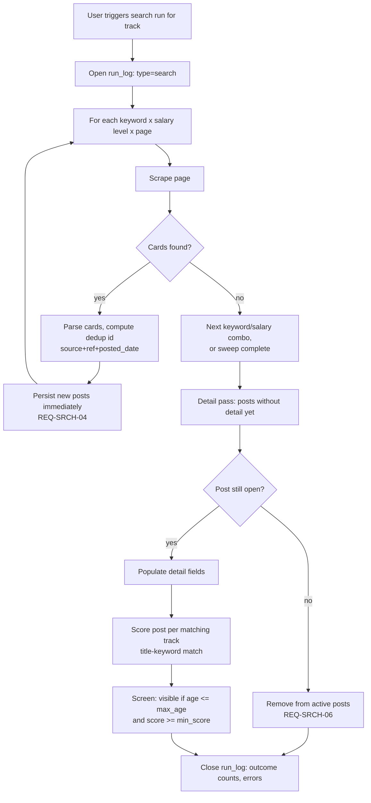
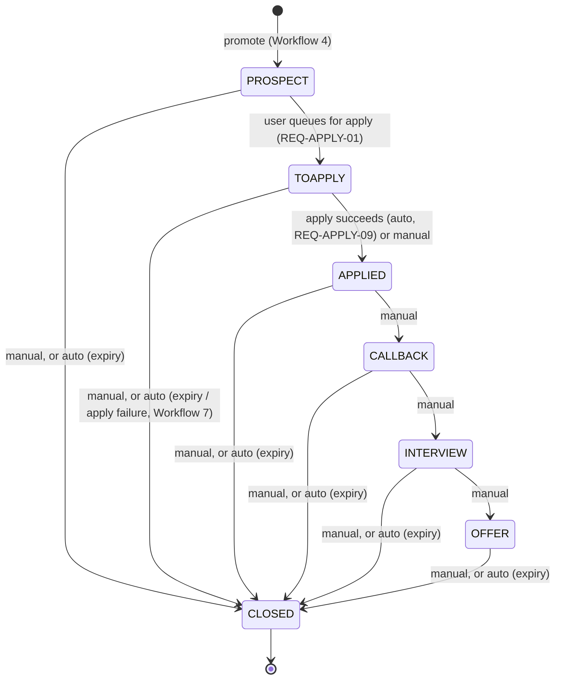

# Easy MCF POC Local - Workflows

## Contents

- [Purpose](#purpose)
- [References](#references)
- [Design decisions](#design-decisions)
- [1. Track & search profile setup](#1-track--search-profile-setup)
- [2. Search run](#2-search-run)
- [3. Manual posting entry](#3-manual-posting-entry)
- [4. Promote post to lead](#4-promote-post-to-lead)
- [5. Lead lifecycle / stage transitions](#5-lead-lifecycle--stage-transitions)
- [6. Automated apply run](#6-automated-apply-run)
- [7. Apply-outcome → lead propagation](#7-apply-outcome--lead-propagation)
- [8. MCF session establishment](#8-mcf-session-establishment)
- [9. Run logging & status](#9-run-logging--status)

## Purpose

This document describes the business logic and process flows release `010` implements, derived from the **requirements** doc. It is the source document. The **data model**, covering entities and schema, and the **user interface** design, covering pages and UX, are both derived from the workflows below. A change here should be checked against both.

Read the **requirements** doc first for the requirement IDs, `REQ-*`, referenced throughout, and the **prototype extraction** for the `jobsearch`/`mcfpipe` mechanics these workflows carry forward or correct.

## References

- **requirements** [010-01-requirements.md](010-01-requirements.md): the `REQ-*` ids referenced throughout this document.
- **data model** [010-data-model.md](010-data-model.md): entities and schema, derived from the workflows below.
- **user interface** [010-user-interface.md](010-user-interface.md): pages and UX, derived from the workflows below.
- **prototype extraction** [010-prototype.md](010-prototype.md): the `jobsearch`/`mcfpipe` mechanics these workflows carry forward or correct.

## Design decisions 

1. **Post vs. lead split.** 010 keeps the two-entity split already implied by the requirements glossary: `post`, the source-of-truth listing that isn't user-specific, and `lead`, the user's personal trackable instance created on promotion, rather than importing `mcfpipe`'s three-entity `post`/`job`/`crm_status` split. There is no per-user `job` wrapper entity. Per-track scoring attaches directly to `post` via a join, per the **data model**.
2. **Primary track assignment.** When a post matches more than one track, the track a resulting lead belongs to is **chosen by the user at promotion time**, Workflow 4, rather than computed automatically from the highest score.
3. **Apply-failure → lead effect.** This isn't a single blanket rule. It depends on whether the *post* is the problem or the *apply mechanics/config* are the problem, per Workflow 7's full table. `post_closed` and `post_unavailable` auto-close the lead as `apply failed`. Other failure outcomes, `cv_not_found`, `cv_selector_error`, `unable_to_apply`, and `invalid_input`, leave the lead open at `TOAPPLY` for the user to fix and retry.
4. **Session establishment UX.** There is in-app UI for this, Workflow 8: the app redirects the user to MCF's Singpass-federated login. Login and MFA itself stays manual and out of scope per REQ-APPLY-06. A custom upload dialog lets the user paste or upload the exported session cookie afterward.
5. **Track archival.** Track deletion is a soft delete, REQ-SRCH-10: an archived track is hidden from active track selectors, including search run, promote-to-lead, and apply default CV, but its historical posts, leads, and applications remain intact and readable.
6. **Apply-queue removal.** Removing a queued, not-yet-run, application from the queue closes the owning lead with close reason `withdrawn`, per REQ-APPLY-11, rather than reverting it to stage `PROSPECT`. A removed application is not recycled into a future batch.
7. **Lead activity as an event log.** A lead's activity, such as stage transitions, contact logged, note edits, and deadline changes, is recorded as an append-only per-lead event log, REQ-CRM-08, which is the basis for the lead's last-activity timestamp feeding auto-expiry, REQ-CRM-05, and for its activity history view. Scheduled interview and callback details are captured as free text within notes or an event entry rather than as dedicated per-stage date fields. The lead's `deadline` field keeps one consistent meaning throughout its lifecycle rather than being repurposed per stage.

## 1. Track & search profile setup

- User creates a **track**, role plus seniority, per REQ-SRCH-01. Creating a track creates its one **search profile** in the same step: keyword(s), minimum salary, maximum posting age, minimum match score, and employment type, defaulting to Full Time.
- User may set a **default CV** for the track, per REQ-APPLY-02, used by the apply run unless overridden per application.
- User can archive a track, REQ-SRCH-10 and **Decision 5**: a soft delete that hides it from active track selectors while preserving its historical posts, leads, and applications.

## 2. Search run

Trigger: user-initiated per track from the UI, REQ-SRCH-02. No scheduler exists in 010.

- Incremental persistence, per REQ-SRCH-04, means a crash mid-run keeps whatever was already saved. This is the one deliberate improvement over the `jobsearch` prototype's all-or-nothing write, per the **prototype extraction**.
- Dedup id, the title-keyword match-score formula, and screening thresholds reuse the `jobsearch` mechanics as-is, per the **prototype extraction**. 010 does not change the algorithm. It only changes where and when results are persisted.
- Score is stored with its `method` string, per REQ-SRCH-09, so a future semantic-scoring method can be added without a schema change.

## 3. Manual posting entry

- User submits a posting MCF search didn't find, via a form using the same fields as a scraped post, per REQ-SRCH-07: position title, company, URL/reference, salary, and so on.
- On save, the system auto-assigns the posting's matching tracks using the same match-scoring logic as a search run, per REQ-SRCH-09, creating the same `post_track` association a search match would, with `search_match = false`. The user can update this track assignment afterward via the UI.
- Manual postings bypass the match-score filter in screening, per REQ-SRCH-07, for the tracks they're assigned to. They're still visible for promotion regardless of score.

## 4. Promote post to lead

- From any posting-browse context, user selects a post and **one** of its associated tracks, Decision 2 above, to pursue it under.
- System creates a **lead**: `status = OPEN`, `stage = PROSPECT`, `post_id`, `track_id` set to the chosen track, and title/company initially mirroring the post, per REQ-CRM-01.
- The post record itself is never mutated by this step. REQ-CRM-04 keeps lead-level title/company overrides separate from the post.
- A post can be promoted into at most one lead. Once promoted, it is no longer available for promotion under a different track. Search & Results shows it as already promoted rather than offering the promote action again.

## 5. Lead lifecycle / stage transitions

- `CLOSED` records one close reason, per REQ-CRM-02:
  01. offer accepted
  02. rejected
  03. withdrawn
  04. expired
  05. cancelled
  06. duplicate
  07. apply failed
- **Activity log**, REQ-CRM-08 and **Decision 7**: every update to a lead, whether a stage change, contact logged, notes edited, or deadline changed, is recorded as a timestamped event in an append-only per-lead log, rather than only mutating a bare `updated_at` field. This log is the basis for both the lead's last-activity time, feeding auto-expiry below, and the activity history shown to the user, per the **user interface** design's Lead Detail. Scheduled interview and callback details are captured as free text within notes or an event entry rather than as dedicated per-stage date fields.
- **Auto-expiry**, REQ-CRM-05: a lead auto-closes as `expired` once 28 days pass with no activity on it. The expiry threshold is the lead's latest activity-log entry plus 28 days, and applies at every open stage, `PROSPECT` through `OFFER`. It is evaluated on each backend list call, for example `GET /lead/search` per REQ-PLAT-01, rather than by a background job, since 010 has no scheduler, so the UI reflects current expiry state on every page load or refresh.
- **Auto apply-failed close**: see Workflow 7 for the specific outcomes that trigger this and the ones that leave the lead open.
- **Manual withdrawal via queue removal**, REQ-APPLY-11 and **Decision 6**: removing a queued application from the Applications page closes its lead as `withdrawn` rather than reverting it to `PROSPECT`. See Workflow 6.

## 6. Automated apply run

Two-step model, matching REQ-FE-01's explicit "apply-queue review and results" screen. Queueing and running are separate user actions rather than one:

1. **Queue.** From the pipeline view, user selects one or more `PROSPECT` leads and queues them, per REQ-APPLY-01: each advances to `TOAPPLY`, and an `application` row is created per lead with `status = queued`.
2. **Run.** From the apply-queue view, user reviews the queue, confirming or overriding the CV per application per REQ-APPLY-02, then triggers the run.
3. **Remove, optional, before running.** User can remove a queued application from the queue instead of running it, per REQ-APPLY-11 and **Decision 6**: the `application` row is discarded and its lead closes with reason `withdrawn`. It does not revert to `PROSPECT`, and it is not available to be re-queued.

- A single application's failure never stops the batch and never overwrites another application's recorded outcome, per REQ-APPLY-08.
- Questionnaire-required postings are deliberately left for the user to complete manually on MCF. They are not automated and not retried, per REQ-APPLY-05.

## 7. Apply-outcome → lead propagation

01. **`applied`**: auto-transitions lead to `APPLIED`, per REQ-APPLY-09.
02. **`questionnaire_required`**: lead stays `TOAPPLY`. User completes the questionnaire manually on MCF, then manually sets the lead to `APPLIED`.
03. **`post_closed`**: lead auto-closes as `CLOSED`, reason `apply failed`. The post is gone, so retrying is pointless.
04. **`post_unavailable`**: same treatment as `post_closed`. The post couldn't even load, so it's equally unpursuable.
05. **`cv_not_found`**: lead stays `TOAPPLY`. User fixes the CV assignment and re-queues.
06. **`cv_selector_error`**: lead stays `TOAPPLY`, retryable. This is likely a transient DOM or selector issue rather than a dead post.
07. **`unable_to_apply`**: lead stays `TOAPPLY`, retryable. This may be a slow page load rather than a dead post.
08. **`invalid_input`**: lead stays `TOAPPLY`. User fixes the missing required field or fields and re-queues.

## 8. MCF session establishment

1. User clicks "Log in to MCF" in-app.
2. App opens MCF's login flow, Singpass-federated. Login, MFA, and CAPTCHA itself is a manual step the user completes outside app control. Automating it is explicitly out of scope, per REQ-APPLY-06's out-of-scope list.
3. User manually exports the resulting session cookie from their browser. This is an external step, the same pattern as `jobsearch`'s `cookies_mcf.json`, per the **prototype extraction**.
4. User returns to the app and uploads or pastes the cookie via a custom dialog, per **Decision 4**.
5. Backend validates at least one loaded cookie matches the MCF domain, the same check `jobsearch` performs, and stores it. Session status, valid, expired, or missing, is shown in the UI. An apply run aborts up front if the session isn't valid, per Workflow 6 and REQ-APPLY-06.

## 9. Run logging & status

Every user-triggered run, search or apply, is logged with start and end time, outcome counts, and errors, per REQ-PLAT-03, so a failure is diagnosable without re-running. Scoring is not a separately-triggered run. It happens inline as part of a search run, per REQ-SRCH-09. Run status and any errors are surfaced in the UI rather than just written to a log file, per REQ-FE-02.
