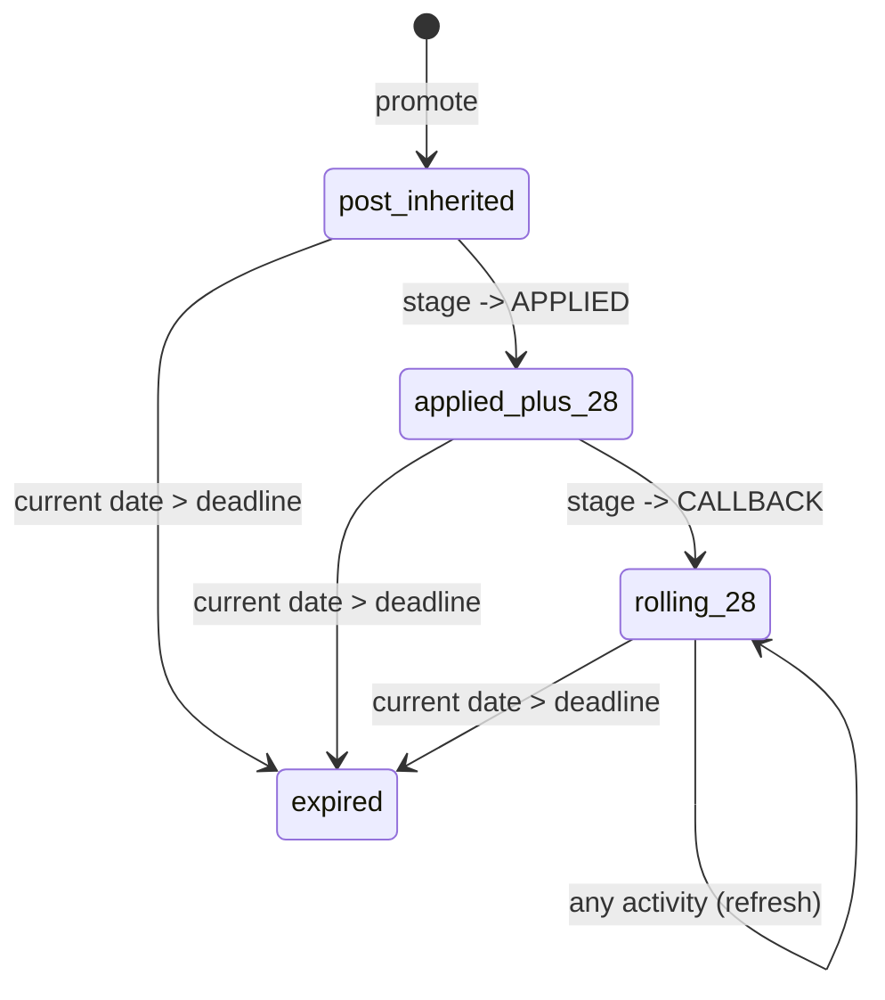

# Job Leads Tracking - Feature tracker
>Review the guidelines before performing any actions including edits on the document

## 010.09 (open) job leads tracking

Implements the **requirements** doc's Job leads tracking section (REQ-CRM-01..08) and the CRM-facing half of REQ-FE-01/02: promoting a post into a tracked lead, progressing it through its stage lifecycle, closing/archiving it, adding lead notes, and giving the user the pipeline board/list views and per-lead activity history to do all of that without ever touching the database or a spreadsheet. Builds on the schema and seed data milestone 08 already delivered for `lead`/`lead_note`/`lead_event`.

## Contents

- [Status](#status)
- [Tasks](#tasks)
- [Scope](#scope)
- [References](#references)
- [Design](#design)
- [Test cases](#test-cases)
- [Edit locations](#edit-locations)
- [Implement](#implement)
- [Validate](#validate)
- [Guideline](#guideline)

## Status

**current status: PENDING**

scope, design developed and ready to move to detailed design specification - edit locations, test strategy and test cases. Currently pending completion of 010.12 validation utilities for use in the test strategy.

**next**

next agent prompt

```md
develop the test strategy, test cases and edit locations sections of the tacker, the test strategy should define how autonomous agent would independently validate each of the components - the backend, the frontend.  the details of these test strategies and instructions for the ai agent should be defined in `010-test-strategy.md` and only referneced in the tracker.  the test cases should be organized into enumerated tables with separate tables for each test strategy.  for both api and frontend, each should have it's own standalone validation utility 
```

## Tasks

| id    | seq | status  | task                     |
| ----- | --- | ------- | ------------------------ |
| 09.01 | 01  | closed  | scope                    |
| 09.02 | 02  | open    | design                   |
| 09.03 | 03  | pending | test strategy            |
| 09.04 | 04  | pending | test cases               | 
| 09.05 | 05  | pending | edit locations           |
| 09.06 | 06  | pending | data model seed data     |
| 09.07 | 07  | pending | implement backend api    |
| 09.08 | 08  | pending | implement frontend       |
| 09.09 | 09  | pending | manual validation        |
| 09.IS | 10  | pending | validate                 |

## Scope

Build the job-leads-tracking / CRM feature end to end on top of milestone 08's schema and seed data: the backend read/write behavior for `lead`, `lead_note`, and `lead_event` per `010-api.md`'s hook design, and the AngularJS screens (**user interface** pages 5 and 6) that let a user drive the full lead lifecycle — promote, progress through stages, add notes, log contact, close/archive — and see it, per REQ-CRM-07.

**Scope**

- **backend — lead create (promote)**: `POST /api/v1/lead` (generic-shaped, hook-validated, REQ-CRM-01). Requires `post_id` + `track_id`, rejects a post already promoted for the same `user_id` with `409` (one lead per post-user_id combination), defaults `status=OPEN`/`stage=PROSPECT`, and writes the first `lead_event`.
- **backend — lead update**: `PUT /api/v1/lead/{id}` (REQ-CRM-02..04, REQ-CRM-06). Enforces legal stage transitions, allows `close_reason` only when transitioning to `CLOSED`, allows title/company override independent of the source post, and appends one `lead_event` per accepted write with `event_type` inferred from what changed (`stage_change`, `deadline_changed`, `contact_logged`), refreshing `updated_at` from that event.
- **backend — lead_note create**: `POST /api/v1/lead_note` (REQ-CRM-03). Appends its own `lead_event(event_type='note_edited')` against the owning lead as a side effect.
- **backend — lead_event read**: `GET /api/v1/lead_event/search` (REQ-CRM-08). Read-only; every row is written internally by a `lead`/`lead_note` write, never created directly.
- **backend — auto-expiry (REQ-CRM-05)**: evaluated as a write-on-read side effect of `lead` `GET`/`search`, comparing the current date (via the injectable clock, `ARCH-STO-05`) against `deadline` rather than a scheduled job; `deadline` itself is system-maintained per the resolved decision above (post-inherited at promotion, reset at `APPLIED`, rolling from `CALLBACK` onward).
- **frontend — Leads page** (**user interface** page 5): the six stage-filtered tabs (Pipeline board for `PROSPECT`/`TOAPPLY`, focused lists for `APPLIED`/`CALLBACK`/`INTERVIEW`/`OFFER`, and `CLOSED`) as one `lead` list filtered by current stage, plus the days-since-last-activity/expiry-warning indicator on every tab. The page contents should show only for tracks scoped to the logged in user, and should be filterable by track.
- **frontend — Lead Detail panel** (**user interface** page 6): the full REQ-CRM-03 field set, title/company override, add-note, log-contact, stage-change/close-with-reason controls, and the reverse-chronological activity history interleaving `lead_event` rows with `application` attempts.
- **backend — track management**: `POST`/`PUT /api/v1/track` (generic, REQ-SRCH-01/10) — plain CRUD plus the existing archive-via-`PUT {is_active: false}` pattern (`010-api.md`'s `track` CAT-01 classification). A prerequisite for this milestone, since a lead cannot be promoted without an owning track (REQ-CRM-01).
- **frontend — Tracks page** (**user interface** page 1): create/edit a track (role, seniority), default-CV picker, and archive/unarchive, per REQ-SRCH-10. Does not include the track's search-profile fields — those live on the separate Search Profiles page (1b), milestone 10's scope, reached via a "Configure search" row action from this page.
- **run-status/error surfacing** (REQ-FE-02): a failed or rejected lead/lead_note write surfaces in the UI via whatever cross-cutting error-surfacing pattern the **user interface** design's UX section fixes, not only in a console or log.

**Auto-expiry mechanism (REQ-CRM-05)** `lead.deadline` is a system-maintained field. Set from the post's `closing_date` at promotion (defaulted to 28 days from `posted_date` if the post has none, or to 1 week from the promotion date if that computed date has already passed), reset to 28 days from `applied_date` on the `APPLIED` transition, then refreshed to 28 days from the most recent logged activity on every update from `CALLBACK` onward. A lead auto-closes (`status`/`stage` → `CLOSED`, `close_reason='expired'`) once the current date passes `deadline`; a lead already `status='CLOSED'` is never re-evaluated or rewritten. This supersedes the earlier "last-updated timestamp plus 28 days, every open stage a candidate" framing and the `easymcf-crm` skill's now-corrected `APPLIED`/`INTERVIEW`-exempt guard — there is no exempt-stage list; the only guard is "not already `CLOSED`." Propagated to: **requirements** REQ-CRM-05/08 and the glossary, **data model** `lead`/`lead_event` sections, **workflows** Workflow 5 (Decision 7, Auto-expiry), and the **easymcf-crm skill**. No source code exists yet for this milestone, so there is nothing to update there.

**seed data generator update**: update the seed data generator to reproduce the current seed data state
    - add roles, tracks, search profiles for Data Engineer, Data Scientist, Software Developer and Gen AI Developer
    - update user to Taylor Hickem yayfalafels@gmail.com

Out of scope:

- the Search Profiles page (**user interface** page 1b) — search-execution criteria (keywords, salary, age, schedule) is milestone 10's, search by keywords. This milestone owns Tracks (page 1) itself: track identity and lifecycle only, since a lead cannot be promoted without an owning track (REQ-CRM-01).
- the Posts/results-browsing screen with its per-row "Promote to lead" trigger control (page 3) — milestone 10, search by keywords. This milestone owns the `lead` creation endpoint and every screen once a lead exists, not the screen the promote action is triggered from.
- the apply-queue/results screens (page 7), the apply state machine, and CV assignment — milestone 11, apply automation. This milestone only owns what happens to a lead when an apply outcome is recorded against it (REQ-APPLY-09/10/11's transition/close effects), not the apply run itself.
- the Automation/session-status screen (page 8) — milestone 11.
- `lead`/`lead_note`/`lead_event` schema and seed-data generation — delivered by milestone 08 (`easymcf/db/schema.sql`, `seed/10_lead.sql`..`12_lead_event.sql`). This milestone reuses that seed set, extending it only if Design finds a concrete gap it doesn't already cover (e.g., a lead sitting exactly at the 27/28-day expiry boundary, needed to exercise the UI warning indicator and the auto-expiry read path).
- any analytics/BI/reporting pipeline — ETL, warehouse, cross-run dashboards — explicitly out of scope release-wide (**requirements** doc, Out of scope section). "Pipeline performance reporting" for this milestone means the Leads page's own stage-grouped views and counts (page 5) and the per-lead activity history (page 6) already specified above, not a new aggregate metrics or reporting screen.
- multi-user support/ownership beyond the single seeded user — out of scope release-wide.

**closure**

- **09.CK.01** every one of REQ-CRM-01..08 is implemented and independently verified by the Test cases section this milestone writes.
- **09.CK.02** promoting a post creates a lead at `status=OPEN`/`stage=PROSPECT` with its first `lead_event`; promoting the same post a second time is rejected with `409` naming the existing lead.
- **09.CK.03** every stage transition and close action exposed in the UI succeeds server-side and appends the correct `lead_event`; an illegal transition is rejected by the backend, not merely hidden by the client.
- **09.CK.04** a lead is auto-closed (`close_reason='expired'`) on its next read once the current date passes its system-maintained `deadline` (REQ-CRM-05), and a lead already `status='CLOSED'` is never re-touched — the prototype's unconditional-overwrite regression (`easymcf-crm` skill) does not recur.
- **09.CK.05** creating a `lead_note` appends its own `lead_event` and is visible in the lead's activity history.
- **09.CK.06** the Leads page's six tabs and the Lead Detail panel are reachable, populated from seed/fixture data, and every action (stage change, close, note, contact log) round-trips through the real backend API, not a client-side mock.
- **09.CK.07** a rejected or failed lead write surfaces its error in the UI (REQ-FE-02).
- **09.CK.08** milestone 07's and milestone 08's own closing commands still pass unmodified against this milestone's changes — no regression.
- **09.CK.09** the Tracks page (page 1) supports create/edit/archive of a track independent of its search-profile configuration, which lives on the separate Search Profiles page (1b) owned by milestone 10.

## References

- **requirements** [010-01-requirements.md](../design/010-01-requirements.md): REQ-CRM-01..08 (this milestone's core scope), REQ-FE-01/02 (UI and run-status surfacing), REQ-APPLY-09/10/11 (apply-outcome → lead propagation, this milestone's write path only, not the apply run itself), Out of scope section (analytics/BI/reporting exclusion)
- **api design** [010-api.md](../design/010-api.md): `lead`/`lead_note`/`lead_event` sections — the CAT-02 hook classification, request/response shapes, and the write-on-read auto-expiry rule this milestone implements verbatim
- **data model** [010-data-model.md](../design/010-data-model.md): `lead`/`lead_note`/`lead_event` table shape, already realized in schema by milestone 08
- **architecture** [010-architecture.md](../design/010-architecture.md) `ARCH-STO-05`: the injectable clock (`clock.py::now()`) the auto-expiry read-path evaluates against, so fixture-mode tests can control "now" deterministically
- **workflows** [010-workflows.md](../design/010-workflows.md): Workflow 4 (promote), Workflow 5 (lead lifecycle / state diagram), Workflow 7 (apply-outcome → lead propagation table)
- **user interface** [010-user-interface.md](../design/010-user-interface.md): page 1 (Tracks), page 5 (Leads), and page 6 (Lead Detail) — the screens this milestone builds; pages 1b/3/7/8 for the cross-milestone boundaries noted in Scope
- **frontend app design** [010-frontend-app.md](../design/010-frontend-app.md): `TracksCtrl`/`LeadsCtrl`/`LeadDetailCtrl` controller/service wiring and the `SearchProfilesCtrl` boundary this milestone must not cross
- **prior milestone** [010.08-db-schema-seed-data.md](010.08-db-schema-seed-data.md): owns the schema and seed data this milestone builds on and does not re-implement
- **easymcf-crm skill** [easymcf-crm](../../../../.claude/skills/easymcf-crm/SKILL.md): the pipeline-status vs. apply-status distinction, the stage state machine, and the unconditional-overwrite regression this milestone must not repeat
- **easymcf-backend-api skill** [easymcf-backend-api](../../../../.claude/skills/easymcf-backend-api/SKILL.md): the generic-CRUD/hook/named-endpoint classification this milestone's `lead` routes follow
- **easymcf-frontend skill** [easymcf-frontend](../../../../.claude/skills/easymcf-frontend/SKILL.md): AngularJS structure conventions and the run-status-surfacing requirement
- **project boundaries** [CLAUDE.md](../../../../CLAUDE.md): no live-site requests, local venv rules, dev/test against seed data only

## Design

### Workflow

**Promote-to-lead** (Workflow 4, REQ-CRM-01): triggered from Posts (page 3) via `POST /api/v1/lead {post_id, track_id}`. Validates both fields present, rejects an already-promoted post with `409`, and on success sets `status=OPEN`/`stage=PROSPECT`, computes the initial `deadline` (see Data model below), and writes one `lead_event(event_type='stage_change', detail='promoted to PROSPECT')`, matching `010-api.md`'s existing example verbatim.

**Lead lifecycle / stage transitions** (Workflow 5, REQ-CRM-02/06): the table below is the enforcement-ready translation of `010-workflows.md`'s mermaid diagram, which now states explicitly that it is the complete legal set — no skip-ahead, no backward move. `PUT /api/v1/lead/{id}` rejects anything not in this table with `409`.

| id | from stage | legal to stage(s) |
| -- | ---------- | ------------------ |
| 01 | PROSPECT   | TOAPPLY, CLOSED   |
| 02 | TOAPPLY    | APPLIED, CLOSED   |
| 03 | APPLIED    | CALLBACK, CLOSED  |
| 04 | CALLBACK   | INTERVIEW, CLOSED |
| 05 | INTERVIEW  | OFFER, CLOSED     |
| 06 | OFFER      | CLOSED            |
| 07 | CLOSED     |                   |

`close_reason` is required, and validated against the seven-value enum, on any transition to `CLOSED`; omitting it is `400`.

**Track lifecycle** (Workflow 1, track-identity half only): create/edit (role, seniority) and archive/unarchive (`PUT {is_active: false}`), per REQ-SRCH-10. No search-profile field appears in the `track` write path — `track` and `search_profile` are separate tables per the data model, and the Tracks page's frontend and backend code never read or write `search_profile`.

**Activity logging as a side effect** (REQ-CRM-08): every accepted `lead`/`lead_note` write appends exactly one `lead_event` row, inferred per the Data model mapping below. This is the single code path REQ-CRM-08 requires; there is no second, unmediated way to mutate a `lead`.

**Auto-expiry deadline state machine** (REQ-CRM-05, already resolved in Scope):



`deadline` passes through three states: `post_inherited` (the post's `closing_date`, or `posted_date`+28, or promotion+1 week if already past), `applied_plus_28` (fixed at the `APPLIED` transition), and `rolling_28` (refreshed on every activity from `CALLBACK` onward). The "current date > deadline" check runs only against a lead still `status='OPEN'`, as a write-on-read pre-pass on `GET`/`search` (API endpoints below), reusing the same internal write path as every other close.

**Apply-outcome → lead propagation** (Workflow 7, inbound only): the apply-run service calls into this same `lead` write path for `applied`→`APPLIED` and `post_closed`/`post_unavailable`→`CLOSED`(`apply_failed`), so the resulting `lead_event` is written through the identical code path as every other transition above — never a second lead-mutation route.

### Data model

No new columns or tables — no new schema changes (`lead`, `lead_note`, `lead_event`, `track`).

**`lead`**: `status`/`stage`/`close_reason` mutated only through the transition table above; `deadline` mutated only at the three points in the Auto-expiry state machine above; `title_override`/`company_override` unrestricted (REQ-CRM-04); `applied_date`/`first_attempt_date`/`last_contact_date` unrestricted, each still producing a `lead_event` per the mapping below.

**`lead_event.event_type` mapping** — closes the one real gap left in `010-api.md`'s prior text, which never assigned an event type to four of the seven writable `lead` fields:

| id | changed field(s)                   | event_type         |
| -- | ---------------------------------- | ------------------ |
| 01 | `stage` or `close_reason`          | `stage_change`     |
| 02 | `deadline`                         | `deadline_changed` |
| 03 | `last_contact_date`                | `contact_logged`   |
| 04 | override/date fields — see note 04 | `field_edited`     |
| 05 | a `lead_note` created              | `note_edited`      |

04. `title_override`, `company_override`, `applied_date`, or `first_attempt_date` changed with no accompanying stage/deadline/contact change.

**resolved decision** — `event_type` gains a fifth enum value, `field_edited`, rather than overloading `stage_change` for these four fields. The overload was rejected on reflection: nothing has shipped yet, so "avoid a schema change late in the release" doesn't hold up as a reason, and reusing `stage_change` would have made Lead Detail's activity-history view (page 6) show a misleading "stage change" entry for a plain title-override edit. `field_edited`'s `detail` field names the specific field and value, matching every other event type's convention. Propagated to `010-data-model.md` (`lead_event.event_type` field) and `010-01-requirements.md` (REQ-CRM-08). Not yet propagated to running code: `easymcf/db/schema.sql`'s `event_type` `CHECK` constraint and `easymcf/__init__.py`'s `SCHEMA_VERSION` (currently `3`, milestone 08) still need the actual DDL edit, a `schema_version` 3→4 bump, and a seed-data regen to produce at least one `field_edited` fixture row — that is Implement-stage work for this milestone (09.05/09.06), not a Design-stage doc change, and it will make milestone 08's tracker's embedded schema.sql snapshot one version stale until it lands.

**`lead_note`**: append-only; each create pairs with a `lead_event(note_edited)` per `010-api.md`.

**`track`**: plain CRUD against the existing columns (`user_id`, `role_id`, `seniority`, `default_cv_id`, `is_active`); `search_profile` is never read or written here.

### Seed data

**Seed data generator update**: `scripts/gen_test_data.py` (milestone 08) is updated to reproduce, on every regeneration, the seed state this milestone's manual data-patching established, so it survives the next `resetdb.py --seed` run instead of being lost the first time someone regenerates the seed set.

- **`user`**: the fabricated singleton (`seed/02_user.sql`) changes from milestone 08's placeholder (`'Alex Tan', 'alex.tan@example.com'`) to `'Taylor Hickem', 'yayfalafels@gmail.com'`. Still a fabricated row, since `user` has no source in `test-data/*.csv` — only the fabricated identity's content changes, not the fabrication rule itself.
- **`role`**: four fabricated rows added to the existing two (`Data Analyst`, `Sustainability Consultant`): `Data Engineer`, `Data Scientist`, `Software Developer`, `Gen AI Developer`.
- **`track`**: one fabricated row per new role, owned by the single seeded `user`, `is_active=1`, `default_cv_id` left null.
- **`search_profile`**: one fabricated row per new track, matching the existing two rows' convention (`seed/05_search_profile.sql`): `keywords` set to the role name, `min_salary=10000`, `max_age_weeks=4`, `min_match_score=0.3`, `employment_type='Full Time'`.
- **`search_schedule`**: one fabricated row per track — for all six tracks, not only the four new ones. No `search_schedule` seed file exists yet at all; the table is new, added alongside `010-data-model.md`'s recent `search_schedule` addition, so the two pre-existing tracks have never had a row seeded for it either. Every row follows `010-data-model.md`'s stated convention: `schedule_enabled=false`, `schedule_interval_hours=24`, `next_run_at=NULL` — opt-in scheduling, so a freshly reset database never fires an unattended run.

**implementation decision** — this changes `scripts/gen_test_data.py`'s fabricated-row content for `_map_user`/`_map_role`/`_map_track`/`_map_search_profile` and adds a new `_map_search_schedule` function (the table itself is new since milestone 08, so no prior mapping function exists to extend), plus the resulting `seed/02_user.sql`/`seed/01_role.sql`/`seed/04_track.sql`/`seed/05_search_profile.sql` output and a new seed file for `search_schedule` (numbering shifts if inserted before existing FK-dependent tables — recheck `_TABLE_ORDER`'s numbering against `010-data-model.md`'s current entity list before implementing). No schema change to already-existing tables and no `schema_version` bump for this part — `search_schedule` itself is a schema addition, but one `010-data-model.md` already made outside this milestone's own design work, not something this milestone's Design introduces. Regenerating uses the existing `env/bin/python scripts/gen_test_data.py --mode seed --out seed/ --rand-seed 42` command milestone 08 already built, extended for the new table.

### API endpoints

| id | endpoint                        | classification         | responsibility              |
| -- | -------------------------------- | ----------------------- | ---------------------------- |
| 01 | `POST /api/v1/lead`             | CAT-02 hook            | promote — see Workflow      |
| 02 | `PUT /api/v1/lead/{id}`         | CAT-02 hook            | transitions — see Workflow  |
| 03 | `GET`/`search /api/v1/lead`     | CAT-02 hook, read-time | auto-expiry pre-pass, below |
| 04 | `POST /api/v1/lead_note`        | CAT-02 hook            | create + paired event       |
| 05 | `GET /api/v1/lead_event/search` | CAT-02 hook, read-only | activity history, page 6    |
| 06 | `POST`/`PUT /api/v1/track`      | CAT-01 generic         | plain CRUD + archive toggle |

**Auto-expiry pre-pass** (endpoint 03): before running the requested `search`, select every `id` where `status='OPEN' AND deadline < :today`, then close each through the same internal write function endpoint 02 uses — never a raw bulk `UPDATE` — so the `lead_event` side effect is never skipped. This extends the "no second lead-mutation code path" invariant `010-api.md` already states for apply-outcome propagation to auto-expiry as well.

### Frontend page UI

**Tracks (page 1)**: create/edit form (role, seniority), default-CV picker, archive toggle, and a read-only search-profile summary per row with a "Configure search" link to page 1b (Search Profiles).

**Leads (page 5)**: `LeadsCtrl` issues one `list('lead')` fetch; the six tabs are a client-side filter over that one response. The expiry-warning indicator is computed client-side from the fetched `deadline` (days-until, thresholded).

**Lead Detail (page 6)**: `LeadDetailCtrl` binds the full REQ-CRM-03 field set, the note/contact/stage-change/close controls (each a generic `PUT`/`POST`, per `FE-SVC-02`), and merges read-only `lead_event` (`FE-SVC-03a`) with the lead's `application` rows into one reverse-chronological activity view.

**Error/run-status surfacing**: lead/lead_note write failures route through the existing single `ErrorService` (`FE-ERR-01`) — a `409` (double-promote, illegal transition) and a `400` (missing `close_reason`) both need a human-readable message mapping there; no new error-handling mechanism is introduced.

## Test strategy

_expand when this stage starts_

## Test cases

_expand when this stage starts_

## Edit locations

_expand when this stage starts_

## Implement

_expand when this stage starts_

## Validate

_expand when this stage starts_

## Guideline

### instructions

review and strictly follow these relevant skills when performing tasks for this feature implementation and working with this document

### relevant skills

- markdown-tables
- feature-implementation-guide
- easymcf-crm
- easymcf-backend-api
- easymcf-frontend
