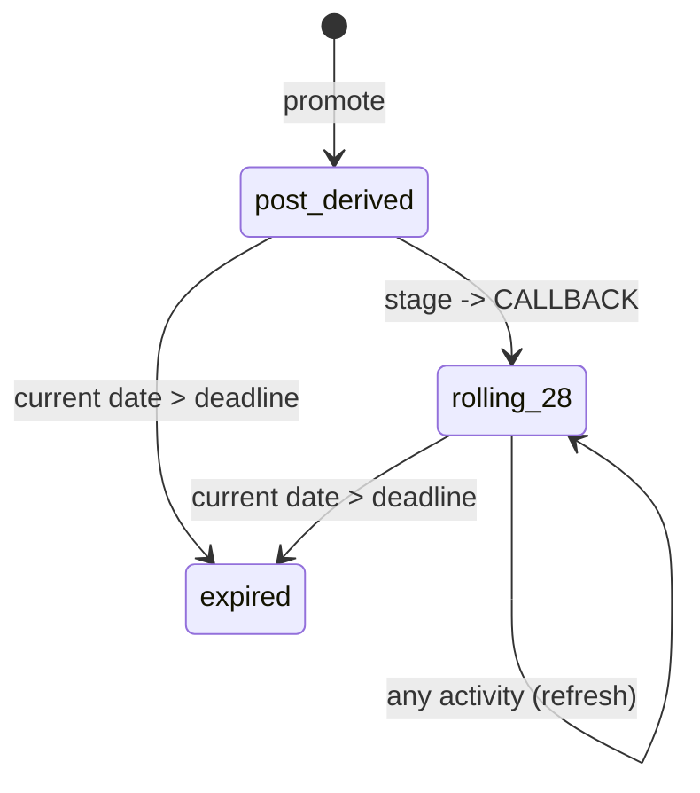

# Job Leads Tracking - Feature tracker
>Review the guidelines before performing any actions including edits on the document

## 010.09 (open) job leads tracking

Implements the **requirements** doc's Job leads tracking section (REQ-CRM-01..08) and the CRM-facing half of REQ-FE-01/02: promoting a post into a tracked lead, progressing it through its stage lifecycle, closing/archiving it, adding lead notes, and giving the user the pipeline board/list views and per-lead activity history to run the whole lead workflow inside the app. Builds on the existing schema and seed data for `lead`/`lead_note`/`lead_event`.

## Contents

- [Status](#status)
- [Tasks](#tasks)
- [Scope](#scope)
- [References](#references)
- [Design](#design)
- [Test cases](#test-cases)
- [Edit locations](#edit-locations)
- [Implement](#implement)
- [Validate](#validate)
- [Guideline](#guideline)

## Status

**current status: OPEN**

Scope, design, test strategy, test cases, and edit locations are complete. The data model and seed data (09.06), the backend API (09.07), and the frontend (09.08) are implemented and validated, with every issue logged under 09.IS and closed. Manual validation (09.09) is the remaining task.

**next**

next agent prompt

```md
record the results of the manual validation pass for 010.09 (task 09.09) in the Validate section: the human cases 09.TC.23 to 09.TC.26 against the running app at http://127.0.0.1:5000, with anything that looked wrong logged under 09.IS as it is reported, then close the remaining tasks.
```

## Tasks

| id    | seq | status  | task                     |
| ----- | --- | ------- | ------------------------ |
| 09.01 | 01  | closed  | scope                    |
| 09.02 | 02  | closed  | design                   |
| 09.03 | 03  | closed  | test strategy            |
| 09.04 | 04  | closed  | test cases               | 
| 09.05 | 05  | closed  | edit locations           |
| 09.06 | 06  | closed  | data model seed data     |
| 09.07 | 07  | closed  | implement backend api    |
| 09.09 | 08  | closed  | manual validation be api |
| 09.08 | 09  | closed  | implement frontend       |
| 09.10 | 10  | open    | manual validation fe     |
| 09.IS | 11  | pending | validate                 |

## Scope

Build the job-leads-tracking / CRM feature end to end on top of the existing schema and seed data: the backend read/write behavior for `lead`, `lead_note`, and `lead_event` per `010-api.md`'s hook design, and the AngularJS screens (**user interface** pages 5 and 6) that let a user drive the full lead lifecycle — promote, progress through stages, add notes, log contact, close/archive — and see it, per REQ-CRM-07.

**Scope**

- **backend — lead create (promote)**: `POST /api/v1/lead` (generic-shaped, hook-validated, REQ-CRM-01). Requires `post_id` + `track_id`, rejects a post already promoted for the same `user_id` with `409` (one lead per post-user_id combination), defaults `status=OPEN`/`stage=PROSPECT`, and writes the first `lead_event`.
- **backend — lead update**: `PUT /api/v1/lead/{id}` (REQ-CRM-02..04, REQ-CRM-06). Enforces legal stage transitions, allows `close_reason` only when transitioning to `CLOSED`, allows title/company override independent of the source post, and appends one `lead_event` per accepted write with `event_type` inferred from what changed (`stage_change`, `deadline_changed`, `contact_logged`), refreshing `updated_at` from that event.
- **backend — lead_note create**: `POST /api/v1/lead_note` (REQ-CRM-03). Appends its own `lead_event(event_type='note_edited')` against the owning lead as a side effect.
- **backend — lead_event read**: `GET /api/v1/lead_event/search` (REQ-CRM-08). Read-only. Every row is written internally as a side effect of a `lead`/`lead_note` write.
- **backend — auto-expiry (REQ-CRM-05)**: a write-on-read side effect of `lead` `GET`/`search`. The current date, via the injectable clock `ARCH-STO-05`, is compared against `deadline` on every read. `deadline` itself is system-maintained per the auto-expiry mechanism below: derived from the post at promotion, rolling from `CALLBACK` onward.
- **frontend — Leads page** (**user interface** page 5): the six stage-filtered tabs (Pipeline board for `PROSPECT`/`TOAPPLY`, focused lists for `APPLIED`/`CALLBACK`/`INTERVIEW`/`OFFER`, and `CLOSED`) as one `lead` list filtered by current stage, plus the days-since-last-activity/expiry-warning indicator on every tab. The page contents should show only for tracks scoped to the logged in user, and should be filterable by track.
- **frontend — Lead Detail panel** (**user interface** page 6): the full REQ-CRM-03 field set, title/company override, add-note, log-contact, stage-change/close-with-reason controls, and the reverse-chronological activity history interleaving `lead_event` rows with `application` attempts.
- **backend — track management**: `POST`/`PUT /api/v1/track` (generic, REQ-SRCH-01/10) — plain CRUD plus the existing archive-via-`PUT {is_active: false}` pattern (`010-api.md`'s `track` CAT-01 classification). Promoting a lead requires an owning track (REQ-CRM-01).
- **backend — generic CRUD layer and injectable clock**: the `/api/v1` blueprint serving the seven generic shapes for each registered resource (REQ-PLAT-01), the `clock.py::now()` indirection (`ARCH-STO-05`), and read resources for `role`, `cv`, `search_profile`, and `application` that the Tracks page and Lead Detail read.
- **frontend — Tracks page** (**user interface** page 1): create/edit a track (role, seniority), default-CV picker, and archive/unarchive, per REQ-SRCH-10. The track's search-profile fields live on the separate Search Profiles page (1b), reached via a "Configure search" row action from this page.
- **run-status/error surfacing** (REQ-FE-02): a failed or rejected lead/lead_note write surfaces in the UI, via whatever cross-cutting error-surfacing pattern the **user interface** design's UX section fixes.

**Auto-expiry mechanism (REQ-CRM-05)** `lead.deadline` is a system-maintained field. 
    - if the post `closing_date` is non-null and > promotion date -> Set from the post's `closing_date` at promotion
    - if the post `closing_date` is null -> defaulted to 28 days from `posted_date`
    - if the post `closing_date` is non-null and <= promotion date -> set closing date to promotion date + 1 week.
    - thereafter, refresh to 28 days from the most recent logged activity on every update from `CALLBACK` onward
    - At any point, a lead with `status='OPEN'` auto-closes (`status`/`stage` → `CLOSED`, `close_reason='expired'`) once the current date passes `deadline`. 
    - Every open stage is an expiry candidate. 
    - Leads with `status='CLOSED'` are skipped by the expiry pass and keep their recorded close reason. 

**seed data generator update**: update the seed data generator to reproduce the current seed data state
    - add roles, tracks, search profiles for Data Engineer, Data Scientist, Software Developer and Gen AI Developer
    - update user to Taylor Hickem yayfalafels@gmail.com

Out of scope:

- the Search Profiles page (**user interface** page 1b) — search-execution criteria (keywords, salary, age, schedule) is milestone 10's, search by keywords. This milestone owns Tracks (page 1) itself: track identity and lifecycle only, since promoting a lead requires an owning track (REQ-CRM-01).
- the Posts/results-browsing screen with its per-row "Promote to lead" trigger control (page 3) — milestone 10, search by keywords. This milestone owns the `lead` creation endpoint and every screen once a lead exists. Milestone 10 owns the screen the promote action is triggered from.
- the apply-queue/results screens (page 7), the apply state machine, and CV assignment — milestone 11, apply automation. This milestone owns only what happens to a lead when an apply outcome is recorded against it, REQ-APPLY-09/10/11's transition/close effects. Milestone 11 owns the apply run itself.
- the Automation/session-status screen (page 8) — milestone 11.
- `lead`/`lead_note`/`lead_event` schema and seed-data generation — already in place (`easymcf/db/schema.sql`, `seed/*.sql`). The existing seed set is reused and extended where a scenario needs it, for example a lead sitting exactly on its `deadline` boundary, needed to exercise the UI warning indicator and the auto-expiry read path.
- any analytics/BI/reporting pipeline — ETL, warehouse, cross-run dashboards — explicitly out of scope release-wide (**requirements** doc, Out of scope section). "Pipeline performance reporting" for this milestone means the Leads page's own stage-grouped views and counts (page 5) and the per-lead activity history (page 6) already specified above.
- multi-user support/ownership beyond the single seeded user — out of scope release-wide.

**closure**

- **09.CK.01** every one of REQ-CRM-01..08 is implemented and independently verified by the Test cases section.
- **09.CK.02** promoting a post creates a lead at `status=OPEN`/`stage=PROSPECT` with its first `lead_event`; promoting the same post a second time is rejected with `409` naming the existing lead.
- **09.CK.03** every stage transition and close action exposed in the UI succeeds server-side and appends the correct `lead_event`; an illegal transition is rejected by the backend itself.
- **09.CK.04** a lead is auto-closed (`close_reason='expired'`) on its next read once the current date passes its system-maintained `deadline` (REQ-CRM-05), and leads with `status='CLOSED'` are skipped, keeping their recorded close reason (`easymcf-crm` skill).
- **09.CK.05** creating a `lead_note` appends its own `lead_event` and is visible in the lead's activity history.
- **09.CK.06** the Leads page's six tabs and the Lead Detail panel are reachable, populated from seed/fixture data, and every action (stage change, close, note, contact log) round-trips through the real backend API.
- **09.CK.07** a rejected or failed lead write surfaces its error in the UI (REQ-FE-02).
- **09.CK.08** milestone 07's and milestone 08's own closing commands still pass unmodified against this milestone's changes.
- **09.CK.09** the Tracks page (page 1) supports create/edit/archive of a track independent of its search-profile configuration, which lives on the separate Search Profiles page (1b).

## References

- **requirements** [010-01-requirements.md](../design/010-01-requirements.md): REQ-CRM-01..08 (this milestone's core scope), REQ-FE-01/02 (UI and run-status surfacing), REQ-APPLY-09/10/11 (apply-outcome → lead propagation, scoped here to this milestone's write path; the apply run itself is milestone 11's), Out of scope section (analytics/BI/reporting exclusion)
- **api design** [010-api.md](../design/010-api.md): `lead`/`lead_note`/`lead_event` sections — the CAT-02 hook classification, request/response shapes, and the write-on-read auto-expiry rule this milestone implements verbatim
- **data model** [010-data-model.md](../design/010-data-model.md): `lead`/`lead_note`/`lead_event` table shape, already realized in schema by milestone 08
- **architecture** [010-architecture.md](../design/010-architecture.md) `ARCH-STO-05`: the injectable clock (`clock.py::now()`) the auto-expiry read-path evaluates against, so fixture-mode tests can control "now" deterministically
- **workflows** [010-workflows.md](../design/010-workflows.md): Workflow 4 (promote), Workflow 5 (lead lifecycle / state diagram), Workflow 7 (apply-outcome → lead propagation table)
- **test strategy** [010-test-strategy.md](../design/010-test-strategy.md): `STRAT-SILO`/`CASE`/`LOOP`, the general independent-layer philosophy, plus `STRAT-TOOL-01..04`/`STRAT-HUMAN-01/02`, the standalone-utility and secondary human-validation protocols this milestone's Test cases section implements against and only references
- **user interface** [010-user-interface.md](../design/010-user-interface.md): page 1 (Tracks), page 5 (Leads), and page 6 (Lead Detail) — the screens this milestone builds; pages 1b/3/7/8 for the cross-milestone boundaries noted in Scope
- **frontend app design** [010-frontend-app.md](../design/010-frontend-app.md): `TracksCtrl`/`LeadsCtrl`/`LeadDetailCtrl` controller/service wiring and the `SearchProfilesCtrl` boundary that marks milestone 10's ownership
- **prior milestone** [010.08-db-schema-seed-data.md](010.08-db-schema-seed-data.md): owns the schema and seed data this milestone builds on
- **easymcf-crm skill** [easymcf-crm](../../../../.claude/skills/easymcf-crm/SKILL.md): the pipeline-status vs. apply-status distinction, the stage state machine, and the expiry guard
- **easymcf-backend-api skill** [easymcf-backend-api](../../../../.claude/skills/easymcf-backend-api/SKILL.md): the generic-CRUD/hook/named-endpoint classification this milestone's `lead` routes follow
- **easymcf-frontend skill** [easymcf-frontend](../../../../.claude/skills/easymcf-frontend/SKILL.md): AngularJS structure conventions and the run-status-surfacing requirement
- **project boundaries** [CLAUDE.md](../../../../CLAUDE.md): dev/test against seed data, local venv rules, live-site access only when the user explicitly requests it

## Design

### Workflow

**Promote-to-lead** (Workflow 4, REQ-CRM-01): triggered from Posts (page 3) via `POST /api/v1/lead {post_id, track_id}`. Validates both fields present, rejects an already-promoted post with `409`, and on success sets `status=OPEN`/`stage=PROSPECT`, computes the initial `deadline` (see Data model below), and writes one `lead_event(event_type='stage_change', detail='promoted to PROSPECT')`, matching `010-api.md`'s existing example verbatim.

**Lead lifecycle / stage transitions** (Workflow 5, REQ-CRM-02/06): the table below is the enforcement-ready translation of `010-workflows.md`'s mermaid diagram, which now states explicitly that it is the complete legal set: each stage advances one adjacent step forward, or closes. `PUT /api/v1/lead/{id}` accepts exactly the transitions in this table and answers `409` to any other. A `stage` equal to the current stage leaves the lead as it is.

| id | from stage | legal to stage(s) |
| -- | ---------- | ------------------ |
| 01 | PROSPECT   | TOAPPLY, CLOSED   |
| 02 | TOAPPLY    | APPLIED, CLOSED   |
| 03 | APPLIED    | CALLBACK, CLOSED  |
| 04 | CALLBACK   | INTERVIEW, CLOSED |
| 05 | INTERVIEW  | OFFER, CLOSED     |
| 06 | OFFER      | CLOSED            |
| 07 | CLOSED     |                   |

`close_reason` is required, and validated against the seven-value enum, on any transition to `CLOSED`; omitting it is `400`.

**Track lifecycle** (Workflow 1, track-identity half only): create/edit (role, seniority) and archive/unarchive (`PUT {is_active: false}`), per REQ-SRCH-10. The `track` write path covers track fields. `track` and `search_profile` are separate tables per the data model, and the Tracks page reads and writes `track` alone.

**Activity logging as a side effect** (REQ-CRM-08): every accepted `lead`/`lead_note` write appends one `lead_event` row, inferred per the Data model mapping below, plus one `deadline_changed` row when the system moves `deadline`. This single code path is the only way a `lead` changes, as REQ-CRM-08 requires.

**Auto-expiry deadline state machine** (REQ-CRM-05):



`deadline` passes through two states: `post_derived` (the post's `closing_date` when that date is after the promotion date, `posted_date` plus 28 days when the post has no `closing_date`, and the promotion date plus 1 week when `closing_date` is on or before the promotion date) and `rolling_28` (refreshed to 28 days after the most recent logged activity on every update from `CALLBACK` onward). The "current date > deadline" check runs only against a lead still `status='OPEN'`, as a write-on-read pre-pass on `GET`/`search` (API endpoints below), reusing the same internal write path as every other close.

**Apply-outcome → lead propagation** (Workflow 7, inbound only): the apply-run service calls into this same `lead` write path for `applied`→`APPLIED` and `post_closed`/`post_unavailable`→`CLOSED`(`apply_failed`), so the resulting `lead_event` is written through the identical code path as every other transition above. One lead-mutation route serves every caller.

### Data model

This section uses the existing `lead`, `lead_note`, `lead_event`, and `track` columns, plus the `field_edited` enum value defined below and the `search_schedule` table that the Seed data section fills.

**`lead`**: `status`/`stage`/`close_reason` mutated only through the transition table above; `deadline` mutated only at the two points in the Auto-expiry state machine above; `title_override`/`company_override` unrestricted (REQ-CRM-04); `applied_date`/`first_attempt_date`/`last_contact_date` unrestricted, each still producing a `lead_event` per the mapping below.

**`lead_event.event_type` mapping** — assigns an event type to each writable `lead` field:

| id | changed field(s)                   | event_type         |
| -- | ---------------------------------- | ------------------ |
| 01 | `stage` or `close_reason`          | `stage_change`     |
| 02 | `deadline`                         | `deadline_changed` |
| 03 | `last_contact_date`                | `contact_logged`   |
| 04 | override/date fields — see note 04 | `field_edited`     |
| 05 | a `lead_note` created              | `note_edited`      |

04. `title_override`, `company_override`, `applied_date`, or `first_attempt_date` changed in a request that carries only these fields.

**`event_type` values** — `event_type` has five enum values: `stage_change`, `contact_logged`, `note_edited`, `deadline_changed`, and `field_edited`. `field_edited` covers `title_override`, `company_override`, `applied_date`, and `first_attempt_date` edits, so Lead Detail's activity-history view (page 6) shows a title-override edit as a field edit and a stage transition as a stage change. Its `detail` field names the specific field and value, matching every other event type's convention. The `event_type` `CHECK` constraint in `easymcf/db/schema.sql`, `SCHEMA_VERSION` in `easymcf/__init__.py` (3→4), and the seed data carry the fifth value, with at least one `field_edited` fixture row.

**`lead_note`**: append-only; each create pairs with a `lead_event(note_edited)` per `010-api.md`.

**`track`**: plain CRUD against the existing columns (`user_id`, `role_id`, `seniority`, `default_cv_id`, `is_active`).

### Seed data

**Seed data generator update**: `scripts/gen_test_data.py` reproduces the current seed state on every regeneration, so the roles, tracks, search profiles, schedules, and user below survive each `resetdb.py --seed` run.

- **`user`**: the fabricated singleton (`seed/02_user.sql`) is `'Taylor Hickem', 'yayfalafels@gmail.com'`, replacing the placeholder `'Alex Tan', 'alex.tan@example.com'`. It remains a fabricated row, since `user` originates outside `test-data/*.csv`.
- **`role`**: four fabricated rows added to the existing two (`Data Analyst`, `Sustainability Consultant`): `Data Engineer`, `Data Scientist`, `Software Developer`, `Gen AI Developer`.
- **`track`**: one fabricated row per new role, owned by the single seeded `user`, `is_active=1`. Every seeded track, new and existing, carries `default_cv_id=1`.
- **`search_profile`**: one fabricated row per new track, matching the existing two rows' convention (`seed/05_search_profile.sql`): `keywords` set to the role name, `min_salary=10000`, `max_age_weeks=4`, `min_match_score=0.3`, `employment_type='Full Time'`.
- **`search_schedule`**: one fabricated row per track, all six of them, in a new `search_schedule` seed file. Every row follows `010-data-model.md`'s convention: `schedule_enabled=false`, `schedule_interval_hours=24`, `next_run_at=NULL`. Scheduling is opt-in, so a freshly reset database waits for the user to switch a schedule on.

**Seed generator changes** — `scripts/gen_test_data.py` fabricates the `_map_user`, `_map_role`, `_map_track`, and `_map_search_profile` rows and adds a `_map_search_schedule` function. Output covers `seed/01_role.sql`, `seed/02_user.sql`, `seed/04_track.sql`, `seed/05_search_profile.sql`, and a `search_schedule` seed file whose numbering follows `_TABLE_ORDER` against `010-data-model.md`'s current entity list. Regeneration runs `env/bin/python scripts/gen_test_data.py --mode seed --out seed/ --rand-seed 42`.

### API endpoints

| id | endpoint                        | classification         | responsibility              |
| -- | -------------------------------- | ----------------------- | ---------------------------- |
| 01 | `POST /api/v1/lead`             | CAT-02 hook            | promote — see Workflow      |
| 02 | `PUT /api/v1/lead/{id}`         | CAT-02 hook            | transitions — see Workflow  |
| 03 | `GET`/`search /api/v1/lead`     | CAT-02 hook, read-time | auto-expiry pre-pass, below |
| 04 | `POST /api/v1/lead_note`        | CAT-02 hook            | create + paired event       |
| 05 | `GET /api/v1/lead_event/search` | CAT-02 hook, read-only | activity history, page 6    |
| 06 | `POST`/`PUT /api/v1/track`      | CAT-01 generic         | plain CRUD + archive toggle |

**Auto-expiry pre-pass** (endpoint 03): before running the requested `search`, select every `id` where `status='OPEN' AND deadline < :today`, then close each through the same internal write function endpoint 02 uses, so the `lead_event` side effect always fires. This extends the single lead-mutation code path `010-api.md` already states for apply-outcome propagation to auto-expiry as well.

### Frontend page UI

**Tracks (page 1)**: create/edit form (role, seniority), default-CV picker, archive toggle, and a read-only search-profile summary per row with a "Configure search" link to page 1b (Search Profiles).

**Leads (page 5)**: `LeadsCtrl` issues one `list('lead')` fetch; the six tabs are a client-side filter over that one response. The expiry-warning indicator is computed client-side from the fetched `deadline` (days-until, thresholded).

**Lead Detail (page 6)**: `LeadDetailCtrl` binds the full REQ-CRM-03 field set, the note/contact/stage-change/close controls (each a generic `PUT`/`POST`, per `FE-SVC-02`), and merges read-only `lead_event` (`FE-SVC-03a`) with the lead's `application` rows into one reverse-chronological activity view.

**Error/run-status surfacing**: lead/lead_note write failures route through the existing single `ErrorService` (`FE-ERR-01`) — a `409` (double-promote, illegal transition) and a `400` (missing `close_reason`) both need a human-readable message mapping there.

## Test strategy

the concrete protocols and tooling are defined once in the **test strategy** doc (`STRAT-TOOL-01..04`, `STRAT-HUMAN-01/02`) and only referenced here. Four independent layers, grouped into their own table below, since each layer checks independently of the layers before it:

1. **self-report** — `scripts/api_tester.py`/`scripts/ui_tester.py` replaying this milestone's own case-config files (`STRAT-TOOL-01/02`) against a real running instance: request/response shape or DOM-assertion checks only. Proves only that the endpoint/screen responds as expected.
2. **direct inspection** — `scripts/db_util.py` queried against the same SQLite file the request just wrote to (`STRAT-TOOL-03`), bypassing both the API response and the case-config tool's own verdict entirely.
3. **oracle** — hard-coded-expectation pytest modules, extending `tests/backend/test_seed_data.py`'s existing pattern, for behavior that spans many requests or rows: a full transition matrix, a boundary pair, an enumeration.
4. **human validation (secondary, post-automation)** — `STRAT-HUMAN-01/02`: performed only after every layer above passes, a real-browser pass through the real app, checking layout, wording, and usability judgment.

Every case below is read-only or scoped to a freshly reset temp database, so re-running the full set twice in a row is safe and idempotent. The exception is where a case's own point is to compare state before and after one write (09.TC.11-18): each of these resets the fixture it depends on and runs independently of any prior case's side effect.


## Test cases

### Self-report — `api_tester.py` / `ui_tester.py`

| id       | scope-item | check                                                                    |
| -------- | ---------- | ------------------------------------------------------------------------ |
| 09.TC.01 | 09.CK.02   | promote happy path: POST /api/v1/lead -> 201, status=OPEN/stage=PROSPECT |
| 09.TC.02 | 09.CK.02   | promote the same post a second time -> 409                               |
| 09.TC.03 | 09.CK.03   | every legal transition in the Design table -> 200                        |
| 09.TC.04 | 09.CK.03   | a representative illegal transition (skip-ahead, backward) -> 409        |
| 09.TC.05 | 09.CK.03   | close to CLOSED, close_reason omitted -> 400                                |
| 09.TC.06 | 09.CK.05   | POST /api/v1/lead_note -> 201                                            |
| 09.TC.07 | 09.CK.09   | track create/edit/archive -> 200/201                                     |
| 09.TC.08 | 09.CK.06   | Leads page: all six tab elements render (ui_tester)                      |
| 09.TC.09 | 09.CK.06   | Lead Detail panel opens, REQ-CRM-03 fields render (ui_tester)            |
| 09.TC.10 | 09.CK.09   | Tracks page create form shows track fields only (ui_tester)      |

- **09.TC.01/.02** — `tests/backend/cases/lead.json`, replayed via `api_tester.py --case tests/backend/cases/lead.json`. Two entries: a fresh `post_id`/`track_id` pair expecting `201`, then the same pair replayed expecting `409`.
- **09.TC.03/.04** — same file, one entry per row of the Design section's transition table (six legal, plus a `CLOSED` case from each stage) and at least one skip-ahead (`PROSPECT`→`INTERVIEW`) and one backward (`INTERVIEW`→`APPLIED`) illegal case.
- **09.TC.05** — a `PUT` entry with `stage: "CLOSED"` and `close_reason` omitted, expecting `400`.
- **09.TC.06** — `tests/backend/cases/lead_note.json`, a single `POST` entry against a seeded lead id.
- **09.TC.07** — `tests/backend/cases/track.json`, extending the existing generic-CRUD case template `STRAT-SILO-04` already defines, instantiated for `track`.
- **09.TC.08/.09** — `tests/frontend/checks/leads.json`, replayed via `ui_tester.py --case tests/frontend/checks/leads.json`: a `wait_for`/`visible` check per tab's `data-testid`, and a check that clicking a seeded row's detail control renders the Lead Detail panel's field labels.
- **09.TC.10** — `tests/frontend/checks/tracks.json`: a `count_equals` assertion of `0` against a search-profile-field selector on the Tracks create form, confirming the page 1/1b split.

### Direct inspection — `db_util.py`

| id       | scope-item | check                                                                |
| -------- | ---------- | -------------------------------------------------------------------- |
| 09.TC.11 | 09.CK.02   | promote wrote the lead row plus exactly one stage_change lead_event  |
| 09.TC.12 | 09.CK.03   | event_type matches the Design mapping for the field actually changed |
| 09.TC.13 | 09.CK.03   | lead.updated_at equals the new lead_event's own timestamp            |
| 09.TC.14 | 09.CK.05   | lead_note create paired with a note_edited lead_event                |
| 09.TC.15 | 09.CK.04   | deadline 1 day in the future: still OPEN after GET/search            |
| 09.TC.16 | 09.CK.04   | deadline 1 day in the past: CLOSED/expired after the next GET/search |
| 09.TC.17 | 09.CK.04   | an already-CLOSED lead with a past deadline: row unchanged           |
| 09.TC.18 | 09.CK.09   | a track-only write leaves search_profile/search_schedule rows unchanged |

- **09.TC.11** — `db_util.py lead_event search '{"lead_id": <id>}'` after 09.TC.01 returns exactly one row, `event_type='stage_change'`, `detail` containing "promoted to PROSPECT", matching `010-api.md`'s stated example verbatim. The `lead.deadline` read alongside it matches the three promotion branches: `closing_date` after the promotion date, `posted_date` plus 28 days for a null `closing_date`, and promotion date plus 1 week for a `closing_date` on or before the promotion date (three sub-cases).
- **09.TC.12** — one sub-case per row of the Data model's `event_type` mapping table: a `deadline` edit alone → `deadline_changed`; `last_contact_date` alone → `contact_logged`; `title_override`/`company_override`/`applied_date`/`first_attempt_date` alone → `field_edited`; a `stage` change → `stage_change`.
- **09.TC.13** — compares `lead.updated_at` against the same-transaction `lead_event.occurred_at` via two `db_util.py get` calls, checking for an exact match.
- **09.TC.14** — `db_util.py lead_event search '{"lead_id": <id>, "event_type": "note_edited"}'` returns a row whose `detail` matches the note's excerpt.
- **09.TC.15/.16** — the injectable clock (`ARCH-STO-05`) is set to a fixed "now" fixture-side; a lead's `deadline` is written one day beyond vs. one day before it, then `GET /api/v1/lead/search` is called once and the row re-read directly.
- **09.TC.17** — a `CLOSED` lead fixture per close reason (seven sub-cases) with `deadline` in the past; row content, including `updated_at` and `close_reason`, is byte-identical before and after a `GET/search` call.
- **09.TC.18** — row counts on `search_profile`/`search_schedule` are read before and after a `track` create/edit/archive sequence and asserted unchanged.

### Oracle — hard-coded-expectation pytest

| id       | scope-item | check                                                                               |
| -------- | ---------- | ----------------------------------------------------------------------------------- |
| 09.TC.19 | 09.CK.03   | full transition matrix vs. Design's table, hard-coded expectation                   |
| 09.TC.20 | 09.CK.04   | 27-day/29-day rolling-deadline boundary pair (STRAT-CASE-03)                        |
| 09.TC.21 | 09.CK.04   | every open stage past its deadline closes as expired; CLOSED leads stay as recorded |
| 09.TC.22 | 09.CK.02   | event_type five-value enumeration completeness (STRAT-CASE-05)                      |
| 09.TC.27 | 09.CK.04   | automatic deadline refresh from CALLBACK onward and its event                       |

- **09.TC.19** — `tests/backend/test_lead_transitions.py` (new, oracle layer for this milestone, mirroring `010.08`'s and `010.12`'s convention of hard-coding the expectation from Design): every `(from_stage, to_stage)` pair across all seven stages is asserted legal or illegal against a literal transcription of the Design section's table.
- **09.TC.20** — extends `tests/backend/test_seed_data.py`, per `STRAT-TOOL-04`'s reuse-first rule, with a case pinning the clock to a fixed date, asserting a `CALLBACK` lead with its last activity 27 days earlier is still `OPEN` and one with its last activity 29 days earlier is `CLOSED`/`expired`.
- **09.TC.21** — same file: six fixture leads, one per open stage from `PROSPECT` through `OFFER`, with past deadlines each become `CLOSED`/`expired` after a read, and a seventh `CLOSED` lead keeps its recorded state.
- **09.TC.22** — same file, extended once the Seed data section's generator update lands: asserts all five `event_type` values are present at least once in the seeded database, the same `STRAT-CASE-05` pattern `010.08`'s `test_closed_vocabularies_are_complete` already established for other enums.
- **09.TC.27** — extends `tests/backend/test_seed_data.py` with four cases that pin the clock five days after the seed anchor: a `CALLBACK` transition and later activity (a note, a contact edit) move `deadline` to 28 days after the pinned date and append a `deadline_changed` event after the primary event, an edit before `CALLBACK` leaves `deadline` alone, and a `deadline` set in the request takes precedence over the refresh.

### Human validation 

secondary, post validation

| id       | scope-item | check                                                                  |
| -------- | ---------- | ------------------------------------------------------------------------ |
| 09.TC.23 | 09.CK.06   | visual pass over the Leads page's six tabs and expiry indicator        |
| 09.TC.24 | 09.CK.06   | promote a real seeded post, walk every stage manually end to end       |
| 09.TC.25 | 09.CK.07   | trigger a 409/400 via the UI, confirm the error message is legible     |
| 09.TC.26 | 09.CK.09   | create/archive a track, confirm it drops from the promote track-picker |

- **09.TC.23** — a human opens `/leads` in a real browser against the reseeded database and confirms the six tabs are visually distinct, the board/list layouts read cleanly, and a near-expiry lead's warning indicator reads clearly on screen.
- **09.TC.24** — a human promotes a real seeded post and manually drives it `PROSPECT`→...→`CLOSED`, confirming each control is discoverable and each transition's effect matches expectation.
- **09.TC.25** — a human deliberately double-promotes a post or attempts an illegal transition through the UI, confirming the surfaced message (REQ-FE-02) is understandable on its own.
- **09.TC.26** — a human creates and then archives a track, confirming it disappears from the promote-to-lead track picker on Posts, per REQ-SRCH-10's cross-selector visibility rule.

Performed and recorded only after `09.TC.01..22` and `09.TC.27` all pass, per `STRAT-HUMAN-01`. Results go in this tracker's own Validate section.

**tools**: copy-pasteable, independent of whatever `09.06/.07/.08` automate:

```bash
# self-report — backend, batch replay
env/bin/python scripts/api_tester.py --case tests/backend/cases/lead.json --label 09.TC
env/bin/python scripts/api_tester.py --case tests/backend/cases/lead_note.json --label 09.TC
env/bin/python scripts/api_tester.py --case tests/backend/cases/track.json --label 09.TC
cat .dev/logs/*-09.TC-api_tester.log

# self-report — frontend, batch replay
env/bin/python scripts/ui_tester.py --case tests/frontend/checks/leads.json --label 09.TC
env/bin/python scripts/ui_tester.py --case tests/frontend/checks/tracks.json --label 09.TC
cat .dev/logs/*-09.TC-ui_tester.log

# direct inspection
env/bin/python scripts/db_util.py lead_event search '{"lead_id": 1}'
env/bin/python scripts/db_util.py lead get 1
env/bin/python scripts/db_util.py search_profile search '{}'

# oracle layer
env/bin/python -m pytest -m backend -k "lead_transitions or seed_data" -v

# prior-milestone closing commands
env/bin/python scripts/envcheck.py && env/bin/python -m pytest
env/bin/python scripts/resetdb.py --seed
```

## Edit locations

Tagged new, edit, or generated. Files marked new and edit are hand-authored. `09.EL.13` is generator output. The generic CRUD blueprint (`09.EL.03` to `09.EL.06`) is the first API layer in the app, so this milestone's routes and every later resource share it. Backend files build bottom-up: clock and errors, generic layer, lead services, wiring, schema, seed. Frontend files build in load order: core services, shared components, feature screens, routes. Tests follow the layer each case verifies.

| id       | path                                                           | change                         |
| -------- | -------------------------------------------------------------- | ------------------------------ |
| 09.EL.01 | `easymcf/clock.py`                                             | new: `now()` indirection       |
| 09.EL.02 | `easymcf/errors.py`                                            | new: `ApiError` family         |
| 09.EL.03 | `easymcf/api/__init__.py`                                      | new: `init_api()` wiring       |
| 09.EL.04 | `easymcf/api/db.py`                                            | new: per-request connection    |
| 09.EL.05 | `easymcf/api/generic.py`                                       | new: `Resource`, seven shapes  |
| 09.EL.06 | `easymcf/api/resources.py`                                     | new: resource declarations     |
| 09.EL.07 | `easymcf/services/__init__.py`                                 | new: package marker            |
| 09.EL.08 | `easymcf/services/leads.py`                                    | new: lead business logic       |
| 09.EL.09 | `easymcf/__init__.py`                                          | edit: wire API, schema version |
| 09.EL.10 | `easymcf/db/schema.sql`                                        | edit: enum value, new table    |
| 09.EL.11 | `.env.example`                                                 | edit: document `FIXED_NOW`     |
| 09.EL.12 | `scripts/gen_test_data.py`                                     | edit: roles, tracks, schedules |
| 09.EL.13 | `seed/*.sql`                                                   | generated: full seed set       |
| 09.EL.14 | `frontend/index.html`                                          | edit: scripts, nav, modal      |
| 09.EL.15 | `frontend/app/app.routes.js`                                   | edit: `/tracks`, `/leads`      |
| 09.EL.16 | `frontend/app/core/error.service.js`                           | new: `ErrorService`            |
| 09.EL.17 | `frontend/app/core/api-client.service.js`                      | new: `ApiClient`               |
| 09.EL.18 | `frontend/app/core/confirm-dialog.service.js`                  | new: `ConfirmDialog`           |
| 09.EL.19 | `frontend/app/shared/confirm-modal/confirm-modal.directive.js` | new: modal markup              |
| 09.EL.20 | `frontend/app/shared/nav-bar/nav-bar.directive.js`             | new: navigation, toasts        |
| 09.EL.21 | `frontend/app/tracks/tracks.{controller.js,html}`              | new: Tracks page               |
| 09.EL.22 | `frontend/app/leads/leads.{controller.js,html}`                | new: Leads page                |
| 09.EL.23 | `frontend/app/leads/lead-detail.{controller.js,html}`          | new: Lead Detail panel         |
| 09.EL.24 | `tests/conftest.py`                                            | edit: clock and db fixtures    |
| 09.EL.25 | `tests/backend/cases/{lead,lead_note,track}.json`              | new: `api_tester.py` cases     |
| 09.EL.26 | `tests/backend/test_lead_transitions.py`                       | new: transition-matrix oracle  |
| 09.EL.27 | `tests/backend/test_seed_data.py`                              | edit: expiry and event oracles |
| 09.EL.28 | `tests/frontend/checks/{leads,tracks}.json`                    | new: `ui_tester.py` checks     |
| 09.EL.29 | `tests/backend/test_generic_api.py`                            | new: generic shapes tests      |
| 09.EL.30 | `tests/frontend/test_leads_ui.py`                              | new: UI tests, DB inspection   |

The files below keep their current content, and a need to change one of them is raised where it is owned:

01. `easymcf/db/connection.py` supplies `get_connection()` to `09.EL.04` and the scripts as it stands.
02. `scripts/initdb.py`, `scripts/resetdb.py`, and `scripts/db_util.py` apply the new schema and seed files through their existing globbing and CRUD.
03. `scripts/api_tester.py`, `scripts/ui_tester.py`, `scripts/_val_log.py`, and `tests/_browser_support.py` replay the new case and check files unmodified.
04. `pytest.ini` keeps its markers. The new tests use `backend`, `frontend`, and `e2e`.
05. `frontend/app/env-status/*` and `tests/*/test_env_status.py` keep `/` as the env-status route.

**implementation decision**: three dependencies span files. `09.EL.10` increments `meta.schema_version` by one from the value on disk (currently `3`), and `SCHEMA_VERSION` in `09.EL.09` matches it. `09.EL.10` adds the `search_schedule` table that the seed file from `09.EL.12` fills, so both land before `09.EL.13` regenerates. `09.EL.21` renders a read-only search-profile summary through the `search_profile` resource declared in `09.EL.06` with `get` and `search` verbs.

### 09.EL.01 `easymcf/clock.py`

Single source of "now" for application code. `FIXED_NOW` pins the clock for spawned processes (`ui_tester.py`, e2e tiers) and `set_fixed()` pins it inside a pytest process.

```python
"""ARCH-STO-05 — every application read of the current time goes through now()."""

from __future__ import annotations

import os
from datetime import date, datetime

_fixed: datetime | None = None


def now() -> datetime:
    if _fixed is not None:
        return _fixed
    pinned = os.environ.get("FIXED_NOW")
    if pinned:
        return datetime.fromisoformat(pinned)
    return datetime.now().replace(microsecond=0)


def today() -> date:
    return now().date()


def stamp(value: datetime | None = None) -> str:
    return (value or now()).strftime("%Y-%m-%d %H:%M:%S")


def set_fixed(value: datetime | None) -> None:
    global _fixed
    _fixed = value
```

### 09.EL.02 `easymcf/errors.py`

Exceptions raised by the API layer and the services. One handler in `09.EL.03` turns each into the JSON error shape from the **api design** (`400 validation_error`, `404 not_found`, `409 conflict`).

```python
"""Error types shared by easymcf/api and easymcf/services."""

from __future__ import annotations


class ApiError(Exception):
    status = 400
    error = "validation_error"

    def __init__(self, message: str, field: str | None = None, **extra):
        super().__init__(message)
        self.message = message
        self.field = field
        self.extra = extra


class ValidationFailed(ApiError):
    status, error = 400, "validation_error"


class RecordNotFound(ApiError):
    status, error = 404, "not_found"


class Conflict(ApiError):
    status, error = 409, "conflict"
```

### 09.EL.03 `easymcf/api/__init__.py`

Registers the blueprint, the JSON error handler, and the connection teardown. Importing `resources` registers every `Resource` before the first request.

```python
"""REQ-PLAT-01 — the generic CRUD API mounted under /api/v1 (ARCH-RUN-10)."""

from __future__ import annotations

from flask import Flask, jsonify

from ..errors import ApiError
from . import resources  # noqa: F401  (registers every Resource)
from .db import close_db
from .generic import bp


def init_api(app: Flask) -> None:
    @app.errorhandler(ApiError)
    def _api_error(exc: ApiError):
        body = {"error": exc.error, "message": exc.message}
        if exc.field:
            body["field"] = exc.field
        body.update(exc.extra)
        return jsonify(body), exc.status

    app.register_blueprint(bp)
    app.teardown_appcontext(close_db)
```

### 09.EL.04 `easymcf/api/db.py`

One connection per request, opened through `easymcf/db/connection.py` so WAL and foreign-key settings apply.

```python
from __future__ import annotations

from flask import current_app, g

from ..db.connection import get_connection


def get_db():
    if "db" not in g:
        g.db = get_connection(current_app.config["EASYMCF_CONFIG"].db_path)
    return g.db


def close_db(_exc=None) -> None:
    db = g.pop("db", None)
    if db is not None:
        db.close()
```

### 09.EL.05 `easymcf/api/generic.py`

The seven generic shapes, driven by a `Resource` declaration per table. A resource lists the verbs it opens and optional hooks: `create_fn` and `update_fn` replace the plain write, `before_read` runs ahead of every `GET`, and `select_sql` projects joined columns. Filters in `search` come from query parameters checked against the table's columns.

```python
"""REQ-PLAT-01 — one Resource per table, seven generic shapes served for all of them."""

from __future__ import annotations

import re
import sqlite3
from dataclasses import dataclass
from typing import Callable

import jsonschema
from flask import Blueprint, jsonify, request

from ..errors import Conflict, RecordNotFound, ValidationFailed
from .db import get_db

bp = Blueprint("api", __name__, url_prefix="/api/v1")
REGISTRY: dict[str, "Resource"] = {}
GENERIC = frozenset({"get", "search", "create", "update", "delete", "batch", "bulk_delete"})


@dataclass(frozen=True)
class Resource:
    table: str
    create_schema: dict
    update_schema: dict
    verbs: frozenset = GENERIC
    pk: str = "id"
    select_sql: str | None = None
    bool_columns: tuple = ()
    defaults: Callable | None = None      # (db) -> dict merged beneath the request body on create
    create_fn: Callable | None = None     # (db, body) -> new row id
    update_fn: Callable | None = None     # (db, row_id, body) -> None
    before_read: Callable | None = None   # (db) -> None


def register(resource: Resource) -> None:
    REGISTRY[resource.table] = resource


def _resource(table: str, verb: str) -> Resource:
    resource = REGISTRY.get(table)
    if resource is None or verb not in resource.verbs:
        raise RecordNotFound(f"unknown table or unsupported operation: {table}")
    return resource


def _validate(body, schema: dict) -> None:
    if not isinstance(body, dict):
        raise ValidationFailed("request body must be a JSON object")
    error = jsonschema.exceptions.best_match(jsonschema.Draft202012Validator(schema).iter_errors(body))
    if error is None:
        return
    field = error.path[0] if error.path else None
    if error.validator == "required":
        field = re.search(r"'([^']+)'", error.message).group(1)
        raise ValidationFailed(f"{field} is required", field=field)
    if error.validator == "additionalProperties":
        field = re.search(r"\('([^']+)' was unexpected", error.message).group(1)
        raise ValidationFailed(f"{field} is not a writable field", field=field)
    raise ValidationFailed(error.message, field=field)


def _select(resource: Resource) -> str:
    return resource.select_sql or f"SELECT {resource.table}.* FROM {resource.table}"


def _serialize(resource: Resource, row: sqlite3.Row) -> dict:
    data = dict(row)
    for column in resource.bool_columns:
        data[column] = bool(data[column])
    return data


def _coerce(resource: Resource, body: dict) -> dict:
    return {k: int(v) if k in resource.bool_columns else v for k, v in body.items()}


def _fetch(db, resource: Resource, row_id) -> dict:
    row = db.execute(f"{_select(resource)} WHERE {resource.table}.{resource.pk} = ?", (row_id,)).fetchone()
    if row is None:
        raise RecordNotFound(f"{resource.table} {row_id} not found")
    return _serialize(resource, row)


def _insert(db, resource: Resource, body: dict) -> int:
    body = _coerce(resource, body)
    cols, marks = ", ".join(body), ", ".join("?" for _ in body)
    return db.execute(f"INSERT INTO {resource.table} ({cols}) VALUES ({marks})", tuple(body.values())).lastrowid


def _guarded(fn, *args):
    try:
        return fn(*args)
    except sqlite3.IntegrityError as exc:
        raise Conflict(str(exc)) from exc


@bp.get("/<table>/<int:row_id>")
def get_one(table: str, row_id: int):
    resource, db = _resource(table, "get"), get_db()
    if resource.before_read:
        resource.before_read(db)
    return jsonify(_fetch(db, resource, row_id))


@bp.get("/<table>/search")
def search(table: str):
    resource, db = _resource(table, "search"), get_db()
    if resource.before_read:
        resource.before_read(db)
    columns = {r["name"] for r in db.execute(f"PRAGMA table_info({resource.table})")}
    clauses, params = [], []
    for key, value in request.args.items():
        if key not in columns:
            raise ValidationFailed(f"unknown filter: {key}", field=key)
        clauses.append(f"{resource.table}.{key} = ?")
        params.append(value)
    where = f" WHERE {' AND '.join(clauses)}" if clauses else ""
    rows = db.execute(f"{_select(resource)}{where} ORDER BY {resource.table}.{resource.pk}", params).fetchall()
    return jsonify([_serialize(resource, r) for r in rows])


@bp.post("/<table>")
def create(table: str):
    resource, db = _resource(table, "create"), get_db()
    body = request.get_json(silent=True)
    if resource.defaults and isinstance(body, dict):
        body = {**resource.defaults(db), **body}
    _validate(body, resource.create_schema)
    with db:
        row_id = resource.create_fn(db, body) if resource.create_fn else _guarded(_insert, db, resource, body)
        row = _fetch(db, resource, row_id)
    return jsonify(row), 201


@bp.put("/<table>/<int:row_id>")
def update(table: str, row_id: int):
    resource, db = _resource(table, "update"), get_db()
    body = request.get_json(silent=True)
    _validate(body, resource.update_schema)
    with db:
        _fetch(db, resource, row_id)
        if resource.update_fn:
            resource.update_fn(db, row_id, body)
        elif body:
            body = _coerce(resource, body)
            sets = ", ".join(f"{k} = ?" for k in body)
            _guarded(db.execute, f"UPDATE {resource.table} SET {sets} WHERE {resource.pk} = ?", (*body.values(), row_id))
        row = _fetch(db, resource, row_id)
    return jsonify(row)


@bp.delete("/<table>/<int:row_id>")
def delete(table: str, row_id: int):
    resource, db = _resource(table, "delete"), get_db()
    with db:
        _fetch(db, resource, row_id)
        _guarded(db.execute, f"DELETE FROM {resource.table} WHERE {resource.pk} = ?", (row_id,))
    return "", 204


@bp.post("/<table>/batch")
def batch(table: str):
    resource, db = _resource(table, "batch"), get_db()
    rows = (request.get_json(silent=True) or {}).get("rows")
    if not isinstance(rows, list):
        raise ValidationFailed("rows must be a list", field="rows")
    created = []
    with db:
        for body in rows:
            _validate(body, resource.create_schema)
            created.append(_fetch(db, resource, _guarded(_insert, db, resource, body)))
    return jsonify(created), 201


@bp.post("/<table>/delete")
def bulk_delete(table: str):
    resource, db = _resource(table, "bulk_delete"), get_db()
    where = (request.get_json(silent=True) or {}).get("filter")
    if not isinstance(where, dict) or not where:
        raise ValidationFailed("filter must be a non-empty object", field="filter")
    columns = {r["name"] for r in db.execute(f"PRAGMA table_info({resource.table})")}
    if not set(where) <= columns:
        raise ValidationFailed("filter names an unknown column", field="filter")
    clause = " AND ".join(f"{k} = ?" for k in where)
    with db:
        count = _guarded(db.execute, f"DELETE FROM {resource.table} WHERE {clause}", tuple(where.values())).rowcount
    return jsonify({"deleted": count})
```

### 09.EL.06 `easymcf/api/resources.py`

Declares every table this milestone serves. `track`, `role`, `cv`, and `search_profile` are `API-CAT-01` resources. `lead`, `lead_note`, `lead_event`, and `application` are `API-CAT-02` resources whose writes and read-time work live in `09.EL.08`.

**implementation decision**: `lead` and `track` reads project joined columns (`position_title`, `company_name`, `url_ref` from `post`, `role_name` from `role`), so the Leads and Tracks pages render from one request each. `application` opens `get` and `search` so Lead Detail's activity history can interleave attempts with events, and milestone 11 extends that declaration with its own hook. `track` creation defaults `user_id` to the single seeded user, so the Tracks form submits role and seniority only.

```python
"""Resource declarations. Importing this module registers them with generic.register()."""

from __future__ import annotations

from ..services import leads
from .generic import GENERIC, Resource, register

READ_ONLY = frozenset({"get", "search"})
_DATE = {"type": ["string", "null"], "pattern": r"^\d{4}-\d{2}-\d{2}$"}
_ANY = {"type": "object"}


def _only_user(db) -> dict:
    row = db.execute("SELECT id FROM user ORDER BY id LIMIT 1").fetchone()
    return {"user_id": row["id"]} if row else {}


_TRACK_PROPS = {
    "role_id": {"type": "integer"},
    "seniority": {"type": "string", "minLength": 1},
    "default_cv_id": {"type": ["integer", "null"]},
    "is_active": {"type": ["boolean", "integer"]},
}
register(Resource(
    "track",
    create_schema={"type": "object", "properties": {**_TRACK_PROPS, "user_id": {"type": "integer"}},
                   "required": ["user_id", "role_id", "seniority"], "additionalProperties": False},
    update_schema={"type": "object", "properties": _TRACK_PROPS, "additionalProperties": False},
    verbs=frozenset({"get", "search", "create", "update"}),
    bool_columns=("is_active",),
    select_sql="SELECT track.*, role.name AS role_name FROM track JOIN role ON role.id = track.role_id",
    defaults=_only_user,
))
register(Resource(
    "role",
    create_schema={"type": "object", "properties": {"name": {"type": "string", "minLength": 1},
                                                   "description": {"type": ["string", "null"]}},
                   "required": ["name"], "additionalProperties": False},
    update_schema=_ANY, verbs=frozenset({"get", "search", "create"}),
))
register(Resource("cv", create_schema=_ANY, update_schema=_ANY, verbs=READ_ONLY))
register(Resource("search_profile", create_schema=_ANY, update_schema=_ANY, verbs=READ_ONLY, pk="track_id"))

register(Resource(
    "lead",
    create_schema={"type": "object", "properties": {"post_id": {"type": "string", "minLength": 1},
                                                   "track_id": {"type": "integer"}},
                   "required": ["post_id", "track_id"], "additionalProperties": False},
    update_schema={"type": "object", "additionalProperties": False, "properties": {
        "stage": {"enum": list(leads.STAGES)},
        "close_reason": {"enum": [*leads.CLOSE_REASONS, None]},
        "title_override": {"type": ["string", "null"]},
        "company_override": {"type": ["string", "null"]},
        "deadline": _DATE, "applied_date": _DATE,
        "first_attempt_date": _DATE, "last_contact_date": _DATE}},
    verbs=frozenset({"get", "search", "create", "update"}),
    select_sql=("SELECT lead.*, post.position_title, post.company_name, post.url_ref "
                "FROM lead JOIN post ON post.id = lead.post_id"),
    create_fn=leads.promote, update_fn=leads.update_lead, before_read=leads.expire_due,
))
register(Resource(
    "lead_note",
    create_schema={"type": "object", "properties": {"lead_id": {"type": "integer"},
                                                   "note": {"type": "string", "minLength": 1}},
                   "required": ["lead_id", "note"], "additionalProperties": False},
    update_schema=_ANY, verbs=frozenset({"get", "search", "create"}), create_fn=leads.add_note,
))
register(Resource("lead_event", create_schema=_ANY, update_schema=_ANY, verbs=READ_ONLY))
register(Resource("application", create_schema=_ANY, update_schema=_ANY, verbs=READ_ONLY))
```

### 09.EL.07 `easymcf/services/__init__.py`

Empty package marker.

### 09.EL.08 `easymcf/services/leads.py`

All lead behavior in one module, called by the hooks above and callable by milestone 11's apply service. `_write` applies column changes, `_event` appends one `lead_event` and refreshes `updated_at`, and `update_lead`, `add_note`, and `expire_due` reach the database through them.

- **promotion**: `promote()` derives `deadline` from the post per the three branches of `REQ-CRM-05`. A missing `posted_date` falls back to the promotion date plus 28 days.
- **transitions**: `update_lead()` accepts a stage change when `TRANSITIONS` lists it. A `stage` equal to the current stage leaves the lead as it is, so a form that resubmits it succeeds and writes nothing. `close_reason` is required for a closing write and accepted only with one.
- **events**: a write appends one event whose type follows the precedence `stage_change`, `deadline_changed`, `contact_logged`, `field_edited`. When the system moves `deadline` (a rolling refresh from `CALLBACK` onward), it appends one further `deadline_changed` event.
- **notes**: `add_note()` appends a `note_edited` event and applies the rolling refresh.
- **expiry**: `expire_due()` selects leads with `status='OPEN'` and `deadline` before today, and closes each through `_write` and `_event`.

```python
"""REQ-CRM-01..08 — lead promotion, transitions, activity log, deadline maintenance, expiry."""

from __future__ import annotations

from datetime import date, timedelta

from .. import clock
from ..errors import Conflict, RecordNotFound, ValidationFailed

STAGES = ("PROSPECT", "TOAPPLY", "APPLIED", "CALLBACK", "INTERVIEW", "OFFER", "CLOSED")
CLOSE_REASONS = ("offer_accepted", "rejected", "withdrawn", "expired", "cancelled", "duplicate", "apply_failed")
TRANSITIONS = {
    "PROSPECT": {"TOAPPLY", "CLOSED"},
    "TOAPPLY": {"APPLIED", "CLOSED"},
    "APPLIED": {"CALLBACK", "CLOSED"},
    "CALLBACK": {"INTERVIEW", "CLOSED"},
    "INTERVIEW": {"OFFER", "CLOSED"},
    "OFFER": {"CLOSED"},
    "CLOSED": set(),
}
ROLLING_STAGES = frozenset({"CALLBACK", "INTERVIEW", "OFFER"})
ROLLING_DAYS = 28
UNDATED_POST_DAYS = 28
PAST_CLOSING_DAYS = 7


def _date(value: str | None) -> date | None:
    return date.fromisoformat(value[:10]) if value else None


def initial_deadline(post, promoted_on: date) -> date:
    closing = _date(post["closing_date"])
    if closing is None:
        posted = _date(post["posted_date"]) or promoted_on
        return posted + timedelta(days=UNDATED_POST_DAYS)
    if closing > promoted_on:
        return closing
    return promoted_on + timedelta(days=PAST_CLOSING_DAYS)


def _load(db, lead_id: int):
    row = db.execute("SELECT * FROM lead WHERE id = ?", (lead_id,)).fetchone()
    if row is None:
        raise RecordNotFound(f"lead {lead_id} not found")
    return row


def _event(db, lead_id: int, event_type: str, detail: str, at: str) -> None:
    db.execute(
        "INSERT INTO lead_event (lead_id, event_type, detail, occurred_at) VALUES (?, ?, ?, ?)",
        (lead_id, event_type, detail, at),
    )
    db.execute("UPDATE lead SET updated_at = ? WHERE id = ?", (at, lead_id))


def _write(db, lead_id: int, values: dict) -> None:
    sets = ", ".join(f"{column} = ?" for column in values)
    db.execute(f"UPDATE lead SET {sets} WHERE id = ?", (*values.values(), lead_id))


def _refresh_deadline(db, lead_id: int, at: str) -> None:
    lead = _load(db, lead_id)
    if lead["status"] != "OPEN" or lead["stage"] not in ROLLING_STAGES:
        return
    target = (clock.today() + timedelta(days=ROLLING_DAYS)).isoformat()
    if lead["deadline"] != target:
        _write(db, lead_id, {"deadline": target})
        _event(db, lead_id, "deadline_changed", f"deadline: {lead['deadline']} -> {target}", at)


def promote(db, body: dict) -> int:
    post = db.execute("SELECT id, posted_date, closing_date FROM post WHERE id = ?", (body["post_id"],)).fetchone()
    if post is None:
        raise RecordNotFound(f"post {body['post_id']} not found")
    if db.execute("SELECT 1 FROM track WHERE id = ?", (body["track_id"],)).fetchone() is None:
        raise RecordNotFound(f"track {body['track_id']} not found")
    existing = db.execute("SELECT id FROM lead WHERE post_id = ?", (body["post_id"],)).fetchone()
    if existing:
        raise Conflict(f"post {body['post_id']} is already promoted", lead_id=existing["id"])
    at = clock.stamp()
    deadline = initial_deadline(post, clock.today()).isoformat()
    lead_id = db.execute(
        "INSERT INTO lead (post_id, track_id, status, stage, deadline, created_at, updated_at) "
        "VALUES (?, ?, 'OPEN', 'PROSPECT', ?, ?, ?)",
        (body["post_id"], body["track_id"], deadline, at, at),
    ).lastrowid
    _event(db, lead_id, "stage_change", "promoted to PROSPECT", at)
    return lead_id


def _event_type(changed: dict) -> str:
    if "stage" in changed or "close_reason" in changed:
        return "stage_change"
    if "deadline" in changed:
        return "deadline_changed"
    if "last_contact_date" in changed:
        return "contact_logged"
    return "field_edited"


def update_lead(db, lead_id: int, body: dict) -> None:
    lead = _load(db, lead_id)
    changed = {k: v for k, v in body.items() if lead[k] != v}
    if not changed:
        return
    closing = changed.get("stage") == "CLOSED"
    if "stage" in changed and changed["stage"] not in TRANSITIONS[lead["stage"]]:
        raise Conflict(f"illegal transition {lead['stage']} -> {changed['stage']}")
    if closing and not body.get("close_reason"):
        raise ValidationFailed("close_reason is required when closing", field="close_reason")
    if body.get("close_reason") and not closing:
        raise ValidationFailed("close_reason applies only when closing", field="close_reason")
    values = {**changed, **({"status": "CLOSED"} if closing else {})}
    at = clock.stamp()
    _write(db, lead_id, values)
    detail = "; ".join(f"{k}: {lead[k]} -> {v}" for k, v in changed.items())
    _event(db, lead_id, _event_type(changed), detail, at)
    if "deadline" not in changed:
        _refresh_deadline(db, lead_id, at)


def add_note(db, body: dict) -> int:
    lead = _load(db, body["lead_id"])
    at = clock.stamp()
    note_id = db.execute(
        "INSERT INTO lead_note (lead_id, note, created_at) VALUES (?, ?, ?)", (lead["id"], body["note"], at)
    ).lastrowid
    _event(db, lead["id"], "note_edited", body["note"][:80], at)
    _refresh_deadline(db, lead["id"], at)
    return note_id


def expire_due(db) -> None:
    today = clock.today().isoformat()
    for row in db.execute("SELECT id FROM lead WHERE status = 'OPEN' AND deadline < ?", (today,)).fetchall():
        with db:
            at = clock.stamp()
            _write(db, row["id"], {"stage": "CLOSED", "status": "CLOSED", "close_reason": "expired"})
            _event(db, row["id"], "stage_change", "auto-closed: deadline passed", at)
```

### 09.EL.09 `easymcf/__init__.py`

Wire the API layer, align `SCHEMA_VERSION` with `09.EL.10`, and answer unmatched `/api` paths with a JSON `404` from `spa()`.

```python
from .api import init_api                     # new import, beside the other package imports

SCHEMA_VERSION = 4                            # was 3; matches meta.schema_version in schema.sql

def create_app(config: Config | None = None) -> Flask:
    ...
    app = Flask(__name__, static_folder=None)
    app.config["EASYMCF_CONFIG"] = config
    init_api(app)                             # new: before the health and spa routes

    @app.get("/api/v1/health")
    def health(): ...

    @app.get("/")
    @app.get("/<path:path>")
    def spa(path: str = "index.html"):
        if path == "api" or path.startswith("api/"):
            return jsonify(error="not_found", message=f"no such API path: /{path}"), 404
        ...                                   # existing static-file fallback unchanged
```

### 09.EL.10 `easymcf/db/schema.sql`

`event_type` gains `field_edited`, the `search_schedule` table joins the schema, and the version increments by one.

```sql
-- schema_version 4 adds `search_schedule` and `field_edited` in lead_event.event_type
-- (see docs/releases/010/design/010-data-model.md, Schema versions).

INSERT INTO meta (schema_version) VALUES (4);

CREATE TABLE lead_event (
    id INTEGER PRIMARY KEY,
    lead_id INTEGER NOT NULL REFERENCES lead(id),
    event_type TEXT NOT NULL CHECK (event_type IN ('stage_change', 'contact_logged', 'note_edited', 'deadline_changed', 'field_edited')),
    detail TEXT,
    occurred_at TEXT NOT NULL
);

CREATE TABLE search_schedule (
    track_id INTEGER PRIMARY KEY REFERENCES track(id),
    schedule_enabled INTEGER NOT NULL DEFAULT 0 CHECK (schedule_enabled IN (0, 1)),
    schedule_interval_hours INTEGER NOT NULL DEFAULT 24 CHECK (schedule_interval_hours > 0),
    next_run_at TEXT
);
```

### 09.EL.11 `.env.example`

```bash
# FIXED_NOW=2026-09-15T07:00:00   # pins clock.now() for a spawned process; tests use clock.set_fixed()
```

### 09.EL.12 `scripts/gen_test_data.py`

Five changes, all inside the existing pipeline. The new `search_schedule` table joins `TABLES` after `search_profile`, so the numbered output files shift by one and `resetdb.py`'s sorted glob keeps load order valid.

```python
TABLES = [
    "role", "user", "cv", "track", "search_profile", "search_schedule", "run_log", "post",
    "post_track", "match_score", "lead", "lead_note", "lead_event", "application", "session",
]
```

Inside `build_sql`: the user, four roles with their tracks, profiles, and schedules.

```python
users = [{"id": 1, "name": "Taylor Hickem", "email": "yayfalafels@gmail.com", "status": "active"}]
roles += [{"id": i, "name": name, "description": None} for i, name in
          ((3, "Data Engineer"), (4, "Data Scientist"), (5, "Software Developer"), (6, "Gen AI Developer"))]
for role in roles[2:]:
    tracks.append({"id": role["id"], "user_id": 1, "role_id": role["id"], "seniority": "mid",
                   "default_cv_id": 1, "is_active": 1})
    profiles.append({"track_id": role["id"], "keywords": role["name"], "min_salary": 10000,
                     "max_age_weeks": 4, "min_match_score": 0.3, "employment_type": "Full Time"})
schedules = [{"track_id": t["id"], "schedule_enabled": 0, "schedule_interval_hours": 24, "next_run_at": None}
             for t in tracks]
for row in schedules:
    sql["search_schedule"] += insert("search_schedule", row, "synthetic schedule default")
```

Three promotable posts, one per initial-deadline branch. Leads pair with `posts[index - 1]` for the first thirteen posts, so posts appended after that stay unpromoted.

```python
for name, closing in (("future", anchor + timedelta(days=14)), ("nodate", None), ("past", anchor - timedelta(days=2))):
    posts.append({"id": f"synthetic-promote-{name}", "source": "Synthetic",
                  "position_title": f"Seed promote {name} role", "company_name": "Synthetic Company",
                  "url_ref": f"https://www.mycareersfuture.gov.sg/job/synthetic-promote-{name}",
                  "posted_date": (anchor - timedelta(days=3)).isoformat(), "salary_high": 10000,
                  "is_open": 1, "closing_date": closing.isoformat() if closing else None,
                  "applicants": 0, "description": None, "score": 0.8})
```

Open leads carry a forward deadline, so every seeded open lead starts inside its deadline. Closed leads keep the anchor date.

```python
open_deadline = (anchor + timedelta(days=28)).isoformat()
# first lead constructor:  "deadline": anchor.isoformat() if stage == "CLOSED" else open_deadline,
# second constructor (all CLOSED leads) keeps  "deadline": anchor.isoformat()
```

One `field_edited` event, added after the lead loop:

```python
sql["lead_event"] += insert("lead_event", {"id": 200, "lead_id": 2, "event_type": "field_edited",
    "detail": "company_override: None -> Seed Co", "occurred_at": f"{anchor} 07:30:00"},
    "synthetic field-edit coverage")
```

### 09.EL.13 `seed/*.sql`

Regenerated with `env/bin/python scripts/gen_test_data.py --mode seed --out seed/ --rand-seed 42`. The generator clears the output directory first, so the set is complete after one run. File names follow `TABLES`: `01_role.sql`, `02_user.sql`, `03_cv.sql`, `04_track.sql`, `05_search_profile.sql`, `06_search_schedule.sql`, then `07_run_log.sql` through `15_session.sql`.

### 09.EL.14 `frontend/index.html`

Scripts load in `FE-APP-03` order: vendor, core, shared, feature folders, routes last. `<nav-bar>` and `<confirm-modal>` sit above `ng-view`.

```html
<body>
  <nav-bar></nav-bar>
  <confirm-modal></confirm-modal>
  <div ng-view></div>

  <script src="vendor/angular.min.js"></script>
  <script src="vendor/angular-route.min.js"></script>
  <script src="app/app.module.js"></script>
  <script src="app/core/error.service.js"></script>
  <script src="app/core/api-client.service.js"></script>
  <script src="app/core/confirm-dialog.service.js"></script>
  <script src="app/shared/nav-bar/nav-bar.directive.js"></script>
  <script src="app/shared/confirm-modal/confirm-modal.directive.js"></script>
  <script src="app/env-status/env-status.controller.js"></script>
  <script src="app/tracks/tracks.controller.js"></script>
  <script src="app/leads/leads.controller.js"></script>
  <script src="app/leads/lead-detail.controller.js"></script>
  <script src="app/app.routes.js"></script>
</body>
```

### 09.EL.15 `frontend/app/app.routes.js`

Two routes join the existing `/` route, which stays on `env-status`.

```js
$routeProvider
  .when('/', { templateUrl: 'app/env-status/env-status.html', controller: 'EnvStatusCtrl' })
  .when('/tracks', { templateUrl: 'app/tracks/tracks.html', controller: 'TracksCtrl', controllerAs: 'vm' })
  .when('/leads', { templateUrl: 'app/leads/leads.html', controller: 'LeadsCtrl', controllerAs: 'vm' })
  .otherwise({ redirectTo: '/' });
```

### 09.EL.16 `frontend/app/core/error.service.js`

One place turns a rejected request into a toast (`FE-ERR-01`). A `400` that names a field stays with the form that sent it (`FE-ERR-02`).

```js
angular.module('easymcfApp').factory('ErrorService', ['$timeout', function ($timeout) {
  var toasts = [];

  function messageFor(r) {
    if (r.status <= 0) { return 'Cannot reach the backend.'; }
    if (r.data && r.data.message) { return r.data.message; }
    return 'Request failed (' + r.status + ').';
  }

  return {
    toasts: toasts,
    report: function (r) {
      if (r.status === 400 && r.data && r.data.field) { return; }
      var toast = { text: messageFor(r) };
      toasts.push(toast);
      $timeout(function () { toasts.splice(toasts.indexOf(toast), 1); }, 8000);
    },
    fieldMessage: function (r) {
      return r.data && r.data.field ? { field: r.data.field, message: r.data.message } : null;
    }
  };
}]);
```

### 09.EL.17 `frontend/app/core/api-client.service.js`

The only code that issues an `/api/**` request (`FE-SVC-01`). Table-generic methods cover `track`, `role`, `cv`, `lead`, `lead_note`, `lead_event`, and `application`.

```js
angular.module('easymcfApp').factory('ApiClient', ['$http', '$q', 'ErrorService', function ($http, $q, ErrorService) {
  var base = '/api/v1/';

  function call(config) {
    return $http(config).then(
      function (response) { return response.data; },
      function (response) { ErrorService.report(response); return $q.reject(response); }
    );
  }

  return {
    get: function (table, id) { return call({ method: 'GET', url: base + table + '/' + id }); },
    list: function (table, params) { return call({ method: 'GET', url: base + table + '/search', params: params }); },
    create: function (table, body) { return call({ method: 'POST', url: base + table, data: body }); },
    update: function (table, id, body) { return call({ method: 'PUT', url: base + table + '/' + id, data: body }); }
  };
}]);
```

### 09.EL.18 `frontend/app/core/confirm-dialog.service.js`

One service backs every destructive confirmation (`FE-ERR-03`). Closing a lead is this milestone's caller.

```js
angular.module('easymcfApp').factory('ConfirmDialog', ['$q', function ($q) {
  var pending = null;
  var state = { open: false, message: '', confirmLabel: 'Confirm' };

  return {
    state: state,
    ask: function (options) {
      pending = $q.defer();
      state.open = true;
      state.message = options.message;
      state.confirmLabel = options.confirmLabel || 'Confirm';
      return pending.promise;
    },
    answer: function (confirmed) {
      state.open = false;
      if (confirmed) { pending.resolve(); } else { pending.reject(); }
    }
  };
}]);
```

### 09.EL.19 `frontend/app/shared/confirm-modal/confirm-modal.directive.js`

```js
angular.module('easymcfApp').directive('confirmModal', ['ConfirmDialog', function (ConfirmDialog) {
  return {
    restrict: 'E',
    scope: {},
    link: function (scope) { scope.dialog = ConfirmDialog.state; scope.answer = ConfirmDialog.answer; },
    template:
      '<div class="modal" ng-if="dialog.open" data-testid="confirm-modal">' +
      '<p data-testid="confirm-message">{{dialog.message}}</p>' +
      '<button data-testid="confirm-yes" ng-click="answer(true)">{{dialog.confirmLabel}}</button>' +
      '<button data-testid="confirm-no" ng-click="answer(false)">Cancel</button></div>'
  };
}]);
```

### 09.EL.20 `frontend/app/shared/nav-bar/nav-bar.directive.js`

Links to the screens that exist, plus the toast area `ErrorService` fills.

```js
angular.module('easymcfApp').directive('navBar', ['ErrorService', function (ErrorService) {
  return {
    restrict: 'E',
    scope: {},
    link: function (scope) { scope.toasts = ErrorService.toasts; },
    template:
      '<nav data-testid="nav-bar"><a href="/tracks" data-testid="nav-tracks">Tracks</a> ' +
      '<a href="/leads" data-testid="nav-leads">Leads</a></nav>' +
      '<div data-testid="toasts"><div ng-repeat="t in toasts" data-testid="error-toast">{{t.text}}</div></div>'
  };
}]);
```

### 09.EL.21 `frontend/app/tracks/tracks.controller.js`, `tracks.html`

Create, edit, archive, and unarchive a track, with the default-CV picker and a read-only search-profile summary. `vm.configureSearch` records the selected track for the Search Profiles modal to read.

```js
angular.module('easymcfApp').controller('TracksCtrl', ['ApiClient', 'ErrorService', function (ApiClient, ErrorService) {
  var vm = this;
  vm.tracks = []; vm.roles = []; vm.cvs = []; vm.profiles = {};
  vm.showArchived = false; vm.form = {}; vm.fieldError = null; vm.searchProfileTrack = null;

  function load() {
    ApiClient.list('track').then(function (rows) { vm.tracks = rows; });
    ApiClient.list('role').then(function (rows) { vm.roles = rows; });
    ApiClient.list('cv').then(function (rows) { vm.cvs = rows; });
    ApiClient.list('search_profile').then(function (rows) {
      vm.profiles = {};
      rows.forEach(function (p) { vm.profiles[p.track_id] = p; });
    });
  }

  vm.visible = function () {
    return vm.tracks.filter(function (t) { return vm.showArchived || t.is_active; });
  };
  vm.edit = function (track) { vm.form = angular.copy(track); };
  vm.save = function () {
    var body = { role_id: vm.form.role_id, seniority: vm.form.seniority, default_cv_id: vm.form.default_cv_id || null };
    var request = vm.form.id ? ApiClient.update('track', vm.form.id, body) : ApiClient.create('track', body);
    request.then(function () { vm.form = {}; vm.fieldError = null; load(); },
                 function (r) { vm.fieldError = ErrorService.fieldMessage(r); });
  };
  vm.setActive = function (track, active) { ApiClient.update('track', track.id, { is_active: active }).then(load); };
  vm.configureSearch = function (track) { vm.searchProfileTrack = track; };

  load();
}]);
```

```html
<h1 data-testid="tracks-heading">Tracks</h1>
<label><input type="checkbox" ng-model="vm.showArchived" data-testid="tracks-show-archived"> Show archived</label>

<form data-testid="track-form" ng-submit="vm.save()">
  <select ng-model="vm.form.role_id" ng-options="r.id as r.name for r in vm.roles" data-testid="track-role-select"></select>
  <input ng-model="vm.form.seniority" placeholder="seniority" data-testid="track-seniority-input">
  <select ng-model="vm.form.default_cv_id" ng-options="c.id as c.label for c in vm.cvs" data-testid="track-cv-select">
    <option value="">no default CV</option>
  </select>
  <button type="submit" data-testid="track-save">Save</button>
  <span data-testid="track-field-error" ng-if="vm.fieldError">{{vm.fieldError.message}}</span>
</form>

<table>
  <tr ng-repeat="t in vm.visible()" data-testid="track-row-{{t.id}}">
    <td>{{t.role_name}} / {{t.seniority}}</td>
    <td data-testid="track-profile-{{t.id}}">{{vm.profiles[t.id].keywords}}</td>
    <td><button ng-click="vm.edit(t)" data-testid="track-edit-{{t.id}}">Edit</button>
        <button ng-if="t.is_active" ng-click="vm.setActive(t, false)" data-testid="track-archive-{{t.id}}">Archive</button>
        <button ng-if="!t.is_active" ng-click="vm.setActive(t, true)" data-testid="track-unarchive-{{t.id}}">Unarchive</button>
        <button ng-click="vm.configureSearch(t)" data-testid="configure-search-{{t.id}}">Configure search</button></td>
  </tr>
</table>
```

### 09.EL.22 `frontend/app/leads/leads.controller.js`, `leads.html`

One `list('lead')` fetch feeds six tabs as client-side filters. The Pipeline tab renders one column per stage, and the other tabs render a list. The expiry indicator computes days to `deadline` in the browser and warns at seven days or fewer.

```js
angular.module('easymcfApp').controller('LeadsCtrl', ['ApiClient', function (ApiClient) {
  var vm = this;
  var DAY_MS = 86400000;
  vm.tabs = [
    { key: 'pipeline', label: 'Pipeline', stages: ['PROSPECT', 'TOAPPLY'] },
    { key: 'applied', label: 'Applied', stages: ['APPLIED'] },
    { key: 'callbacks', label: 'Callbacks', stages: ['CALLBACK'] },
    { key: 'interviews', label: 'Interviews', stages: ['INTERVIEW'] },
    { key: 'offers', label: 'Offers', stages: ['OFFER'] },
    { key: 'closed', label: 'Closed', stages: ['CLOSED'] }
  ];
  vm.tab = vm.tabs[0]; vm.trackId = ''; vm.leads = []; vm.tracks = []; vm.selected = null;

  vm.load = function () {
    ApiClient.list('lead').then(function (rows) { vm.leads = rows; });
    ApiClient.list('track').then(function (rows) { vm.tracks = rows; });
  };
  vm.inStages = function (stages) {
    return vm.leads.filter(function (l) {
      return stages.indexOf(l.stage) !== -1 && (!vm.trackId || l.track_id === Number(vm.trackId));
    });
  };
  vm.count = function (tab) { return vm.inStages(tab.stages).length; };
  vm.title = function (l) { return l.title_override || l.position_title; };
  vm.company = function (l) { return l.company_override || l.company_name; };
  vm.daysLeft = function (l) {
    return l.deadline ? Math.ceil((Date.parse(l.deadline) - Date.parse(new Date().toISOString().slice(0, 10))) / DAY_MS) : null;
  };
  vm.warn = function (l) { var d = vm.daysLeft(l); return d !== null && d <= 7 && l.status === 'OPEN'; };
  vm.open = function (l) { vm.selected = l; };
  vm.closeDetail = function () { vm.selected = null; vm.load(); };

  vm.load();
}]);
```

```html
<h1 data-testid="leads-heading">Leads</h1>
<select ng-model="vm.trackId" data-testid="leads-track-filter">
  <option value="">all tracks</option>
  <option ng-repeat="t in vm.tracks" value="{{t.id}}">{{t.role_name}} / {{t.seniority}}</option>
</select>

<div>
  <button ng-repeat="tab in vm.tabs" ng-click="vm.tab = tab" data-testid="leads-tab-{{tab.key}}">
    {{tab.label}} ({{vm.count(tab)}})
  </button>
</div>

<div ng-repeat="stage in vm.tab.stages" data-testid="leads-column-{{stage}}">
  <h2>{{stage}}</h2>
  <div ng-repeat="l in vm.inStages([stage])" ng-click="vm.open(l)" data-testid="lead-row-{{l.id}}">
    {{vm.title(l)}}, {{vm.company(l)}}
    <span ng-class="{warn: vm.warn(l)}" data-testid="lead-expiry-{{l.id}}">{{vm.daysLeft(l)}} days left</span>
  </div>
</div>

<div ng-if="vm.selected" ng-controller="LeadDetailCtrl as detail" ng-include="'app/leads/lead-detail.html'"></div>
```

### 09.EL.23 `frontend/app/leads/lead-detail.controller.js`, `lead-detail.html`

The panel binds the `REQ-CRM-03` field set. Stage controls come from the same transition map the backend enforces, and the backend remains the authority on every write. Closing asks for confirmation and a close reason. The activity list merges `lead_event` rows and `application` attempts, newest first.

```js
angular.module('easymcfApp').controller('LeadDetailCtrl', ['$scope', '$q', 'ApiClient', 'ConfirmDialog', 'ErrorService',
  function ($scope, $q, ApiClient, ConfirmDialog, ErrorService) {
    var d = this;
    var NEXT = { PROSPECT: 'TOAPPLY', TOAPPLY: 'APPLIED', APPLIED: 'CALLBACK', CALLBACK: 'INTERVIEW', INTERVIEW: 'OFFER' };
    var EDITABLE = ['title_override', 'company_override', 'deadline', 'applied_date', 'first_attempt_date'];
    d.lead = angular.copy($scope.vm.selected);
    d.loaded = angular.copy(d.lead);
    d.reasons = ['offer_accepted', 'rejected', 'withdrawn', 'expired', 'cancelled', 'duplicate', 'apply_failed'];
    d.closeReason = ''; d.noteText = ''; d.fieldError = null; d.activity = []; d.notes = [];

    function adopt(server) {
      var dirty = {};
      EDITABLE.forEach(function (f) {
        if ((d.lead[f] || null) !== (d.loaded[f] || null)) { dirty[f] = d.lead[f]; }
      });
      d.loaded = angular.copy(server);
      d.lead = angular.extend(angular.copy(server), dirty);
    }

    function reload() {
      ApiClient.get('lead', d.lead.id).then(adopt);
      ApiClient.list('lead_note', { lead_id: d.lead.id }).then(function (rows) { d.notes = rows.reverse(); });
      $q.all([ApiClient.list('lead_event', { lead_id: d.lead.id }),
              ApiClient.list('application', { lead_id: d.lead.id })]).then(function (r) {
        var events = r[0].map(function (e) { return { at: e.occurred_at, kind: e.event_type, text: e.detail }; });
        var attempts = r[1].map(function (a) { return { at: a.attempted_at, kind: 'application', text: a.status }; });
        d.activity = events.concat(attempts).sort(function (a, b) { return a.at < b.at ? 1 : -1; });
      });
    }
    function save(body) {
      return ApiClient.update('lead', d.lead.id, body).then(
        function () { d.fieldError = null; reload(); },
        function (r) { d.fieldError = ErrorService.fieldMessage(r); });
    }

    d.nextStage = function () { return NEXT[d.lead.stage]; };
    d.advance = function () { save({ stage: d.nextStage() }); };
    d.close = function () {
      ConfirmDialog.ask({ message: 'Close this lead?', confirmLabel: 'Close lead' })
        .then(function () { save({ stage: 'CLOSED', close_reason: d.closeReason || null }); }, angular.noop);
    };
    d.logContact = function () { save({ last_contact_date: new Date().toISOString().slice(0, 10) }); };
    d.saveFields = function () {
      save({ title_override: d.lead.title_override || null, company_override: d.lead.company_override || null,
             deadline: d.lead.deadline || null, applied_date: d.lead.applied_date || null,
             first_attempt_date: d.lead.first_attempt_date || null });
    };
    d.addNote = function () {
      ApiClient.create('lead_note', { lead_id: d.lead.id, note: d.noteText }).then(function () { d.noteText = ''; reload(); });
    };

    reload();
  }]);
```

```html
<section data-testid="lead-detail">
  <button ng-click="vm.closeDetail()" data-testid="lead-detail-back">Back</button>
  <h2>{{detail.lead.title_override || detail.lead.position_title}}</h2>
  <p>{{detail.lead.stage}} / {{detail.lead.status}} <span ng-if="detail.lead.close_reason">({{detail.lead.close_reason}})</span></p>

  <label>Title <input ng-model="detail.lead.title_override" data-testid="lead-detail-field-title_override"></label>
  <label>Company <input ng-model="detail.lead.company_override" data-testid="lead-detail-field-company_override"></label>
  <label>Deadline <input type="text" ng-model="detail.lead.deadline" data-testid="lead-detail-field-deadline"></label>
  <label>Applied <input ng-model="detail.lead.applied_date" data-testid="lead-detail-field-applied_date"></label>
  <label>First attempt <input ng-model="detail.lead.first_attempt_date" data-testid="lead-detail-field-first_attempt_date"></label>
  <p data-testid="lead-detail-field-last_contact_date">Last contact: {{detail.lead.last_contact_date}}</p>
  <a ng-href="{{detail.lead.url_ref}}" data-testid="lead-detail-post-link">Post</a>
  <button ng-click="detail.saveFields()" data-testid="lead-detail-save">Save</button>
  <span ng-if="detail.fieldError" data-testid="lead-detail-field-error">{{detail.fieldError.message}}</span>

  <div ng-if="detail.lead.status === 'OPEN'">
    <button ng-if="detail.nextStage()" ng-click="detail.advance()" data-testid="lead-detail-advance">Move to {{detail.nextStage()}}</button>
    <button ng-click="detail.logContact()" data-testid="lead-detail-contact">Log contact</button>
    <select ng-model="detail.closeReason" ng-options="r for r in detail.reasons" data-testid="lead-detail-close-reason"></select>
    <button ng-click="detail.close()" data-testid="lead-detail-close">Close lead</button>
  </div>

  <textarea ng-model="detail.noteText" data-testid="lead-detail-note-input"></textarea>
  <button ng-click="detail.addNote()" data-testid="lead-detail-note-add">Add note</button>
  <ul><li ng-repeat="n in detail.notes" data-testid="lead-detail-note">{{n.created_at}} {{n.note}}</li></ul>

  <h3>Activity</h3>
  <ul><li ng-repeat="a in detail.activity" data-testid="lead-detail-activity">{{a.at}} {{a.kind}} {{a.text}}</li></ul>
</section>
```

### 09.EL.24 `tests/conftest.py`

`fixed_clock` pins `clock.now()` for one test and restores it. The isolated fixtures give a test its own freshly seeded database, so a write test starts from known state.

```python
from datetime import datetime


@pytest.fixture()
def fixed_clock():
    from easymcf import clock

    def _pin(value: str) -> None:
        clock.set_fixed(datetime.fromisoformat(value))

    yield _pin
    clock.set_fixed(None)


@pytest.fixture()
def isolated_db(tmp_path):
    path = str(tmp_path / "easymcf.db")
    apply_schema(path)
    apply_seed(path)
    return path


@pytest.fixture()
def isolated_client(isolated_db):
    from easymcf import create_app
    from easymcf.config import Config

    return create_app(Config(db_path=isolated_db)).test_client()
```

### 09.EL.25 `tests/backend/cases/lead.json`, `lead_note.json`, `track.json`

Replayed by `api_tester.py --case FILE --label 09.TC` against a freshly reset database. Lead ids follow the seed order (`1` `PROSPECT` through `7` `CLOSED`), and entries run in file order, so each transition builds on the one before. Case bodies compare status codes, and exact bodies where the response is deterministic.

```json
[
  {"name": "promote a post with a future closing date", "method": "POST", "path": "/api/v1/lead",
   "body": {"post_id": "synthetic-promote-future", "track_id": 1}, "expected_status": 201},
  {"name": "promote the same post again", "method": "POST", "path": "/api/v1/lead",
   "body": {"post_id": "synthetic-promote-future", "track_id": 1}, "expected_status": 409},
  {"name": "PROSPECT to TOAPPLY", "method": "PUT", "path": "/api/v1/lead/1", "body": {"stage": "TOAPPLY"}, "expected_status": 200},
  {"name": "TOAPPLY to APPLIED", "method": "PUT", "path": "/api/v1/lead/2", "body": {"stage": "APPLIED"}, "expected_status": 200},
  {"name": "APPLIED to CALLBACK", "method": "PUT", "path": "/api/v1/lead/3", "body": {"stage": "CALLBACK"}, "expected_status": 200},
  {"name": "CALLBACK to INTERVIEW", "method": "PUT", "path": "/api/v1/lead/4", "body": {"stage": "INTERVIEW"}, "expected_status": 200},
  {"name": "INTERVIEW to OFFER", "method": "PUT", "path": "/api/v1/lead/5", "body": {"stage": "OFFER"}, "expected_status": 200},
  {"name": "OFFER to CLOSED with a reason", "method": "PUT", "path": "/api/v1/lead/6",
   "body": {"stage": "CLOSED", "close_reason": "offer_accepted"}, "expected_status": 200},
  {"name": "skip-ahead is rejected", "method": "PUT", "path": "/api/v1/lead/1", "body": {"stage": "INTERVIEW"}, "expected_status": 409},
  {"name": "backward move is rejected", "method": "PUT", "path": "/api/v1/lead/5", "body": {"stage": "APPLIED"}, "expected_status": 409},
  {"name": "closing without a reason", "method": "PUT", "path": "/api/v1/lead/3", "body": {"stage": "CLOSED"},
   "expected_status": 400,
   "expected_body": {"error": "validation_error", "field": "close_reason", "message": "close_reason is required when closing"}}
]
```

`lead_note.json` holds one entry, `POST /api/v1/lead_note` with `{"lead_id": 4, "note": "Interview scheduled with hiring manager"}` expecting `201`. `track.json` covers create (`POST /api/v1/track` with `{"role_id": 3, "seniority": "senior"}` expecting `201`), edit, and archive, where the archive entry is deterministic:

```json
{"name": "archive a track", "method": "PUT", "path": "/api/v1/track/1", "body": {"is_active": false},
 "expected_status": 200,
 "expected_body": {"id": 1, "user_id": 1, "role_id": 1, "seniority": "mid", "default_cv_id": 1,
                   "is_active": false, "role_name": "Data Analyst"}}
```

### 09.EL.26 `tests/backend/test_lead_transitions.py`

Oracle for the transition table. `LEGAL` is transcribed from the tracker's Design section. Every ordered pair of stages runs against a fresh lead at the source stage.

```python
from __future__ import annotations

import itertools
import sqlite3

import pytest

pytestmark = pytest.mark.backend

STAGES = ["PROSPECT", "TOAPPLY", "APPLIED", "CALLBACK", "INTERVIEW", "OFFER", "CLOSED"]
LEGAL = {
    "PROSPECT": {"TOAPPLY", "CLOSED"}, "TOAPPLY": {"APPLIED", "CLOSED"}, "APPLIED": {"CALLBACK", "CLOSED"},
    "CALLBACK": {"INTERVIEW", "CLOSED"}, "INTERVIEW": {"OFFER", "CLOSED"}, "OFFER": {"CLOSED"}, "CLOSED": set(),
}


def _lead_at(db_path: str, stage: str, n: int) -> int:
    conn = sqlite3.connect(db_path)
    conn.execute("PRAGMA foreign_keys = ON")
    conn.execute(
        "INSERT INTO post (id, source, position_title, company_name, is_open, src_method) "
        "VALUES (?, 'Matrix', 'Matrix role', 'Matrix Co', 1, 'manual')", (f"matrix-{n}",))
    status = "CLOSED" if stage == "CLOSED" else "OPEN"
    reason = "cancelled" if stage == "CLOSED" else None
    lead_id = conn.execute(
        "INSERT INTO lead (post_id, track_id, status, stage, close_reason, deadline, created_at, updated_at) "
        "VALUES (?, 1, ?, ?, ?, '2099-01-01', '2026-01-01 00:00:00', '2026-01-01 00:00:00')",
        (f"matrix-{n}", status, stage, reason)).lastrowid
    conn.commit()
    conn.close()
    return lead_id


@pytest.mark.parametrize("src,dst", list(itertools.product(STAGES, STAGES)))
def test_transition_matrix(isolated_client, isolated_db, src, dst):
    lead_id = _lead_at(isolated_db, src, STAGES.index(src) * 10 + STAGES.index(dst))
    body = {"stage": dst}
    if dst == "CLOSED" and src != "CLOSED":
        body["close_reason"] = "withdrawn"
    response = isolated_client.put(f"/api/v1/lead/{lead_id}", json=body)
    expected = 200 if src == dst or dst in LEGAL[src] else 409
    assert response.status_code == expected, (src, dst, response.get_json())
```

The diagonal pairs expect `200`: a `stage` equal to the current stage leaves the lead as it is, and a closed source sends no `close_reason`.

### 09.EL.27 `tests/backend/test_seed_data.py`

Extends the milestone 08 oracle module with four checks. Each one builds its own leads through `isolated_db`, pins the clock with `fixed_clock`, and reads state back with `sqlite3`.

```python
from datetime import date, timedelta


def test_event_type_enumeration_is_complete(conn):
    assert {"stage_change", "contact_logged", "note_edited", "deadline_changed", "field_edited"} <= distinct(
        conn, "SELECT DISTINCT event_type FROM lead_event")


@pytest.mark.parametrize("post,offset_days", [
    ("synthetic-promote-future", None),
    ("synthetic-promote-nodate", "posted_plus_28"),
    ("synthetic-promote-past", 7),
])
def test_initial_deadline_branches(isolated_client, isolated_db, fixed_clock, post, offset_days):
    posted, closing = sqlite3.connect(isolated_db).execute(
        "SELECT posted_date, closing_date FROM post WHERE id = ?", (post,)).fetchone()
    promoted_on = date.fromisoformat(posted) + timedelta(days=3)
    fixed_clock(f"{promoted_on}T07:00:00")
    lead = isolated_client.post("/api/v1/lead", json={"post_id": post, "track_id": 1}).get_json()
    expected = {None: closing,
                "posted_plus_28": (date.fromisoformat(posted) + timedelta(days=28)).isoformat(),
                7: (promoted_on + timedelta(days=7)).isoformat()}[offset_days]
    assert lead["deadline"] == expected


def test_rolling_deadline_27_and_29_days(isolated_client, isolated_db, fixed_clock):
    conn = sqlite3.connect(isolated_db)
    conn.execute("UPDATE lead SET stage = 'CALLBACK', deadline = '2026-10-12' WHERE id = 1")
    conn.execute("UPDATE lead SET stage = 'CALLBACK', deadline = '2026-10-10' WHERE id = 2")
    conn.commit()
    fixed_clock("2026-10-11T07:00:00")
    leads = {l["id"]: l for l in isolated_client.get("/api/v1/lead/search").get_json()}
    assert leads[1]["status"] == "OPEN"
    assert leads[2]["status"] == "CLOSED" and leads[2]["close_reason"] == "expired"


def test_open_stages_expire_and_closed_leads_keep_state(isolated_client, isolated_db, fixed_clock):
    conn = sqlite3.connect(isolated_db)
    conn.execute("UPDATE lead SET deadline = '2026-01-01'")
    conn.commit()
    closed_before = conn.execute("SELECT * FROM lead WHERE status = 'CLOSED' ORDER BY id").fetchall()
    fixed_clock("2026-09-15T07:00:00")
    leads = isolated_client.get("/api/v1/lead/search").get_json()
    assert all(l["close_reason"] == "expired" for l in leads if l["id"] <= 6)
    assert conn.execute("SELECT * FROM lead WHERE status = 'CLOSED' AND id >= 7 ORDER BY id").fetchall() == closed_before


def _pin_after_anchor(isolated_db, fixed_clock, days: int) -> date:
    anchor = sqlite3.connect(isolated_db).execute("SELECT substr(created_at, 1, 10) FROM lead WHERE id = 1").fetchone()[0]
    day = date.fromisoformat(anchor) + timedelta(days=days)
    fixed_clock(f"{day}T07:00:00")
    return day


def _events(isolated_db, lead_id: int) -> list[str]:
    rows = sqlite3.connect(isolated_db).execute("SELECT event_type FROM lead_event WHERE lead_id = ? ORDER BY id", (lead_id,))
    return [row[0] for row in rows]


def test_callback_transition_moves_deadline_and_logs_it(isolated_client, isolated_db, fixed_clock):
    day = _pin_after_anchor(isolated_db, fixed_clock, 5)
    response = isolated_client.put("/api/v1/lead/3", json={"stage": "CALLBACK"})
    assert response.status_code == 200
    assert response.get_json()["deadline"] == (day + timedelta(days=28)).isoformat()
    assert _events(isolated_db, 3)[-2:] == ["stage_change", "deadline_changed"]


def test_activity_at_callback_or_later_keeps_the_window_rolling(isolated_client, isolated_db, fixed_clock):
    day = _pin_after_anchor(isolated_db, fixed_clock, 5)
    isolated_client.post("/api/v1/lead_note", json={"lead_id": 4, "note": "chased"})
    assert isolated_client.get("/api/v1/lead/4").get_json()["deadline"] == (day + timedelta(days=28)).isoformat()
    assert _events(isolated_db, 4)[-2:] == ["note_edited", "deadline_changed"]
    later = _pin_after_anchor(isolated_db, fixed_clock, 12)
    isolated_client.put("/api/v1/lead/4", json={"last_contact_date": later.isoformat()})
    assert isolated_client.get("/api/v1/lead/4").get_json()["deadline"] == (later + timedelta(days=28)).isoformat()
    assert _events(isolated_db, 4)[-2:] == ["contact_logged", "deadline_changed"]


def test_activity_before_callback_leaves_the_deadline(isolated_client, isolated_db, fixed_clock):
    _pin_after_anchor(isolated_db, fixed_clock, 5)
    before = isolated_client.get("/api/v1/lead/2").get_json()["deadline"]
    isolated_client.put("/api/v1/lead/2", json={"company_override": "Seed Co"})
    assert isolated_client.get("/api/v1/lead/2").get_json()["deadline"] == before
    assert "deadline_changed" not in _events(isolated_db, 2)[-2:]


def test_a_deadline_set_in_the_request_takes_precedence(isolated_client, isolated_db, fixed_clock):
    _pin_after_anchor(isolated_db, fixed_clock, 5)
    response = isolated_client.put("/api/v1/lead/4", json={"stage": "INTERVIEW", "deadline": "2031-01-01"})
    assert response.get_json()["deadline"] == "2031-01-01"
    assert _events(isolated_db, 4)[-1] == "stage_change"
```


### 09.EL.28 `tests/frontend/checks/leads.json`, `tracks.json`

Replayed by `ui_tester.py --case FILE --label 09.TC`. Each check waits for a `data-testid` element, then asserts DOM text, count, or visibility.

```json
[
  {"name": "leads page renders six tabs", "route": "/leads",
   "actions": [{"op": "wait_for", "selector": "[data-testid=\"leads-tab-pipeline\"]"}],
   "expect": [{"op": "count_equals", "selector": "[data-testid^=\"leads-tab-\"]", "value": 6}]},
  {"name": "lead detail opens from a row", "route": "/leads",
   "actions": [{"op": "wait_for", "selector": "[data-testid=\"lead-row-1\"]"},
               {"op": "click", "selector": "[data-testid=\"lead-row-1\"]"},
               {"op": "wait_for", "selector": "[data-testid=\"lead-detail\"]"}],
   "expect": [{"op": "visible", "selector": "[data-testid=\"lead-detail-field-deadline\"]", "value": true},
              {"op": "visible", "selector": "[data-testid=\"lead-detail-field-title_override\"]", "value": true}]}
]
```

`tracks.json` holds one check on `/tracks` that waits for `[data-testid="track-form"]`, asserts `count_equals` `0` for `[data-testid="track-form"] [data-testid^="search-profile-"]`, and asserts the role select is visible, confirming the form carries track fields alone.

### 09.EL.29 `tests/backend/test_generic_api.py`

Covers the generic shapes and error shapes that no production resource opens in this milestone. A test-only `Resource` opens all seven verbs on `cv`, and the fixture restores the production declaration afterwards. Checks cover the create, read, update, delete round trip, all-or-nothing `batch`, bulk delete by filter, a foreign-key `409`, and the `400` and `404` bodies.

```python
"""REQ-PLAT-01 — the seven generic shapes and the error shapes, exercised through a
test-only resource that opens every verb on `cv` (no production resource opens
`batch` or bulk delete in this milestone)."""

from __future__ import annotations

import sqlite3

import pytest

from easymcf.api import generic

pytestmark = pytest.mark.backend

_CV_CREATE = {"type": "object", "properties": {"user_id": {"type": "integer"}, "label": {"type": "string", "minLength": 1}},
              "required": ["user_id", "label"], "additionalProperties": False}


@pytest.fixture()
def cv_client(isolated_client):
    original = generic.REGISTRY["cv"]
    generic.REGISTRY["cv"] = generic.Resource("cv", create_schema=_CV_CREATE, update_schema={**_CV_CREATE, "required": []},
                                              verbs=generic.GENERIC)
    yield isolated_client
    generic.REGISTRY["cv"] = original


def _count(db_path: str) -> int:
    return sqlite3.connect(db_path).execute("SELECT COUNT(*) FROM cv").fetchone()[0]


def test_create_get_update_delete_round_trip(cv_client):
    created = cv_client.post("/api/v1/cv", json={"user_id": 1, "label": "9.9"})
    assert created.status_code == 201
    row_id = created.get_json()["id"]
    assert cv_client.get(f"/api/v1/cv/{row_id}").get_json()["label"] == "9.9"
    assert cv_client.put(f"/api/v1/cv/{row_id}", json={"label": "9.8"}).get_json()["label"] == "9.8"
    assert cv_client.delete(f"/api/v1/cv/{row_id}").status_code == 204
    assert cv_client.get(f"/api/v1/cv/{row_id}").status_code == 404


def test_batch_creates_all_rows_or_none(cv_client, isolated_db):
    before = _count(isolated_db)
    ok = cv_client.post("/api/v1/cv/batch", json={"rows": [{"user_id": 1, "label": "b1"}, {"user_id": 1, "label": "b2"}]})
    assert ok.status_code == 201 and len(ok.get_json()) == 2 and _count(isolated_db) == before + 2
    duplicate = cv_client.post("/api/v1/cv/batch", json={"rows": [{"user_id": 1, "label": "b3"}, {"user_id": 1, "label": "b1"}]})
    assert duplicate.status_code == 409 and _count(isolated_db) == before + 2


def test_bulk_delete_by_filter(cv_client, isolated_db):
    cv_client.post("/api/v1/cv/batch", json={"rows": [{"user_id": 1, "label": "d1"}, {"user_id": 1, "label": "d2"}]})
    assert cv_client.post("/api/v1/cv/delete", json={"filter": {"label": "d1"}}).get_json() == {"deleted": 1}
    assert cv_client.post("/api/v1/cv/delete", json={"filter": {}}).status_code == 400
    assert cv_client.post("/api/v1/cv/delete", json={"filter": {"nope": 1}}).status_code == 400


def test_delete_of_a_referenced_row_is_a_conflict(cv_client):
    response = cv_client.delete("/api/v1/cv/1")
    assert response.status_code == 409 and response.get_json()["error"] == "conflict"


@pytest.mark.parametrize("method,path,body,status", [
    ("get", "/api/v1/cv/999", None, 404),
    ("put", "/api/v1/cv/999", {"label": "x"}, 404),
    ("delete", "/api/v1/cv/999", None, 404),
    ("get", "/api/v1/nope/1", None, 404),
    ("get", "/api/v1/cv/search?bogus=1", None, 400),
    ("post", "/api/v1/cv", {"user_id": 1}, 400),
    ("post", "/api/v1/cv", {"user_id": "a", "label": "x"}, 400),
])
def test_error_shapes(cv_client, method, path, body, status):
    response = getattr(cv_client, method)(path, **({"json": body} if body is not None else {}))
    assert response.status_code == status
    assert response.get_json()["error"] in {"not_found", "validation_error"}


def test_missing_field_is_named(cv_client):
    body = cv_client.post("/api/v1/cv", json={"user_id": 1}).get_json()
    assert body == {"error": "validation_error", "field": "label", "message": "label is required"}
```

### 09.EL.30 `tests/frontend/test_leads_ui.py`

Browser tests for the Tracks, Leads, and Lead Detail screens. The module spawns one real app on its own seeded database, drives the UI with Playwright, and reads the SQLite file directly after each action, so every write is confirmed outside the page.

```python
"""Tier 1b/2 — Tracks, Leads, and Lead Detail screens in a real browser (09.TC.08 to .10).

Each test drives the UI, then reads the SQLite file directly, so the assertion
does not depend on what the page says about its own write. The module spawns
one real `python -m easymcf` on its own freshly seeded database.
"""

from __future__ import annotations

import os
import sqlite3
import sys

import pytest

_TESTS_DIR = os.path.dirname(os.path.dirname(os.path.abspath(__file__)))
_REPO_ROOT = os.path.dirname(_TESTS_DIR)
sys.path.insert(0, _REPO_ROOT)
sys.path.insert(0, os.path.join(_REPO_ROOT, "scripts"))

from initdb import apply_schema  # noqa: E402
from resetdb import apply_seed  # noqa: E402
from tests._browser_support import spawn_app, terminate_app  # noqa: E402

pytestmark = pytest.mark.frontend


@pytest.fixture(scope="module")
def ui_app(tmp_path_factory):
    db_path = str(tmp_path_factory.mktemp("easymcf-ui-db") / "easymcf.db")
    apply_schema(db_path)
    apply_seed(db_path)
    proc, base_url = spawn_app(db_path)
    try:
        yield base_url, db_path
    finally:
        terminate_app(proc)


def _rows(db_path: str, sql: str, *args):
    conn = sqlite3.connect(db_path)
    try:
        return conn.execute(sql, args).fetchall()
    finally:
        conn.close()


def _visible(page, testid: str, timeout: int = 10_000):
    locator = page.locator(f'[data-testid="{testid}"]')
    locator.wait_for(state="visible", timeout=timeout)
    return locator


def test_tracks_create_edit_archive_unarchive(page, ui_app):
    base_url, db_path = ui_app
    page.goto(base_url + "/tracks")
    _visible(page, "track-row-1")
    assert page.locator('[data-testid^="track-row-"]').count() == 5

    page.select_option('[data-testid="track-role-select"]', label="Data Engineer")
    page.fill('[data-testid="track-seniority-input"]', "senior")
    page.click('[data-testid="track-save"]')
    _visible(page, "track-row-7")
    assert _rows(db_path, "SELECT user_id, role_id, seniority, default_cv_id, is_active FROM track WHERE id = 7") == [(1, 3, "senior", None, 1)]

    page.click('[data-testid="track-edit-7"]')
    page.fill('[data-testid="track-seniority-input"]', "lead")
    page.click('[data-testid="track-save"]')
    page.wait_for_function("document.querySelector('[data-testid=\"track-row-7\"]').innerText.includes('lead')")
    assert _rows(db_path, "SELECT seniority FROM track WHERE id = 7") == [("lead",)]

    page.click('[data-testid="track-archive-7"]')
    page.locator('[data-testid="track-row-7"]').wait_for(state="detached", timeout=10_000)
    assert _rows(db_path, "SELECT is_active FROM track WHERE id = 7") == [(0,)]

    page.check('[data-testid="tracks-show-archived"]')
    _visible(page, "track-row-7")
    page.click('[data-testid="track-unarchive-7"]')
    _visible(page, "track-archive-7")
    assert _rows(db_path, "SELECT is_active FROM track WHERE id = 7") == [(1,)]


def test_tracks_form_shows_track_fields_only(page, ui_app):
    base_url, _ = ui_app
    page.goto(base_url + "/tracks")
    _visible(page, "track-form")
    assert page.locator('[data-testid="track-form"] [data-testid^="search-profile-"]').count() == 0


TAB_COUNTS = {"pipeline": 2, "applied": 1, "callbacks": 1, "interviews": 1, "offers": 1, "closed": 7}


def test_leads_tabs_follow_the_seeded_stages(page, ui_app):
    base_url, db_path = ui_app
    page.goto(base_url + "/leads")
    _visible(page, "lead-row-1")
    assert page.locator('[data-testid^="leads-tab-"]').count() == 6
    for key, expected in TAB_COUNTS.items():
        page.click(f'[data-testid="leads-tab-{key}"]')
        page.wait_for_function(f"document.querySelectorAll('[data-testid^=\"lead-row-\"]').length === {expected}")
        assert f"({expected})" in page.locator(f'[data-testid="leads-tab-{key}"]').inner_text()
    stage_counts = dict(_rows(db_path, "SELECT stage, COUNT(*) FROM lead GROUP BY stage"))
    assert stage_counts["CLOSED"] == TAB_COUNTS["closed"] and stage_counts["PROSPECT"] + stage_counts["TOAPPLY"] == TAB_COUNTS["pipeline"]


def test_leads_track_filter(page, ui_app):
    base_url, _ = ui_app
    page.goto(base_url + "/leads")
    _visible(page, "lead-row-1")
    page.select_option('[data-testid="leads-track-filter"]', value="2")
    page.wait_for_function("document.querySelectorAll('[data-testid^=\"lead-row-\"]').length === 0")
    page.select_option('[data-testid="leads-track-filter"]', value="1")
    page.wait_for_function("document.querySelectorAll('[data-testid^=\"lead-row-\"]').length === 2")


def test_expiry_warning_marks_leads_close_to_their_deadline(page, ui_app):
    base_url, db_path = ui_app
    conn = sqlite3.connect(db_path)
    conn.execute("UPDATE lead SET deadline = date('now', '+3 days') WHERE id = 2")
    conn.execute("UPDATE lead SET deadline = date('now', '+20 days') WHERE id = 1")
    conn.commit()
    conn.close()
    page.goto(base_url + "/leads")
    _visible(page, "lead-expiry-2")
    assert "warn" in (page.locator('[data-testid="lead-expiry-2"]').get_attribute("class") or "")
    assert "warn" not in (page.locator('[data-testid="lead-expiry-1"]').get_attribute("class") or "")
    assert "3 days left" in page.locator('[data-testid="lead-expiry-2"]').inner_text()


def _open_lead(page, base_url: str, lead_id: int, tab: str = "pipeline"):
    page.goto(base_url + "/leads")
    _visible(page, "leads-tab-pipeline")
    page.click(f'[data-testid="leads-tab-{tab}"]')
    _visible(page, f"lead-row-{lead_id}")
    page.click(f'[data-testid="lead-row-{lead_id}"]')
    return _visible(page, "lead-detail")


def test_lead_detail_shows_the_lead_fields(page, ui_app):
    base_url, _ = ui_app
    _open_lead(page, base_url, 3, tab="applied")
    for field in ("title_override", "company_override", "deadline", "applied_date", "first_attempt_date", "last_contact_date"):
        _visible(page, f"lead-detail-field-{field}")
    assert page.locator('[data-testid="lead-detail-activity"]').count() >= 1
    assert page.locator('[data-testid="lead-detail-post-link"]').get_attribute("href").startswith("https://")


def _poll(db_path: str, sql: str, expected, timeout_s: float = 8.0, *args):
    import time
    deadline = time.time() + timeout_s
    while time.time() < deadline:
        rows = _rows(db_path, sql, *args)
        if rows == expected:
            return rows
        time.sleep(0.2)
    return _rows(db_path, sql, *args)


def test_advance_stage_from_lead_detail(page, ui_app):
    base_url, db_path = ui_app
    _open_lead(page, base_url, 3, tab="applied")
    assert "CALLBACK" in _visible(page, "lead-detail-advance").inner_text()
    page.click('[data-testid="lead-detail-advance"]')
    assert _poll(db_path, "SELECT stage, status FROM lead WHERE id = 3", [("CALLBACK", "OPEN")]) == [("CALLBACK", "OPEN")]
    events = [r[0] for r in _rows(db_path, "SELECT event_type FROM lead_event WHERE lead_id = 3 ORDER BY id")]
    assert events[-1] in ("stage_change", "deadline_changed") and "stage_change" in events[-2:]
    page.wait_for_function("[...document.querySelectorAll('[data-testid=\"lead-detail-activity\"]')].some(e => e.innerText.includes('CALLBACK'))")


def test_log_contact_and_edit_fields_write_events(page, ui_app):
    base_url, db_path = ui_app
    _open_lead(page, base_url, 5, tab="interviews")
    page.click('[data-testid="lead-detail-contact"]')
    assert _poll(db_path, "SELECT last_contact_date = date('now') FROM lead WHERE id = 5", [(1,)]) == [(1,)]
    page.fill('[data-testid="lead-detail-field-title_override"]', "Renamed by UI")
    page.click('[data-testid="lead-detail-save"]')
    assert _poll(db_path, "SELECT title_override FROM lead WHERE id = 5", [("Renamed by UI",)]) == [("Renamed by UI",)]
    events = [r[0] for r in _rows(db_path, "SELECT event_type FROM lead_event WHERE lead_id = 5 ORDER BY id")]
    assert "contact_logged" in events and "field_edited" in events


def test_add_note_writes_note_and_event(page, ui_app):
    base_url, db_path = ui_app
    _open_lead(page, base_url, 4, tab="callbacks")
    page.fill('[data-testid="lead-detail-note-input"]', "Called the recruiter")
    page.click('[data-testid="lead-detail-note-add"]')
    assert _poll(db_path, "SELECT note FROM lead_note WHERE lead_id = 4 AND note LIKE 'Called%'", [("Called the recruiter",)]) == [("Called the recruiter",)]
    assert ("note_edited", "Called the recruiter") in _rows(db_path, "SELECT event_type, detail FROM lead_event WHERE lead_id = 4")
    _visible(page, "lead-detail-note")
    assert "Called the recruiter" in page.locator('[data-testid="lead-detail-note"]').first.inner_text()


def test_close_asks_for_confirmation_and_records_the_reason(page, ui_app):
    base_url, db_path = ui_app
    _open_lead(page, base_url, 2)
    page.select_option('[data-testid="lead-detail-close-reason"]', label="withdrawn")
    page.click('[data-testid="lead-detail-close"]')
    _visible(page, "confirm-modal")
    page.click('[data-testid="confirm-no"]')
    assert _rows(db_path, "SELECT status, close_reason FROM lead WHERE id = 2") == [("OPEN", None)]
    page.click('[data-testid="lead-detail-close"]')
    _visible(page, "confirm-modal")
    page.click('[data-testid="confirm-yes"]')
    assert _poll(db_path, "SELECT status, stage, close_reason FROM lead WHERE id = 2", [("CLOSED", "CLOSED", "withdrawn")]) == [("CLOSED", "CLOSED", "withdrawn")]


def test_closing_without_a_reason_shows_the_field_error_inline(page, ui_app):
    base_url, db_path = ui_app
    _open_lead(page, base_url, 6, tab="offers")
    page.click('[data-testid="lead-detail-close"]')
    page.click('[data-testid="confirm-yes"]')
    error = _visible(page, "lead-detail-field-error")
    assert "close_reason" in error.inner_text()
    assert page.locator('[data-testid="error-toast"]').count() == 0
    assert _rows(db_path, "SELECT status FROM lead WHERE id = 6") == [("OPEN",)]


def test_a_rejected_write_shows_a_toast(page, ui_app):
    base_url, db_path = ui_app
    _open_lead(page, base_url, 4, tab="callbacks")
    conn = sqlite3.connect(db_path)
    conn.execute("UPDATE lead SET stage = 'CLOSED', status = 'CLOSED', close_reason = 'cancelled' WHERE id = 4")
    conn.commit()
    conn.close()
    page.click('[data-testid="lead-detail-advance"]')
    toast = _visible(page, "error-toast")
    assert "illegal transition" in toast.inner_text()
```

## Implement

Task 09.07 (backend API). Steps follow the Edit locations table. Each step records what was built and how it was checked before the next one starts. Issues found while working are logged in Validate under `09.IS.*` at the moment they surface.

| id | seq | status | step                              | edit locations              |
| -- | --- | ------ | --------------------------------- | --------------------------- |
| 01 | 01  | closed | clock and errors                  | 09.EL.01, .02, .11          |
| 02 | 02  | closed | lead services                     | 09.EL.07, .08               |
| 03 | 03  | closed | generic CRUD layer and app wiring | 09.EL.03 to .06, .09        |
| 04 | 04  | closed | backend cases and oracle tests    | 09.EL.24 to .27             |
| 05 | 05  | closed | validation against Test cases     | 09.TC.01 to .07, .11 to .22 |

### 1. clock and errors

edit locations: `09.EL.01`, `09.EL.02`, `09.EL.11`

status: closed

Written from the `09.EL.01`, `09.EL.02`, and `09.EL.11` snippets. `easymcf/clock.py` provides `now()`, `today()`, `stamp()`, and `set_fixed()`, with the `FIXED_NOW` environment variable pinning the clock for spawned processes. `easymcf/errors.py` holds `ApiError` and its three subclasses. `.env.example` documents `FIXED_NOW` as a comment line, so the default run keeps the real clock.

Checked by importing both modules: `set_fixed()` and `FIXED_NOW` each pin `now()`, `stamp()` and `today()` agree, and the error classes carry status `400`, `404`, `409` with their `field` and extra keyword values. No issues.

### 2. lead services

edit locations: `09.EL.07`, `09.EL.08`

status: open

Order changed from the Edit locations table: `easymcf/api/resources.py` imports `easymcf/services/leads.py`, so the services are built and checked against sqlite first (`STRAT-SILO` order, logic before wiring).

Written from the `09.EL.07` and `09.EL.08` snippets (`easymcf/services/__init__.py`, `easymcf/services/leads.py`).

Checked directly against a freshly seeded scratch database with the clock pinned to the seed anchor date (`.dev/logs/*-09.07-services-direct.log`):

01. promotion of the three seeded promotable posts wrote deadlines `2026-10-03` (`closing_date` after the promotion date), `2026-10-14` (`posted_date` plus 28 days), and `2026-09-26` (promotion date plus 1 week), each with one `stage_change` event.
02. a second promotion returned `409` with the existing `lead_id`, a missing post returned `404`, `PROSPECT` to `TOAPPLY` succeeded, and `TOAPPLY` to `INTERVIEW` returned `409`.
03. closing without a reason and a reason without closing each returned `400` on `close_reason`, and a `stage` equal to the current one wrote no event.
04. edits produced `field_edited`, `contact_logged`, and `deadline_changed` events, and a `CALLBACK` transition moved `stage` and `updated_at`. It wrote no `deadline_changed` event because the seeded deadline already equalled the pinned date plus 28 days.
05. with the clock moved to 2040 every open lead closed as `expired` and the seven closed leads kept their reasons.

No issues.

### 3. generic CRUD layer and app wiring

edit locations: `09.EL.03`, `09.EL.04`, `09.EL.05`, `09.EL.06`, `09.EL.09`

status: closed

Written from the `09.EL.03` to `09.EL.06` snippets (`easymcf/api/__init__.py`, `db.py`, `generic.py`, `resources.py`), with `init_api(app)` called from `create_app()` in `easymcf/__init__.py` (`09.EL.09`). The existing 18 backend tests kept passing once the blueprint was wired in.

Checked by driving every registered route through the Flask test client against a freshly seeded scratch database (`.dev/logs/*-09.07-api-direct.log`): reads, searches with filters, creates, updates, the `400`, `404`, and `409` error shapes, the verbs each resource leaves closed (`DELETE` on `track` and `lead`, `PUT` on `role`, `POST` on `lead_event`), the joined columns on `lead` and `track` reads, and the SPA fallback. Two unexpected results surfaced and were resolved: `09.IS.05` (unmatched `/api/**` paths returned `200` HTML, fixed with an `api/` guard in `spa()`) and `09.IS.06` (unknown-property `400` errors carried no `field`, fixed in `_validate()`). The Edit locations snippets for `09.EL.05` and `09.EL.09` were updated to match the shipped code.

The seven generic shapes for `batch` and `bulk_delete` have no registered resource that opens them in this milestone, so step 4 adds a test resource that opens all seven.

### 4. backend cases and oracle tests

edit locations: `09.EL.24`, `09.EL.25`, `09.EL.26`, `09.EL.27`

status: closed

Written from the `09.EL.24` to `09.EL.27` snippets: the `fixed_clock`, `isolated_db`, and `isolated_client` fixtures in `tests/conftest.py`, the three case files (`lead.json`, `lead_note.json`, `track.json`), the transition-matrix oracle (`test_lead_transitions.py`), and the initial-deadline, rolling-boundary, and expiry oracles appended to `test_seed_data.py`. One file beyond the table, `09.EL.29` (`test_generic_api.py`), was added for the generic shapes no production resource opens.

`pytest -m backend` reported 72 passed after the oracle tests were added (`.dev/logs/*-09.07-oracle-tests.log`), and the 12 generic-shape tests passed on their own run (`*-09.07-generic-api-tests.log`). No issues.

### 5. validation against Test cases

status: closed

Each Test cases layer was run for the backend scope and every result was recorded in Validate as it came in. A live server on a scratch database (`DB_PATH=data/validate-09.db`, `PORT=5099`, `SCHEDULER_ENABLED=0`) served the `api_tester.py` and direct-inspection layers, and the expiry checks ran on a second instance with `FIXED_NOW` pinning its clock. The dev database at `data/easymcf.db` was left alone, and the scratch database and pid file were removed at the end.

01. self-report: `api_tester.py --case` on `lead.json`, `lead_note.json`, and `track.json` returned 15 of 15 `PASS`.
02. direct inspection: `sqlite3` reads after live writes confirmed promotion (`09.TC.11`), one event type per changed field (`.12`), `updated_at` equal to the latest event (`.13`), the paired note event (`.14`), unchanged `search_profile` and `search_schedule` counts (`.18`), and expiry on the live server (`.15` to `.17`).
03. oracle: the transition matrix, the rolling-boundary and expiry cases, the enumeration and initial-deadline cases, and the four refresh cases (`09.TC.19` to `.22`, `.27`) run inside `pytest -m backend`.
04. closing command: `envcheck.py && pytest` reported 92 passed across the backend, frontend, and e2e tiers.

Four issues surfaced after the API layer was wired in and each was logged before its fix: `09.IS.05` (unmatched `/api/**` paths returned HTML), `09.IS.06` (unknown-property `400` without `field`), `09.IS.07` (no case exercised the automatic deadline refresh, so `09.TC.27` was added), and `09.IS.08` (a mis-specified comparison in the `09.TC.17` check).

### Task 09.08 (frontend)

Steps follow the Edit locations table for the frontend files. Each step records what was built and how it was checked before the next one starts, and issues are logged in Validate under `09.IS.*` at the moment they surface. JavaScript is checked in a real browser through `ui_tester.py` and the pytest frontend and e2e tiers, since the repo has no node toolchain (`ARCH-RUN-06`).

| id | seq | status  | step                                   | edit locations             |
| -- | --- | ------- | -------------------------------------- | -------------------------- |
| 06 | 01  | closed  | shell, core services, routes           | 09.EL.14 to .20            |
| 07 | 02  | closed  | Tracks page                            | 09.EL.21                   |
| 08 | 03  | closed  | Leads page                             | 09.EL.22                   |
| 09 | 04  | closed  | Lead Detail panel                      | 09.EL.23                   |
| 10 | 05  | closed  | frontend checks and validation         | 09.EL.28, 09.TC.08 to .10  |
| 11 | 06  | closed  | app up for browsing                    | none                       |

### 6. shell, core services, routes

edit locations: `09.EL.14`, `09.EL.15`, `09.EL.16`, `09.EL.17`, `09.EL.18`, `09.EL.19`, `09.EL.20`

status: closed

Written from the `09.EL.14` to `09.EL.20` snippets: `ErrorService`, `ApiClient`, `ConfirmDialog`, the `confirmModal` and `navBar` directives, and the new `index.html` body with `<nav-bar>` and `<confirm-modal>` above `ng-view`. Each feature screen adds its own `<script>` tag and route in its own step, so a step never ships a tag whose file does not exist yet. `/` stays on `env-status`, which keeps the milestone 07 frontend and e2e tests valid.

Checked in a real browser through `ui_tester.py`: `/` renders the nav bar (`Tracks Leads`) and an empty toast area, and `pytest -m "frontend or e2e"` reported 4 passed, including the `env-status` heading assertion (`.dev/logs/*-09.08-shell.log`). No issues.

### 7. Tracks page

edit locations: `09.EL.21`, `09.EL.30`

status: closed

Written from the `09.EL.21` snippet (`tracks.controller.js`, `tracks.html`), with the `<script>` tag in `index.html` and the `/tracks` route. `ui_tester.py` confirmed the page renders the five active tracks and the seeded search-profile keyword. The interactive flows need a `<select>` choice that `ui_tester.py` has no operation for, and its tool is outside this milestone, so the flows run as Playwright tests in a new file, `tests/frontend/test_leads_ui.py` (`09.EL.30`). Each test drives the UI and then reads the SQLite file directly.

The Tracks tests create a track, edit its seniority, archive it (the row leaves the list and `is_active` becomes `0`), reveal it with the archived toggle, and unarchive it, and confirm the form carries no search-profile field. Both tests passed (`.dev/logs/*-09.08-tracks-ui.log`). No issues.

### 8. Leads page

edit locations: `09.EL.22`, `09.EL.30`

status: closed

Written from the `09.EL.22` snippet (`leads.controller.js`, `leads.html`), with the `<script>` tag in `index.html` and the `/leads` route. `ui_tester.py` confirmed six tab buttons and rows with expiry indicators on first load.

Three tests were added to `tests/frontend/test_leads_ui.py`. The first clicks each tab and compares its row count and the count in its label with the seeded stage counts (Pipeline 2, Applied 1, Callbacks 1, Interviews 1, Offers 1, Closed 7), reading `SELECT stage, COUNT(*) FROM lead` directly. The second filters by track (the archived track shows no rows, the first track shows the pipeline rows). The third moves two deadlines in the database and confirms the indicator carries the warning class and `3 days left` at three days and stays plain at twenty. All five tests in the file passed (`.dev/logs/*-09.08-leads-ui.log`). No issues.

### 9. Lead Detail panel

edit locations: `09.EL.23`, `09.EL.30`

status: closed

Written from the `09.EL.23` snippet (`lead-detail.controller.js`, `lead-detail.html`), with the `<script>` tag in `index.html`. The panel opens from a Leads row and shows the `REQ-CRM-03` fields, the post link, the notes list, and the activity history that merges `lead_event` rows with `application` attempts.

Seven tests were added to `tests/frontend/test_leads_ui.py`, each reading SQLite directly after the UI action:

01. the panel shows every field and at least one activity entry.
02. Move to next stage sets `stage` to `CALLBACK` with a `stage_change` event, and the new entry appears in the activity list.
03. Log contact and Save write `last_contact_date` and `title_override`, with `contact_logged` and `field_edited` events.
04. Add note writes the `lead_note` row and its `note_edited` event and lists the note.
05. Close asks for confirmation: Cancel leaves the lead `OPEN`, Confirm writes `CLOSED` with `close_reason='withdrawn'`.
06. Closing without a reason shows the field error inline and no toast, and the lead stays `OPEN`.
07. A write the server rejects (the lead was closed behind the page) shows a toast containing `illegal transition`.

Two issues surfaced and were resolved: `09.IS.09` (a test helper waited for a row on the wrong tab) and `09.IS.10` (a reload overwrote an unsaved title edit, fixed by keeping edited fields in `adopt()`). All 12 tests in the file pass (`.dev/logs/*-09.08-detail-actions-fixed.log`).

### 10. frontend checks and validation

edit locations: `09.EL.28`

status: closed

Written from the `09.EL.28` snippet: `tests/frontend/checks/leads.json` (six tabs render, Lead Detail opens from a row) and `tests/frontend/checks/tracks.json` (the form shows the role select and no search-profile field). `ui_tester.py --case FILE --label 09.TC` reported 3 of 3 `PASS` for the two files, so `09.TC.08` to `.10` hold. Its page-error capture covers each check, so a JavaScript exception would have classed a check `ERROR`.

Beyond the pass or fail checks, a sweep script (`.dev/features/09-job-leads-tracking/scripts/02-console-sweep.py`) visited `/`, `/tracks`, and `/leads`, opened up to three leads under every tab, and loaded an unknown path while recording console errors and warnings, page errors, failed requests, and HTTP responses of `400` or above. It recorded none.

The closing command (`envcheck.py` then `pytest`, all tiers) reported 104 passed. Issues from this task are `09.IS.09` and `09.IS.10`, both closed.

### 11. app up for browsing

status: closed

The app is running for manual browsing at `http://127.0.0.1:5000` (Flask serves the API under `/api/v1` and the AngularJS frontend at `/`). It runs on a fresh seeded scratch database, `data/browse-09.db` (`DB_PATH=data/browse-09.db PORT=5000`), so the dev database `data/easymcf.db` is left as it was. The seed holds 6 tracks, 13 leads across all seven stages, and 3 unpromoted posts. Server output goes to `.dev/logs/*-09.08-browse-server.log`, and the process id is in `.dev/browse-server.pid`.

Checked after start: `GET /`, `GET /leads`, and `GET /api/v1/health` returned `200`, the lead and track searches returned 13 leads and 6 tracks, and `PRAGMA foreign_key_check` returned no rows. Stop with `kill $(cat .dev/browse-server.pid)` and remove `data/browse-09.db*` when finished.

## Validate

Task 09.06 (data model and seed data): implementation of the schema update, the generator update, and the regenerated seed set, validated against the Design and Test cases sections. Issues are logged as they surface. A hypothesis stays a hypothesis until a fix is applied and re-validated, and only then does the entry state a cause.

Log artifacts (`.dev/logs/`, gitignored):

| id | log file                                               | exit | evidence                               |
| -- | ------------------------------------------------------ | ---- | -------------------------------------- |
| 01 | `20260919125338-09.06-seed-generate-first-run.log`     | 1    | generator stops at `search_schedule`   |
| 02 | `20260919125405-09.06-seed-generate.log`               | 0    | generator writes 15 files, `[PASS]`    |
| 03 | `20260919125414-09.06-backend-tests-after-schema.log`  | 1    | 2 errors: db version 4, code expects 3 |
| 04 | `20260919125501-09.06-backend-tests-after-version.log` | 0    | 11 backend tests pass                  |
| 05 | `20260919125522-09.06-seed-oracle-tests.log`           | 1    | 1 failure: two event types unseeded    |
| 06 | `20260919125616-09.06-backend-tests-after-events.log`  | 0    | 18 backend tests pass                  |
| 07 | `20260919125633-09.06-validation-direct.log`           | 0    | determinism, direct checks, privacy    |
| 08 | `20260919125644-09.06-validation-full.log`             | 0    | sample mode, envcheck, 22 tests        |
| 09 | `20260919132450-09.07-api-direct.log`                  | 0    | HTTP smoke: 2 unexpected results       |
| 10 | `20260919132620-09.07-api-fixes.log`                   | 0    | both fixes validated, 22 passed        |
| 11 | `20260919132904-09.07-direct-inspection.log`           | 0    | .11 to .14 and .18 match               |
| 12 | `20260919132957-09.07-refresh-tests.log`               | 0    | 4 refresh tests pass                   |
| 13 | `20260919133038-09.07-expiry-live.log`                 | 1    | .15/.16 pass, .17 comparison diff      |
| 14 | `20260919133105-09.07-expiry-live-rerun.log`           | 0    | .15, .16, .17 pass live                |
| 15 | `20260919133135-09.07-full-suite.log`                  | 0    | closing command: 92 passed             |
| 16 | `20260919140626-09.08-tracks-ui.log` | 0    | Tracks UI tests pass (2) |
| 17 | `20260919140722-09.08-leads-ui.log` | 0    | Leads UI tests pass (5 total) |
| 18 | `20260919140747-09.08-detail-open.log` | 1    | Lead Detail test times out on lead-row-3 |
| 19 | `20260919140848-09.08-detail-open-fixed.log` | 0    | 6 UI tests pass |
| 20 | `20260919140915-09.08-detail-actions.log` | 1    | 1 failure: title edit not saved after a contact log |
| 21 | `20260919140957-09.08-diag-title-after-contact.log` | 0    | diagnostic: title lost without a pause |
| 22 | `20260919141038-09.08-detail-actions-fixed.log` | 0    | 12 UI tests pass |
| 23 | `20260919141124-09.08-ui-tester-checks.log` | 0    | ui_tester.py: 3 of 3 PASS |
| 24 | `20260919141145-09.08-console-sweep.log` | 0    | no console, page or HTTP errors |
| 25 | `20260919141208-09.08-full-suite.log` | 0    | closing command: 104 passed |
| 26 | `20260919141319-09.08-browse-server.log` | 0    | server up on port 5000, fresh seeded db |

Validation summary: schema version 4 (`search_schedule` table, `field_edited`) loads cleanly, the regenerated seed carries the roles, tracks, profiles, schedules, user, promotable posts, forward deadlines, and all five event types the Design section specifies, and the closing commands of milestones 07 and 08 pass unmodified.

| id | scope-item | result | evidence                                                         |
| -- | ---------- | ------ | ---------------------------------------------------------------- |
| 01 | 09.TC.22   | pass   | `test_event_type_enumeration_is_complete`: five values seeded    |
| 02 | 09.CK.08   | pass   | `envcheck.py && pytest`: 22 passed, live health returns `ok`     |
| 03 | seed data  | pass   | 6 tracks, 6 profiles, 6 disabled schedules, user `Taylor Hickem` |

**secondary validation** (independent of the generator's own success line), reproduce with:

```bash
env/bin/python scripts/gen_test_data.py --mode seed --out /tmp/seed-a --rand-seed 42 --anchor 2026-09-19
env/bin/python scripts/gen_test_data.py --mode seed --out /tmp/seed-b --rand-seed 42 --anchor 2026-09-19
diff -rq /tmp/seed-a /tmp/seed-b                       # byte-identical
env/bin/python scripts/resetdb.py --seed
sqlite3 data/easymcf.db "SELECT event_type, COUNT(*) FROM lead_event GROUP BY 1;"
sqlite3 data/easymcf.db "SELECT track_id, schedule_enabled, schedule_interval_hours FROM search_schedule;"
sqlite3 data/easymcf.db "PRAGMA foreign_key_check;"     # no rows
env/bin/python -m pytest -m backend -k seed -v
```

Backend validation summary (task 09.07): the backend scope of the Test cases passes on every layer. Cases `09.TC.08` to `.10` (frontend) and `09.TC.23` to `.26` (human) belong to the frontend and manual validation tasks.

| id | test cases           | layer             | result | evidence                                      |
| -- | -------------------- | ----------------- | ------ | --------------------------------------------- |
| 01 | 09.TC.01 to .07      | self-report       | pass   | `api_tester.py`, 15 of 15 `PASS`              |
| 02 | 09.TC.11 to .14, .18 | direct inspection | pass   | `sqlite3` after live writes                   |
| 03 | 09.TC.15 to .17      | direct inspection | pass   | live server, `FIXED_NOW` pinned               |
| 04 | 09.TC.19 to .22, .27 | oracle            | pass   | `pytest -m backend` oracle modules            |
| 05 | 09.CK.08             | self-report       | pass   | `envcheck.py && pytest`, all tiers: 92 passed |

Frontend validation summary (task 09.08): the frontend scope of the Test cases passes. Cases `09.TC.23` to `.26` (human) belong to the manual validation task.

| id | test cases         | layer             | result | evidence                                           |
| -- | ------------------ | ----------------- | ------ | -------------------------------------------------- |
| 01 | 09.TC.08 to .10    | self-report       | pass   | `ui_tester.py` on two check files: 3 of 3 `PASS`   |
| 02 | 09.CK.06, .07, .09 | direct inspection | pass   | 12 browser tests, SQLite read after each UI action |
| 03 | 09.CK.07           | self-report       | pass   | field error inline, rejected write shows a toast   |
| 04 | screens            | self-report       | pass   | console sweep: no errors, failed requests, or 4xx  |
| 05 | 09.CK.08           | self-report       | pass   | `envcheck.py && pytest`, all tiers: 104 passed     |

Follow-up UI validation closed 09.IS.11 and 09.IS.23 to .32. The Leads page now orders `TOAPPLY` ahead of `PROSPECT`, filters title and company text, creates a manual post and promotes it through the existing lead path, resets the detail panel when another lead is opened, closes the panel and refreshes the list after a close, accepts a user-selected contact date, and places post and lifecycle actions in the detail header. Tracks opens a working search-configuration screen. CV labels support create, rename, and removal. `tests/frontend/test_leads_ui.py` reported 17 passed. The full suite reported 109 passed.

Milestone 08's tracker embeds a `schema.sql` snapshot at version 3, which describes the file before this update.

**Issues**

| id       | seq | status  | issue                                                                     |
| -------- | --- | ------- | ------------------------------------------------------------------------- |
| 09.IS.01 | 01  | closed  | generator validation fails: no such table `search_schedule`               |
| 09.IS.02 | 02  | closed  | app startup rejects the version 4 database                                |
| 09.IS.03 | 03  | closed  | seed carries three of the five `event_type` values                        |
| 09.IS.04 | 04  | closed  | design docs assign schema version 4 and `search_schedule` to milestone 10 |
| 09.IS.05 | 05  | closed  | unmatched `/api/**` path returns `200` HTML                               |
| 09.IS.06 | 06  | closed  | unknown-property `400` carries no `field`                                 |
| 09.IS.07 | 07  | closed  | no case exercises the automatic deadline refresh from `CALLBACK` onward   |
| 09.IS.08 | 08  | closed  | `09.TC.17` comparison reports a differing row                             |
| 09.IS.09 | 09  | closed  | Lead Detail test cannot find `lead-row-3` on `/leads`                     |
| 09.IS.10 | 10  | closed  | table template not pretty                                                 |
| 09.IS.13 | 11  | closed  | leads - track selector missing label "Track"                              |
| 09.IS.14 | 12  | closed  | leads - missing space between track selector and pipeline                 |
| 09.IS.15 | 13  | closed  | leads - should be table view and option to open lead detail page          |
| 09.IS.16 | 14  | closed  | lead detail page missing                                                  |
| 09.IS.17 | 15  | closed  | leads - table row edit feature                                            |
| 09.IS.18 | 16  | closed  | leads - hide id on row display company position deadline salary notes     |
| 09.IS.19 | 17  | closed  | leads - missing option to add lead note                                   |
| 09.IS.20 | 18  | closed  | leads - missing action to change status stage                             |
| 09.IS.22 | 19  | closed  | nav bar - side nav bar with minimize hide option                          |
| 09.IS.25 | 20  | closed  | leads - should be table layout with aligned and labeled columns           |
| 09.IS.26 | 21  | closed  | leads - lead add label appropriately add spacer before table below        |
| 09.IS.11 | 22  | closed  | leads - pipeline flip order to apply at top and propspects below          |
| 09.IS.27 | 23  | closed  | leads - search filter leads                                               |
| 09.IS.28 | 24  | closed  | leads - lead detail view discard changes and refresh on another lead click|
| 09.IS.29 | 25  | closed  | leads - auto return and refresh leads page on lead close save actions     |
| 09.IS.30 | 26  | closed  | leads - lead detail add user supplied date for log contact                |
| 09.IS.31 | 27  | closed  | leads - lead detail move post url and action buttons to top               |
| 09.IS.32 | 28  | closed  | leads - lead manual add action button and page                            |
| 09.IS.23 | 29  | closed  | cv - cv page to crud cv                                                   |
| 09.IS.24 | 30  | closed  | tracks - configure search button does nothing                             |
| 09.IS.21 | 31  | drop    | user - add a user acct create login with google OAuth or email pwd        |
| 09.IS.12 | 32  | drop    | leads - missing to apply tab                                              |

_09.IS.01 (closed) generator validation fails: no such table `search_schedule`_

**problem description**

The updated seed generator aborts at its scratch-database validation step. No `seed/*.sql` file is written or removed, so the committed set stays as it was.

**exception**

```log
RuntimeError: seed validation failed in search_schedule: no such table: search_schedule
```

**triggering actions**

`env/bin/python scripts/gen_test_data.py --mode seed --out seed/ --rand-seed 42` after adding `search_schedule` to `TABLES` and emitting one row per track (Seed data section of Design).

**hypothesis**

The generator emits `search_schedule` rows, and `easymcf/db/schema.sql` holds no `search_schedule` table. The data model defines the table and its Schema versions row assigns it to version 4 under milestone 10, whose data model update task (10.05) is still pending. A `search_schedule` table in `schema.sql` would let the scratch-database load succeed.

The fix in step 03 confirmed it: the generator's validation step failed because `schema.sql` held no `search_schedule` table while the generator emitted rows for it.

**diagnostic steps**

| id          | seq | status | step                                                    |
| ----------- | --- | ------ | ------------------------------------------------------- |
| 09.IS.01.01 | 01  | closed | confirm the abort left `seed/` untouched                |
| 09.IS.01.02 | 02  | closed | confirm `schema.sql` lacks the table and find its owner |
| 09.IS.01.03 | 03  | closed | add the table to `schema.sql`, rerun the generator      |

**diagnostic details**

01. (closed) `ls seed | wc -l` returned 14 and `git status --short seed` listed no change, so validation aborts before `write_output` runs.
02. (closed) `grep -c search_schedule easymcf/db/schema.sql` returned 0. The data model's `search_schedule` section defines `track_id`, `schedule_enabled`, `schedule_interval_hours`, and `next_run_at`. Its Schema versions table assigns version 4 to milestone 10, and the 010.10 tracker lists task 10.05 (data model update) as pending.

03. (closed) Added `CREATE TABLE search_schedule` to `schema.sql` (columns and defaults from the data model, `CHECK` constraints on `schedule_enabled` and `schedule_interval_hours`), which put the table in schema version 4 ahead of milestone 10's data model update. The generator then printed `[PASS] seed generated` and wrote 15 files, and `resetdb.py --seed` applied all 15. Follow-up: the data model's Schema versions table and milestone 10's references to this edit need to match, tracked as `09.IS.04`.

**user actions**

None.

_09.IS.02 (closed) app startup rejects the version 4 database_

**problem description**

After the schema moved to version 4 and `resetdb.py --seed` recreated the database, two backend tests error at fixture setup. Tests that build the Flask app through `create_app()` fail, and tests that read the database directly pass.

**exception**

```log
RuntimeError: database is version 4, code expects 3 — run scripts/resetdb.py
```

**triggering actions**

`env/bin/python -m pytest -m backend -q` after `09.IS.01` closed.

**hypothesis**

`SCHEMA_VERSION` in `easymcf/__init__.py` still reads `3`, and the startup check compares it to `meta.schema_version` on disk. Setting the constant to `4` would clear both errors.

The fix in step 01 confirmed it: the startup check raised because `SCHEMA_VERSION` still held `3` against a version 4 database.

**diagnostic steps**

| id          | seq | status | step                                              |
| ----------- | --- | ------ | ------------------------------------------------- |
| 09.IS.02.01 | 01  | closed | set `SCHEMA_VERSION = 4`, rerun the backend tests |

**diagnostic details**

01. (closed) Changed `SCHEMA_VERSION = 3` to `SCHEMA_VERSION = 4` in `easymcf/__init__.py`. `pytest -m backend` then reported 11 passed, including the two tests that had errored (`test_live_target_outcomes`, `test_health_cases`).

**user actions**

None.

_09.IS.03 (closed) seed carries three of the five `event_type` values_

**problem description**

The new oracle test for `09.TC.22` fails. The regenerated seed holds `stage_change`, `note_edited`, and `field_edited` events, and holds no `contact_logged` or `deadline_changed` event.

**exception**

```log
AssertionError: assert {'contact_log...stage_change'} <= {'field_edite...stage_change'}
  Extra items in the left set: 'contact_logged', 'deadline_changed'
```

**triggering actions**

`env/bin/python -m pytest -m backend -q` with `test_event_type_enumeration_is_complete` added to `tests/backend/test_seed_data.py`.

**hypothesis**

The generator creates lead events at three sites: one `stage_change` per lead, one `note_edited` per interview note, and the `field_edited` row added for this milestone. No site emits `contact_logged` or `deadline_changed`, and milestone 08's oracle never checked `event_type` coverage, so the gap went unnoticed. Two further fixture events on a `CALLBACK` lead, with `last_contact_date` set to match, would complete the enumeration.

The fix in step 02 confirmed it: the seed lacked `contact_logged` and `deadline_changed` because the generator had no site that emitted them.

**diagnostic steps**

| id          | seq | status | step                                          |
| ----------- | --- | ------ | --------------------------------------------- |
| 09.IS.03.01 | 01  | closed | count seeded events by type                   |
| 09.IS.03.02 | 02  | closed | add the two fixture events, regenerate, rerun |

**diagnostic details**

01. (closed) Counting event types in `seed/13_lead_event.sql` returned 13 `stage_change`, 1 `note_edited`, 1 `field_edited`. `grep event_type scripts/gen_test_data.py` showed three `insert("lead_event", ...)` sites and no other event type.
02. (closed) Set `last_contact_date` to the anchor date on the `CALLBACK` lead and added `contact_logged` (id 201) and `deadline_changed` (id 202) events for it. After regeneration, the seeded counts were 13 `stage_change`, 1 each of `note_edited`, `field_edited`, `contact_logged`, `deadline_changed`, and `pytest -m backend` reported 18 passed.

**user actions**

None.

_09.IS.04 (closed) design docs assign schema version 4 and `search_schedule` to milestone 10_

**problem description**

Implementing the seed update placed the `search_schedule` table in schema version 4 (`09.IS.01`). The **data model** Schema versions table, `ARCH-SCHED-02`, and the 010.10 tracker each assign that table and that version to milestone 10, so the documents and the shipped schema describe different version histories.

**exception**

```log
docs/releases/010/design/010-data-model.md: | 04 | 4 | 10 | adds `search_schedule` table, `run_log.trigger_source` |
docs/releases/010/design/010-architecture.md (ARCH-SCHED-02): bump `meta.schema_version` 3 → 4 ... Milestone 10 owns that edit.
```

**triggering actions**

Resolving `09.IS.01` by adding `CREATE TABLE search_schedule` to `schema.sql` at version 4.

**hypothesis**

Recording version 4 as milestone 09's change (`search_schedule` table and `field_edited`) and version 5 as milestone 10's change (`run_log.trigger_source`) in the **data model**, updating `ARCH-SCHED-02`, and narrowing the 010.10 data model bullet to the `trigger_source` column would bring the documents in line with the schema. A search of the design set for the old assignment would then return no match.

The fix in step 02 confirmed it: the documents described a different version history because they assigned the `search_schedule` table and version 4 to milestone 10 before milestone 09's seed update needed the table.

**diagnostic steps**

| id          | seq | status | step                                                                  |
| ----------- | --- | ------ | --------------------------------------------------------------------- |
| 09.IS.04.01 | 01  | closed | list every line that assigns version 4 or the table to 010.10         |
| 09.IS.04.02 | 02  | closed | update the data model, `ARCH-SCHED-02`, 010.10, and 09 Edit locations |

**diagnostic details**

01. (closed) A search of the design docs and the 010.10 tracker found the Schema versions table (row 04 and the sentence below it), `ARCH-SCHED-02`, and the 010.10 data model bullet. The 010.10 bullet already reads "whatever value is next", and its `10.CK.11` requires only that `meta.schema_version` matches the data model table.
02. (closed) The Schema versions table now lists version 4 under milestone 09 (`search_schedule` table, `field_edited`) and version 5 under milestone 10 (`run_log.trigger_source`). `ARCH-SCHED-02` and the 010.10 data model bullet name the same split, and the 09 Edit locations section (`09.EL.10`) carries the `search_schedule` DDL. Searching the design docs and trackers for the old assignment returned only the quoted exception lines above.

**user actions**

None.

_09.IS.05 (closed) unmatched `/api/**` path returns `200` HTML_

**problem description**

A request to an API path no route serves, such as `GET /api/v1/foo`, returns status `200` with the AngularJS `index.html` body. An API client gets HTML and a success status where the API error convention expects a JSON `404`.

**exception**

```log
GET /api/v1/foo  ->  200 (text/html, index.html)   expected: 404 {"error": "not_found", ...}
```

**triggering actions**

The HTTP smoke run in `.dev/logs/*-09.07-api-direct.log` requested `/api/v1/foo` after the API blueprint was wired into `create_app()`.

**hypothesis**

The `spa()` catch-all in `easymcf/__init__.py` matches every path that no other route claims, including `api/...` paths, and serves `index.html` for it. `ARCH-RUN-09` limits the fallback to non-`/api` paths, so a guard that answers `api/` paths with the JSON `not_found` error would return `404` for `/api/v1/foo` and leave client-side routes unchanged.

The fix in step 02 confirmed it: the catch-all served `index.html` for `/api/**` because `spa()` held no `api/` guard.

**diagnostic steps**

| id          | seq | status | step                                                              |
| ----------- | --- | ------ | ----------------------------------------------------------------- |
| 09.IS.05.01 | 01  | closed | reproduce with a second unmatched API path and a client-side path |
| 09.IS.05.02 | 02  | closed | add the `api/` guard to `spa()` and rerun the smoke run           |

**diagnostic details**

01. (closed) Requesting `/api/v1/foo`, `/api/v1/lead/abc`, `/api/v2/x`, and `/api` through the test client each returned `200` with an HTML body, and `/leads` and `/tracks/3` returned the same `index.html`. Every path under `/api` reaches the catch-all, which fits the hypothesis. A missing static asset such as `/vendor/missing.js` also returns `index.html`, the accepted fallback tradeoff recorded in `07.IS.04`.
02. (closed) Added an `api/` guard at the top of `spa()` in `easymcf/__init__.py`. `/api/v1/foo`, `/api/v1/lead/abc`, `/api/v2/x`, and `/api` now return `404` with the JSON `not_found` body, while `/`, `/leads`, `/tracks/3`, `/app/app.module.js`, and `/api/v1/health` keep their previous responses. The full suite (`pytest`, all tiers) reported 22 passed.

**user actions**

None.

_09.IS.06 (closed) unknown-property `400` carries no `field`_

**problem description**

A write body with a property outside the resource schema returns `400` without the `field` key, for example `PUT /api/v1/lead/1 {"status": "CLOSED"}`. The API convention names the offending field in every `400`, and the required-field and type errors already do.

**exception**

```log
PUT /api/v1/lead/1 {"status": "CLOSED"}
400 {"error": "validation_error", "message": "Additional properties are not allowed ('status' was unexpected)"}
```

**triggering actions**

The same HTTP smoke run (`track create extra field`, `lead put status`).

**hypothesis**

`_validate()` in `easymcf/api/generic.py` takes `field` from `error.path`, and jsonschema reports an `additionalProperties` error at the object level with an empty path, naming the property only inside the message text. Reading the property name from the message would populate `field` for these errors.

The fix in step 02 confirmed it: jsonschema reports an `additionalProperties` violation with an empty path, so `_validate()` had no source for `field` until it parsed the property name from the message.

**diagnostic steps**

| id          | seq | status | step                                                             |
| ----------- | --- | ------ | ---------------------------------------------------------------- |
| 09.IS.06.01 | 01  | closed | print the jsonschema error path and message for the two requests |
| 09.IS.06.02 | 02  | closed | read the property name from the message in `_validate()`, rerun  |

**diagnostic details**

01. (closed) jsonschema reports an `additionalProperties` violation with an empty error path (`[]`) and the message `Additional properties are not allowed ('status' was unexpected)`, so the property name appears only in the message text. This fits the hypothesis.
02. (closed) `_validate()` now reads the property name from the `additionalProperties` message and returns `field` with the message `<name> is not a writable field`. `PUT /api/v1/lead/1 {"status": "CLOSED"}` and a `POST /api/v1/track` with `foo` each returned `400` naming `status` and `foo`, and the required-field error kept its shape.

**user actions**

None.

_09.IS.07 (closed) no case exercises the automatic deadline refresh from `CALLBACK` onward_

**problem description**

The automatic refresh of `lead.deadline` to 28 days after the latest activity, for leads at `CALLBACK`, `INTERVIEW`, and `OFFER`, and its paired `deadline_changed` event, run in `_refresh_deadline()`. No test case or live check has observed either. During the live runs the `APPLIED` to `CALLBACK` transition on lead 3 wrote no `deadline_changed` event.

**exception**

```log
sqlite3 data/validate-09.db "SELECT event_type FROM lead_event WHERE lead_id=3 ORDER BY id"
stage_change
stage_change      (no deadline_changed after APPLIED -> CALLBACK)
```

**triggering actions**

Reading the live-run events for lead 3 while checking `09.TC.12` and `09.TC.13`.

**hypothesis**

The seeded `deadline` for open leads is the anchor date plus 28 days, and the anchor date equals the run date, so `_refresh_deadline()` computed a target equal to the stored value and returned without writing. The test cases hold expiry boundary checks (`09.TC.15`, `.16`, `.20`, `.21`) and no check that moves a lead into `CALLBACK` or adds activity while the clock differs from the seed anchor. Pinning the clock a few days after the anchor would make the target differ from the stored value and expose the refresh path to a test.

The fix in step 02 confirmed it: the refresh path went unobserved because the seed anchor equals the run date, which made the refresh target equal the stored value, and no test case moved the clock.

**diagnostic steps**

| id          | seq | status | step                                                  |
| ----------- | --- | ------ | ----------------------------------------------------- |
| 09.IS.07.01 | 01  | closed | confirm no test asserts the automatic refresh         |
| 09.IS.07.02 | 02  | closed | add oracle cases with a shifted clock, add `09.TC.27` |

**diagnostic details**

01. (closed) `grep deadline_changed tests/backend/*.py` returned only the `EVENT_TYPES` constant in `test_seed_data.py`, so no test asserts a refresh or the paired event from the automatic path. The live-run events for lead 3 (`stage_change`, `stage_change`) fit the hypothesis that the target equalled the stored value on the anchor date.
02. (closed) Added four oracle tests to `tests/backend/test_seed_data.py` that pin the clock five days after the seed anchor: a `CALLBACK` transition moves `deadline` to the pinned date plus 28 days and appends `stage_change` then `deadline_changed`, a note and a contact edit at `CALLBACK` keep the window rolling, an edit at `TOAPPLY` leaves `deadline` alone, and a `deadline` set in the request takes precedence. All four passed, and `test_seed_data.py` reported 22 passed. The `09.TC.27` row and detail entry were added to the Test cases section, and the `09.EL.27` snippet now holds the four tests.

**user actions**

None.

_09.IS.08 (closed) `09.TC.17` comparison reports a differing row_

**problem description**

The direct-inspection check for `09.TC.17` printed a diff between the closed-lead snapshot taken before the expiry pass and the closed-lead rows read afterwards. The differing row is lead 2, which carries `close_reason='expired'` and `updated_at` from the pass.

**exception**

```log
1d0
< 2|MyCareerFutures-ba8a...|1|CLOSED|CLOSED|expired|||2026-10-10||||2026-09-19 07:00:00|2026-10-11 07:00:00
```

**triggering actions**

Running the live expiry validation (`.dev/logs/*-09.07-expiry-live.log`) with the clock pinned to 2026-10-11, after `GET /api/v1/lead/search` closed lead 2 as designed for `09.TC.16`.

**hypothesis**

The comparison selected `WHERE status='CLOSED'` after the pass, and lead 2 belongs to that set because the same pass closed it, so the two sides held different sets of rows and not different values for the same rows. Restricting both sides to the lead ids that were closed before the pass (7 to 13) would compare like with like, and a diff of those rows would then print nothing.

The rerun in step 01 confirmed it: the first comparison held different row sets because it re-selected every `CLOSED` lead after the pass, which included lead 2 closed by that pass. The product behaved as designed.

**diagnostic steps**

| id          | seq | status | step                                                            |
| ----------- | --- | ------ | --------------------------------------------------------------- |
| 09.IS.08.01 | 01  | closed | compare the before snapshot against the same ids after the pass |

**diagnostic details**

01. (closed) Re-ran the check capturing the ids closed before the pass (`7,8,9,10,11,12,13`) and diffing the same ids afterwards. The diff printed nothing, `[PASS] TC.17 the 7 leads closed before the pass are byte-identical after it`, and lead 1 (deadline one day ahead) stayed `OPEN` while lead 2 (deadline one day behind) closed as `expired`.

**user actions**

None.

_09.IS.09 (closed) Lead Detail test cannot find `lead-row-3` on `/leads`_

**problem description**

The first Lead Detail test times out waiting for `[data-testid="lead-row-3"]` after loading `/leads`. The Leads page renders, and the five tests written earlier in the same file pass.

**exception**

```log
playwright._impl._errors.TimeoutError: Locator.wait_for: Timeout 10000ms exceeded.
  - waiting for locator("[data-testid=\"lead-row-3\"]") to be visible
```

**triggering actions**

`env/bin/python -m pytest tests/frontend/test_leads_ui.py -q` after adding `_open_lead()` and `test_lead_detail_shows_the_lead_fields`, which opens seeded lead 3.

**hypothesis**

The Leads page opens on the Pipeline tab, which lists stages `PROSPECT` and `TOAPPLY`. Seeded lead 3 sits at `APPLIED`, so its row exists only under the Applied tab, and the test never selects that tab. Clicking the tab that holds the lead before waiting for its row would make the row visible.

The fix in step 02 confirmed it: the test waited for `lead-row-3` on the Pipeline tab, which lists only `PROSPECT` and `TOAPPLY` leads, while lead 3 sits at `APPLIED` and renders under the Applied tab. The page behaved as designed.

**diagnostic steps**

| id          | seq | status  | step                                                      |
| ----------- | --- | ------- | --------------------------------------------------------- |
| 09.IS.09.01 | 01  | closed | confirm lead 3's stage and which tab renders `lead-row-3` |
| 09.IS.09.02 | 02  | closed | select the lead's tab in `_open_lead()`, rerun            |

**diagnostic details**

01. (closed) Seeded lead 3 has `stage='APPLIED'` (`SELECT id, stage FROM lead WHERE id IN (1,2,3)` returned `1|PROSPECT 2|TOAPPLY 3|APPLIED`). `leads.controller.js` sets `vm.tab = vm.tabs[0]`, the Pipeline tab for `PROSPECT` and `TOAPPLY`, so the row renders only under the Applied tab. This fits the hypothesis.
02. (closed) `_open_lead()` now takes a `tab` argument and clicks that tab before waiting for the row, and the lead 3 test passes `tab="applied"`. `tests/frontend/test_leads_ui.py` reported 6 passed.

**user actions**

None.

_09.IS.10 (closed) title edit typed right after logging contact is not saved_

**problem description**

In the Lead Detail panel, logging a contact and then typing a title override and pressing Save leaves `title_override` NULL in the database. The contact write succeeds, and the title `PUT` either sends no title or is overwritten before it is sent.

**exception**

```log
assert [(None,)] == [('Renamed by UI',)]   (SELECT title_override FROM lead WHERE id = 5)
```

**triggering actions**

`tests/frontend/test_leads_ui.py::test_log_contact_and_edit_fields_write_events`: open lead 5, click Log contact, wait for the database write, fill the title field, click Save.

**hypothesis**

`d.logContact()` calls `save()`, whose success handler runs `reload()`, and `reload()` replaces `d.lead` with the server copy when its `GET` returns. If the title is typed before that `GET` returns, the reload overwrites the typed text in the model with the stored `null`, and Save then sends `title_override: null`. Waiting for the reload before typing would make the edit persist, and refreshing only the fields the server owns (`updated_at`, `deadline`, `last_contact_date`) instead of the whole lead would remove the race for users.

The fix in step 02 confirmed it: `reload()` replaced the whole `d.lead` model with the server copy, so a title typed before the reload returned was overwritten with the stored `null` and Save sent it.

**diagnostic steps**

| id          | seq | status | step                                                         |
| ----------- | --- | ------ | ------------------------------------------------------------ |
| 09.IS.10.01 | 01  | closed | record requests and the field value with and without a pause |
| 09.IS.10.02 | 02  | closed | keep unsaved edits when a reload arrives, rerun the test     |

**diagnostic details**

01. (closed) `.dev/features/09-job-leads-tracking/scripts/01-title-after-contact.py` ran the flow twice. With no pause after the contact log, the title input read `''` before Save and the Save request carried `"title_override":null`, leaving the database value `None`. With a one-second pause, the input kept `Renamed`, the request carried `"title_override":"Renamed"`, and the database held `Renamed`. This fits the hypothesis.
02. (closed) Added `adopt()` to `lead-detail.controller.js`. It compares each editable field with the value loaded from the server, keeps any field the user has changed, and takes the server copy for the rest, so a reload after Log contact updates `updated_at`, `deadline`, and the stage while a half-typed title survives. The diagnostic showed `Renamed` in the input and the database at both pause settings, and `tests/frontend/test_leads_ui.py` reported 12 passed. The `09.EL.23` snippet was updated to the shipped controller.

**user actions**

None.

## Guideline

### instructions

review and strictly follow these relevant skills when performing tasks for this feature implementation and working with this document

### relevant skills

- markdown-tables
- feature-implementation-guide
- easymcf-crm
- easymcf-backend-api
- easymcf-frontend
