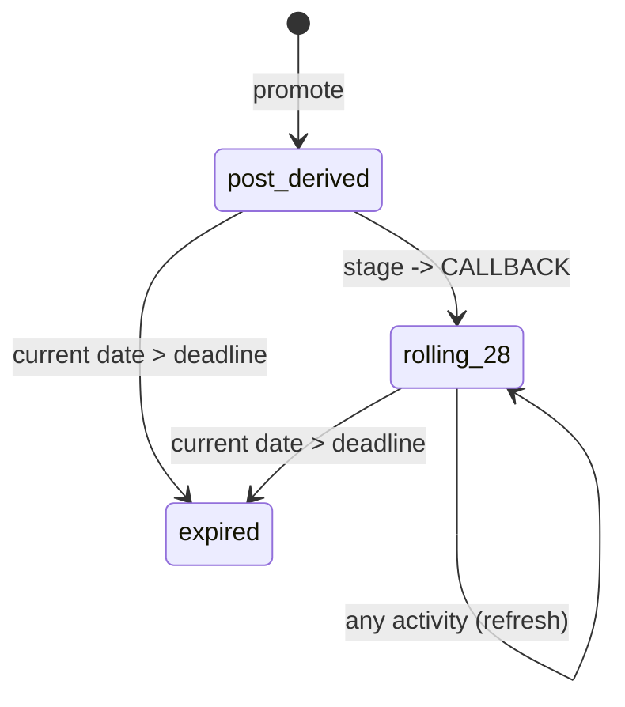
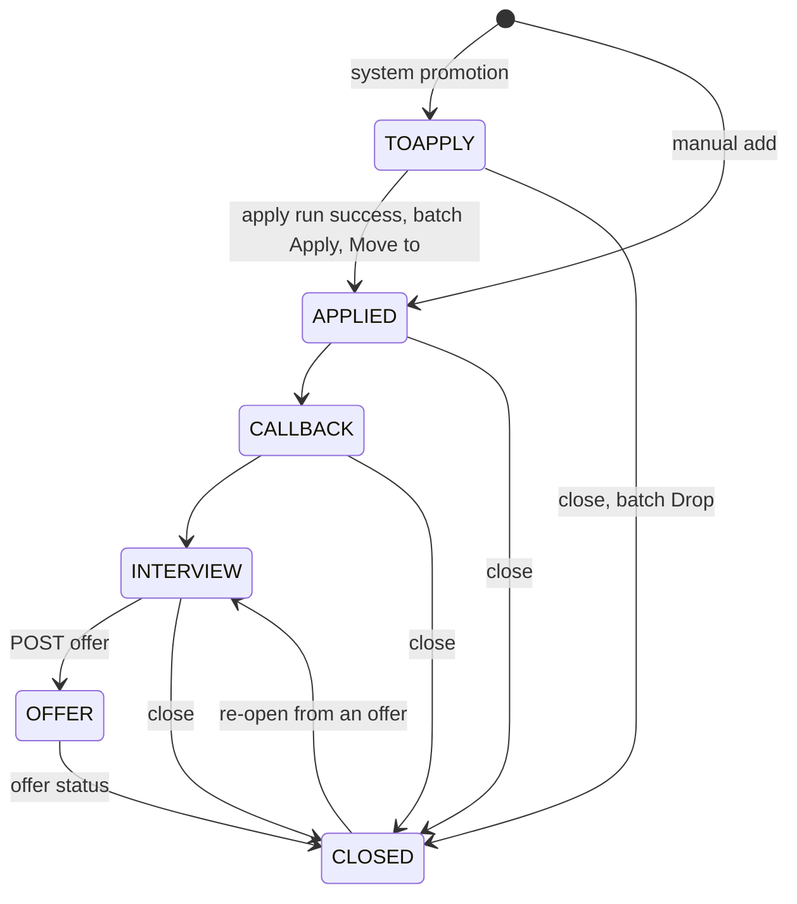
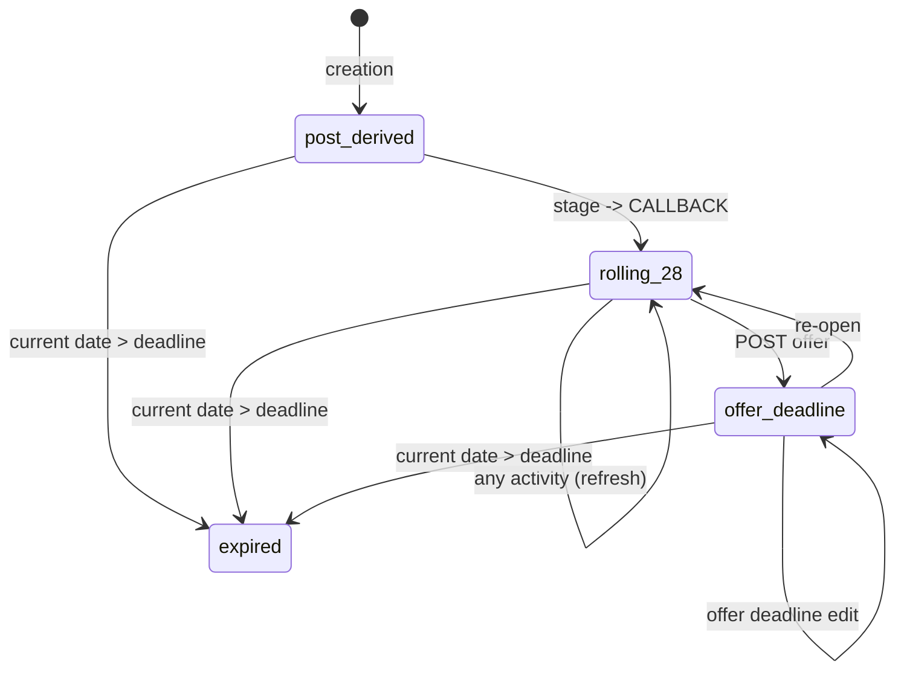

# Job Leads Tracking - Feature tracker
>Review the guidelines before performing any actions including edits on the document

## 010.09 (closed) job leads tracking

Implements the **requirements** doc's Job leads tracking section (REQ-CRM-01..08) and the CRM-facing half of REQ-FE-01/02: promoting a post into a tracked lead, progressing it through its stage lifecycle, closing/archiving it, adding lead notes, and giving the user the pipeline board/list views and per-lead activity history to run the whole lead workflow inside the app. Builds on the existing schema and seed data for `lead`/`lead_note`/`lead_event`.

## Contents

- [Status](#status)
- [Tasks](#tasks)
- [Scope](#scope)
- [References](#references)
- [Design](#design)
- [Test cases](#test-cases)
- [Edit locations](#edit-locations)
- [Implement](#implement)
- [Validate](#validate)
- [Tasks Details](#tasks-details)
- [Guideline](#guideline)

## Status

**current status: OPEN**

Task 09.11 (lead event stage) is implemented and validated by `09.TC.28` to `09.TC.33`. `lead_event.stage_from` and `lead_event.stage_to` are live at schema version 5, every write path fills them, the seed carries 51 connected events, and the Lead Detail activity list shows the stage labels. The closing command reports 126 passed on a version 5 database. Five issues surfaced (`09.IS.33` to `09.IS.37`) and all are closed, the last one a list that stayed stale after a stage move. The app runs at `http://127.0.0.1:5000` on `data/browse-09.db` for the human pass (`09.TC.34`).

Task 09.13 (job leads enhancements) has its scope, closure criteria, test strategy, test cases, design, updates to the other design docs and feature trackers, and edit locations written (subtasks `09.13.10` to `09.13.14`, see Tasks Details). The edit locations were rehearsed in a scratch copy of the repository: the full suite passed there (188 tests), and both `api_tester.py` case files and the `ui_tester.py` checks passed. Task 09.13.15 changed the schema, the seed generator, the seed, the stage constants and `promote()` in `services/leads.py`, the first Leads tab, and the seed-dependent tests.

**next**

Tasks `09.13.01` to `09.13.07`, `09.13.15`, and `09.13.17` are implemented and validated (see Implement steps 23 to 34): the full suite reports 216 passed on a version 7 scratch database, both `api_tester.py` case files and the `ui_tester.py` checks pass, and a live direct inspection matches the design. Seven issues surfaced and closed (`09.IS.52` to `09.IS.57`, with `09.IS.47` to `09.IS.50` found earlier in rehearsal). The app runs at `http://127.0.0.1:5000` on `data/browse-09.db` (version 7). The manual pass (`09.13.16`, test cases `09.13.TC.32` to `.35` and `.43`) is next.

## Tasks

| id    | seq | status  | task                        |
| ----- | --- | ------- | --------------------------- |
| 09.01 | 01  | closed  | scope                       |
| 09.02 | 02  | closed  | design                      |
| 09.03 | 03  | closed  | test strategy               |
| 09.04 | 04  | closed  | test cases                  |
| 09.05 | 05  | closed  | edit locations              |
| 09.06 | 06  | closed  | data model seed data        |
| 09.07 | 07  | closed  | implement backend api       |
| 09.09 | 08  | closed  | manual validation be api    |
| 09.08 | 09  | closed  | implement frontend          |
| 09.10 | 10  | closed  | manual validation fe        |
| 09.11 | 11  | closed  | lead event show stage       |
| 09.12 | 12  | closed  | landing page to leads       |
| 09.13 | 13  | closed  | lead pipeline and offer enh |
| 09.IS | 14  | closed  | validate                    |

## Scope

> Task 09.13 (see Tasks Details) supersedes the stage set (`PROSPECT` is gone and `TOAPPLY` is the entry stage), the promotion rule, the close reasons, the transition table, and the apply queue described in the sections from Scope through Validate. Those sections remain the record of tasks 09.01 to 09.12 as built.

Build the job-leads-tracking / CRM feature end to end on top of the existing schema and seed data: the backend read/write behavior for `lead`, `lead_note`, and `lead_event` per `010-api.md`'s hook design, and the AngularJS screens (**user interface** pages 5 and 6) that let a user drive the full lead lifecycle — promote, progress through stages, add notes, log contact, close/archive — and see it, per REQ-CRM-07.

**Scope**

- **backend — lead create (promote)**: `POST /api/v1/lead` (generic-shaped, hook-validated, REQ-CRM-01). Requires `post_id` + `track_id`, rejects a post already promoted for the same `user_id` with `409` (one lead per post-user_id combination), defaults `status=OPEN`/`stage=PROSPECT`, and writes the first `lead_event`.
- **backend — lead update**: `PUT /api/v1/lead/{id}` (REQ-CRM-02..04, REQ-CRM-06). Enforces legal stage transitions, allows `close_reason` only when transitioning to `CLOSED`, allows title/company override independent of the source post, and appends one `lead_event` per accepted write with `event_type` inferred from what changed (`stage_change`, `deadline_changed`, `contact_logged`), refreshing `updated_at` from that event.
- **backend — lead_note create**: `POST /api/v1/lead_note` (REQ-CRM-03). Appends its own `lead_event(event_type='note_edited')` against the owning lead as a side effect.
- **backend — lead_event read**: `GET /api/v1/lead_event/search` (REQ-CRM-08). Read-only. Every row is written internally as a side effect of a `lead`/`lead_note` write.
- **data model — lead event stage context** (REQ-CRM-08): `lead_event` gains `stage_from` and `stage_to`, each checked against the seven stage values, with a table constraint that a `stage_change` event changes the stage and every other event holds it. `meta.schema_version` moves to 5.
- **backend — stage context on every event**: `POST /api/v1/lead`, `PUT /api/v1/lead/{id}`, `POST /api/v1/lead_note`, and the auto-expiry pass write the lead's stage before and after each update into `stage_from` and `stage_to`. The promotion runs from no stage to `PROSPECT`, a transition or close from the old stage to the new one, an auto-expiry close from the stage at expiry to `CLOSED`, and every other event holds the current stage in both. `GET /api/v1/lead_event/search` returns both fields and accepts them as filters.
- **backend — auto-expiry (REQ-CRM-05)**: a write-on-read side effect of `lead` `GET`/`search`. The current date, via the injectable clock `ARCH-STO-05`, is compared against `deadline` on every read. `deadline` itself is system-maintained per the auto-expiry mechanism below: derived from the post at promotion, rolling from `CALLBACK` onward.
- **frontend — Leads page** (**user interface** page 5): the six stage-filtered tabs (Pipeline board for `PROSPECT`/`TOAPPLY`, focused lists for `APPLIED`/`CALLBACK`/`INTERVIEW`/`OFFER`, and `CLOSED`) as one `lead` list filtered by current stage, plus the days-since-last-activity/expiry-warning indicator on every tab. The page contents should show only for tracks scoped to the logged in user, and should be filterable by track.
- **frontend — Lead Detail panel** (**user interface** page 6): the full REQ-CRM-03 field set, title/company override, add-note, log-contact, stage-change/close-with-reason controls, and the reverse-chronological activity history interleaving `lead_event` rows with `application` attempts. Each activity entry shows its stage context: `TOAPPLY → APPLIED` for a stage change, `new → PROSPECT` for the promotion, and `at <stage>` for every other event.
- **frontend — landing page**: the app opens on the Leads page. `/` and any unmatched path redirect to `/leads`, and the milestone 07 `env-status` placeholder screen, its controller, its script tag, and its two smoke tests are removed.
- **backend — track management**: `POST`/`PUT /api/v1/track` (generic, REQ-SRCH-01/10) — plain CRUD plus the existing archive-via-`PUT {is_active: false}` pattern (`010-api.md`'s `track` CAT-01 classification). Promoting a lead requires an owning track (REQ-CRM-01).
- **backend — generic CRUD layer and injectable clock**: the `/api/v1` blueprint serving the seven generic shapes for each registered resource (REQ-PLAT-01), the `clock.py::now()` indirection (`ARCH-STO-05`), and read resources for `role`, `cv`, `search_profile`, and `application` that the Tracks page and Lead Detail read.
- **frontend — Tracks page** (**user interface** page 1): create/edit a track (role, seniority), default-CV picker, and archive/unarchive, per REQ-SRCH-10. The track's search-profile fields live on the separate Search Profiles page (1b), reached via a "Configure search" row action from this page.
- **run-status/error surfacing** (REQ-FE-02): a failed or rejected lead/lead_note write surfaces in the UI, via whatever cross-cutting error-surfacing pattern the **user interface** design's UX section fixes.

**Auto-expiry mechanism (REQ-CRM-05)** `lead.deadline` is a system-maintained field. 
    - if the post `closing_date` is non-null and > promotion date -> Set from the post's `closing_date` at promotion
    - if the post `closing_date` is null -> defaulted to 28 days from `posted_date`
    - if the post `closing_date` is non-null and <= promotion date -> set closing date to promotion date + 1 week.
    - thereafter, refresh to 28 days from the most recent logged activity on every update from `CALLBACK` onward
    - At any point, a lead with `status='OPEN'` auto-closes (`status`/`stage` → `CLOSED`, `close_reason='expired'`) once the current date passes `deadline`. 
    - Every open stage is an expiry candidate. 
    - Leads with `status='CLOSED'` are skipped by the expiry pass and keep their recorded close reason. 

**seed data generator update**: update the seed data generator to reproduce the current seed data state
    - add roles, tracks, search profiles for Data Engineer, Data Scientist, Software Developer and Gen AI Developer
    - update user to Demo User demo.user@example.test
    - give every seeded lead a coherent event history: a promotion event, then one `stage_change` event per stage step up to its current stage or, for a closed lead, up to its closing stage and the close, so each lead's events form a connected stage chain

Out of scope:

- the Search Profiles page (**user interface** page 1b) — search-execution criteria (keywords, salary, age, schedule) is milestone 10's, search by keywords. This milestone owns Tracks (page 1) itself: track identity and lifecycle only, since promoting a lead requires an owning track (REQ-CRM-01).
- the Posts/results-browsing screen with its per-row "Promote to lead" trigger control (page 3) — milestone 10, search by keywords. This milestone owns the `lead` creation endpoint and every screen once a lead exists. Milestone 10 owns the screen the promote action is triggered from.
- the apply-queue/results screens (page 7), the apply state machine, and CV assignment — milestone 11, apply automation. This milestone owns only what happens to a lead when an apply outcome is recorded against it, REQ-APPLY-09/10/11's transition/close effects. Milestone 11 owns the apply run itself.
- the Automation/session-status screen (page 8) — milestone 11.
- `lead`/`lead_note`/`lead_event` schema and seed-data generation — already in place (`easymcf/db/schema.sql`, `seed/*.sql`). The existing seed set is reused and extended where a scenario needs it, for example a lead sitting exactly on its `deadline` boundary, needed to exercise the UI warning indicator and the auto-expiry read path.
- any analytics/BI/reporting pipeline — ETL, warehouse, cross-run dashboards — explicitly out of scope release-wide (**requirements** doc, Out of scope section). "Pipeline performance reporting" for this milestone means the Leads page's own stage-grouped views and counts (page 5) and the per-lead activity history (page 6) already specified above.
- accounts, sign-in, and per-user data scoping, which feature 13 delivers on top of this milestone's schema and screens. This milestone builds against the single seeded user.

**closure**

- **09.CK.01** every one of REQ-CRM-01..08 is implemented and independently verified by the Test cases section.
- **09.CK.02** promoting a post creates a lead at `status=OPEN`/`stage=PROSPECT` with its first `lead_event`; promoting the same post a second time is rejected with `409` naming the existing lead.
- **09.CK.03** every stage transition and close action exposed in the UI succeeds server-side and appends the correct `lead_event`; an illegal transition is rejected by the backend itself.
- **09.CK.04** a lead is auto-closed (`close_reason='expired'`) on its next read once the current date passes its system-maintained `deadline` (REQ-CRM-05), and leads with `status='CLOSED'` are skipped, keeping their recorded close reason (`easymcf-crm` skill).
- **09.CK.05** creating a `lead_note` appends its own `lead_event` and is visible in the lead's activity history.
- **09.CK.06** the Leads page's six tabs and the Lead Detail panel are reachable, populated from seed/fixture data, and every action (stage change, close, note, contact log) round-trips through the real backend API.
- **09.CK.07** a rejected or failed lead write surfaces its error in the UI (REQ-FE-02).
- **09.CK.08** milestone 07's and milestone 08's own closing commands still pass unmodified against this milestone's changes.
- **09.CK.09** the Tracks page (page 1) supports create/edit/archive of a track independent of its search-profile configuration, which lives on the separate Search Profiles page (1b).
- **09.CK.10** every `lead_event` row states the stage before and after its update, each lead's events form a connected chain from `NULL → PROSPECT` to the lead's current stage, and Lead Detail shows the stage context of each event.

## References

- **requirements** [010-01-requirements.md](../design/010-01-requirements.md): REQ-CRM-01..08 (this milestone's core scope), REQ-FE-01/02 (UI and run-status surfacing), REQ-APPLY-09/10/11 (apply-outcome → lead propagation, scoped here to this milestone's write path; the apply run itself is milestone 11's), Out of scope section (analytics/BI/reporting exclusion)
- **api design** [010-api.md](../design/010-api.md): `lead`/`lead_note`/`lead_event` sections — the CAT-02 hook classification, request/response shapes, and the write-on-read auto-expiry rule this milestone implements verbatim
- **data model** [010-data-model.md](../design/010-data-model.md): `lead`/`lead_note`/`lead_event` table shape, already realized in schema by milestone 08
- **architecture** [010-architecture.md](../design/010-architecture.md) `ARCH-STO-05`: the injectable clock (`clock.py::now()`) the auto-expiry read-path evaluates against, so fixture-mode tests can control "now" deterministically
- **workflows** [010-workflows.md](../design/010-workflows.md): Workflow 4 (promote), Workflow 5 (lead lifecycle / state diagram), Workflow 7 (apply-outcome → lead propagation table)
- **test strategy** [010-test-strategy.md](../design/010-test-strategy.md): `STRAT-SILO`/`CASE`/`LOOP`, the general independent-layer philosophy, plus `STRAT-TOOL-01..04`/`STRAT-HUMAN-01/02`, the standalone-utility and secondary human-validation protocols this milestone's Test cases section implements against and only references
- **user interface** [010-user-interface.md](../design/010-user-interface.md): page 1 (Tracks), page 5 (Leads), and page 6 (Lead Detail) — the screens this milestone builds; pages 1b/3/7/8 for the cross-milestone boundaries noted in Scope
- **frontend app design** [010-frontend-app.md](../design/010-frontend-app.md): `TracksCtrl`/`LeadsCtrl`/`LeadDetailCtrl` controller/service wiring and the `SearchProfilesCtrl` boundary that marks milestone 10's ownership
- **prior milestone** [010.08-db-schema-seed-data.md](010.08-db-schema-seed-data.md): owns the schema and seed data this milestone builds on
- **easymcf-crm skill** [easymcf-crm](../../../../.claude/skills/easymcf-crm/SKILL.md): the pipeline-status vs. apply-status distinction, the stage state machine, and the expiry guard
- **easymcf-backend-api skill** [easymcf-backend-api](../../../../.claude/skills/easymcf-backend-api/SKILL.md): the generic-CRUD/hook/named-endpoint classification this milestone's `lead` routes follow
- **easymcf-frontend skill** [easymcf-frontend](../../../../.claude/skills/easymcf-frontend/SKILL.md): AngularJS structure conventions and the run-status-surfacing requirement
- **project boundaries** [CLAUDE.md](../../../../CLAUDE.md): dev/test against seed data, local venv rules, live-site access only when the user explicitly requests it

## Design

### Workflow

**Promote-to-lead** (Workflow 4, REQ-CRM-01): triggered from Posts (page 3) via `POST /api/v1/lead {post_id, track_id}`. Validates both fields present, rejects an already-promoted post with `409`, and on success sets `status=OPEN`/`stage=PROSPECT`, computes the initial `deadline` (see Data model below), and writes one `lead_event(event_type='stage_change', detail='promoted to PROSPECT')`, matching `010-api.md`'s existing example verbatim. The event carries `stage_from=NULL` and `stage_to='PROSPECT'`.

**Lead lifecycle / stage transitions** (Workflow 5, REQ-CRM-02/06): the table below is the enforcement-ready translation of `010-workflows.md`'s mermaid diagram, which now states explicitly that it is the complete legal set: each stage advances one adjacent step forward, or closes. `PUT /api/v1/lead/{id}` accepts exactly the transitions in this table and answers `409` to any other. A `stage` equal to the current stage leaves the lead as it is.

| id | from stage | legal to stage(s) |
| -- | ---------- | ------------------ |
| 01 | PROSPECT   | TOAPPLY, CLOSED   |
| 02 | TOAPPLY    | APPLIED, CLOSED   |
| 03 | APPLIED    | CALLBACK, CLOSED  |
| 04 | CALLBACK   | INTERVIEW, CLOSED |
| 05 | INTERVIEW  | OFFER, CLOSED     |
| 06 | OFFER      | CLOSED            |
| 07 | CLOSED     |                   |

`close_reason` is required, and validated against the seven-value enum, on any transition to `CLOSED`; omitting it is `400`.

**Track lifecycle** (Workflow 1, track-identity half only): create/edit (role, seniority) and archive/unarchive (`PUT {is_active: false}`), per REQ-SRCH-10. The `track` write path covers track fields. `track` and `search_profile` are separate tables per the data model, and the Tracks page reads and writes `track` alone.

**Activity logging as a side effect** (REQ-CRM-08): every accepted `lead`/`lead_note` write appends one `lead_event` row, inferred per the Data model mapping below, plus one `deadline_changed` row when the system moves `deadline`. This single code path is the only way a `lead` changes, as REQ-CRM-08 requires. Each event also records the stage the lead held before and after the write (`stage_from`, `stage_to`), taken from the same lead row the write reads, so the pair always matches the transition the write performs.

**Auto-expiry deadline state machine** (REQ-CRM-05):



`deadline` passes through two states: `post_derived` (the post's `closing_date` when that date is after the promotion date, `posted_date` plus 28 days when the post has no `closing_date`, and the promotion date plus 1 week when `closing_date` is on or before the promotion date) and `rolling_28` (refreshed to 28 days after the most recent logged activity on every update from `CALLBACK` onward). The "current date > deadline" check runs only against a lead still `status='OPEN'`, as a write-on-read pre-pass on `GET`/`search` (API endpoints below), reusing the same internal write path as every other close. The closing event runs from the stage at expiry to `CLOSED`.

**Apply-outcome → lead propagation** (Workflow 7, inbound only): the apply-run service calls into this same `lead` write path for `applied`→`APPLIED` and `post_closed`/`post_unavailable`→`CLOSED`(`apply_failed`), so the resulting `lead_event` is written through the identical code path as every other transition above. One lead-mutation route serves every caller.

### Data model

This section uses the existing `lead`, `lead_note`, `lead_event`, and `track` columns, plus the `field_edited` enum value defined below and the `search_schedule` table that the Seed data section fills. The `stage_from` and `stage_to` columns on `lead_event` are defined below.

**`lead`**: `status`/`stage`/`close_reason` mutated only through the transition table above; `deadline` mutated only at the two points in the Auto-expiry state machine above; `title_override`/`company_override` unrestricted (REQ-CRM-04); `applied_date`/`first_attempt_date`/`last_contact_date` unrestricted, each still producing a `lead_event` per the mapping below.

**`lead_event.event_type` mapping** — assigns an event type to each writable `lead` field:

| id | changed field(s)                   | event_type         |
| -- | ---------------------------------- | ------------------ |
| 01 | `stage` or `close_reason`          | `stage_change`     |
| 02 | `deadline`                         | `deadline_changed` |
| 03 | `last_contact_date`                | `contact_logged`   |
| 04 | override/date fields — see note 04 | `field_edited`     |
| 05 | a `lead_note` created              | `note_edited`      |

04. `title_override`, `company_override`, `applied_date`, or `first_attempt_date` changed in a request that carries only these fields.

**`event_type` values** — `event_type` has five enum values: `stage_change`, `contact_logged`, `note_edited`, `deadline_changed`, and `field_edited`. `field_edited` covers `title_override`, `company_override`, `applied_date`, and `first_attempt_date` edits, so Lead Detail's activity-history view (page 6) shows a title-override edit as a field edit and a stage transition as a stage change. Its `detail` field names the specific field and value, matching every other event type's convention. The `event_type` `CHECK` constraint in `easymcf/db/schema.sql`, `SCHEMA_VERSION` in `easymcf/__init__.py` (3→4), and the seed data carry the fifth value, with at least one `field_edited` fixture row.

**`lead_event` stage context** — every event states the stage the lead held before the update in `stage_from` and after it in `stage_to`, so a lead's history reads as a chain and shows the stage at which each update happened. The values follow the event's source:

| id | event source                             | stage_from        | stage_to          |
| -- | ---------------------------------------- | ----------------- | ----------------- |
| 01 | promotion                                | `NULL`            | `PROSPECT`        |
| 02 | stage transition or close (user, apply)  | stage before      | stage after       |
| 03 | auto-expiry close                        | stage at expiry   | `CLOSED`          |
| 04 | contact, field edit, deadline edit, note | current stage     | current stage     |
| 05 | automatic deadline refresh               | stage after write | stage after write |

Two constraints in `schema.sql` enforce the shape. Both columns hold only the seven stage values (`stage_from` also allows `NULL`), and a `stage_change` event always changes the stage while every other event type holds it. Across a lead's events ordered by `id`, each `stage_from` equals the previous `stage_to`, the first `stage_from` is `NULL`, and the last `stage_to` equals `lead.stage`.

**implementation decision** — `detail` lists the changed fields other than `stage`, because the stage pair lives in its own columns. A plain transition writes no `detail`, a close writes `close_reason: None -> <reason>`, and the promotion and auto-expiry events keep their fixed text. A write that changes the stage and other fields in one request writes one primary event with the stage pair, and the automatic deadline refresh from `CALLBACK` onward writes its own `deadline_changed` event that holds the new stage. The schema change moves `meta.schema_version` from 4 to 5 and `SCHEMA_VERSION` in `easymcf/__init__.py` follows. Milestone 10's `run_log.trigger_source` change becomes version 6, recorded in the **data model**'s Schema versions table.

**`lead_note`**: append-only; each create pairs with a `lead_event(note_edited)` per `010-api.md`.

**`track`**: plain CRUD against the existing columns (`user_id`, `role_id`, `seniority`, `default_cv_id`, `is_active`).

### Seed data

**Seed data generator update**: `scripts/gen_test_data.py` reproduces the current seed state on every regeneration, so the roles, tracks, search profiles, schedules, and user below survive each `resetdb.py --seed` run.

- **`user`**: the fabricated singleton (`seed/02_user.sql`) is `'Demo User', 'demo.user@example.test'`, replacing the placeholder `'Alex Tan', 'alex.tan@example.com'`. It remains a fabricated row, since `user` originates outside `test-data/*.csv`.
- **`role`**: four fabricated rows added to the existing two (`Data Analyst`, `Sustainability Consultant`): `Data Engineer`, `Data Scientist`, `Software Developer`, `Gen AI Developer`.
- **`track`**: one fabricated row per new role, owned by the single seeded `user`, `is_active=1`. Every seeded track, new and existing, carries `default_cv_id=1`.
- **`search_profile`**: one fabricated row per new track, matching the existing two rows' convention (`seed/05_search_profile.sql`): `keywords` set to the role name, `min_salary=10000`, `max_age_weeks=4`, `min_match_score=0.3`, `employment_type='Full Time'`.
- **`search_schedule`**: one fabricated row per track, all six of them, in a new `search_schedule` seed file. Every row follows `010-data-model.md`'s convention: `schedule_enabled=false`, `schedule_interval_hours=24`, `next_run_at=NULL`. Scheduling is opt-in, so a freshly reset database waits for the user to switch a schedule on.

**Seed generator changes** — `scripts/gen_test_data.py` fabricates the `_map_user`, `_map_role`, `_map_track`, and `_map_search_profile` rows and adds a `_map_search_schedule` function. Output covers `seed/01_role.sql`, `seed/02_user.sql`, `seed/04_track.sql`, `seed/05_search_profile.sql`, and a `search_schedule` seed file whose numbering follows `_TABLE_ORDER` against `010-data-model.md`'s current entity list. Regeneration runs `env/bin/python scripts/gen_test_data.py --mode seed --out seed/ --rand-seed 42`.

**Lead event history** — the generator writes a connected event history for every lead. A lead passes through the stages from `PROSPECT` up to its current stage. A closed lead passes through the stages up to the stage it closed from and then `CLOSED`, where the closing stage follows the close reason:

| id | close reason   | closes from |
| -- | -------------- | ----------- |
| 01 | offer_accepted | `OFFER`     |
| 02 | rejected       | `APPLIED`   |
| 03 | withdrawn      | `APPLIED`   |
| 04 | expired        | `APPLIED`   |
| 05 | cancelled      | `PROSPECT`  |
| 06 | duplicate      | `PROSPECT`  |
| 07 | apply_failed   | `TOAPPLY`   |

Each lead's first event is the promotion (`NULL → PROSPECT`, detail `promoted to PROSPECT`), each later event is one `stage_change` with the previous stage as `stage_from`, and the closing event carries `close_reason: None -> <reason>`. The four fixture events (`note_edited` on the `INTERVIEW` lead, `field_edited` on lead 2, `contact_logged` and `deadline_changed` on the `CALLBACK` lead) follow their lead's chain and hold its current stage in both columns. The `INTERVIEW` lead's note carries the `07:30:00` timestamp of its `note_edited` event. The regenerated seed holds 51 events: 47 stage changes and the four fixtures.

### API endpoints

| id | endpoint                        | classification         | responsibility              |
| -- | -------------------------------- | ----------------------- | ---------------------------- |
| 01 | `POST /api/v1/lead`             | CAT-02 hook            | promote — see Workflow      |
| 02 | `PUT /api/v1/lead/{id}`         | CAT-02 hook            | transitions — see Workflow  |
| 03 | `GET`/`search /api/v1/lead`     | CAT-02 hook, read-time | auto-expiry pre-pass, below |
| 04 | `POST /api/v1/lead_note`        | CAT-02 hook            | create + paired event       |
| 05 | `GET /api/v1/lead_event/search` | CAT-02 hook, read-only | activity history, page 6    |
| 06 | `POST`/`PUT /api/v1/track`      | CAT-01 generic         | plain CRUD + archive toggle |

**Auto-expiry pre-pass** (endpoint 03): before running the requested `search`, select every `id` where `status='OPEN' AND deadline < :today`, then close each through the same internal write function endpoint 02 uses, so the `lead_event` side effect always fires. This extends the single lead-mutation code path `010-api.md` already states for apply-outcome propagation to auto-expiry as well.

**Stage context** (endpoints 01 to 05): `POST /api/v1/lead` writes the promotion event as `NULL → PROSPECT`. `PUT /api/v1/lead/{id}` writes the stage before and after the write, equal for a write that leaves the stage alone. `POST /api/v1/lead_note` and the automatic deadline refresh hold the lead's current stage in both columns. The auto-expiry pass writes the stage at expiry and `CLOSED`. `GET /api/v1/lead_event/search` returns `stage_from` and `stage_to` on every row and accepts both as filters through the generic column check. No request or response shape of `lead`, `lead_note`, or `track` changes, so the API layer needs no new route and its `lead_event` resource carries the fields through `SELECT lead_event.*`.

### Frontend page UI

**Tracks (page 1)**: create/edit form (role, seniority), default-CV picker, archive toggle, and a read-only search-profile summary per row with a "Configure search" link to page 1b (Search Profiles).

**Leads (page 5)**: `LeadsCtrl` issues one `list('lead')` fetch; the six tabs are a client-side filter over that one response. The expiry-warning indicator is computed client-side from the fetched `deadline` (days-until, thresholded).

**Lead Detail (page 6)**: `LeadDetailCtrl` binds the full REQ-CRM-03 field set, the note/contact/stage-change/close controls (each a generic `PUT`/`POST`, per `FE-SVC-02`), and merges read-only `lead_event` (`FE-SVC-03a`) with the lead's `application` rows into one reverse-chronological activity view. `LeadDetailCtrl` maps `stage_from` and `stage_to` from each `lead_event` row into the activity entry, and the template shows a stage label per event: `new → PROSPECT` for the promotion, `TOAPPLY → APPLIED` for a transition, and `at CALLBACK` for an event that holds the stage. Application attempts carry no stage fields and show no label. After every saved change `LeadDetailCtrl` re-reads the lead, its notes, and its activity, and asks `LeadsCtrl` to reload `vm.leads`, so the board shows the lead under its new stage while the panel shows the new stage and the next stage button. The Leads page, the Tracks page, and `ApiClient` keep their current code, because `list('lead_event', ...)` already returns the new fields.

**Landing page**: `app.routes.js` maps `/` to a redirect to `/leads`, and the `otherwise` route redirects to `/leads` too, so the browser lands on the Leads page (Pipeline tab) for the root path and for any unknown path. The `env-status` screen no longer exists.

**Error/run-status surfacing**: lead/lead_note write failures route through the existing single `ErrorService` (`FE-ERR-01`) — a `409` (double-promote, illegal transition) and a `400` (missing `close_reason`) both need a human-readable message mapping there.

## Test strategy

the concrete protocols and tooling are defined once in the **test strategy** doc (`STRAT-TOOL-01..04`, `STRAT-HUMAN-01/02`) and only referenced here. Four independent layers, grouped into their own table below, since each layer checks independently of the layers before it:

1. **self-report** — `scripts/api_tester.py`/`scripts/ui_tester.py` replaying this milestone's own case-config files (`STRAT-TOOL-01/02`) against a real running instance: request/response shape or DOM-assertion checks only. Proves only that the endpoint/screen responds as expected.
2. **direct inspection** — `scripts/db_util.py` queried against the same SQLite file the request just wrote to (`STRAT-TOOL-03`), bypassing both the API response and the case-config tool's own verdict entirely.
3. **oracle** — hard-coded-expectation pytest modules, extending `tests/backend/test_seed_data.py`'s existing pattern, for behavior that spans many requests or rows: a full transition matrix, a boundary pair, an enumeration.
4. **human validation (secondary, post-automation)** — `STRAT-HUMAN-01/02`: performed only after every layer above passes, a real-browser pass through the real app, checking layout, wording, and usability judgment.

Every case below is read-only or scoped to a freshly reset temp database, so re-running the full set twice in a row is safe and idempotent. The exception is where a case's own point is to compare state before and after one write (09.TC.11-18): each of these resets the fixture it depends on and runs independently of any prior case's side effect.


## Test cases

### Self-report — `api_tester.py` / `ui_tester.py`

| id       | scope-item | check                                                                    |
| -------- | ---------- | ------------------------------------------------------------------------ |
| 09.TC.01 | 09.CK.02   | promote happy path: POST /api/v1/lead -> 201, status=OPEN/stage=PROSPECT |
| 09.TC.02 | 09.CK.02   | promote the same post a second time -> 409                               |
| 09.TC.03 | 09.CK.03   | every legal transition in the Design table -> 200                        |
| 09.TC.04 | 09.CK.03   | a representative illegal transition (skip-ahead, backward) -> 409        |
| 09.TC.05 | 09.CK.03   | close to CLOSED, close_reason omitted -> 400                             |
| 09.TC.06 | 09.CK.05   | POST /api/v1/lead_note -> 201                                            |
| 09.TC.07 | 09.CK.09   | track create/edit/archive -> 200/201                                     |
| 09.TC.08 | 09.CK.06   | Leads page: all six tab elements render (ui_tester)                      |
| 09.TC.09 | 09.CK.06   | Lead Detail panel opens, REQ-CRM-03 fields render (ui_tester)            |
| 09.TC.10 | 09.CK.09   | Tracks page create form shows track fields only (ui_tester)              |
| 09.TC.28 | 09.CK.10   | Lead Detail activity entries show their stage context (ui_tester)        |
| 09.TC.35 | 09.CK.06   | a saved stage move refreshes the board and the Lead Detail panel         |
| 09.TC.36 | 09.CK.06   | `/` and an unknown path both land on the Leads page                      |

- **09.TC.01/.02** — `tests/backend/cases/lead.json`, replayed via `api_tester.py --case tests/backend/cases/lead.json`. Two entries: a fresh `post_id`/`track_id` pair expecting `201`, then the same pair replayed expecting `409`.
- **09.TC.03/.04** — same file, one entry per row of the Design section's transition table (six legal, plus a `CLOSED` case from each stage) and at least one skip-ahead (`PROSPECT`→`INTERVIEW`) and one backward (`INTERVIEW`→`APPLIED`) illegal case.
- **09.TC.05** — a `PUT` entry with `stage: "CLOSED"` and `close_reason` omitted, expecting `400`.
- **09.TC.06** — `tests/backend/cases/lead_note.json`, a single `POST` entry against a seeded lead id.
- **09.TC.07** — `tests/backend/cases/track.json`, extending the existing generic-CRUD case template `STRAT-SILO-04` already defines, instantiated for `track`.
- **09.TC.08/.09** — `tests/frontend/checks/leads.json`, replayed via `ui_tester.py --case tests/frontend/checks/leads.json`: a `wait_for`/`visible` check per tab's `data-testid`, and a check that clicking a seeded row's detail control renders the Lead Detail panel's field labels.
- **09.TC.10** — `tests/frontend/checks/tracks.json`: a `count_equals` assertion of `0` against a search-profile-field selector on the Tracks create form, confirming the page 1/1b split.
- **09.TC.28** — a third check in `tests/frontend/checks/leads.json` (`ui_tester.py`) and `test_activity_history_shows_stage_context` in `tests/frontend/test_leads_ui.py`: the Lead Detail activity list of seeded lead 1 shows `new → PROSPECT`, and lead 4's list shows each stage step (`PROSPECT → TOAPPLY`, `TOAPPLY → APPLIED`, `APPLIED → CALLBACK`) and `at CALLBACK` for the events that hold the stage.
- **09.TC.35** — `test_saved_change_refreshes_the_list_and_the_detail` in `tests/frontend/test_leads_ui.py`: seeded lead 1 sits in the `PROSPECT` column, `Move to TOAPPLY` is clicked, and the lead row appears in the `TOAPPLY` column and leaves `PROSPECT`, the panel header reads `TOAPPLY / OPEN`, and the button reads `Move to APPLIED`.
- **09.TC.36** — `test_root_and_unknown_paths_land_on_leads` in `tests/frontend/test_root_redirect.py` and `tests/e2e/test_root_redirect.py`: `goto('/')` and `goto('/no-such-page')` each end at `<base>/leads` with the Pipeline tab visible.

### Direct inspection — `db_util.py`

| id       | scope-item | check                                                                   |
| -------- | ---------- | ----------------------------------------------------------------------- |
| 09.TC.11 | 09.CK.02   | promote wrote the lead row plus exactly one stage_change lead_event     |
| 09.TC.12 | 09.CK.03   | event_type matches the Design mapping for the field actually changed    |
| 09.TC.13 | 09.CK.03   | lead.updated_at equals the new lead_event's own timestamp               |
| 09.TC.14 | 09.CK.05   | lead_note create paired with a note_edited lead_event                   |
| 09.TC.15 | 09.CK.04   | deadline 1 day in the future: still OPEN after GET/search               |
| 09.TC.16 | 09.CK.04   | deadline 1 day in the past: CLOSED/expired after the next GET/search    |
| 09.TC.17 | 09.CK.04   | an already-CLOSED lead with a past deadline: row unchanged              |
| 09.TC.18 | 09.CK.09   | a track-only write leaves search_profile/search_schedule rows unchanged |
| 09.TC.29 | 09.CK.10   | each event source writes its stage_from/stage_to pair                   |
| 09.TC.30 | 09.CK.10   | auto-expiry close runs from the stage at expiry to CLOSED               |

- **09.TC.11** — `db_util.py lead_event search '{"lead_id": <id>}'` after 09.TC.01 returns exactly one row, `event_type='stage_change'`, `detail` containing "promoted to PROSPECT", matching `010-api.md`'s stated example verbatim. The `lead.deadline` read alongside it matches the three promotion branches: `closing_date` after the promotion date, `posted_date` plus 28 days for a null `closing_date`, and promotion date plus 1 week for a `closing_date` on or before the promotion date (three sub-cases).
- **09.TC.12** — one sub-case per row of the Data model's `event_type` mapping table: a `deadline` edit alone → `deadline_changed`; `last_contact_date` alone → `contact_logged`; `title_override`/`company_override`/`applied_date`/`first_attempt_date` alone → `field_edited`; a `stage` change → `stage_change`.
- **09.TC.13** — compares `lead.updated_at` against the same-transaction `lead_event.occurred_at` via two `db_util.py get` calls, checking for an exact match.
- **09.TC.14** — `db_util.py lead_event search '{"lead_id": <id>, "event_type": "note_edited"}'` returns a row whose `detail` matches the note's excerpt.
- **09.TC.15/.16** — the injectable clock (`ARCH-STO-05`) is set to a fixed "now" fixture-side; a lead's `deadline` is written one day beyond vs. one day before it, then `GET /api/v1/lead/search` is called once and the row re-read directly.
- **09.TC.17** — a `CLOSED` lead fixture per close reason (seven sub-cases) with `deadline` in the past; row content, including `updated_at` and `close_reason`, is byte-identical before and after a `GET/search` call.
- **09.TC.18** — row counts on `search_profile`/`search_schedule` are read before and after a `track` create/edit/archive sequence and asserted unchanged.
- **09.TC.29** — `tests/backend/test_lead_events_stage.py`: promotion writes `(stage_change, NULL, PROSPECT)`, a transition and a close write the old and new stage, a note, a contact edit, a title edit, and a deadline edit each hold the current stage in both columns, and a `CALLBACK` transition writes the transition event followed by a `deadline_changed` event that holds `CALLBACK`. Each check reads `lead_event` through `sqlite3` after the API call.
- **09.TC.30** — the same file: leads at `TOAPPLY` and `APPLIED` with a past `deadline` close on the next `GET /api/v1/lead/search`, and their closing events read `TOAPPLY → CLOSED` and `APPLIED → CLOSED`. The live equivalent is `db_util.py lead_event search '{"lead_id": <id>}'`.

### Oracle — hard-coded-expectation pytest

| id       | scope-item | check                                                                               |
| -------- | ---------- | ----------------------------------------------------------------------------------- |
| 09.TC.19 | 09.CK.03   | full transition matrix vs. Design's table, hard-coded expectation                   |
| 09.TC.20 | 09.CK.04   | 27-day/29-day rolling-deadline boundary pair (STRAT-CASE-03)                        |
| 09.TC.21 | 09.CK.04   | every open stage past its deadline closes as expired; CLOSED leads stay as recorded |
| 09.TC.22 | 09.CK.02   | event_type five-value enumeration completeness (STRAT-CASE-05)                      |
| 09.TC.27 | 09.CK.04   | automatic deadline refresh from CALLBACK onward and its event                       |
| 09.TC.31 | 09.CK.10   | every seeded lead's events form a connected chain to its stage                      |
| 09.TC.32 | 09.CK.10   | schema rejects inconsistent stage pairs                                             |
| 09.TC.33 | 09.CK.10   | chain stays connected after an API write sequence                                   |

- **09.TC.19** — `tests/backend/test_lead_transitions.py` (new, oracle layer for this milestone, mirroring `010.08`'s and `010.12`'s convention of hard-coding the expectation from Design): every `(from_stage, to_stage)` pair across all seven stages is asserted legal or illegal against a literal transcription of the Design section's table.
- **09.TC.20** — extends `tests/backend/test_seed_data.py`, per `STRAT-TOOL-04`'s reuse-first rule, with a case pinning the clock to a fixed date, asserting a `CALLBACK` lead with its last activity 27 days earlier is still `OPEN` and one with its last activity 29 days earlier is `CLOSED`/`expired`.
- **09.TC.21** — same file: six fixture leads, one per open stage from `PROSPECT` through `OFFER`, with past deadlines each become `CLOSED`/`expired` after a read, and a seventh `CLOSED` lead keeps its recorded state.
- **09.TC.22** — same file, extended once the Seed data section's generator update lands: asserts all five `event_type` values are present at least once in the seeded database, the same `STRAT-CASE-05` pattern `010.08`'s `test_closed_vocabularies_are_complete` already established for other enums.
- **09.TC.27** — extends `tests/backend/test_seed_data.py` with four cases that pin the clock five days after the seed anchor: a `CALLBACK` transition and later activity (a note, a contact edit) move `deadline` to 28 days after the pinned date and append a `deadline_changed` event after the primary event, an edit before `CALLBACK` leaves `deadline` alone, and a `deadline` set in the request takes precedence over the refresh.
- **09.TC.31** — `tests/backend/test_seed_data.py`: for every seeded lead, the first event runs `NULL → PROSPECT`, each `stage_from` equals the previous `stage_to`, and the last `stage_to` equals `lead.stage`. Every seeded stage change follows the transition table transcribed from Design, and every other event holds the stage.
- **09.TC.32** — `test_lead_events_stage.py`: five direct inserts are rejected by the schema: a `stage_change` that keeps the stage, a `note_edited` with a `NULL` `stage_from`, a `note_edited` that changes the stage, an unknown stage value, and a `NULL` `stage_to`.
- **09.TC.33** — `test_lead_events_stage.py`: lead 3 runs `APPLIED → CALLBACK → INTERVIEW → CLOSED` with a note between, the clock pinned after the seed anchor, and its events remain a connected chain that ends at `CLOSED`. A search filtered by `stage_to=CLOSED` returns rows carrying both stage fields.

### Human validation 

secondary, post validation

| id       | scope-item | check                                                                  |
| -------- | ---------- | ---------------------------------------------------------------------- |
| 09.TC.23 | 09.CK.06   | visual pass over the Leads page's six tabs and expiry indicator        |
| 09.TC.24 | 09.CK.06   | promote a real seeded post, walk every stage manually end to end       |
| 09.TC.25 | 09.CK.07   | trigger a 409/400 via the UI, confirm the error message is legible     |
| 09.TC.26 | 09.CK.09   | create/archive a track, confirm it drops from the promote track-picker |
| 09.TC.34 | 09.CK.10   | read a lead's activity list and confirm each stage label               |

- **09.TC.23** — a human opens `/leads` in a real browser against the reseeded database and confirms the six tabs are visually distinct, the board/list layouts read cleanly, and a near-expiry lead's warning indicator reads clearly on screen.
- **09.TC.24** — a human promotes a real seeded post and manually drives it `PROSPECT`→...→`CLOSED`, confirming each control is discoverable and each transition's effect matches expectation.
- **09.TC.25** — a human deliberately double-promotes a post or attempts an illegal transition through the UI, confirming the surfaced message (REQ-FE-02) is understandable on its own.
- **09.TC.26** — a human creates and then archives a track, confirming it disappears from the promote-to-lead track picker on Posts, per REQ-SRCH-10's cross-selector visibility rule.
- **09.TC.34** — a human opens a lead with a long history (lead 6, `OFFER`) and reads its activity list: each entry shows a stage label that matches the stage the lead held at that time, and the labels read top to bottom trace the lead's path.

Performed and recorded only after `09.TC.01..22`, `09.TC.27`, and `09.TC.28..33` all pass, per `STRAT-HUMAN-01`. Results go in this tracker's own Validate section.

**tools**: copy-pasteable, independent of whatever `09.06/.07/.08` automate:

```bash
# self-report — backend, batch replay
env/bin/python scripts/api_tester.py --case tests/backend/cases/lead.json --label 09.TC
env/bin/python scripts/api_tester.py --case tests/backend/cases/lead_note.json --label 09.TC
env/bin/python scripts/api_tester.py --case tests/backend/cases/track.json --label 09.TC
cat .dev/logs/*-09.TC-api_tester.log

# self-report — frontend, batch replay
env/bin/python scripts/ui_tester.py --case tests/frontend/checks/leads.json --label 09.TC
env/bin/python scripts/ui_tester.py --case tests/frontend/checks/tracks.json --label 09.TC
cat .dev/logs/*-09.TC-ui_tester.log

# direct inspection
env/bin/python scripts/db_util.py lead_event search '{"lead_id": 1}'
env/bin/python scripts/db_util.py lead get 1
env/bin/python scripts/db_util.py search_profile search '{}'

# oracle layer
env/bin/python -m pytest -m backend -k "lead_transitions or seed_data" -v

# prior-milestone closing commands
env/bin/python scripts/envcheck.py && env/bin/python -m pytest
env/bin/python scripts/resetdb.py --seed
```

## Edit locations

Tagged new, edit, or generated. Files marked new and edit are hand-authored. `09.EL.13` is generator output. The generic CRUD blueprint (`09.EL.03` to `09.EL.06`) is the first API layer in the app, so this milestone's routes and every later resource share it. Backend files build bottom-up: clock and errors, generic layer, lead services, wiring, schema, seed. Frontend files build in load order: core services, shared components, feature screens, routes. Tests follow the layer each case verifies. Rows `09.EL.31` to `09.EL.41` carry the `lead_event` stage context change (task 09.11). They edit files that earlier rows created, and each subsection shows the change to make.

| id       | path                                                           | change                              |
| -------- | -------------------------------------------------------------- | ----------------------------------- |
| 09.EL.01 | `easymcf/clock.py`                                             | new: `now()` indirection            |
| 09.EL.02 | `easymcf/errors.py`                                            | new: `ApiError` family              |
| 09.EL.03 | `easymcf/api/__init__.py`                                      | new: `init_api()` wiring            |
| 09.EL.04 | `easymcf/api/db.py`                                            | new: per-request connection         |
| 09.EL.05 | `easymcf/api/generic.py`                                       | new: `Resource`, seven shapes       |
| 09.EL.06 | `easymcf/api/resources.py`                                     | new: resource declarations          |
| 09.EL.07 | `easymcf/services/__init__.py`                                 | new: package marker                 |
| 09.EL.08 | `easymcf/services/leads.py`                                    | new: lead business logic            |
| 09.EL.09 | `easymcf/__init__.py`                                          | edit: wire API, schema version      |
| 09.EL.10 | `easymcf/db/schema.sql`                                        | edit: enum value, new table         |
| 09.EL.11 | `.env.example`                                                 | edit: document `FIXED_NOW`          |
| 09.EL.12 | `scripts/gen_test_data.py`                                     | edit: roles, tracks, schedules      |
| 09.EL.13 | `seed/*.sql`                                                   | generated: full seed set            |
| 09.EL.14 | `frontend/index.html`                                          | edit: scripts, nav, modal           |
| 09.EL.15 | `frontend/app/app.routes.js`                                   | edit: `/tracks`, `/leads`           |
| 09.EL.16 | `frontend/app/core/error.service.js`                           | new: `ErrorService`                 |
| 09.EL.17 | `frontend/app/core/api-client.service.js`                      | new: `ApiClient`                    |
| 09.EL.18 | `frontend/app/core/confirm-dialog.service.js`                  | new: `ConfirmDialog`                |
| 09.EL.19 | `frontend/app/shared/confirm-modal/confirm-modal.directive.js` | new: modal markup                   |
| 09.EL.20 | `frontend/app/shared/nav-bar/nav-bar.directive.js`             | new: navigation, toasts             |
| 09.EL.21 | `frontend/app/tracks/tracks.{controller.js,html}`              | new: Tracks page                    |
| 09.EL.22 | `frontend/app/leads/leads.{controller.js,html}`                | new: Leads page                     |
| 09.EL.23 | `frontend/app/leads/lead-detail.{controller.js,html}`          | new: Lead Detail panel              |
| 09.EL.24 | `tests/conftest.py`                                            | edit: clock and db fixtures         |
| 09.EL.25 | `tests/backend/cases/{lead,lead_note,track}.json`              | new: `api_tester.py` cases          |
| 09.EL.26 | `tests/backend/test_lead_transitions.py`                       | new: transition-matrix oracle       |
| 09.EL.27 | `tests/backend/test_seed_data.py`                              | edit: expiry and event oracles      |
| 09.EL.28 | `tests/frontend/checks/{leads,tracks}.json`                    | new: `ui_tester.py` checks          |
| 09.EL.29 | `tests/backend/test_generic_api.py`                            | new: generic shapes tests           |
| 09.EL.30 | `tests/frontend/test_leads_ui.py`                              | new: UI tests, DB inspection        |
| 09.EL.31 | `easymcf/db/schema.sql`                                        | edit: stage columns, constraint, v5 |
| 09.EL.32 | `easymcf/__init__.py`                                          | edit: `SCHEMA_VERSION = 5`          |
| 09.EL.33 | `easymcf/services/leads.py`                                    | edit: stage pair on every event     |
| 09.EL.34 | `scripts/gen_test_data.py`                                     | edit: connected event histories     |
| 09.EL.35 | `seed/13_lead_event.sql`                                       | generated: 51 events                |
| 09.EL.36 | `frontend/app/leads/lead-detail.controller.js`                 | edit: map fields, `stageLabel()`    |
| 09.EL.37 | `frontend/app/leads/lead-detail.html`                          | edit: stage label per event         |
| 09.EL.38 | `tests/backend/test_seed_data.py`                              | edit: seed chain oracles            |
| 09.EL.39 | `tests/backend/test_lead_events_stage.py`                      | new: API stage context tests        |
| 09.EL.40 | `tests/frontend/test_leads_ui.py`                              | edit: activity stage assertions     |
| 09.EL.41 | `tests/frontend/checks/leads.json`                             | edit: promotion stage check         |
| 09.EL.42 | `frontend/app/leads/lead-detail.controller.js`                 | edit: reload the list after a save  |
| 09.EL.43 | `tests/frontend/test_leads_ui.py`                              | edit: refresh after a saved change  |
| 09.EL.44 | `frontend/app/app.routes.js`, `frontend/index.html`            | edit: root redirect, drop script    |
| 09.EL.45 | `frontend/app/env-status/`                                     | delete: placeholder screen          |
| 09.EL.46 | `tests/**` root and selftest files                             | edit: root redirect tests           |

The files below keep their current content, and a need to change one of them is raised where it is owned:

01. `easymcf/db/connection.py` supplies `get_connection()` to `09.EL.04` and the scripts as it stands.
02. `scripts/initdb.py`, `scripts/resetdb.py`, and `scripts/db_util.py` apply the new schema and seed files through their existing globbing and CRUD.
03. `scripts/api_tester.py`, `scripts/ui_tester.py`, `scripts/_val_log.py`, and `tests/_browser_support.py` replay the new case and check files unmodified.
04. `pytest.ini` keeps its markers. The new tests use `backend`, `frontend`, and `e2e`.
05. `frontend/app/env-status/*` and `tests/*/test_env_status.py` keep `/` as the env-status route.

**implementation decision**: three dependencies span files. `09.EL.10` increments `meta.schema_version` by one from the value on disk (currently `3`), and `SCHEMA_VERSION` in `09.EL.09` matches it. `09.EL.10` adds the `search_schedule` table that the seed file from `09.EL.12` fills, so both land before `09.EL.13` regenerates. `09.EL.21` renders a read-only search-profile summary through the `search_profile` resource declared in `09.EL.06` with `get` and `search` verbs.

### 09.EL.01 `easymcf/clock.py`

Single source of "now" for application code. `FIXED_NOW` pins the clock for spawned processes (`ui_tester.py`, e2e tiers) and `set_fixed()` pins it inside a pytest process.

```python
"""ARCH-STO-05 — every application read of the current time goes through now()."""

from __future__ import annotations

import os
from datetime import date, datetime

_fixed: datetime | None = None


def now() -> datetime:
    if _fixed is not None:
        return _fixed
    pinned = os.environ.get("FIXED_NOW")
    if pinned:
        return datetime.fromisoformat(pinned)
    return datetime.now().replace(microsecond=0)


def today() -> date:
    return now().date()


def stamp(value: datetime | None = None) -> str:
    return (value or now()).strftime("%Y-%m-%d %H:%M:%S")


def set_fixed(value: datetime | None) -> None:
    global _fixed
    _fixed = value
```

### 09.EL.02 `easymcf/errors.py`

Exceptions raised by the API layer and the services. One handler in `09.EL.03` turns each into the JSON error shape from the **api design** (`400 validation_error`, `404 not_found`, `409 conflict`).

```python
"""Error types shared by easymcf/api and easymcf/services."""

from __future__ import annotations


class ApiError(Exception):
    status = 400
    error = "validation_error"

    def __init__(self, message: str, field: str | None = None, **extra):
        super().__init__(message)
        self.message = message
        self.field = field
        self.extra = extra


class ValidationFailed(ApiError):
    status, error = 400, "validation_error"


class RecordNotFound(ApiError):
    status, error = 404, "not_found"


class Conflict(ApiError):
    status, error = 409, "conflict"
```

### 09.EL.03 `easymcf/api/__init__.py`

Registers the blueprint, the JSON error handler, and the connection teardown. Importing `resources` registers every `Resource` before the first request.

```python
"""REQ-PLAT-01 — the generic CRUD API mounted under /api/v1 (ARCH-RUN-10)."""

from __future__ import annotations

from flask import Flask, jsonify

from ..errors import ApiError
from . import resources  # noqa: F401  (registers every Resource)
from .db import close_db
from .generic import bp


def init_api(app: Flask) -> None:
    @app.errorhandler(ApiError)
    def _api_error(exc: ApiError):
        body = {"error": exc.error, "message": exc.message}
        if exc.field:
            body["field"] = exc.field
        body.update(exc.extra)
        return jsonify(body), exc.status

    app.register_blueprint(bp)
    app.teardown_appcontext(close_db)
```

### 09.EL.04 `easymcf/api/db.py`

One connection per request, opened through `easymcf/db/connection.py` so WAL and foreign-key settings apply.

```python
from __future__ import annotations

from flask import current_app, g

from ..db.connection import get_connection

def get_db():
    if "db" not in g:
        g.db = get_connection(current_app.config["EASYMCF_CONFIG"].db_path)
    return g.db


def close_db(_exc=None) -> None:
    db = g.pop("db", None)
    if db is not None:
        db.close()
```

### 09.EL.05 `easymcf/api/generic.py`

The seven generic shapes, driven by a `Resource` declaration per table. A resource lists the verbs it opens and optional hooks: `create_fn` and `update_fn` replace the plain write, `before_read` runs ahead of every `GET`, and `select_sql` projects joined columns. Filters in `search` come from query parameters checked against the table's columns.

```python
"""REQ-PLAT-01 — one Resource per table, seven generic shapes served for all of them."""

from __future__ import annotations

import re
import sqlite3
from dataclasses import dataclass
from typing import Callable

import jsonschema
from flask import Blueprint, jsonify, request

from ..errors import Conflict, RecordNotFound, ValidationFailed
from .db import get_db

bp = Blueprint("api", __name__, url_prefix="/api/v1")
REGISTRY: dict[str, "Resource"] = {}
GENERIC = frozenset({"get", "search", "create", "update", "delete", "batch", "bulk_delete"})


@dataclass(frozen=True)
class Resource:
    table: str
    create_schema: dict
    update_schema: dict
    verbs: frozenset = GENERIC
    pk: str = "id"
    select_sql: str | None = None
    bool_columns: tuple = ()
    defaults: Callable | None = None      # (db) -> dict merged beneath the request body on create
    create_fn: Callable | None = None     # (db, body) -> new row id
    update_fn: Callable | None = None     # (db, row_id, body) -> None
    before_read: Callable | None = None   # (db) -> None


def register(resource: Resource) -> None:
    REGISTRY[resource.table] = resource


def _resource(table: str, verb: str) -> Resource:
    resource = REGISTRY.get(table)
    if resource is None or verb not in resource.verbs:
        raise RecordNotFound(f"unknown table or unsupported operation: {table}")
    return resource


def _validate(body, schema: dict) -> None:
    if not isinstance(body, dict):
        raise ValidationFailed("request body must be a JSON object")
    error = jsonschema.exceptions.best_match(jsonschema.Draft202012Validator(schema).iter_errors(body))
    if error is None:
        return
    field = error.path[0] if error.path else None
    if error.validator == "required":
        field = re.search(r"'([^']+)'", error.message).group(1)
        raise ValidationFailed(f"{field} is required", field=field)
    if error.validator == "additionalProperties":
        field = re.search(r"\('([^']+)' was unexpected", error.message).group(1)
        raise ValidationFailed(f"{field} is not a writable field", field=field)
    raise ValidationFailed(error.message, field=field)


def _select(resource: Resource) -> str:
    return resource.select_sql or f"SELECT {resource.table}.* FROM {resource.table}"


def _serialize(resource: Resource, row: sqlite3.Row) -> dict:
    data = dict(row)
    for column in resource.bool_columns:
        data[column] = bool(data[column])
    return data


def _coerce(resource: Resource, body: dict) -> dict:
    return {k: int(v) if k in resource.bool_columns else v for k, v in body.items()}


def _fetch(db, resource: Resource, row_id) -> dict:
    row = db.execute(f"{_select(resource)} WHERE {resource.table}.{resource.pk} = ?", (row_id,)).fetchone()
    if row is None:
        raise RecordNotFound(f"{resource.table} {row_id} not found")
    return _serialize(resource, row)


def _insert(db, resource: Resource, body: dict) -> int:
    body = _coerce(resource, body)
    cols, marks = ", ".join(body), ", ".join("?" for _ in body)
    return db.execute(f"INSERT INTO {resource.table} ({cols}) VALUES ({marks})", tuple(body.values())).lastrowid


def _guarded(fn, *args):
    try:
        return fn(*args)
    except sqlite3.IntegrityError as exc:
        raise Conflict(str(exc)) from exc


@bp.get("/<table>/<int:row_id>")
def get_one(table: str, row_id: int):
    resource, db = _resource(table, "get"), get_db()
    if resource.before_read:
        resource.before_read(db)
    return jsonify(_fetch(db, resource, row_id))


@bp.get("/<table>/search")
def search(table: str):
    resource, db = _resource(table, "search"), get_db()
    if resource.before_read:
        resource.before_read(db)
    columns = {r["name"] for r in db.execute(f"PRAGMA table_info({resource.table})")}
    clauses, params = [], []
    for key, value in request.args.items():
        if key not in columns:
            raise ValidationFailed(f"unknown filter: {key}", field=key)
        clauses.append(f"{resource.table}.{key} = ?")
        params.append(value)
    where = f" WHERE {' AND '.join(clauses)}" if clauses else ""
    rows = db.execute(f"{_select(resource)}{where} ORDER BY {resource.table}.{resource.pk}", params).fetchall()
    return jsonify([_serialize(resource, r) for r in rows])


@bp.post("/<table>")
def create(table: str):
    resource, db = _resource(table, "create"), get_db()
    body = request.get_json(silent=True)
    if resource.defaults and isinstance(body, dict):
        body = {**resource.defaults(db), **body}
    _validate(body, resource.create_schema)
    with db:
        row_id = resource.create_fn(db, body) if resource.create_fn else _guarded(_insert, db, resource, body)
        row = _fetch(db, resource, row_id)
    return jsonify(row), 201


@bp.put("/<table>/<int:row_id>")
def update(table: str, row_id: int):
    resource, db = _resource(table, "update"), get_db()
    body = request.get_json(silent=True)
    _validate(body, resource.update_schema)
    with db:
        _fetch(db, resource, row_id)
        if resource.update_fn:
            resource.update_fn(db, row_id, body)
        elif body:
            body = _coerce(resource, body)
            sets = ", ".join(f"{k} = ?" for k in body)
            _guarded(db.execute, f"UPDATE {resource.table} SET {sets} WHERE {resource.pk} = ?", (*body.values(), row_id))
        row = _fetch(db, resource, row_id)
    return jsonify(row)


@bp.delete("/<table>/<int:row_id>")
def delete(table: str, row_id: int):
    resource, db = _resource(table, "delete"), get_db()
    with db:
        _fetch(db, resource, row_id)
        _guarded(db.execute, f"DELETE FROM {resource.table} WHERE {resource.pk} = ?", (row_id,))
    return "", 204


@bp.post("/<table>/batch")
def batch(table: str):
    resource, db = _resource(table, "batch"), get_db()
    rows = (request.get_json(silent=True) or {}).get("rows")
    if not isinstance(rows, list):
        raise ValidationFailed("rows must be a list", field="rows")
    created = []
    with db:
        for body in rows:
            _validate(body, resource.create_schema)
            created.append(_fetch(db, resource, _guarded(_insert, db, resource, body)))
    return jsonify(created), 201


@bp.post("/<table>/delete")
def bulk_delete(table: str):
    resource, db = _resource(table, "bulk_delete"), get_db()
    where = (request.get_json(silent=True) or {}).get("filter")
    if not isinstance(where, dict) or not where:
        raise ValidationFailed("filter must be a non-empty object", field="filter")
    columns = {r["name"] for r in db.execute(f"PRAGMA table_info({resource.table})")}
    if not set(where) <= columns:
        raise ValidationFailed("filter names an unknown column", field="filter")
    clause = " AND ".join(f"{k} = ?" for k in where)
    with db:
        count = _guarded(db.execute, f"DELETE FROM {resource.table} WHERE {clause}", tuple(where.values())).rowcount
    return jsonify({"deleted": count})
```

### 09.EL.06 `easymcf/api/resources.py`

Declares every table this milestone serves. `track`, `role`, `cv`, and `search_profile` are `API-CAT-01` resources. `lead`, `lead_note`, `lead_event`, and `application` are `API-CAT-02` resources whose writes and read-time work live in `09.EL.08`.

**implementation decision**: `lead` and `track` reads project joined columns (`position_title`, `company_name`, `url_ref` from `post`, `role_name` from `role`), so the Leads and Tracks pages render from one request each. `application` opens `get` and `search` so Lead Detail's activity history can interleave attempts with events, and milestone 11 extends that declaration with its own hook. `track` creation defaults `user_id` to the single seeded user, so the Tracks form submits role and seniority only.

```python
"""Resource declarations. Importing this module registers them with generic.register()."""

from __future__ import annotations

from ..services import leads
from .generic import GENERIC, Resource, register

READ_ONLY = frozenset({"get", "search"})
_DATE = {"type": ["string", "null"], "pattern": r"^\d{4}-\d{2}-\d{2}$"}
_ANY = {"type": "object"}


def _only_user(db) -> dict:
    row = db.execute("SELECT id FROM user ORDER BY id LIMIT 1").fetchone()
    return {"user_id": row["id"]} if row else {}


_TRACK_PROPS = {
    "role_id": {"type": "integer"},
    "seniority": {"type": "string", "minLength": 1},
    "default_cv_id": {"type": ["integer", "null"]},
    "is_active": {"type": ["boolean", "integer"]},
}
register(Resource(
    "track",
    create_schema={"type": "object", "properties": {**_TRACK_PROPS, "user_id": {"type": "integer"}},
                   "required": ["user_id", "role_id", "seniority"], "additionalProperties": False},
    update_schema={"type": "object", "properties": _TRACK_PROPS, "additionalProperties": False},
    verbs=frozenset({"get", "search", "create", "update"}),
    bool_columns=("is_active",),
    select_sql="SELECT track.*, role.name AS role_name FROM track JOIN role ON role.id = track.role_id",
    defaults=_only_user,
))
register(Resource(
    "role",
    create_schema={"type": "object", "properties": {"name": {"type": "string", "minLength": 1},
                                                   "description": {"type": ["string", "null"]}},
                   "required": ["name"], "additionalProperties": False},
    update_schema=_ANY, verbs=frozenset({"get", "search", "create"}),
))
register(Resource("cv", create_schema=_ANY, update_schema=_ANY, verbs=READ_ONLY))
register(Resource("search_profile", create_schema=_ANY, update_schema=_ANY, verbs=READ_ONLY, pk="track_id"))

register(Resource(
    "lead",
    create_schema={"type": "object", "properties": {"post_id": {"type": "string", "minLength": 1},
                                                   "track_id": {"type": "integer"}},
                   "required": ["post_id", "track_id"], "additionalProperties": False},
    update_schema={"type": "object", "additionalProperties": False, "properties": {
        "stage": {"enum": list(leads.STAGES)},
        "close_reason": {"enum": [*leads.CLOSE_REASONS, None]},
        "title_override": {"type": ["string", "null"]},
        "company_override": {"type": ["string", "null"]},
        "deadline": _DATE, "applied_date": _DATE,
        "first_attempt_date": _DATE, "last_contact_date": _DATE}},
    verbs=frozenset({"get", "search", "create", "update"}),
    select_sql=("SELECT lead.*, post.position_title, post.company_name, post.url_ref "
                "FROM lead JOIN post ON post.id = lead.post_id"),
    create_fn=leads.promote, update_fn=leads.update_lead, before_read=leads.expire_due,
))
register(Resource(
    "lead_note",
    create_schema={"type": "object", "properties": {"lead_id": {"type": "integer"},
                                                   "note": {"type": "string", "minLength": 1}},
                   "required": ["lead_id", "note"], "additionalProperties": False},
    update_schema=_ANY, verbs=frozenset({"get", "search", "create"}), create_fn=leads.add_note,
))
register(Resource("lead_event", create_schema=_ANY, update_schema=_ANY, verbs=READ_ONLY))
register(Resource("application", create_schema=_ANY, update_schema=_ANY, verbs=READ_ONLY))
```

### 09.EL.07 `easymcf/services/__init__.py`

Empty package marker.

### 09.EL.08 `easymcf/services/leads.py`

All lead behavior in one module, called by the hooks above and callable by milestone 11's apply service. `_write` applies column changes, `_event` appends one `lead_event` and refreshes `updated_at`, and `update_lead`, `add_note`, and `expire_due` reach the database through them.

- **promotion**: `promote()` derives `deadline` from the post per the three branches of `REQ-CRM-05`. A missing `posted_date` falls back to the promotion date plus 28 days.
- **transitions**: `update_lead()` accepts a stage change when `TRANSITIONS` lists it. A `stage` equal to the current stage leaves the lead as it is, so a form that resubmits it succeeds and writes nothing. `close_reason` is required for a closing write and accepted only with one.
- **events**: a write appends one event whose type follows the precedence `stage_change`, `deadline_changed`, `contact_logged`, `field_edited`. When the system moves `deadline` (a rolling refresh from `CALLBACK` onward), it appends one further `deadline_changed` event.
- **notes**: `add_note()` appends a `note_edited` event and applies the rolling refresh.
- **expiry**: `expire_due()` selects leads with `status='OPEN'` and `deadline` before today, and closes each through `_write` and `_event`.

```python
"""REQ-CRM-01..08 — lead promotion, transitions, activity log, deadline maintenance, expiry."""

from __future__ import annotations

from datetime import date, timedelta

from .. import clock
from ..errors import Conflict, RecordNotFound, ValidationFailed

STAGES = ("PROSPECT", "TOAPPLY", "APPLIED", "CALLBACK", "INTERVIEW", "OFFER", "CLOSED")
CLOSE_REASONS = ("offer_accepted", "rejected", "withdrawn", "expired", "cancelled", "duplicate", "apply_failed")
TRANSITIONS = {
    "PROSPECT": {"TOAPPLY", "CLOSED"},
    "TOAPPLY": {"APPLIED", "CLOSED"},
    "APPLIED": {"CALLBACK", "CLOSED"},
    "CALLBACK": {"INTERVIEW", "CLOSED"},
    "INTERVIEW": {"OFFER", "CLOSED"},
    "OFFER": {"CLOSED"},
    "CLOSED": set(),
}
ROLLING_STAGES = frozenset({"CALLBACK", "INTERVIEW", "OFFER"})
ROLLING_DAYS = 28
UNDATED_POST_DAYS = 28
PAST_CLOSING_DAYS = 7


def _date(value: str | None) -> date | None:
    return date.fromisoformat(value[:10]) if value else None


def initial_deadline(post, promoted_on: date) -> date:
    closing = _date(post["closing_date"])
    if closing is None:
        posted = _date(post["posted_date"]) or promoted_on
        return posted + timedelta(days=UNDATED_POST_DAYS)
    if closing > promoted_on:
        return closing
    return promoted_on + timedelta(days=PAST_CLOSING_DAYS)


def _load(db, lead_id: int):
    row = db.execute("SELECT * FROM lead WHERE id = ?", (lead_id,)).fetchone()
    if row is None:
        raise RecordNotFound(f"lead {lead_id} not found")
    return row


def _event(db, lead_id: int, event_type: str, detail: str, at: str) -> None:
    db.execute(
        "INSERT INTO lead_event (lead_id, event_type, detail, occurred_at) VALUES (?, ?, ?, ?)",
        (lead_id, event_type, detail, at),
    )
    db.execute("UPDATE lead SET updated_at = ? WHERE id = ?", (at, lead_id))


def _write(db, lead_id: int, values: dict) -> None:
    sets = ", ".join(f"{column} = ?" for column in values)
    db.execute(f"UPDATE lead SET {sets} WHERE id = ?", (*values.values(), lead_id))


def _refresh_deadline(db, lead_id: int, at: str) -> None:
    lead = _load(db, lead_id)
    if lead["status"] != "OPEN" or lead["stage"] not in ROLLING_STAGES:
        return
    target = (clock.today() + timedelta(days=ROLLING_DAYS)).isoformat()
    if lead["deadline"] != target:
        _write(db, lead_id, {"deadline": target})
        _event(db, lead_id, "deadline_changed", f"deadline: {lead['deadline']} -> {target}", at)


def promote(db, body: dict) -> int:
    post = db.execute("SELECT id, posted_date, closing_date FROM post WHERE id = ?", (body["post_id"],)).fetchone()
    if post is None:
        raise RecordNotFound(f"post {body['post_id']} not found")
    if db.execute("SELECT 1 FROM track WHERE id = ?", (body["track_id"],)).fetchone() is None:
        raise RecordNotFound(f"track {body['track_id']} not found")
    existing = db.execute("SELECT id FROM lead WHERE post_id = ?", (body["post_id"],)).fetchone()
    if existing:
        raise Conflict(f"post {body['post_id']} is already promoted", lead_id=existing["id"])
    at = clock.stamp()
    deadline = initial_deadline(post, clock.today()).isoformat()
    lead_id = db.execute(
        "INSERT INTO lead (post_id, track_id, status, stage, deadline, created_at, updated_at) "
        "VALUES (?, ?, 'OPEN', 'PROSPECT', ?, ?, ?)",
        (body["post_id"], body["track_id"], deadline, at, at),
    ).lastrowid
    _event(db, lead_id, "stage_change", "promoted to PROSPECT", at)
    return lead_id


def _event_type(changed: dict) -> str:
    if "stage" in changed or "close_reason" in changed:
        return "stage_change"
    if "deadline" in changed:
        return "deadline_changed"
    if "last_contact_date" in changed:
        return "contact_logged"
    return "field_edited"


def update_lead(db, lead_id: int, body: dict) -> None:
    lead = _load(db, lead_id)
    changed = {k: v for k, v in body.items() if lead[k] != v}
    if not changed:
        return
    closing = changed.get("stage") == "CLOSED"
    if "stage" in changed and changed["stage"] not in TRANSITIONS[lead["stage"]]:
        raise Conflict(f"illegal transition {lead['stage']} -> {changed['stage']}")
    if closing and not body.get("close_reason"):
        raise ValidationFailed("close_reason is required when closing", field="close_reason")
    if body.get("close_reason") and not closing:
        raise ValidationFailed("close_reason applies only when closing", field="close_reason")
    values = {**changed, **({"status": "CLOSED"} if closing else {})}
    at = clock.stamp()
    _write(db, lead_id, values)
    detail = "; ".join(f"{k}: {lead[k]} -> {v}" for k, v in changed.items())
    _event(db, lead_id, _event_type(changed), detail, at)
    if "deadline" not in changed:
        _refresh_deadline(db, lead_id, at)


def add_note(db, body: dict) -> int:
    lead = _load(db, body["lead_id"])
    at = clock.stamp()
    note_id = db.execute(
        "INSERT INTO lead_note (lead_id, note, created_at) VALUES (?, ?, ?)", (lead["id"], body["note"], at)
    ).lastrowid
    _event(db, lead["id"], "note_edited", body["note"][:80], at)
    _refresh_deadline(db, lead["id"], at)
    return note_id


def expire_due(db) -> None:
    today = clock.today().isoformat()
    for row in db.execute("SELECT id FROM lead WHERE status = 'OPEN' AND deadline < ?", (today,)).fetchall():
        with db:
            at = clock.stamp()
            _write(db, row["id"], {"stage": "CLOSED", "status": "CLOSED", "close_reason": "expired"})
            _event(db, row["id"], "stage_change", "auto-closed: deadline passed", at)
```

### 09.EL.09 `easymcf/__init__.py`

Wire the API layer, align `SCHEMA_VERSION` with `09.EL.10`, and answer unmatched `/api` paths with a JSON `404` from `spa()`.

```python
from .api import init_api                     # new import, beside the other package imports

SCHEMA_VERSION = 4                            # was 3; matches meta.schema_version in schema.sql

def create_app(config: Config | None = None) -> Flask:
    ...
    app = Flask(__name__, static_folder=None)
    app.config["EASYMCF_CONFIG"] = config
    init_api(app)                             # new: before the health and spa routes

    @app.get("/api/v1/health")
    def health(): ...

    @app.get("/")
    @app.get("/<path:path>")
    def spa(path: str = "index.html"):
        if path == "api" or path.startswith("api/"):
            return jsonify(error="not_found", message=f"no such API path: /{path}"), 404
        ...                                   # existing static-file fallback unchanged
```

### 09.EL.10 `easymcf/db/schema.sql`

`event_type` gains `field_edited`, the `search_schedule` table joins the schema, and the version increments by one.

```sql
-- schema_version 4 adds `search_schedule` and `field_edited` in lead_event.event_type
-- (see docs/releases/010/design/010-data-model.md, Schema versions).

INSERT INTO meta (schema_version) VALUES (4);

CREATE TABLE lead_event (
    id INTEGER PRIMARY KEY,
    lead_id INTEGER NOT NULL REFERENCES lead(id),
    event_type TEXT NOT NULL CHECK (event_type IN ('stage_change', 'contact_logged', 'note_edited', 'deadline_changed', 'field_edited')),
    detail TEXT,
    occurred_at TEXT NOT NULL
);

CREATE TABLE search_schedule (
    track_id INTEGER PRIMARY KEY REFERENCES track(id),
    schedule_enabled INTEGER NOT NULL DEFAULT 0 CHECK (schedule_enabled IN (0, 1)),
    schedule_interval_hours INTEGER NOT NULL DEFAULT 24 CHECK (schedule_interval_hours > 0),
    next_run_at TEXT
);
```

### 09.EL.11 `.env.example`

```bash
# FIXED_NOW=2026-09-15T07:00:00   # pins clock.now() for a spawned process; tests use clock.set_fixed()
```

### 09.EL.12 `scripts/gen_test_data.py`

Five changes, all inside the existing pipeline. The new `search_schedule` table joins `TABLES` after `search_profile`, so the numbered output files shift by one and `resetdb.py`'s sorted glob keeps load order valid.

```python
TABLES = [
    "role", "user", "cv", "track", "search_profile", "search_schedule", "run_log", "post",
    "post_track", "match_score", "lead", "lead_note", "lead_event", "application", "session",
]
```

Inside `build_sql`: the user, four roles with their tracks, profiles, and schedules.

```python
users = [{"id": 1, "name": "Demo User", "email": "demo.user@example.test", "status": "active"}]
roles += [{"id": i, "name": name, "description": None} for i, name in
          ((3, "Data Engineer"), (4, "Data Scientist"), (5, "Software Developer"), (6, "Gen AI Developer"))]
for role in roles[2:]:
    tracks.append({"id": role["id"], "user_id": 1, "role_id": role["id"], "seniority": "mid",
                   "default_cv_id": 1, "is_active": 1})
    profiles.append({"track_id": role["id"], "keywords": role["name"], "min_salary": 10000,
                     "max_age_weeks": 4, "min_match_score": 0.3, "employment_type": "Full Time"})
schedules = [{"track_id": t["id"], "schedule_enabled": 0, "schedule_interval_hours": 24, "next_run_at": None}
             for t in tracks]
for row in schedules:
    sql["search_schedule"] += insert("search_schedule", row, "synthetic schedule default")
```

Three promotable posts, one per initial-deadline branch. Leads pair with `posts[index - 1]` for the first thirteen posts, so posts appended after that stay unpromoted.

```python
for name, closing in (("future", anchor + timedelta(days=14)), ("nodate", None), ("past", anchor - timedelta(days=2))):
    posts.append({"id": f"synthetic-promote-{name}", "source": "Synthetic",
                  "position_title": f"Seed promote {name} role", "company_name": "Synthetic Company",
                  "url_ref": f"https://www.mycareersfuture.gov.sg/job/synthetic-promote-{name}",
                  "posted_date": (anchor - timedelta(days=3)).isoformat(), "salary_high": 10000,
                  "is_open": 1, "closing_date": closing.isoformat() if closing else None,
                  "applicants": 0, "description": None, "score": 0.8})
```

Open leads carry a forward deadline, so every seeded open lead starts inside its deadline. Closed leads keep the anchor date.

```python
open_deadline = (anchor + timedelta(days=28)).isoformat()
# first lead constructor:  "deadline": anchor.isoformat() if stage == "CLOSED" else open_deadline,
# second constructor (all CLOSED leads) keeps  "deadline": anchor.isoformat()
```

One `field_edited` event, added after the lead loop:

```python
sql["lead_event"] += insert("lead_event", {"id": 200, "lead_id": 2, "event_type": "field_edited",
    "detail": "company_override: None -> Seed Co", "occurred_at": f"{anchor} 07:30:00"},
    "synthetic field-edit coverage")
```

### 09.EL.13 `seed/*.sql`

Regenerated with `env/bin/python scripts/gen_test_data.py --mode seed --out seed/ --rand-seed 42`. The generator clears the output directory first, so the set is complete after one run. File names follow `TABLES`: `01_role.sql`, `02_user.sql`, `03_cv.sql`, `04_track.sql`, `05_search_profile.sql`, `06_search_schedule.sql`, then `07_run_log.sql` through `15_session.sql`.

### 09.EL.14 `frontend/index.html`

Scripts load in `FE-APP-03` order: vendor, core, shared, feature folders, routes last. `<nav-bar>` and `<confirm-modal>` sit above `ng-view`.

```html
<body>
  <nav-bar></nav-bar>
  <confirm-modal></confirm-modal>
  <div ng-view></div>

  <script src="vendor/angular.min.js"></script>
  <script src="vendor/angular-route.min.js"></script>
  <script src="app/app.module.js"></script>
  <script src="app/core/error.service.js"></script>
  <script src="app/core/api-client.service.js"></script>
  <script src="app/core/confirm-dialog.service.js"></script>
  <script src="app/shared/nav-bar/nav-bar.directive.js"></script>
  <script src="app/shared/confirm-modal/confirm-modal.directive.js"></script>
  <script src="app/env-status/env-status.controller.js"></script>
  <script src="app/tracks/tracks.controller.js"></script>
  <script src="app/leads/leads.controller.js"></script>
  <script src="app/leads/lead-detail.controller.js"></script>
  <script src="app/app.routes.js"></script>
</body>
```

### 09.EL.15 `frontend/app/app.routes.js`

Two routes join the existing `/` route, which stays on `env-status`.

```js
$routeProvider
  .when('/', { templateUrl: 'app/env-status/env-status.html', controller: 'EnvStatusCtrl' })
  .when('/tracks', { templateUrl: 'app/tracks/tracks.html', controller: 'TracksCtrl', controllerAs: 'vm' })
  .when('/leads', { templateUrl: 'app/leads/leads.html', controller: 'LeadsCtrl', controllerAs: 'vm' })
  .otherwise({ redirectTo: '/' });
```

### 09.EL.16 `frontend/app/core/error.service.js`

One place turns a rejected request into a toast (`FE-ERR-01`). A `400` that names a field stays with the form that sent it (`FE-ERR-02`).

```js
angular.module('easymcfApp').factory('ErrorService', ['$timeout', function ($timeout) {
  var toasts = [];

  function messageFor(r) {
    if (r.status <= 0) { return 'Cannot reach the backend.'; }
    if (r.data && r.data.message) { return r.data.message; }
    return 'Request failed (' + r.status + ').';
  }

  return {
    toasts: toasts,
    report: function (r) {
      if (r.status === 400 && r.data && r.data.field) { return; }
      var toast = { text: messageFor(r) };
      toasts.push(toast);
      $timeout(function () { toasts.splice(toasts.indexOf(toast), 1); }, 8000);
    },
    fieldMessage: function (r) {
      return r.data && r.data.field ? { field: r.data.field, message: r.data.message } : null;
    }
  };
}]);
```

### 09.EL.17 `frontend/app/core/api-client.service.js`

The only code that issues an `/api/**` request (`FE-SVC-01`). Table-generic methods cover `track`, `role`, `cv`, `lead`, `lead_note`, `lead_event`, and `application`.

```js
angular.module('easymcfApp').factory('ApiClient', ['$http', '$q', 'ErrorService', function ($http, $q, ErrorService) {
  var base = '/api/v1/';

  function call(config) {
    return $http(config).then(
      function (response) { return response.data; },
      function (response) { ErrorService.report(response); return $q.reject(response); }
    );
  }

  return {
    get: function (table, id) { return call({ method: 'GET', url: base + table + '/' + id }); },
    list: function (table, params) { return call({ method: 'GET', url: base + table + '/search', params: params }); },
    create: function (table, body) { return call({ method: 'POST', url: base + table, data: body }); },
    update: function (table, id, body) { return call({ method: 'PUT', url: base + table + '/' + id, data: body }); }
  };
}]);
```

### 09.EL.18 `frontend/app/core/confirm-dialog.service.js`

One service backs every destructive confirmation (`FE-ERR-03`). Closing a lead is this milestone's caller.

```js
angular.module('easymcfApp').factory('ConfirmDialog', ['$q', function ($q) {
  var pending = null;
  var state = { open: false, message: '', confirmLabel: 'Confirm' };

  return {
    state: state,
    ask: function (options) {
      pending = $q.defer();
      state.open = true;
      state.message = options.message;
      state.confirmLabel = options.confirmLabel || 'Confirm';
      return pending.promise;
    },
    answer: function (confirmed) {
      state.open = false;
      if (confirmed) { pending.resolve(); } else { pending.reject(); }
    }
  };
}]);
```

### 09.EL.19 `frontend/app/shared/confirm-modal/confirm-modal.directive.js`

```js
angular.module('easymcfApp').directive('confirmModal', ['ConfirmDialog', function (ConfirmDialog) {
  return {
    restrict: 'E',
    scope: {},
    link: function (scope) { scope.dialog = ConfirmDialog.state; scope.answer = ConfirmDialog.answer; },
    template:
      '<div class="modal" ng-if="dialog.open" data-testid="confirm-modal">' +
      '<p data-testid="confirm-message">{{dialog.message}}</p>' +
      '<button data-testid="confirm-yes" ng-click="answer(true)">{{dialog.confirmLabel}}</button>' +
      '<button data-testid="confirm-no" ng-click="answer(false)">Cancel</button></div>'
  };
}]);
```

### 09.EL.20 `frontend/app/shared/nav-bar/nav-bar.directive.js`

Links to the screens that exist, plus the toast area `ErrorService` fills.

```js
angular.module('easymcfApp').directive('navBar', ['ErrorService', function (ErrorService) {
  return {
    restrict: 'E',
    scope: {},
    link: function (scope) { scope.toasts = ErrorService.toasts; },
    template:
      '<nav data-testid="nav-bar"><a href="/tracks" data-testid="nav-tracks">Tracks</a> ' +
      '<a href="/leads" data-testid="nav-leads">Leads</a></nav>' +
      '<div data-testid="toasts"><div ng-repeat="t in toasts" data-testid="error-toast">{{t.text}}</div></div>'
  };
}]);
```

### 09.EL.21 `frontend/app/tracks/tracks.controller.js`, `tracks.html`

Create, edit, archive, and unarchive a track, with the default-CV picker and a read-only search-profile summary. `vm.configureSearch` records the selected track for the Search Profiles modal to read.

```js
angular.module('easymcfApp').controller('TracksCtrl', ['ApiClient', 'ErrorService', function (ApiClient, ErrorService) {
  var vm = this;
  vm.tracks = []; vm.roles = []; vm.cvs = []; vm.profiles = {};
  vm.showArchived = false; vm.form = {}; vm.fieldError = null; vm.searchProfileTrack = null;

  function load() {
    ApiClient.list('track').then(function (rows) { vm.tracks = rows; });
    ApiClient.list('role').then(function (rows) { vm.roles = rows; });
    ApiClient.list('cv').then(function (rows) { vm.cvs = rows; });
    ApiClient.list('search_profile').then(function (rows) {
      vm.profiles = {};
      rows.forEach(function (p) { vm.profiles[p.track_id] = p; });
    });
  }

  vm.visible = function () {
    return vm.tracks.filter(function (t) { return vm.showArchived || t.is_active; });
  };
  vm.edit = function (track) { vm.form = angular.copy(track); };
  vm.save = function () {
    var body = { role_id: vm.form.role_id, seniority: vm.form.seniority, default_cv_id: vm.form.default_cv_id || null };
    var request = vm.form.id ? ApiClient.update('track', vm.form.id, body) : ApiClient.create('track', body);
    request.then(function () { vm.form = {}; vm.fieldError = null; load(); },
                 function (r) { vm.fieldError = ErrorService.fieldMessage(r); });
  };
  vm.setActive = function (track, active) { ApiClient.update('track', track.id, { is_active: active }).then(load); };
  vm.configureSearch = function (track) { vm.searchProfileTrack = track; };

  load();
}]);
```

```html
<h1 data-testid="tracks-heading">Tracks</h1>
<label><input type="checkbox" ng-model="vm.showArchived" data-testid="tracks-show-archived"> Show archived</label>

<form data-testid="track-form" ng-submit="vm.save()">
  <select ng-model="vm.form.role_id" ng-options="r.id as r.name for r in vm.roles" data-testid="track-role-select"></select>
  <input ng-model="vm.form.seniority" placeholder="seniority" data-testid="track-seniority-input">
  <select ng-model="vm.form.default_cv_id" ng-options="c.id as c.label for c in vm.cvs" data-testid="track-cv-select">
    <option value="">no default CV</option>
  </select>
  <button type="submit" data-testid="track-save">Save</button>
  <span data-testid="track-field-error" ng-if="vm.fieldError">{{vm.fieldError.message}}</span>
</form>

<table>
  <tr ng-repeat="t in vm.visible()" data-testid="track-row-{{t.id}}">
    <td>{{t.role_name}} / {{t.seniority}}</td>
    <td data-testid="track-profile-{{t.id}}">{{vm.profiles[t.id].keywords}}</td>
    <td><button ng-click="vm.edit(t)" data-testid="track-edit-{{t.id}}">Edit</button>
        <button ng-if="t.is_active" ng-click="vm.setActive(t, false)" data-testid="track-archive-{{t.id}}">Archive</button>
        <button ng-if="!t.is_active" ng-click="vm.setActive(t, true)" data-testid="track-unarchive-{{t.id}}">Unarchive</button>
        <button ng-click="vm.configureSearch(t)" data-testid="configure-search-{{t.id}}">Configure search</button></td>
  </tr>
</table>
```

### 09.EL.22 `frontend/app/leads/leads.controller.js`, `leads.html`

One `list('lead')` fetch feeds six tabs as client-side filters. The Pipeline tab renders one column per stage, and the other tabs render a list. The expiry indicator computes days to `deadline` in the browser and warns at seven days or fewer.

```js
angular.module('easymcfApp').controller('LeadsCtrl', ['ApiClient', function (ApiClient) {
  var vm = this;
  var DAY_MS = 86400000;
  vm.tabs = [
    { key: 'pipeline', label: 'Pipeline', stages: ['PROSPECT', 'TOAPPLY'] },
    { key: 'applied', label: 'Applied', stages: ['APPLIED'] },
    { key: 'callbacks', label: 'Callbacks', stages: ['CALLBACK'] },
    { key: 'interviews', label: 'Interviews', stages: ['INTERVIEW'] },
    { key: 'offers', label: 'Offers', stages: ['OFFER'] },
    { key: 'closed', label: 'Closed', stages: ['CLOSED'] }
  ];
  vm.tab = vm.tabs[0]; vm.trackId = ''; vm.leads = []; vm.tracks = []; vm.selected = null;

  vm.load = function () {
    ApiClient.list('lead').then(function (rows) { vm.leads = rows; });
    ApiClient.list('track').then(function (rows) { vm.tracks = rows; });
  };
  vm.inStages = function (stages) {
    return vm.leads.filter(function (l) {
      return stages.indexOf(l.stage) !== -1 && (!vm.trackId || l.track_id === Number(vm.trackId));
    });
  };
  vm.count = function (tab) { return vm.inStages(tab.stages).length; };
  vm.title = function (l) { return l.title_override || l.position_title; };
  vm.company = function (l) { return l.company_override || l.company_name; };
  vm.daysLeft = function (l) {
    return l.deadline ? Math.ceil((Date.parse(l.deadline) - Date.parse(new Date().toISOString().slice(0, 10))) / DAY_MS) : null;
  };
  vm.warn = function (l) { var d = vm.daysLeft(l); return d !== null && d <= 7 && l.status === 'OPEN'; };
  vm.open = function (l) { vm.selected = l; };
  vm.closeDetail = function () { vm.selected = null; vm.load(); };

  vm.load();
}]);
```

```html
<h1 data-testid="leads-heading">Leads</h1>
<select ng-model="vm.trackId" data-testid="leads-track-filter">
  <option value="">all tracks</option>
  <option ng-repeat="t in vm.tracks" value="{{t.id}}">{{t.role_name}} / {{t.seniority}}</option>
</select>

<div>
  <button ng-repeat="tab in vm.tabs" ng-click="vm.tab = tab" data-testid="leads-tab-{{tab.key}}">
    {{tab.label}} ({{vm.count(tab)}})
  </button>
</div>

<div ng-repeat="stage in vm.tab.stages" data-testid="leads-column-{{stage}}">
  <h2>{{stage}}</h2>
  <div ng-repeat="l in vm.inStages([stage])" ng-click="vm.open(l)" data-testid="lead-row-{{l.id}}">
    {{vm.title(l)}}, {{vm.company(l)}}
    <span ng-class="{warn: vm.warn(l)}" data-testid="lead-expiry-{{l.id}}">{{vm.daysLeft(l)}} days left</span>
  </div>
</div>

<div ng-if="vm.selected" ng-controller="LeadDetailCtrl as detail" ng-include="'app/leads/lead-detail.html'"></div>
```

### 09.EL.23 `frontend/app/leads/lead-detail.controller.js`, `lead-detail.html`

The panel binds the `REQ-CRM-03` field set. Stage controls come from the same transition map the backend enforces, and the backend remains the authority on every write. Closing asks for confirmation and a close reason. The activity list merges `lead_event` rows and `application` attempts, newest first.

```js
angular.module('easymcfApp').controller('LeadDetailCtrl', ['$scope', '$q', 'ApiClient', 'ConfirmDialog', 'ErrorService',
  function ($scope, $q, ApiClient, ConfirmDialog, ErrorService) {
    var d = this;
    var NEXT = { PROSPECT: 'TOAPPLY', TOAPPLY: 'APPLIED', APPLIED: 'CALLBACK', CALLBACK: 'INTERVIEW', INTERVIEW: 'OFFER' };
    var EDITABLE = ['title_override', 'company_override', 'deadline', 'applied_date', 'first_attempt_date'];
    d.lead = angular.copy($scope.vm.selected);
    d.loaded = angular.copy(d.lead);
    d.reasons = ['offer_accepted', 'rejected', 'withdrawn', 'expired', 'cancelled', 'duplicate', 'apply_failed'];
    d.closeReason = ''; d.noteText = ''; d.fieldError = null; d.activity = []; d.notes = [];

    function adopt(server) {
      var dirty = {};
      EDITABLE.forEach(function (f) {
        if ((d.lead[f] || null) !== (d.loaded[f] || null)) { dirty[f] = d.lead[f]; }
      });
      d.loaded = angular.copy(server);
      d.lead = angular.extend(angular.copy(server), dirty);
    }

    function reload() {
      ApiClient.get('lead', d.lead.id).then(adopt);
      ApiClient.list('lead_note', { lead_id: d.lead.id }).then(function (rows) { d.notes = rows.reverse(); });
      $q.all([ApiClient.list('lead_event', { lead_id: d.lead.id }),
              ApiClient.list('application', { lead_id: d.lead.id })]).then(function (r) {
        var events = r[0].map(function (e) { return { at: e.occurred_at, kind: e.event_type, text: e.detail }; });
        var attempts = r[1].map(function (a) { return { at: a.attempted_at, kind: 'application', text: a.status }; });
        d.activity = events.concat(attempts).sort(function (a, b) { return a.at < b.at ? 1 : -1; });
      });
    }
    function save(body) {
      return ApiClient.update('lead', d.lead.id, body).then(
        function () { d.fieldError = null; reload(); },
        function (r) { d.fieldError = ErrorService.fieldMessage(r); });
    }

    d.nextStage = function () { return NEXT[d.lead.stage]; };
    d.advance = function () { save({ stage: d.nextStage() }); };
    d.close = function () {
      ConfirmDialog.ask({ message: 'Close this lead?', confirmLabel: 'Close lead' })
        .then(function () { save({ stage: 'CLOSED', close_reason: d.closeReason || null }); }, angular.noop);
    };
    d.logContact = function () { save({ last_contact_date: new Date().toISOString().slice(0, 10) }); };
    d.saveFields = function () {
      save({ title_override: d.lead.title_override || null, company_override: d.lead.company_override || null,
             deadline: d.lead.deadline || null, applied_date: d.lead.applied_date || null,
             first_attempt_date: d.lead.first_attempt_date || null });
    };
    d.addNote = function () {
      ApiClient.create('lead_note', { lead_id: d.lead.id, note: d.noteText }).then(function () { d.noteText = ''; reload(); });
    };

    reload();
  }]);
```

```html
<section data-testid="lead-detail">
  <button ng-click="vm.closeDetail()" data-testid="lead-detail-back">Back</button>
  <h2>{{detail.lead.title_override || detail.lead.position_title}}</h2>
  <p>{{detail.lead.stage}} / {{detail.lead.status}} <span ng-if="detail.lead.close_reason">({{detail.lead.close_reason}})</span></p>

  <label>Title <input ng-model="detail.lead.title_override" data-testid="lead-detail-field-title_override"></label>
  <label>Company <input ng-model="detail.lead.company_override" data-testid="lead-detail-field-company_override"></label>
  <label>Deadline <input type="text" ng-model="detail.lead.deadline" data-testid="lead-detail-field-deadline"></label>
  <label>Applied <input ng-model="detail.lead.applied_date" data-testid="lead-detail-field-applied_date"></label>
  <label>First attempt <input ng-model="detail.lead.first_attempt_date" data-testid="lead-detail-field-first_attempt_date"></label>
  <p data-testid="lead-detail-field-last_contact_date">Last contact: {{detail.lead.last_contact_date}}</p>
  <a ng-href="{{detail.lead.url_ref}}" data-testid="lead-detail-post-link">Post</a>
  <button ng-click="detail.saveFields()" data-testid="lead-detail-save">Save</button>
  <span ng-if="detail.fieldError" data-testid="lead-detail-field-error">{{detail.fieldError.message}}</span>

  <div ng-if="detail.lead.status === 'OPEN'">
    <button ng-if="detail.nextStage()" ng-click="detail.advance()" data-testid="lead-detail-advance">Move to {{detail.nextStage()}}</button>
    <button ng-click="detail.logContact()" data-testid="lead-detail-contact">Log contact</button>
    <select ng-model="detail.closeReason" ng-options="r for r in detail.reasons" data-testid="lead-detail-close-reason"></select>
    <button ng-click="detail.close()" data-testid="lead-detail-close">Close lead</button>
  </div>

  <textarea ng-model="detail.noteText" data-testid="lead-detail-note-input"></textarea>
  <button ng-click="detail.addNote()" data-testid="lead-detail-note-add">Add note</button>
  <ul><li ng-repeat="n in detail.notes" data-testid="lead-detail-note">{{n.created_at}} {{n.note}}</li></ul>

  <h3>Activity</h3>
  <ul><li ng-repeat="a in detail.activity" data-testid="lead-detail-activity">{{a.at}} {{a.kind}} {{a.text}}</li></ul>
</section>
```

### 09.EL.24 `tests/conftest.py`

`fixed_clock` pins `clock.now()` for one test and restores it. The isolated fixtures give a test its own freshly seeded database, so a write test starts from known state.

```python
from datetime import datetime


@pytest.fixture()
def fixed_clock():
    from easymcf import clock

    def _pin(value: str) -> None:
        clock.set_fixed(datetime.fromisoformat(value))

    yield _pin
    clock.set_fixed(None)


@pytest.fixture()
def isolated_db(tmp_path):
    path = str(tmp_path / "easymcf.db")
    apply_schema(path)
    apply_seed(path)
    return path


@pytest.fixture()
def isolated_client(isolated_db):
    from easymcf import create_app
    from easymcf.config import Config

    return create_app(Config(db_path=isolated_db)).test_client()
```

### 09.EL.25 `tests/backend/cases/lead.json`, `lead_note.json`, `track.json`

Replayed by `api_tester.py --case FILE --label 09.TC` against a freshly reset database. Lead ids follow the seed order (`1` `PROSPECT` through `7` `CLOSED`), and entries run in file order, so each transition builds on the one before. Case bodies compare status codes, and exact bodies where the response is deterministic.

```json
[
  {"name": "promote a post with a future closing date", "method": "POST", "path": "/api/v1/lead",
   "body": {"post_id": "synthetic-promote-future", "track_id": 1}, "expected_status": 201},
  {"name": "promote the same post again", "method": "POST", "path": "/api/v1/lead",
   "body": {"post_id": "synthetic-promote-future", "track_id": 1}, "expected_status": 409},
  {"name": "PROSPECT to TOAPPLY", "method": "PUT", "path": "/api/v1/lead/1", "body": {"stage": "TOAPPLY"}, "expected_status": 200},
  {"name": "TOAPPLY to APPLIED", "method": "PUT", "path": "/api/v1/lead/2", "body": {"stage": "APPLIED"}, "expected_status": 200},
  {"name": "APPLIED to CALLBACK", "method": "PUT", "path": "/api/v1/lead/3", "body": {"stage": "CALLBACK"}, "expected_status": 200},
  {"name": "CALLBACK to INTERVIEW", "method": "PUT", "path": "/api/v1/lead/4", "body": {"stage": "INTERVIEW"}, "expected_status": 200},
  {"name": "INTERVIEW to OFFER", "method": "PUT", "path": "/api/v1/lead/5", "body": {"stage": "OFFER"}, "expected_status": 200},
  {"name": "OFFER to CLOSED with a reason", "method": "PUT", "path": "/api/v1/lead/6",
   "body": {"stage": "CLOSED", "close_reason": "offer_accepted"}, "expected_status": 200},
  {"name": "skip-ahead is rejected", "method": "PUT", "path": "/api/v1/lead/1", "body": {"stage": "INTERVIEW"}, "expected_status": 409},
  {"name": "backward move is rejected", "method": "PUT", "path": "/api/v1/lead/5", "body": {"stage": "APPLIED"}, "expected_status": 409},
  {"name": "closing without a reason", "method": "PUT", "path": "/api/v1/lead/3", "body": {"stage": "CLOSED"},
   "expected_status": 400,
   "expected_body": {"error": "validation_error", "field": "close_reason", "message": "close_reason is required when closing"}}
]
```

`lead_note.json` holds one entry, `POST /api/v1/lead_note` with `{"lead_id": 4, "note": "Interview scheduled with hiring manager"}` expecting `201`. `track.json` covers create (`POST /api/v1/track` with `{"role_id": 3, "seniority": "senior"}` expecting `201`), edit, and archive, where the archive entry is deterministic:

```json
{"name": "archive a track", "method": "PUT", "path": "/api/v1/track/1", "body": {"is_active": false},
 "expected_status": 200,
 "expected_body": {"id": 1, "user_id": 1, "role_id": 1, "seniority": "mid", "default_cv_id": 1,
                   "is_active": false, "role_name": "Data Analyst"}}
```

### 09.EL.26 `tests/backend/test_lead_transitions.py`

Oracle for the transition table. `LEGAL` is transcribed from the tracker's Design section. Every ordered pair of stages runs against a fresh lead at the source stage.

```python
from __future__ import annotations

import itertools
import sqlite3

import pytest

pytestmark = pytest.mark.backend

STAGES = ["PROSPECT", "TOAPPLY", "APPLIED", "CALLBACK", "INTERVIEW", "OFFER", "CLOSED"]
LEGAL = {
    "PROSPECT": {"TOAPPLY", "CLOSED"}, "TOAPPLY": {"APPLIED", "CLOSED"}, "APPLIED": {"CALLBACK", "CLOSED"},
    "CALLBACK": {"INTERVIEW", "CLOSED"}, "INTERVIEW": {"OFFER", "CLOSED"}, "OFFER": {"CLOSED"}, "CLOSED": set(),
}


def _lead_at(db_path: str, stage: str, n: int) -> int:
    conn = sqlite3.connect(db_path)
    conn.execute("PRAGMA foreign_keys = ON")
    conn.execute(
        "INSERT INTO post (id, source, position_title, company_name, is_open, src_method) "
        "VALUES (?, 'Matrix', 'Matrix role', 'Matrix Co', 1, 'manual')", (f"matrix-{n}",))
    status = "CLOSED" if stage == "CLOSED" else "OPEN"
    reason = "cancelled" if stage == "CLOSED" else None
    lead_id = conn.execute(
        "INSERT INTO lead (post_id, track_id, status, stage, close_reason, deadline, created_at, updated_at) "
        "VALUES (?, 1, ?, ?, ?, '2099-01-01', '2026-01-01 00:00:00', '2026-01-01 00:00:00')",
        (f"matrix-{n}", status, stage, reason)).lastrowid
    conn.commit()
    conn.close()
    return lead_id


@pytest.mark.parametrize("src,dst", list(itertools.product(STAGES, STAGES)))
def test_transition_matrix(isolated_client, isolated_db, src, dst):
    lead_id = _lead_at(isolated_db, src, STAGES.index(src) * 10 + STAGES.index(dst))
    body = {"stage": dst}
    if dst == "CLOSED" and src != "CLOSED":
        body["close_reason"] = "withdrawn"
    response = isolated_client.put(f"/api/v1/lead/{lead_id}", json=body)
    expected = 200 if src == dst or dst in LEGAL[src] else 409
    assert response.status_code == expected, (src, dst, response.get_json())
```

The diagonal pairs expect `200`: a `stage` equal to the current stage leaves the lead as it is, and a closed source sends no `close_reason`.

### 09.EL.27 `tests/backend/test_seed_data.py`

Extends the milestone 08 oracle module with four checks. Each one builds its own leads through `isolated_db`, pins the clock with `fixed_clock`, and reads state back with `sqlite3`.

```python
from datetime import date, timedelta


def test_event_type_enumeration_is_complete(conn):
    assert {"stage_change", "contact_logged", "note_edited", "deadline_changed", "field_edited"} <= distinct(
        conn, "SELECT DISTINCT event_type FROM lead_event")


@pytest.mark.parametrize("post,offset_days", [
    ("synthetic-promote-future", None),
    ("synthetic-promote-nodate", "posted_plus_28"),
    ("synthetic-promote-past", 7),
])
def test_initial_deadline_branches(isolated_client, isolated_db, fixed_clock, post, offset_days):
    posted, closing = sqlite3.connect(isolated_db).execute(
        "SELECT posted_date, closing_date FROM post WHERE id = ?", (post,)).fetchone()
    promoted_on = date.fromisoformat(posted) + timedelta(days=3)
    fixed_clock(f"{promoted_on}T07:00:00")
    lead = isolated_client.post("/api/v1/lead", json={"post_id": post, "track_id": 1}).get_json()
    expected = {None: closing,
                "posted_plus_28": (date.fromisoformat(posted) + timedelta(days=28)).isoformat(),
                7: (promoted_on + timedelta(days=7)).isoformat()}[offset_days]
    assert lead["deadline"] == expected


def test_rolling_deadline_27_and_29_days(isolated_client, isolated_db, fixed_clock):
    conn = sqlite3.connect(isolated_db)
    conn.execute("UPDATE lead SET stage = 'CALLBACK', deadline = '2026-10-12' WHERE id = 1")
    conn.execute("UPDATE lead SET stage = 'CALLBACK', deadline = '2026-10-10' WHERE id = 2")
    conn.commit()
    fixed_clock("2026-10-11T07:00:00")
    leads = {l["id"]: l for l in isolated_client.get("/api/v1/lead/search").get_json()}
    assert leads[1]["status"] == "OPEN"
    assert leads[2]["status"] == "CLOSED" and leads[2]["close_reason"] == "expired"


def test_open_stages_expire_and_closed_leads_keep_state(isolated_client, isolated_db, fixed_clock):
    conn = sqlite3.connect(isolated_db)
    conn.execute("UPDATE lead SET deadline = '2026-01-01'")
    conn.commit()
    closed_before = conn.execute("SELECT * FROM lead WHERE status = 'CLOSED' ORDER BY id").fetchall()
    fixed_clock("2026-09-15T07:00:00")
    leads = isolated_client.get("/api/v1/lead/search").get_json()
    assert all(l["close_reason"] == "expired" for l in leads if l["id"] <= 6)
    assert conn.execute("SELECT * FROM lead WHERE status = 'CLOSED' AND id >= 7 ORDER BY id").fetchall() == closed_before


def _pin_after_anchor(isolated_db, fixed_clock, days: int) -> date:
    anchor = sqlite3.connect(isolated_db).execute("SELECT substr(created_at, 1, 10) FROM lead WHERE id = 1").fetchone()[0]
    day = date.fromisoformat(anchor) + timedelta(days=days)
    fixed_clock(f"{day}T07:00:00")
    return day


def _events(isolated_db, lead_id: int) -> list[str]:
    rows = sqlite3.connect(isolated_db).execute("SELECT event_type FROM lead_event WHERE lead_id = ? ORDER BY id", (lead_id,))
    return [row[0] for row in rows]


def test_callback_transition_moves_deadline_and_logs_it(isolated_client, isolated_db, fixed_clock):
    day = _pin_after_anchor(isolated_db, fixed_clock, 5)
    response = isolated_client.put("/api/v1/lead/3", json={"stage": "CALLBACK"})
    assert response.status_code == 200
    assert response.get_json()["deadline"] == (day + timedelta(days=28)).isoformat()
    assert _events(isolated_db, 3)[-2:] == ["stage_change", "deadline_changed"]


def test_activity_at_callback_or_later_keeps_the_window_rolling(isolated_client, isolated_db, fixed_clock):
    day = _pin_after_anchor(isolated_db, fixed_clock, 5)
    isolated_client.post("/api/v1/lead_note", json={"lead_id": 4, "note": "chased"})
    assert isolated_client.get("/api/v1/lead/4").get_json()["deadline"] == (day + timedelta(days=28)).isoformat()
    assert _events(isolated_db, 4)[-2:] == ["note_edited", "deadline_changed"]
    later = _pin_after_anchor(isolated_db, fixed_clock, 12)
    isolated_client.put("/api/v1/lead/4", json={"last_contact_date": later.isoformat()})
    assert isolated_client.get("/api/v1/lead/4").get_json()["deadline"] == (later + timedelta(days=28)).isoformat()
    assert _events(isolated_db, 4)[-2:] == ["contact_logged", "deadline_changed"]


def test_activity_before_callback_leaves_the_deadline(isolated_client, isolated_db, fixed_clock):
    _pin_after_anchor(isolated_db, fixed_clock, 5)
    before = isolated_client.get("/api/v1/lead/2").get_json()["deadline"]
    isolated_client.put("/api/v1/lead/2", json={"company_override": "Seed Co"})
    assert isolated_client.get("/api/v1/lead/2").get_json()["deadline"] == before
    assert "deadline_changed" not in _events(isolated_db, 2)[-2:]


def test_a_deadline_set_in_the_request_takes_precedence(isolated_client, isolated_db, fixed_clock):
    _pin_after_anchor(isolated_db, fixed_clock, 5)
    response = isolated_client.put("/api/v1/lead/4", json={"stage": "INTERVIEW", "deadline": "2031-01-01"})
    assert response.get_json()["deadline"] == "2031-01-01"
    assert _events(isolated_db, 4)[-1] == "stage_change"
```


### 09.EL.28 `tests/frontend/checks/leads.json`, `tracks.json`

Replayed by `ui_tester.py --case FILE --label 09.TC`. Each check waits for a `data-testid` element, then asserts DOM text, count, or visibility.

```json
[
  {"name": "leads page renders six tabs", "route": "/leads",
   "actions": [{"op": "wait_for", "selector": "[data-testid=\"leads-tab-pipeline\"]"}],
   "expect": [{"op": "count_equals", "selector": "[data-testid^=\"leads-tab-\"]", "value": 6}]},
  {"name": "lead detail opens from a row", "route": "/leads",
   "actions": [{"op": "wait_for", "selector": "[data-testid=\"lead-row-1\"]"},
               {"op": "click", "selector": "[data-testid=\"lead-row-1\"]"},
               {"op": "wait_for", "selector": "[data-testid=\"lead-detail\"]"}],
   "expect": [{"op": "visible", "selector": "[data-testid=\"lead-detail-field-deadline\"]", "value": true},
              {"op": "visible", "selector": "[data-testid=\"lead-detail-field-title_override\"]", "value": true}]}
]
```

`tracks.json` holds one check on `/tracks` that waits for `[data-testid="track-form"]`, asserts `count_equals` `0` for `[data-testid="track-form"] [data-testid^="search-profile-"]`, and asserts the role select is visible, confirming the form carries track fields alone.

### 09.EL.29 `tests/backend/test_generic_api.py`

Covers the generic shapes and error shapes that no production resource opens in this milestone. A test-only `Resource` opens all seven verbs on `cv`, and the fixture restores the production declaration afterwards. Checks cover the create, read, update, delete round trip, all-or-nothing `batch`, bulk delete by filter, a foreign-key `409`, and the `400` and `404` bodies.

```python
"""REQ-PLAT-01 — the seven generic shapes and the error shapes, exercised through a
test-only resource that opens every verb on `cv` (no production resource opens
`batch` or bulk delete in this milestone)."""

from __future__ import annotations

import sqlite3

import pytest

from easymcf.api import generic

pytestmark = pytest.mark.backend

_CV_CREATE = {"type": "object", "properties": {"user_id": {"type": "integer"}, "label": {"type": "string", "minLength": 1}},
              "required": ["user_id", "label"], "additionalProperties": False}


@pytest.fixture()
def cv_client(isolated_client):
    original = generic.REGISTRY["cv"]
    generic.REGISTRY["cv"] = generic.Resource("cv", create_schema=_CV_CREATE, update_schema={**_CV_CREATE, "required": []},
                                              verbs=generic.GENERIC)
    yield isolated_client
    generic.REGISTRY["cv"] = original


def _count(db_path: str) -> int:
    return sqlite3.connect(db_path).execute("SELECT COUNT(*) FROM cv").fetchone()[0]


def test_create_get_update_delete_round_trip(cv_client):
    created = cv_client.post("/api/v1/cv", json={"user_id": 1, "label": "9.9"})
    assert created.status_code == 201
    row_id = created.get_json()["id"]
    assert cv_client.get(f"/api/v1/cv/{row_id}").get_json()["label"] == "9.9"
    assert cv_client.put(f"/api/v1/cv/{row_id}", json={"label": "9.8"}).get_json()["label"] == "9.8"
    assert cv_client.delete(f"/api/v1/cv/{row_id}").status_code == 204
    assert cv_client.get(f"/api/v1/cv/{row_id}").status_code == 404


def test_batch_creates_all_rows_or_none(cv_client, isolated_db):
    before = _count(isolated_db)
    ok = cv_client.post("/api/v1/cv/batch", json={"rows": [{"user_id": 1, "label": "b1"}, {"user_id": 1, "label": "b2"}]})
    assert ok.status_code == 201 and len(ok.get_json()) == 2 and _count(isolated_db) == before + 2
    duplicate = cv_client.post("/api/v1/cv/batch", json={"rows": [{"user_id": 1, "label": "b3"}, {"user_id": 1, "label": "b1"}]})
    assert duplicate.status_code == 409 and _count(isolated_db) == before + 2


def test_bulk_delete_by_filter(cv_client, isolated_db):
    cv_client.post("/api/v1/cv/batch", json={"rows": [{"user_id": 1, "label": "d1"}, {"user_id": 1, "label": "d2"}]})
    assert cv_client.post("/api/v1/cv/delete", json={"filter": {"label": "d1"}}).get_json() == {"deleted": 1}
    assert cv_client.post("/api/v1/cv/delete", json={"filter": {}}).status_code == 400
    assert cv_client.post("/api/v1/cv/delete", json={"filter": {"nope": 1}}).status_code == 400


def test_delete_of_a_referenced_row_is_a_conflict(cv_client):
    response = cv_client.delete("/api/v1/cv/1")
    assert response.status_code == 409 and response.get_json()["error"] == "conflict"


@pytest.mark.parametrize("method,path,body,status", [
    ("get", "/api/v1/cv/999", None, 404),
    ("put", "/api/v1/cv/999", {"label": "x"}, 404),
    ("delete", "/api/v1/cv/999", None, 404),
    ("get", "/api/v1/nope/1", None, 404),
    ("get", "/api/v1/cv/search?bogus=1", None, 400),
    ("post", "/api/v1/cv", {"user_id": 1}, 400),
    ("post", "/api/v1/cv", {"user_id": "a", "label": "x"}, 400),
])
def test_error_shapes(cv_client, method, path, body, status):
    response = getattr(cv_client, method)(path, **({"json": body} if body is not None else {}))
    assert response.status_code == status
    assert response.get_json()["error"] in {"not_found", "validation_error"}


def test_missing_field_is_named(cv_client):
    body = cv_client.post("/api/v1/cv", json={"user_id": 1}).get_json()
    assert body == {"error": "validation_error", "field": "label", "message": "label is required"}
```

### 09.EL.30 `tests/frontend/test_leads_ui.py`

Browser tests for the Tracks, Leads, and Lead Detail screens. The module spawns one real app on its own seeded database, drives the UI with Playwright, and reads the SQLite file directly after each action, so every write is confirmed outside the page.

```python
"""Tier 1b/2 — Tracks, Leads, and Lead Detail screens in a real browser (09.TC.08 to .10).

Each test drives the UI, then reads the SQLite file directly, so the assertion
does not depend on what the page says about its own write. The module spawns
one real `python -m easymcf` on its own freshly seeded database.
"""

from __future__ import annotations

import os
import sqlite3
import sys

import pytest

_TESTS_DIR = os.path.dirname(os.path.dirname(os.path.abspath(__file__)))
_REPO_ROOT = os.path.dirname(_TESTS_DIR)
sys.path.insert(0, _REPO_ROOT)
sys.path.insert(0, os.path.join(_REPO_ROOT, "scripts"))

from initdb import apply_schema  # noqa: E402
from resetdb import apply_seed  # noqa: E402
from tests._browser_support import spawn_app, terminate_app  # noqa: E402

pytestmark = pytest.mark.frontend


@pytest.fixture(scope="module")
def ui_app(tmp_path_factory):
    db_path = str(tmp_path_factory.mktemp("easymcf-ui-db") / "easymcf.db")
    apply_schema(db_path)
    apply_seed(db_path)
    proc, base_url = spawn_app(db_path)
    try:
        yield base_url, db_path
    finally:
        terminate_app(proc)


def _rows(db_path: str, sql: str, *args):
    conn = sqlite3.connect(db_path)
    try:
        return conn.execute(sql, args).fetchall()
    finally:
        conn.close()


def _visible(page, testid: str, timeout: int = 10_000):
    locator = page.locator(f'[data-testid="{testid}"]')
    locator.wait_for(state="visible", timeout=timeout)
    return locator


def test_tracks_create_edit_archive_unarchive(page, ui_app):
    base_url, db_path = ui_app
    page.goto(base_url + "/tracks")
    _visible(page, "track-row-1")
    assert page.locator('[data-testid^="track-row-"]').count() == 5

    page.select_option('[data-testid="track-role-select"]', label="Data Engineer")
    page.fill('[data-testid="track-seniority-input"]', "senior")
    page.click('[data-testid="track-save"]')
    _visible(page, "track-row-7")
    assert _rows(db_path, "SELECT user_id, role_id, seniority, default_cv_id, is_active FROM track WHERE id = 7") == [(1, 3, "senior", None, 1)]

    page.click('[data-testid="track-edit-7"]')
    page.fill('[data-testid="track-seniority-input"]', "lead")
    page.click('[data-testid="track-save"]')
    page.wait_for_function("document.querySelector('[data-testid=\"track-row-7\"]').innerText.includes('lead')")
    assert _rows(db_path, "SELECT seniority FROM track WHERE id = 7") == [("lead",)]

    page.click('[data-testid="track-archive-7"]')
    page.locator('[data-testid="track-row-7"]').wait_for(state="detached", timeout=10_000)
    assert _rows(db_path, "SELECT is_active FROM track WHERE id = 7") == [(0,)]

    page.check('[data-testid="tracks-show-archived"]')
    _visible(page, "track-row-7")
    page.click('[data-testid="track-unarchive-7"]')
    _visible(page, "track-archive-7")
    assert _rows(db_path, "SELECT is_active FROM track WHERE id = 7") == [(1,)]


def test_tracks_form_shows_track_fields_only(page, ui_app):
    base_url, _ = ui_app
    page.goto(base_url + "/tracks")
    _visible(page, "track-form")
    assert page.locator('[data-testid="track-form"] [data-testid^="search-profile-"]').count() == 0


TAB_COUNTS = {"pipeline": 2, "applied": 1, "callbacks": 1, "interviews": 1, "offers": 1, "closed": 7}


def test_leads_tabs_follow_the_seeded_stages(page, ui_app):
    base_url, db_path = ui_app
    page.goto(base_url + "/leads")
    _visible(page, "lead-row-1")
    assert page.locator('[data-testid^="leads-tab-"]').count() == 6
    for key, expected in TAB_COUNTS.items():
        page.click(f'[data-testid="leads-tab-{key}"]')
        page.wait_for_function(f"document.querySelectorAll('[data-testid^=\"lead-row-\"]').length === {expected}")
        assert f"({expected})" in page.locator(f'[data-testid="leads-tab-{key}"]').inner_text()
    stage_counts = dict(_rows(db_path, "SELECT stage, COUNT(*) FROM lead GROUP BY stage"))
    assert stage_counts["CLOSED"] == TAB_COUNTS["closed"] and stage_counts["PROSPECT"] + stage_counts["TOAPPLY"] == TAB_COUNTS["pipeline"]


def test_leads_track_filter(page, ui_app):
    base_url, _ = ui_app
    page.goto(base_url + "/leads")
    _visible(page, "lead-row-1")
    page.select_option('[data-testid="leads-track-filter"]', value="2")
    page.wait_for_function("document.querySelectorAll('[data-testid^=\"lead-row-\"]').length === 0")
    page.select_option('[data-testid="leads-track-filter"]', value="1")
    page.wait_for_function("document.querySelectorAll('[data-testid^=\"lead-row-\"]').length === 2")


def test_expiry_warning_marks_leads_close_to_their_deadline(page, ui_app):
    base_url, db_path = ui_app
    conn = sqlite3.connect(db_path)
    conn.execute("UPDATE lead SET deadline = date('now', '+3 days') WHERE id = 2")
    conn.execute("UPDATE lead SET deadline = date('now', '+20 days') WHERE id = 1")
    conn.commit()
    conn.close()
    page.goto(base_url + "/leads")
    _visible(page, "lead-expiry-2")
    assert "warn" in (page.locator('[data-testid="lead-expiry-2"]').get_attribute("class") or "")
    assert "warn" not in (page.locator('[data-testid="lead-expiry-1"]').get_attribute("class") or "")
    assert "3 days left" in page.locator('[data-testid="lead-expiry-2"]').inner_text()


def _open_lead(page, base_url: str, lead_id: int, tab: str = "pipeline"):
    page.goto(base_url + "/leads")
    _visible(page, "leads-tab-pipeline")
    page.click(f'[data-testid="leads-tab-{tab}"]')
    _visible(page, f"lead-row-{lead_id}")
    page.click(f'[data-testid="lead-row-{lead_id}"]')
    return _visible(page, "lead-detail")


def test_lead_detail_shows_the_lead_fields(page, ui_app):
    base_url, _ = ui_app
    _open_lead(page, base_url, 3, tab="applied")
    for field in ("title_override", "company_override", "deadline", "applied_date", "first_attempt_date", "last_contact_date"):
        _visible(page, f"lead-detail-field-{field}")
    assert page.locator('[data-testid="lead-detail-activity"]').count() >= 1
    assert page.locator('[data-testid="lead-detail-post-link"]').get_attribute("href").startswith("https://")


def _poll(db_path: str, sql: str, expected, timeout_s: float = 8.0, *args):
    import time
    deadline = time.time() + timeout_s
    while time.time() < deadline:
        rows = _rows(db_path, sql, *args)
        if rows == expected:
            return rows
        time.sleep(0.2)
    return _rows(db_path, sql, *args)


def test_advance_stage_from_lead_detail(page, ui_app):
    base_url, db_path = ui_app
    _open_lead(page, base_url, 3, tab="applied")
    assert "CALLBACK" in _visible(page, "lead-detail-advance").inner_text()
    page.click('[data-testid="lead-detail-advance"]')
    assert _poll(db_path, "SELECT stage, status FROM lead WHERE id = 3", [("CALLBACK", "OPEN")]) == [("CALLBACK", "OPEN")]
    events = [r[0] for r in _rows(db_path, "SELECT event_type FROM lead_event WHERE lead_id = 3 ORDER BY id")]
    assert events[-1] in ("stage_change", "deadline_changed") and "stage_change" in events[-2:]
    page.wait_for_function("[...document.querySelectorAll('[data-testid=\"lead-detail-activity\"]')].some(e => e.innerText.includes('CALLBACK'))")


def test_log_contact_and_edit_fields_write_events(page, ui_app):
    base_url, db_path = ui_app
    _open_lead(page, base_url, 5, tab="interviews")
    page.click('[data-testid="lead-detail-contact"]')
    assert _poll(db_path, "SELECT last_contact_date = date('now') FROM lead WHERE id = 5", [(1,)]) == [(1,)]
    page.fill('[data-testid="lead-detail-field-title_override"]', "Renamed by UI")
    page.click('[data-testid="lead-detail-save"]')
    assert _poll(db_path, "SELECT title_override FROM lead WHERE id = 5", [("Renamed by UI",)]) == [("Renamed by UI",)]
    events = [r[0] for r in _rows(db_path, "SELECT event_type FROM lead_event WHERE lead_id = 5 ORDER BY id")]
    assert "contact_logged" in events and "field_edited" in events


def test_add_note_writes_note_and_event(page, ui_app):
    base_url, db_path = ui_app
    _open_lead(page, base_url, 4, tab="callbacks")
    page.fill('[data-testid="lead-detail-note-input"]', "Called the recruiter")
    page.click('[data-testid="lead-detail-note-add"]')
    assert _poll(db_path, "SELECT note FROM lead_note WHERE lead_id = 4 AND note LIKE 'Called%'", [("Called the recruiter",)]) == [("Called the recruiter",)]
    assert ("note_edited", "Called the recruiter") in _rows(db_path, "SELECT event_type, detail FROM lead_event WHERE lead_id = 4")
    _visible(page, "lead-detail-note")
    assert "Called the recruiter" in page.locator('[data-testid="lead-detail-note"]').first.inner_text()


def test_close_asks_for_confirmation_and_records_the_reason(page, ui_app):
    base_url, db_path = ui_app
    _open_lead(page, base_url, 2)
    page.select_option('[data-testid="lead-detail-close-reason"]', label="withdrawn")
    page.click('[data-testid="lead-detail-close"]')
    _visible(page, "confirm-modal")
    page.click('[data-testid="confirm-no"]')
    assert _rows(db_path, "SELECT status, close_reason FROM lead WHERE id = 2") == [("OPEN", None)]
    page.click('[data-testid="lead-detail-close"]')
    _visible(page, "confirm-modal")
    page.click('[data-testid="confirm-yes"]')
    assert _poll(db_path, "SELECT status, stage, close_reason FROM lead WHERE id = 2", [("CLOSED", "CLOSED", "withdrawn")]) == [("CLOSED", "CLOSED", "withdrawn")]


def test_closing_without_a_reason_shows_the_field_error_inline(page, ui_app):
    base_url, db_path = ui_app
    _open_lead(page, base_url, 6, tab="offers")
    page.click('[data-testid="lead-detail-close"]')
    page.click('[data-testid="confirm-yes"]')
    error = _visible(page, "lead-detail-field-error")
    assert "close_reason" in error.inner_text()
    assert page.locator('[data-testid="error-toast"]').count() == 0
    assert _rows(db_path, "SELECT status FROM lead WHERE id = 6") == [("OPEN",)]


def test_a_rejected_write_shows_a_toast(page, ui_app):
    base_url, db_path = ui_app
    _open_lead(page, base_url, 4, tab="callbacks")
    conn = sqlite3.connect(db_path)
    conn.execute("UPDATE lead SET stage = 'CLOSED', status = 'CLOSED', close_reason = 'cancelled' WHERE id = 4")
    conn.commit()
    conn.close()
    page.click('[data-testid="lead-detail-advance"]')
    toast = _visible(page, "error-toast")
    assert "illegal transition" in toast.inner_text()
```

### 09.EL.31 `easymcf/db/schema.sql`

`lead_event` gains `stage_from` and `stage_to`, both checked against the seven stage values, and one table-level constraint that ties the pair to the event type. `meta.schema_version` moves from 4 to 5. `stage_from` allows `NULL` for the promotion event. The constraint reads: a `stage_change` event changes the stage (`stage_from IS NOT stage_to`, which holds for `NULL` to `PROSPECT`), and every other event holds it (`stage_from IS stage_to`, which needs a non-null `stage_from`).

```sql
-- schema_version 5 adds `stage_from` and `stage_to` to lead_event (REQ-CRM-08).

INSERT INTO meta (schema_version) VALUES (5);

CREATE TABLE lead_event (
    id INTEGER PRIMARY KEY,
    lead_id INTEGER NOT NULL REFERENCES lead(id),
    event_type TEXT NOT NULL CHECK (event_type IN ('stage_change', 'contact_logged', 'note_edited', 'deadline_changed', 'field_edited')),
    detail TEXT,
    stage_from TEXT CHECK (stage_from IN ('PROSPECT', 'TOAPPLY', 'APPLIED', 'CALLBACK', 'INTERVIEW', 'OFFER', 'CLOSED')),
    stage_to TEXT NOT NULL CHECK (stage_to IN ('PROSPECT', 'TOAPPLY', 'APPLIED', 'CALLBACK', 'INTERVIEW', 'OFFER', 'CLOSED')),
    occurred_at TEXT NOT NULL,
    CHECK ((event_type = 'stage_change' AND stage_from IS NOT stage_to)
        OR (event_type <> 'stage_change' AND stage_from IS stage_to))
);
CREATE INDEX idx_lead_event_lead_id ON lead_event(lead_id);
```

Recreate-don't-migrate applies (`ARCH-STO-02`): existing databases at version 4 carry no stage columns, and the startup check refuses them until `scripts/resetdb.py --seed` rebuilds the file.

### 09.EL.32 `easymcf/__init__.py`

```python
SCHEMA_VERSION = 5  # bump alongside easymcf/db/schema.sql (ARCH-STO-03)
```

### 09.EL.33 `easymcf/services/leads.py`

Every event write receives the stage pair from the code that knows it. `_event()` takes `stage_from` and `stage_to`. Promotion passes `None` and `PROSPECT`. `update_lead()` passes the stage read before the write and the stage after it, so a request that leaves the stage alone passes the same value twice. `_refresh_deadline()` and `add_note()` pass the lead's current stage twice, and `expire_due()` passes the stage at expiry and `CLOSED`. A stage transition and its automatic `deadline_changed` refresh are two events: the first runs from the old stage to the new one, and the second holds the new stage. `detail` lists the changed fields other than `stage`, because the stage pair now lives in its own columns, so a plain transition writes no `detail`.

```python
def _event(db, lead_id: int, event_type: str, detail: str | None, at: str,
           stage_from: str | None, stage_to: str) -> None:
    db.execute(
        "INSERT INTO lead_event (lead_id, event_type, detail, stage_from, stage_to, occurred_at) "
        "VALUES (?, ?, ?, ?, ?, ?)",
        (lead_id, event_type, detail, stage_from, stage_to, at),
    )
    db.execute("UPDATE lead SET updated_at = ? WHERE id = ?", (at, lead_id))


def _refresh_deadline(db, lead_id: int, at: str) -> None:
    lead = _load(db, lead_id)
    if lead["status"] != "OPEN" or lead["stage"] not in ROLLING_STAGES:
        return
    target = (clock.today() + timedelta(days=ROLLING_DAYS)).isoformat()
    if lead["deadline"] != target:
        _write(db, lead_id, {"deadline": target})
        _event(db, lead_id, "deadline_changed", f"deadline: {lead['deadline']} -> {target}", at,
               lead["stage"], lead["stage"])


# promote(): the promotion event
    _event(db, lead_id, "stage_change", "promoted to PROSPECT", at, None, "PROSPECT")


# update_lead(): `lead` is the row read before the write, so lead["stage"] is the stage before it
    at = clock.stamp()
    _write(db, lead_id, values)
    detail = "; ".join(f"{k}: {lead[k]} -> {v}" for k, v in changed.items() if k != "stage") or None
    _event(db, lead_id, _event_type(changed), detail, at, lead["stage"], changed.get("stage", lead["stage"]))
    if "deadline" not in changed:
        _refresh_deadline(db, lead_id, at)


# add_note()
    _event(db, lead["id"], "note_edited", body["note"][:80], at, lead["stage"], lead["stage"])


# expire_due()
    for row in db.execute("SELECT id, stage FROM lead WHERE status = 'OPEN' AND deadline < ?", (today,)).fetchall():
        with db:
            at = clock.stamp()
            _write(db, row["id"], {"stage": "CLOSED", "status": "CLOSED", "close_reason": "expired"})
            _event(db, row["id"], "stage_change", "auto-closed: deadline passed", at, row["stage"], "CLOSED")
```

The API layer needs no change. `lead_event` is a `SELECT lead_event.*` resource with `get` and `search` verbs, so `stage_from` and `stage_to` appear in every response and work as `search` filters through the existing column check. The `lead`, `lead_note`, and `track` request and response shapes stay as they are.

### 09.EL.34 `scripts/gen_test_data.py`

Each seeded lead gets a connected event history in place of the single fixture event. A lead passes through the stages from `PROSPECT` up to its current stage. A closed lead passes through the stages up to the stage it closed from, then `CLOSED`. `CLOSED_FROM` fixes that closing stage per close reason, and `stage_path()` builds the list. Event ids come from one running counter, so ids rise along each chain, and the note, field-edit, contact, and deadline fixture events are written after the chain of their lead with the lead's current stage in both columns.

```python
CLOSED_FROM = {"offer_accepted": "OFFER", "rejected": "APPLIED", "withdrawn": "APPLIED", "expired": "APPLIED",
               "cancelled": "PROSPECT", "duplicate": "PROSPECT", "apply_failed": "TOAPPLY"}


def stage_path(stage: str, close_reason: str | None) -> list[str]:
    """Stages a lead passes through, promotion first. A closed lead ends with CLOSED."""
    if stage == "CLOSED":
        return STAGES[: STAGES.index(CLOSED_FROM[close_reason]) + 1] + ["CLOSED"]
    return STAGES[: STAGES.index(stage) + 1]
```

Inside `build_sql`, the lead loop becomes:

```python
    note_id = 1
    event_id = 1
    for row in leads:
        sql["lead"] += insert("lead", row, "synthetic stage or close-reason coverage")
        previous = None
        for step, stage in enumerate(stage_path(row["stage"], row["close_reason"])):
            if previous is None:
                detail = "promoted to PROSPECT"
            else:
                detail = f"close_reason: None -> {row['close_reason']}" if stage == "CLOSED" else None
            sql["lead_event"] += insert("lead_event", {
                "id": event_id, "lead_id": row["id"], "event_type": "stage_change", "detail": detail,
                "stage_from": previous, "stage_to": stage, "occurred_at": f"{anchor} 07:{step:02d}:00"},
                "synthetic stage history")
            previous, event_id = stage, event_id + 1
        if row["stage"] == "INTERVIEW":
            sql["lead_note"] += insert("lead_note", {"id": note_id, "lead_id": row["id"], "note": "Interview scheduled with hiring manager", "created_at": f"{anchor} 07:30:00"}, "synthetic note-history coverage")
            sql["lead_event"] += insert("lead_event", {"id": event_id, "lead_id": row["id"], "event_type": "note_edited", "detail": "note added", "stage_from": "INTERVIEW", "stage_to": "INTERVIEW", "occurred_at": f"{anchor} 07:30:00"}, "synthetic note-history coverage")
            note_id, event_id = note_id + 1, event_id + 1

    callback_id = next(row["id"] for row in leads if row["stage"] == "CALLBACK")
    for lead_id, event_type, detail, stage, minute in (
        (2, "field_edited", "company_override: None -> Seed Co", "TOAPPLY", 31),
        (callback_id, "contact_logged", f"last_contact_date: None -> {anchor}", "CALLBACK", 40),
        (callback_id, "deadline_changed", f"deadline: {anchor} -> {anchor + timedelta(days=28)}", "CALLBACK", 41),
    ):
        sql["lead_event"] += insert("lead_event", {"id": event_id, "lead_id": lead_id, "event_type": event_type, "detail": detail,
                                                   "stage_from": stage, "stage_to": stage, "occurred_at": f"{anchor} 07:{minute}:00"},
                                    "synthetic event coverage")
        event_id += 1
```

### 09.EL.35 `seed/13_lead_event.sql`

Generated by `env/bin/python scripts/gen_test_data.py --mode seed --out seed/ --rand-seed 42`, never hand-edited. The `lead_event` file changes, and the `INTERVIEW` lead's note in `seed/12_lead_note.sql` moves to `07:30:00` so the note carries the timestamp of its `note_edited` event. The regenerated file holds 51 events: 47 stage changes across the 13 leads (a promotion each, plus one event per stage step and per close) and four fixture events (`note_edited`, `field_edited`, `contact_logged`, `deadline_changed`). After regeneration, `scripts/resetdb.py --seed` rebuilds any existing database at version 5.

### 09.EL.36 `frontend/app/leads/lead-detail.controller.js`

The activity mapping carries the two new fields, and `stageLabel()` turns them into the text the template shows: `new → PROSPECT` for the promotion, `TOAPPLY → APPLIED` for a transition, and `at CALLBACK` for an event that holds the stage. Application attempts carry no stage fields and get no label.

```js
      var events = r[0].map(function (e) {
        return { at: e.occurred_at, kind: e.event_type, text: e.detail, stageFrom: e.stage_from, stageTo: e.stage_to };
      });

    d.stageLabel = function (a) {
      if (a.stageFrom === a.stageTo) { return 'at ' + a.stageTo; }
      return (a.stageFrom || 'new') + ' → ' + a.stageTo;
    };
```

### 09.EL.37 `frontend/app/leads/lead-detail.html`

```html
  <ul><li ng-repeat="a in detail.activity" data-testid="lead-detail-activity">{{a.at}} {{a.kind}}
    <span ng-if="a.stageTo" data-testid="lead-detail-activity-stage">{{detail.stageLabel(a)}}</span>
    {{a.text}}</li></ul>
```

The Leads page, the Tracks page, `ApiClient`, and the route table keep their current code: `ApiClient.list('lead_event', ...)` returns the new fields as they are, and `LeadsCtrl` reads `lead` rows only.

### 09.EL.38 `tests/backend/test_seed_data.py`

Oracle checks on the regenerated seed, with the legal transitions transcribed from the Design section. A lead's events form a chain that starts at `NULL` to `PROSPECT` and ends at the lead's stage, every seeded stage change follows the transition table, and every other event holds the stage.

```python
TRANSITIONS = {
    "PROSPECT": {"TOAPPLY", "CLOSED"}, "TOAPPLY": {"APPLIED", "CLOSED"}, "APPLIED": {"CALLBACK", "CLOSED"},
    "CALLBACK": {"INTERVIEW", "CLOSED"}, "INTERVIEW": {"OFFER", "CLOSED"}, "OFFER": {"CLOSED"}, "CLOSED": set(),
}


def test_every_lead_history_is_a_connected_stage_chain(conn):
    for lead_id, stage in conn.execute("SELECT id, stage FROM lead ORDER BY id").fetchall():
        rows = conn.execute("SELECT stage_from, stage_to FROM lead_event WHERE lead_id = ? ORDER BY id", (lead_id,)).fetchall()
        assert rows[0] == (None, "PROSPECT"), lead_id
        assert all(rows[i][0] == rows[i - 1][1] for i in range(1, len(rows))), lead_id
        assert rows[-1][1] == stage, lead_id


def test_seeded_stage_changes_follow_the_transition_table(conn):
    rows = conn.execute(
        "SELECT stage_from, stage_to FROM lead_event WHERE event_type = 'stage_change' AND stage_from IS NOT NULL").fetchall()
    assert rows and all(to in TRANSITIONS[frm] for frm, to in rows)


def test_other_events_hold_the_stage(conn):
    rows = conn.execute("SELECT stage_from, stage_to FROM lead_event WHERE event_type <> 'stage_change'").fetchall()
    assert rows and all(frm is not None and frm == to for frm, to in rows)
```

### 09.EL.39 `tests/backend/test_lead_events_stage.py`

Covers the stage context written by each API path, read straight from SQLite, plus the schema constraint and the search filter. The clock helper pins a date after the seed anchor so the automatic deadline refresh fires.

```python
"""09.CK.10 — lead_event stage context written by the API paths, read directly from SQLite."""

from __future__ import annotations

import sqlite3
from datetime import date, timedelta

import pytest

pytestmark = pytest.mark.backend


def _events(db_path: str, lead_id: int) -> list[tuple]:
    conn = sqlite3.connect(db_path)
    try:
        return conn.execute(
            "SELECT event_type, stage_from, stage_to FROM lead_event WHERE lead_id = ? ORDER BY id", (lead_id,)).fetchall()
    finally:
        conn.close()


def _pin_after_anchor(db_path: str, fixed_clock, days: int = 5) -> None:
    anchor = sqlite3.connect(db_path).execute("SELECT substr(created_at, 1, 10) FROM lead WHERE id = 1").fetchone()[0]
    fixed_clock(f"{date.fromisoformat(anchor) + timedelta(days=days)}T07:00:00")


def _connected(events: list[tuple]) -> bool:
    return events[0][1:] == (None, "PROSPECT") and all(events[i][1] == events[i - 1][2] for i in range(1, len(events)))


def test_promotion_event_runs_from_no_stage_to_prospect(isolated_client, isolated_db):
    lead_id = isolated_client.post("/api/v1/lead", json={"post_id": "synthetic-promote-future", "track_id": 1}).get_json()["id"]
    assert _events(isolated_db, lead_id) == [("stage_change", None, "PROSPECT")]


def test_transition_and_close_events_record_both_stages(isolated_client, isolated_db):
    isolated_client.put("/api/v1/lead/1", json={"stage": "TOAPPLY"})
    assert _events(isolated_db, 1)[-1] == ("stage_change", "PROSPECT", "TOAPPLY")
    isolated_client.put("/api/v1/lead/3", json={"stage": "CLOSED", "close_reason": "rejected"})
    assert _events(isolated_db, 3)[-1] == ("stage_change", "APPLIED", "CLOSED")


def test_note_contact_and_field_events_hold_the_stage(isolated_client, isolated_db, fixed_clock):
    _pin_after_anchor(isolated_db, fixed_clock, days=0)
    isolated_client.post("/api/v1/lead_note", json={"lead_id": 4, "note": "chased"})
    assert _events(isolated_db, 4)[-1] == ("note_edited", "CALLBACK", "CALLBACK")
    isolated_client.put("/api/v1/lead/5", json={"last_contact_date": "2026-09-19"})
    isolated_client.put("/api/v1/lead/5", json={"title_override": "Renamed"})
    isolated_client.put("/api/v1/lead/5", json={"deadline": "2031-01-01"})
    assert _events(isolated_db, 5)[-3:] == [
        ("contact_logged", "INTERVIEW", "INTERVIEW"), ("field_edited", "INTERVIEW", "INTERVIEW"),
        ("deadline_changed", "INTERVIEW", "INTERVIEW")]


def test_callback_transition_writes_the_transition_then_the_refresh(isolated_client, isolated_db, fixed_clock):
    _pin_after_anchor(isolated_db, fixed_clock)
    isolated_client.put("/api/v1/lead/3", json={"stage": "CALLBACK"})
    assert _events(isolated_db, 3)[-2:] == [("stage_change", "APPLIED", "CALLBACK"), ("deadline_changed", "CALLBACK", "CALLBACK")]


def test_auto_expiry_event_runs_from_the_stage_at_expiry(isolated_client, isolated_db, fixed_clock):
    conn = sqlite3.connect(isolated_db)
    conn.execute("UPDATE lead SET deadline = '2026-01-01' WHERE id IN (2, 3)")
    conn.commit()
    _pin_after_anchor(isolated_db, fixed_clock)
    isolated_client.get("/api/v1/lead/search")
    assert _events(isolated_db, 2)[-1] == ("stage_change", "TOAPPLY", "CLOSED")
    assert _events(isolated_db, 3)[-1] == ("stage_change", "APPLIED", "CLOSED")


def test_events_stay_a_connected_chain_after_a_write_sequence(isolated_client, isolated_db, fixed_clock):
    _pin_after_anchor(isolated_db, fixed_clock)
    isolated_client.put("/api/v1/lead/3", json={"stage": "CALLBACK"})
    isolated_client.post("/api/v1/lead_note", json={"lead_id": 3, "note": "hello"})
    isolated_client.put("/api/v1/lead/3", json={"stage": "INTERVIEW"})
    isolated_client.put("/api/v1/lead/3", json={"stage": "CLOSED", "close_reason": "withdrawn"})
    events = _events(isolated_db, 3)
    assert _connected(events)
    assert events[-1][2] == "CLOSED"


def test_search_returns_and_filters_the_stage_fields(isolated_client):
    rows = isolated_client.get("/api/v1/lead_event/search?stage_to=CLOSED").get_json()
    assert rows and all(row["stage_to"] == "CLOSED" and "stage_from" in row for row in rows)


@pytest.mark.parametrize("event_type,stage_from,stage_to", [
    ("stage_change", "APPLIED", "APPLIED"),
    ("note_edited", None, "APPLIED"),
    ("note_edited", "APPLIED", "CALLBACK"),
    ("stage_change", "APPLIED", "NOPE"),
    ("stage_change", "APPLIED", None),
])
def test_schema_rejects_inconsistent_stage_pairs(isolated_db, event_type, stage_from, stage_to):
    conn = sqlite3.connect(isolated_db)
    with pytest.raises(sqlite3.IntegrityError):
        conn.execute(
            "INSERT INTO lead_event (lead_id, event_type, stage_from, stage_to, occurred_at) VALUES (1, ?, ?, ?, '2026-09-19 07:00:00')",
            (event_type, stage_from, stage_to))
    conn.close()
```

### 09.EL.40 `tests/frontend/test_leads_ui.py`

One new test reads the activity labels of seeded lead 4, whose history runs from the promotion to `CALLBACK` and ends with two events that hold the stage. It sits directly after the Lead Detail field test, before any test changes lead 4. The advance test also asserts the new transition label.

```python
def test_activity_history_shows_stage_context(page, ui_app):
    base_url, _ = ui_app
    _open_lead(page, base_url, 4, tab="callbacks")
    page.locator('[data-testid="lead-detail-activity-stage"]').first.wait_for(state="visible", timeout=10_000)
    labels = page.locator('[data-testid="lead-detail-activity-stage"]').all_inner_texts()
    for expected in ("new → PROSPECT", "PROSPECT → TOAPPLY", "TOAPPLY → APPLIED", "APPLIED → CALLBACK", "at CALLBACK"):
        assert expected in labels


# in test_advance_stage_from_lead_detail, after the click:
    page.wait_for_function("[...document.querySelectorAll('[data-testid=\"lead-detail-activity-stage\"]')].some(e => e.innerText === 'APPLIED → CALLBACK')")
```

### 09.EL.41 `tests/frontend/checks/leads.json`

A third check for `ui_tester.py`. Seeded lead 1 has one event, its promotion, so the first activity label reads `new → PROSPECT`.

```json
{"name": "lead detail activity shows the promotion stage", "route": "/leads",
 "actions": [{"op": "wait_for", "selector": "[data-testid=\"lead-row-1\"]"},
             {"op": "click", "selector": "[data-testid=\"lead-row-1\"]"},
             {"op": "wait_for", "selector": "[data-testid=\"lead-detail-activity-stage\"]"}],
 "expect": [{"op": "text_equals", "selector": "[data-testid=\"lead-detail-activity-stage\"]", "value": "new → PROSPECT"}]}
```

### 09.EL.42 `frontend/app/leads/lead-detail.controller.js`

A saved change reloads the Leads list behind the panel as well as the panel's own data. A `changed()` helper runs `reload()` and then `$scope.vm.load()`, and the stage move, contact, fields, post URL, and note paths call it in place of `reload()`. A close still calls `vm.closeDetail()`, which reloads the list and closes the panel. The initial `reload()` on open stays as it is.

```js
    function changed() {
      reload();
      $scope.vm.load();
    }

    // save(): success handler
          if (server.status === 'CLOSED') { $scope.vm.closeDetail(); return; }
          changed();

    // savePostUrl(): success handler
        function () { d.fieldError = null; changed(); },

    // addNote()
      ApiClient.create('lead_note', { lead_id: d.lead.id, note: d.noteText }).then(function () { d.noteText = ''; changed(); });
```

### 09.EL.43 `tests/frontend/test_leads_ui.py`

One test appended at the end of the file, because it moves seeded lead 1 and the earlier tests read lead 1 as `PROSPECT`.

```python
def test_saved_change_refreshes_the_list_and_the_detail(page, ui_app):
    base_url, _ = ui_app
    _open_lead(page, base_url, 1)
    assert page.locator('[data-testid="leads-column-PROSPECT"] [data-testid="lead-row-1"]').count() == 1
    assert "TOAPPLY" in _visible(page, "lead-detail-advance").inner_text().upper()
    page.click('[data-testid="lead-detail-advance"]')
    page.wait_for_function("document.querySelector('[data-testid=\"lead-detail-advance\"]').innerText.toUpperCase().includes('APPLIED')")
    page.locator('[data-testid="leads-column-TOAPPLY"] [data-testid="lead-row-1"]').wait_for(state="visible", timeout=10_000)
    assert page.locator('[data-testid="leads-column-PROSPECT"] [data-testid="lead-row-1"]').count() == 0
    assert "TOAPPLY / OPEN" in page.locator("[data-testid=lead-detail] .detail-header p").inner_text()
```

### 09.EL.44 `frontend/app/app.routes.js`, `frontend/index.html`

The root route redirects to `/leads`, the `otherwise` route redirects to `/leads`, and the `env-status` script tag leaves `index.html`.

```js
      .when('/', { redirectTo: '/leads' })
      // ...
      .otherwise({ redirectTo: '/leads' });
```

### 09.EL.45 `frontend/app/env-status/`

Both files, `env-status.controller.js` and `env-status.html`, are deleted with `git rm`.

### 09.EL.46 `tests/**` root and selftest files

`tests/frontend/test_env_status.py` and `tests/e2e/test_env_status.py` are replaced by `test_root_redirect.py` in each tier (`09.TC.36`). The `ui_tester.py` selftest checks in `tests/frontend/checks/selftest_ui_tester.json` move from the `env-status` heading at `/` to the `PROSPECT` column heading at `/leads` (`[data-testid="leads-column-PROSPECT"] h2`, text `PROSPECT`), with `test_ui_tester_selftest.py`, the `ui_tester.py` docstring, and the two conftest comments following the new check name.

## Implement

Task 09.07 (backend API). Steps follow the Edit locations table. Each step records what was built and how it was checked before the next one starts. Issues found while working are logged in Validate under `09.IS.*` at the moment they surface.

| id | seq | status | step                              | edit locations              |
| -- | --- | ------ | --------------------------------- | --------------------------- |
| 01 | 01  | closed | clock and errors                  | 09.EL.01, .02, .11          |
| 02 | 02  | closed | lead services                     | 09.EL.07, .08               |
| 03 | 03  | closed | generic CRUD layer and app wiring | 09.EL.03 to .06, .09        |
| 04 | 04  | closed | backend cases and oracle tests    | 09.EL.24 to .27             |
| 05 | 05  | closed | validation against Test cases     | 09.TC.01 to .07, .11 to .22 |

### 1. clock and errors

edit locations: `09.EL.01`, `09.EL.02`, `09.EL.11`

status: closed

Written from the `09.EL.01`, `09.EL.02`, and `09.EL.11` snippets. `easymcf/clock.py` provides `now()`, `today()`, `stamp()`, and `set_fixed()`, with the `FIXED_NOW` environment variable pinning the clock for spawned processes. `easymcf/errors.py` holds `ApiError` and its three subclasses. `.env.example` documents `FIXED_NOW` as a comment line, so the default run keeps the real clock.

Checked by importing both modules: `set_fixed()` and `FIXED_NOW` each pin `now()`, `stamp()` and `today()` agree, and the error classes carry status `400`, `404`, `409` with their `field` and extra keyword values. No issues.

### 2. lead services

edit locations: `09.EL.07`, `09.EL.08`

status: open

Order changed from the Edit locations table: `easymcf/api/resources.py` imports `easymcf/services/leads.py`, so the services are built and checked against sqlite first (`STRAT-SILO` order, logic before wiring).

Written from the `09.EL.07` and `09.EL.08` snippets (`easymcf/services/__init__.py`, `easymcf/services/leads.py`).

Checked directly against a freshly seeded scratch database with the clock pinned to the seed anchor date (`.dev/logs/*-09.07-services-direct.log`):

01. promotion of the three seeded promotable posts wrote deadlines `2026-10-03` (`closing_date` after the promotion date), `2026-10-14` (`posted_date` plus 28 days), and `2026-09-26` (promotion date plus 1 week), each with one `stage_change` event.
02. a second promotion returned `409` with the existing `lead_id`, a missing post returned `404`, `PROSPECT` to `TOAPPLY` succeeded, and `TOAPPLY` to `INTERVIEW` returned `409`.
03. closing without a reason and a reason without closing each returned `400` on `close_reason`, and a `stage` equal to the current one wrote no event.
04. edits produced `field_edited`, `contact_logged`, and `deadline_changed` events, and a `CALLBACK` transition moved `stage` and `updated_at`. It wrote no `deadline_changed` event because the seeded deadline already equalled the pinned date plus 28 days.
05. with the clock moved to 2040 every open lead closed as `expired` and the seven closed leads kept their reasons.

No issues.

### 3. generic CRUD layer and app wiring

edit locations: `09.EL.03`, `09.EL.04`, `09.EL.05`, `09.EL.06`, `09.EL.09`

status: closed

Written from the `09.EL.03` to `09.EL.06` snippets (`easymcf/api/__init__.py`, `db.py`, `generic.py`, `resources.py`), with `init_api(app)` called from `create_app()` in `easymcf/__init__.py` (`09.EL.09`). The existing 18 backend tests kept passing once the blueprint was wired in.

Checked by driving every registered route through the Flask test client against a freshly seeded scratch database (`.dev/logs/*-09.07-api-direct.log`): reads, searches with filters, creates, updates, the `400`, `404`, and `409` error shapes, the verbs each resource leaves closed (`DELETE` on `track` and `lead`, `PUT` on `role`, `POST` on `lead_event`), the joined columns on `lead` and `track` reads, and the SPA fallback. Two unexpected results surfaced and were resolved: `09.IS.05` (unmatched `/api/**` paths returned `200` HTML, fixed with an `api/` guard in `spa()`) and `09.IS.06` (unknown-property `400` errors carried no `field`, fixed in `_validate()`). The Edit locations snippets for `09.EL.05` and `09.EL.09` were updated to match the shipped code.

The seven generic shapes for `batch` and `bulk_delete` have no registered resource that opens them in this milestone, so step 4 adds a test resource that opens all seven.

### 4. backend cases and oracle tests

edit locations: `09.EL.24`, `09.EL.25`, `09.EL.26`, `09.EL.27`

status: closed

Written from the `09.EL.24` to `09.EL.27` snippets: the `fixed_clock`, `isolated_db`, and `isolated_client` fixtures in `tests/conftest.py`, the three case files (`lead.json`, `lead_note.json`, `track.json`), the transition-matrix oracle (`test_lead_transitions.py`), and the initial-deadline, rolling-boundary, and expiry oracles appended to `test_seed_data.py`. One file beyond the table, `09.EL.29` (`test_generic_api.py`), was added for the generic shapes no production resource opens.

`pytest -m backend` reported 72 passed after the oracle tests were added (`.dev/logs/*-09.07-oracle-tests.log`), and the 12 generic-shape tests passed on their own run (`*-09.07-generic-api-tests.log`). No issues.

### 5. validation against Test cases

status: closed

Each Test cases layer was run for the backend scope and every result was recorded in Validate as it came in. A live server on a scratch database (`DB_PATH=data/validate-09.db`, `PORT=5099`, `SCHEDULER_ENABLED=0`) served the `api_tester.py` and direct-inspection layers, and the expiry checks ran on a second instance with `FIXED_NOW` pinning its clock. The dev database at `data/easymcf.db` was left alone, and the scratch database and pid file were removed at the end.

01. self-report: `api_tester.py --case` on `lead.json`, `lead_note.json`, and `track.json` returned 15 of 15 `PASS`.
02. direct inspection: `sqlite3` reads after live writes confirmed promotion (`09.TC.11`), one event type per changed field (`.12`), `updated_at` equal to the latest event (`.13`), the paired note event (`.14`), unchanged `search_profile` and `search_schedule` counts (`.18`), and expiry on the live server (`.15` to `.17`).
03. oracle: the transition matrix, the rolling-boundary and expiry cases, the enumeration and initial-deadline cases, and the four refresh cases (`09.TC.19` to `.22`, `.27`) run inside `pytest -m backend`.
04. closing command: `envcheck.py && pytest` reported 92 passed across the backend, frontend, and e2e tiers.

Four issues surfaced after the API layer was wired in and each was logged before its fix: `09.IS.05` (unmatched `/api/**` paths returned HTML), `09.IS.06` (unknown-property `400` without `field`), `09.IS.07` (no case exercised the automatic deadline refresh, so `09.TC.27` was added), and `09.IS.08` (a mis-specified comparison in the `09.TC.17` check).

### Task 09.08 (frontend)

Steps follow the Edit locations table for the frontend files. Each step records what was built and how it was checked before the next one starts, and issues are logged in Validate under `09.IS.*` at the moment they surface. JavaScript is checked in a real browser through `ui_tester.py` and the pytest frontend and e2e tiers, since the repo has no node toolchain (`ARCH-RUN-06`).

| id | seq | status  | step                                   | edit locations             |
| -- | --- | ------- | -------------------------------------- | -------------------------- |
| 06 | 01  | closed  | shell, core services, routes           | 09.EL.14 to .20            |
| 07 | 02  | closed  | Tracks page                            | 09.EL.21                   |
| 08 | 03  | closed  | Leads page                             | 09.EL.22                   |
| 09 | 04  | closed  | Lead Detail panel                      | 09.EL.23                   |
| 10 | 05  | closed  | frontend checks and validation         | 09.EL.28, 09.TC.08 to .10  |
| 11 | 06  | closed  | app up for browsing                    | none                       |

### 6. shell, core services, routes

edit locations: `09.EL.14`, `09.EL.15`, `09.EL.16`, `09.EL.17`, `09.EL.18`, `09.EL.19`, `09.EL.20`

status: closed

Written from the `09.EL.14` to `09.EL.20` snippets: `ErrorService`, `ApiClient`, `ConfirmDialog`, the `confirmModal` and `navBar` directives, and the new `index.html` body with `<nav-bar>` and `<confirm-modal>` above `ng-view`. Each feature screen adds its own `<script>` tag and route in its own step, so a step never ships a tag whose file does not exist yet. `/` stays on `env-status`, which keeps the milestone 07 frontend and e2e tests valid.

Checked in a real browser through `ui_tester.py`: `/` renders the nav bar (`Tracks Leads`) and an empty toast area, and `pytest -m "frontend or e2e"` reported 4 passed, including the `env-status` heading assertion (`.dev/logs/*-09.08-shell.log`). No issues.

### 7. Tracks page

edit locations: `09.EL.21`, `09.EL.30`

status: closed

Written from the `09.EL.21` snippet (`tracks.controller.js`, `tracks.html`), with the `<script>` tag in `index.html` and the `/tracks` route. `ui_tester.py` confirmed the page renders the five active tracks and the seeded search-profile keyword. The interactive flows need a `<select>` choice that `ui_tester.py` has no operation for, and its tool is outside this milestone, so the flows run as Playwright tests in a new file, `tests/frontend/test_leads_ui.py` (`09.EL.30`). Each test drives the UI and then reads the SQLite file directly.

The Tracks tests create a track, edit its seniority, archive it (the row leaves the list and `is_active` becomes `0`), reveal it with the archived toggle, and unarchive it, and confirm the form carries no search-profile field. Both tests passed (`.dev/logs/*-09.08-tracks-ui.log`). No issues.

### 8. Leads page

edit locations: `09.EL.22`, `09.EL.30`

status: closed

Written from the `09.EL.22` snippet (`leads.controller.js`, `leads.html`), with the `<script>` tag in `index.html` and the `/leads` route. `ui_tester.py` confirmed six tab buttons and rows with expiry indicators on first load.

Three tests were added to `tests/frontend/test_leads_ui.py`. The first clicks each tab and compares its row count and the count in its label with the seeded stage counts (Pipeline 2, Applied 1, Callbacks 1, Interviews 1, Offers 1, Closed 7), reading `SELECT stage, COUNT(*) FROM lead` directly. The second filters by track (the archived track shows no rows, the first track shows the pipeline rows). The third moves two deadlines in the database and confirms the indicator carries the warning class and `3 days left` at three days and stays plain at twenty. All five tests in the file passed (`.dev/logs/*-09.08-leads-ui.log`). No issues.

### 9. Lead Detail panel

edit locations: `09.EL.23`, `09.EL.30`

status: closed

Written from the `09.EL.23` snippet (`lead-detail.controller.js`, `lead-detail.html`), with the `<script>` tag in `index.html`. The panel opens from a Leads row and shows the `REQ-CRM-03` fields, the post link, the notes list, and the activity history that merges `lead_event` rows with `application` attempts.

Seven tests were added to `tests/frontend/test_leads_ui.py`, each reading SQLite directly after the UI action:

01. the panel shows every field and at least one activity entry.
02. Move to next stage sets `stage` to `CALLBACK` with a `stage_change` event, and the new entry appears in the activity list.
03. Log contact and Save write `last_contact_date` and `title_override`, with `contact_logged` and `field_edited` events.
04. Add note writes the `lead_note` row and its `note_edited` event and lists the note.
05. Close asks for confirmation: Cancel leaves the lead `OPEN`, Confirm writes `CLOSED` with `close_reason='withdrawn'`.
06. Closing without a reason shows the field error inline and no toast, and the lead stays `OPEN`.
07. A write the server rejects (the lead was closed behind the page) shows a toast containing `illegal transition`.

Two issues surfaced and were resolved: `09.IS.09` (a test helper waited for a row on the wrong tab) and `09.IS.10` (a reload overwrote an unsaved title edit, fixed by keeping edited fields in `adopt()`). All 12 tests in the file pass (`.dev/logs/*-09.08-detail-actions-fixed.log`).

### 10. frontend checks and validation

edit locations: `09.EL.28`

status: closed

Written from the `09.EL.28` snippet: `tests/frontend/checks/leads.json` (six tabs render, Lead Detail opens from a row) and `tests/frontend/checks/tracks.json` (the form shows the role select and no search-profile field). `ui_tester.py --case FILE --label 09.TC` reported 3 of 3 `PASS` for the two files, so `09.TC.08` to `.10` hold. Its page-error capture covers each check, so a JavaScript exception would have classed a check `ERROR`.

Beyond the pass or fail checks, a sweep script (`.dev/features/09-job-leads-tracking/scripts/02-console-sweep.py`) visited `/`, `/tracks`, and `/leads`, opened up to three leads under every tab, and loaded an unknown path while recording console errors and warnings, page errors, failed requests, and HTTP responses of `400` or above. It recorded none.

The closing command (`envcheck.py` then `pytest`, all tiers) reported 104 passed. Issues from this task are `09.IS.09` and `09.IS.10`, both closed.

### 11. app up for browsing

status: closed

The app is running for manual browsing at `http://127.0.0.1:5000` (Flask serves the API under `/api/v1` and the AngularJS frontend at `/`). It runs on a fresh seeded scratch database, `data/browse-09.db` (`DB_PATH=data/browse-09.db PORT=5000`), so the dev database `data/easymcf.db` is left as it was. The seed holds 6 tracks, 13 leads across all seven stages, and 3 unpromoted posts. Server output goes to `.dev/logs/*-09.08-browse-server.log`, and the process id is in `.dev/browse-server.pid`.

Checked after start: `GET /`, `GET /leads`, and `GET /api/v1/health` returned `200`, the lead and track searches returned 13 leads and 6 tracks, and `PRAGMA foreign_key_check` returned no rows. Stop with `kill $(cat .dev/browse-server.pid)` and remove `data/browse-09.db*` when finished.

### Task 09.11 (lead event stage)

Steps follow the Edit locations table for `09.EL.31` to `09.EL.41`. Each step records what was built and how it was checked before the next one starts, and issues are logged in Validate under `09.IS.*` at the moment they surface. Work runs against scratch databases and leaves `data/easymcf.db` as it was.

| id | seq | status | step                                | edit locations  |
| -- | --- | ------ | ----------------------------------- | --------------- |
| 12 | 01  | closed | schema and version                  | 09.EL.31, .32   |
| 13 | 02  | closed | lead services                       | 09.EL.33        |
| 14 | 03  | closed | seed generator and regenerated seed | 09.EL.34, .35   |
| 15 | 04  | closed | Lead Detail activity labels         | 09.EL.36, .37   |
| 16 | 05  | closed | backend, seed and frontend tests    | 09.EL.38 to .41 |
| 17 | 06  | closed | validation against Test cases       | 09.TC.28 to .33 |
| 18 | 07  | closed | app up for browsing                 | none            |
| 19 | 08  | closed | list refresh after a saved change   | 09.EL.42, .43   |

### 12. schema and version

edit locations: `09.EL.31`, `09.EL.32`

status: closed

Written from the `09.EL.31` and `09.EL.32` snippets. `lead_event` in `easymcf/db/schema.sql` carries `stage_from` (nullable) and `stage_to` (NOT NULL), both checked against the seven stage values, and the table-level constraint that ties the pair to `event_type`. `meta.schema_version` inserts 5, and `SCHEMA_VERSION` in `easymcf/__init__.py` is 5.

Checked by loading `schema.sql` into an in-memory database: it builds and `meta.schema_version` reads 5. No other file holds a hardcoded version. No issues.

### 13. lead services

edit locations: `09.EL.33`

status: closed

Written from the `09.EL.33` snippets. `_event()` takes `stage_from` and `stage_to`, and its five callers pass them: promotion `None` to `PROSPECT`, `update_lead()` the stage read before the write and the stage after it, `_refresh_deadline()` and `add_note()` the current stage twice, and `expire_due()` the stage at expiry and `CLOSED`. `detail` lists the changed fields other than `stage` and is `NULL` for a plain transition. `easymcf/services/leads.py` is the only writer of `lead_event` outside the seed generator.

Checked by importing the module. The write paths run against the database under step 17. No issues.

### 14. seed generator and regenerated seed

edit locations: `09.EL.34`, `09.EL.35`

status: closed

Written from the `09.EL.34` snippets: `CLOSED_FROM`, `stage_path()`, and the lead loop with one running event counter. The seed was regenerated with `--anchor 2026-09-19`, the anchor of the committed seed, so the other thirteen files stay byte-identical (log 30). `seed/13_lead_event.sql` holds 51 events and `seed/12_lead_note.sql` changes by one timestamp (`09.IS.35`).

Checked on a scratch database built by `resetdb.py --seed`: `meta.schema_version` reads 5 and `lead_event` holds 51 rows. Lead 4 reads `new>PROSPECT`, `PROSPECT>TOAPPLY`, `TOAPPLY>APPLIED`, `APPLIED>CALLBACK`, then `contact_logged` and `deadline_changed` at `CALLBACK`, and lead 12 reads `new>PROSPECT`, `PROSPECT>CLOSED`. `pytest tests/backend` reported 89 passed. Issues from this step are `09.IS.34` and `09.IS.35`, both closed.

### 15. Lead Detail activity labels

edit locations: `09.EL.36`, `09.EL.37`

status: closed

Written from the `09.EL.36` and `09.EL.37` snippets on top of the current `lead-detail.controller.js` and `lead-detail.html`. The activity mapping carries `stageFrom` and `stageTo`, `d.stageLabel()` returns `new → PROSPECT`, `TOAPPLY → APPLIED`, or `at CALLBACK`, and each activity row shows the label in a `lead-detail-activity-stage` span when `stageTo` is set, so application attempts show none. The Leads page, Tracks page, `ApiClient`, and routes are unchanged.

The label is exercised in a browser by the UI test and the `ui_tester.py` check under step 16.

### 16. backend, seed and frontend tests

edit locations: `09.EL.38` to `09.EL.41`

status: closed

Written from the snippets: three chain oracles in `tests/backend/test_seed_data.py`, the new `tests/backend/test_lead_events_stage.py` (nine tests, five parametrized schema rejections included), `test_activity_history_shows_stage_context` with the extra label assertion in the advance test in `tests/frontend/test_leads_ui.py`, and a fifth check in `tests/frontend/checks/leads.json` after the four the follow-up UI work left there.

`pytest tests/backend` reported 104 passed (log 32) and `pytest tests/frontend` reported 21 passed (log 33).

### 17. validation against Test cases

edit locations: `09.TC.28` to `09.TC.34`

status: closed

Every layer ran and the results are in Validate. A live server on a scratch database (`DB_PATH=data/validate-09.11.db`, `PORT=5099`, `SCHEDULER_ENABLED=0`) served the self-report and direct-inspection layers, and both were removed at the end. The dev database `data/easymcf.db` is unchanged.

01. self-report: `api_tester.py` on `lead.json`, `lead_note.json`, and `track.json` returned `PASS` on all seven cases, and `ui_tester.py` returned 5 of 5 `PASS` on `leads.json` including the new promotion-stage check, plus `PASS` on `tracks.json`.
02. direct inspection: `sqlite3` reads after live writes on a lead promoted, advanced to `APPLIED`, noted, contacted, renamed, moved to `CALLBACK`, given a deadline, and closed showed each event with its stage pair (`09.TC.29`, `.33`). A `TOAPPLY` lead with a past deadline closed on the next `GET /api/v1/lead/search` with `TOAPPLY` to `CLOSED` (`.30`). Chain breaks, last-stage mismatches, and first-event mismatches across all leads each counted 0 (`.31`), and a direct `note_edited` insert with a `NULL` `stage_from` failed the `CHECK` (`.32`).
03. oracle: `test_seed_data.py` and `test_lead_events_stage.py` run inside `pytest -m backend`.
04. closing command: `envcheck.py && pytest` reported `all checks passed` and 126 passed on a version 5 scratch database (log 37). Against `data/easymcf.db` it stopped at the version check (`09.IS.36`).

Issues from this task are `09.IS.33` to `09.IS.36`, all closed, and `09.IS.37` followed from the manual pass. `09.TC.34` waits for the human pass.

### 18. app up for browsing

edit locations: none

status: closed

The app runs at `http://127.0.0.1:5000` on a fresh version 5 seeded scratch database, `data/browse-09.db` (`DB_PATH=data/browse-09.db PORT=5000`), pid in `.dev/browse-server.pid`. The seed holds 13 leads and 51 lead events. `GET /`, `GET /leads`, and `GET /api/v1/health` returned `200`, lead 4's events read `NULL` to `PROSPECT` through `APPLIED` to `CALLBACK` and then two events at `CALLBACK`, and `PRAGMA foreign_key_check` returned no rows. Stop with `kill $(cat .dev/browse-server.pid)` and remove `data/browse-09.db*` when finished.

### 19. list refresh after a saved change

edit locations: `09.EL.42`, `09.EL.43`

status: closed

Written after the manual pass reported a stale screen after `Move to TOAPPLY` (`09.IS.37`). `LeadDetailCtrl` gained `changed()`, which reloads the panel and calls `vm.load()`, and the stage move, contact, fields, post URL, and note paths use it. `test_saved_change_refreshes_the_list_and_the_detail` moves lead 1 and checks the `TOAPPLY` column, the header, and the `Move to APPLIED` button (`09.TC.35`).

The UI tier reported 22 passed, and the new test fails without the fix. The running app serves the frontend as static files, so a browser reload picks the change up.

### Task 09.12 (landing page)

Steps follow `09.EL.44` to `09.EL.46`. Work runs against scratch databases and leaves `data/easymcf.db` as it was.

| id | seq | status | step                                | edit locations  |
| -- | --- | ------ | ----------------------------------- | --------------- |
| 20 | 01  | closed | root redirect and placeholder removal | 09.EL.44, .45 |
| 21 | 02  | closed | root redirect tests and selftest      | 09.EL.46      |
| 22 | 03  | closed | validation against Test cases         | 09.TC.36      |

### 20. root redirect and placeholder removal

edit locations: `09.EL.44`, `09.EL.45`

status: closed

`/` and the `otherwise` route redirect to `/leads` in `app.routes.js`, the `env-status` script tag left `index.html`, and `frontend/app/env-status/` was removed with `git rm`. No other frontend file referenced the placeholder. The design docs `010-development-env.md`, `010-frontend-app.md` (`FE-RTE-01`), and `010-user-interface.md` (page 5) state the new landing page.

### 21. root redirect tests and selftest

edit locations: `09.EL.46`

status: closed

`test_root_redirect.py` in the frontend and e2e tiers replaces the two `test_env_status.py` files (`/` and an unknown path each end at `/leads`). The `ui_tester.py` selftest checks moved from the `env-status` heading to the `PROSPECT` column heading at `/leads`, and the selftest test, the `ui_tester.py` docstring, and the two conftest comments follow the new check name. The mocked-mode selftest note now says the Leads page's `/api` calls fall through to the real backend.

### 22. validation against Test cases

edit locations: `09.TC.36`

status: closed

`pytest` reported 129 passed (log 43) and `envcheck.py && pytest` reported `all checks passed` and 129 passed on a scratch version 5 database with `PORT=5097` (log 45). The first `envcheck.py` attempt stopped at its port check, because the browse server holds port 5000, and the check worked as designed (`ENV-TRBL-01`), so the rerun used another port. The running app at `http://127.0.0.1:5000` serves the frontend files directly: `/` and `/nope` both end at `/leads` with the Pipeline tab visible and no console errors (log 44). No issues.

### Task 09.13.15 (data model and seed data)

Steps follow `09.EL.01`, `.02`, `.07`, and `.08`. Each step records what was built and how it was checked, and issues are logged in Validate under `09.IS.*` at the moment they surface. Validation runs against scratch databases, and step 25 resets the dev database `data/easymcf.db`.

| id | seq | status | step                                     | edit locations     |
| -- | --- | ------ | ---------------------------------------- | ------------------ |
| 23 | 01  | closed | schema and version                       | 09.EL.01, .02      |
| 24 | 02  | closed | seed generator                           | 09.EL.07           |
| 25 | 03  | closed | seed regenerated                         | 09.EL.08           |
| 26 | 04  | closed | stage constants, promote, tests          | 09.IS.53, 09.IS.54 |
| 27 | 05  | closed | validation by direct database inspection | 09.TC.19 to .31    |

### 23. schema and version

edit locations: `09.EL.01`, `09.EL.02`

status: closed

`easymcf/db/schema.sql` is the tested version 6 file (six stage values on `lead` and `lead_event`, `dropped` in `close_reason`, `lead.expected_salary_sgd`, and the `offer` table with `idx_offer_lead_id` and the partial unique index `ux_offer_open`), and `SCHEMA_VERSION` in `easymcf/__init__.py` is 6. Checked by building a scratch database with `resetdb.py --seed`: `meta.schema_version` reads 6 and the table and both indexes exist.

### 24. seed generator

edit locations: `09.EL.07`

status: closed

`scripts/gen_test_data.py` is the tested file: the six stages and eight reasons, `CLOSED_FROM`, `stage_path()` with the manual and re-open variants, the manual post and lead 2, `expected_salary_sgd = 10000` on every lead, the `offer` table after `lead_event` in `TABLES`, three offers, and the application fixtures on lead 1, lead 3, and the `apply_failed` lead.

### 25. seed regenerated

edit locations: `09.EL.08`

status: closed

`env/bin/python scripts/gen_test_data.py --mode seed --out seed/ --rand-seed 42 --anchor 2026-09-19` wrote 16 files (`[PASS]`, log 46), and a second run produced the same SHA-256 over the files. The role, user, cv, track, search profile, search schedule, and run log files are unchanged against HEAD. The post, post_track, and match_score files changed by the retitled stage posts, `synthetic-6` giving way to `synthetic-close-10`, and the manual post (`09.IS.52`). The seed holds 13 leads, 44 lead events, and 3 offers. `env/bin/python scripts/resetdb.py --seed` then rebuilt the dev database `data/easymcf.db` (it read version 5 with no leads): it reads version 6 with 13 leads, 44 events, and 3 offers, no `PROSPECT` row, no chain break, an empty `foreign_key_check`, and `envcheck.py` reports `all checks passed` (log 54).

### 26. stage constants, promote, tests

edit locations: `09.IS.53`, `09.IS.54`

status: closed

The schema change made the running code and tests fail (23 backend and 14 frontend failures). To keep the suite green without building the later subtasks, `services/leads.py` takes the six stages, the eight reasons, and a `TOAPPLY` promotion, the first frontend tab is `toapply`, and the seed-dependent tests take the version 6 seed: `test_seed_data.py` (the `09.EL.18` file), `test_lead_events_stage.py` (`09.EL.19` without the manual add test), `test_lead_transitions.py`, `test_generic_api.py`, `test_leads_ui.py` (the `09.EL.24` file without the tests of later features), the root redirect tests, and the ui_tester checks. The later subtasks replace these compatibility versions: for `leads.py`, the two Leads controllers, and the test files named here, take the tested content of the `09.EL` block in place of applying its diff, because the diffs are written against the file before task 09.13.

### 27. validation by direct database inspection

edit locations: `09.TC.19` to `.31`

status: closed

`sqlite3` reads against a scratch database built by `resetdb.py --seed` (log 49), independent of the generator's own `[PASS]`:

| id | test case | result | evidence                                                                     |
| -- | --------- | ------ | ---------------------------------------------------------------------------- |
| 01 | TC.28     | pass   | nine inserts and updates rejected by the matching `CHECK` or index           |
| 02 | TC.28     | pass   | `dropped` accepted in `close_reason` (rolled back)                           |
| 03 | TC.29     | pass   | 13 leads, 8 distinct close reasons, no `PROSPECT` in `lead` or events        |
| 04 | TC.29     | pass   | offers read `rejected`, `open`, `accepted`, one open offer per OFFER lead    |
| 05 | TC.31     | pass   | 0 chain breaks, 0 last-stage mismatches, 12 `TOAPPLY` and 1 `APPLIED` first  |
| 06 | TC.31     | pass   | lead 5 chain runs through `OFFER`, `CLOSED`, `INTERVIEW`, `OFFER`            |
| 07 | TC.21     | pass   | 0 leads whose `expected_salary_sgd` differs from the profile `min_salary`    |
| 08 | TC.19     | pass   | seeded creation events: lead 2 `NULL → APPLIED`, the others `NULL → TOAPPLY` |
| 09 | TC.26     | pass   | the apply queue query returns lead 1 only                                    |

The closing command (`envcheck.py` then `pytest` on a version 6 scratch database, `PORT=5092`, log 53) reported `all checks passed` and 121 passed. Issues from this task are `09.IS.52`, `09.IS.53`, and `09.IS.54`, all closed. The behavior tests of `09.TC.19` to `.26` and `.28` (writes through the API) belong to the subtasks that build those paths.

### Task 09.13 (leads pipeline and offers)

Steps follow `09.EL.03` to `09.EL.06` and `09.EL.09` to `09.EL.27`, for the subtasks `09.13.01` to `09.13.07` and `09.13.17`. Each step records what was built and how it was checked, and issues are logged in Validate under `09.IS.*` at the moment they surface. Validation runs against scratch databases.

| id | seq | status | step                                   | edit locations     |
| -- | --- | ------ | -------------------------------------- | ------------------ |
| 28 | 01  | closed | services, batch hook, resources        | 09.EL.03 to .06    |
| 29 | 02  | closed | frontend services, dialog, routes, nav | 09.EL.09 to .11    |
| 30 | 03  | closed | Leads, Lead Detail, and Offers pages   | 09.EL.12 to .16    |
| 31 | 04  | closed | tests and api_tester cases             | 09.EL.17 to .27    |
| 32 | 05  | closed | adaptation to schema version 7         | 09.IS.55, .56, .57 |
| 33 | 06  | closed | validation against Test cases          | 09.TC.01 to .43    |
| 34 | 07  | closed | app up for browsing                    | none               |

### 28. services, batch hook, resources

edit locations: `09.EL.03`, `09.EL.04`, `09.EL.05`, `09.EL.06`

status: closed

Applied from the tested blocks: `services/leads.py` (six stages, `TRANSITIONS` with the conditional re-open, `ROLLING_STAGES` without `OFFER`, `promote(stage, copies)`, `_check_gates()`, `_check_track()`, `update_lead(internal, detail)`, `batch_update()`, expiry that also expires the open offer), the new `services/offers.py`, the `batch_fn` hook in `api/generic.py`, and `api/resources.py` (the `lead` resource with the batch verb, the derived fields, the manual add at `APPLIED`, and the `offer` resource). The working tree's schema was version 7 by then (`09.IS.55`), so `promote()` also writes `user_id` from the track and the lead's own display fields, and the lead resource drops its `post` join.

### 29. frontend services, dialog, routes, nav

edit locations: `09.EL.09`, `09.EL.10`, `09.EL.11`

status: closed

`ApiClient.batch()` and the error prefix, `OfferDialog` with `<offer-modal>`, the `/offers` route, the `Offers` nav item, and the script tags.

### 30. Leads, Lead Detail, and Offers pages

edit locations: `09.EL.12`, `09.EL.13`, `09.EL.14`, `09.EL.15`, `09.EL.16`

status: closed

Tabs with layouts and sorts, batch `Apply` and `Drop`, cards with the latest note and last contact, salary display, the Lead Detail offer block, `Re-open`, the `Track` and `Expected salary (SGD)` fields, the Offers page, and the compact row styles. Lead Detail and the Leads page bind to the version 7 fields `position_title`, `company_name`, and `url_ref` (the separate Save post URL control is gone, and the URL saves with the other fields).

### 31. tests and api_tester cases

edit locations: `09.EL.17` to `09.EL.27`

status: closed

The tested test files, plus `tests/backend/test_lead_batch.py`, `test_offers.py`, `test_lead_track.py`, `tests/frontend/test_offers_ui.py`, and the `lead.json` and `offer.json` case files. The tests that insert leads directly, and the UI helper, write the version 7 columns.

### 32. adaptation to schema version 7

edit locations: `09.IS.55`, `09.IS.56`, `09.IS.57`

status: closed

Three issues surfaced and were closed (see Validate): the backend tier failed on the version 7 lead table (`09.IS.55`), the UI helper and the two-user seed counts failed the frontend tier (`09.IS.56`), and a `ui_tester.py` check read an upper-case heading (`09.IS.57`). The other session's feature 13 data model stays as it is, and the counts in the UI tests read the two-user seed until the lists scope to the signed-in user.

### 33. validation against Test cases

edit locations: `09.TC.01` to `09.TC.43`

status: closed

01. self-report: `api_tester.py` on `lead.json` (24 of 24), `offer.json` (7 of 7), `lead_note.json`, and `track.json` returned `PASS` (log 59), `ui_tester.py` returned `PASS` on `leads.json`, `tracks.json`, and `offers.json` (log 60), and `pytest tests/frontend` reported 38 passed (log 58).
02. direct inspection: `sqlite3` reads after live writes on a scratch server (log 61) matched the design: system and manual creation events (`NULL → TOAPPLY`, `NULL → APPLIED`), the salary copy at creation and its independence from a later profile change, batch events in row order and an illegal row rejecting the whole batch, the apply queue query, the track re-assignment event with stage and salary unchanged, the atomic offer create (offer row, lead at `OFFER`, offer deadline, event), one open offer per lead, a rejected offer closing the lead with its mapped reason, the re-open (`CLOSED → INTERVIEW`) with the earlier offer kept, a new offer moving the lead back to `OFFER`, expiry of a lead and its offer at `OFFER`, 0 chain breaks, and an empty `foreign_key_check`.
03. oracle: `pytest tests/backend` reported 176 passed (log 56): the transition matrix and gates, the seed and schema constraints, the offer, batch, track, salary, and derived-field tests.
04. closing command: `envcheck.py && pytest` on a scratch version 7 database reported `all checks passed` and 216 passed (log 62).
05. human validation (`09.TC.32` to `.35` and `.43`) is left to the manual pass on the running app (`09.13.16`).

### 34. app up for browsing

edit locations: none

status: closed

The app runs at `http://127.0.0.1:5000` on a fresh version 7 scratch database, `data/browse-09.db` (`DB_PATH=data/browse-09.db PORT=5000`), pid in `.dev/browse-server.pid`. The seed holds 17 leads (two users), 3 offers, and 8 tracks. `GET /`, `GET /leads`, `GET /offers`, and `GET /api/v1/health` returned `200` and `PRAGMA foreign_key_check` returned no rows (log 63). The earlier database (version 5) is kept as `data/browse-09.v5.bak`. Stop with `kill $(cat .dev/browse-server.pid)`.

## Validate

Task 09.06 (data model and seed data): implementation of the schema update, the generator update, and the regenerated seed set, validated against the Design and Test cases sections. Issues are logged as they surface. A hypothesis stays a hypothesis until a fix is applied and re-validated, and only then does the entry state a cause.

Log artifacts (`.dev/logs/`, gitignored):

| id | log file                                               | exit | evidence                                 |
| -- | ------------------------------------------------------ | ---- | ---------------------------------------- |
| 01 | `20260919125338-09.06-seed-generate-first-run.log`     | 1    | generator stops at `search_schedule`     |
| 02 | `20260919125405-09.06-seed-generate.log`               | 0    | generator writes 15 files, `[PASS]`      |
| 03 | `20260919125414-09.06-backend-tests-after-schema.log`  | 1    | 2 errors: db version 4, code expects 3   |
| 04 | `20260919125501-09.06-backend-tests-after-version.log` | 0    | 11 backend tests pass                    |
| 05 | `20260919125522-09.06-seed-oracle-tests.log`           | 1    | 1 failure: two event types unseeded      |
| 06 | `20260919125616-09.06-backend-tests-after-events.log`  | 0    | 18 backend tests pass                    |
| 07 | `20260919125633-09.06-validation-direct.log`           | 0    | determinism, direct checks, privacy      |
| 08 | `20260919125644-09.06-validation-full.log`             | 0    | sample mode, envcheck, 22 tests          |
| 09 | `20260919132450-09.07-api-direct.log`                  | 0    | HTTP smoke: 2 unexpected results         |
| 10 | `20260919132620-09.07-api-fixes.log`                   | 0    | both fixes validated, 22 passed          |
| 11 | `20260919132904-09.07-direct-inspection.log`           | 0    | .11 to .14 and .18 match                 |
| 12 | `20260919132957-09.07-refresh-tests.log`               | 0    | 4 refresh tests pass                     |
| 13 | `20260919133038-09.07-expiry-live.log`                 | 1    | .15/.16 pass, .17 comparison diff        |
| 14 | `20260919133105-09.07-expiry-live-rerun.log`           | 0    | .15, .16, .17 pass live                  |
| 15 | `20260919133135-09.07-full-suite.log`                  | 0    | closing command: 92 passed               |
| 16 | `20260919140626-09.08-tracks-ui.log`                   | 0    | Tracks UI tests pass (2)                 |
| 17 | `20260919140722-09.08-leads-ui.log`                    | 0    | Leads UI tests pass (5 total)            |
| 18 | `20260919140747-09.08-detail-open.log`                 | 1    | Lead Detail test times out on lead-row-3 |
| 19 | `20260919140848-09.08-detail-open-fixed.log`           | 0    | 6 UI tests pass                          |
| 20 | `20260919140915-09.08-detail-actions.log`              | 1    | 1 failure: title edit lost after contact |
| 21 | `20260919140957-09.08-diag-title-after-contact.log`    | 0    | diagnostic: title lost without a pause   |
| 22 | `20260919141038-09.08-detail-actions-fixed.log`        | 0    | 12 UI tests pass                         |
| 23 | `20260919141124-09.08-ui-tester-checks.log`            | 0    | ui_tester.py: 3 of 3 PASS                |
| 24 | `20260919141145-09.08-console-sweep.log`               | 0    | no console, page or HTTP errors          |
| 25 | `20260919141208-09.08-full-suite.log`                  | 0    | closing command: 104 passed              |
| 26 | `20260919141319-09.08-browse-server.log`               | 0    | server up on port 5000, fresh seeded db  |
| 27 | `20260920144633-09.11-design-rehearsal.log`            | 1    | rehearsal: 1 UI test failure             |
| 28 | `20260920144759-09.11-design-rehearsal-full.log`       | 0    | rehearsal: 126 passed                    |
| 29 | `20260920145241-09.11-design-rehearsal-checks.log`     | 0    | ui_tester 5 of 5, chains verified        |
| 30 | `20260920165842-09.11-seed-generate.log`               | 0    | generator writes 15 files, `[PASS]`      |
| 31 | `20260920170514-09.11-full-suite.log`                  | 1    | envcheck: dev db is version 4            |
| 32 | `20260920170251-09.11-backend-tests.log`               | 0    | 104 backend tests pass                   |
| 33 | `20260920170300-09.11-ui-tests.log`                    | 0    | 21 UI tests pass                         |
| 34 | `20260920170412-09.TC-api_tester.log`                  | 0    | api_tester: 7 cases PASS                 |
| 35 | `20260920170445-09.11-direct-inspection-rerun.log`     | 0    | live writes: events match design         |
| 36 | `20260920170507-09.TC-ui_tester.log`                   | 0    | ui_tester: 5 of 5 + tracks PASS          |
| 37 | `20260920170533-09.11-full-suite-scratch-db.log`       | 0    | closing command: 126 passed              |
| 38 | `20260920170618-09.11-browse-server.log`               | 0    | server up on port 5000, v5 seed          |
| 39 | `20260920171432-09.IS.37-repro.log`                    | 0    | reproduction: detail updates, list stays |
| 40 | `20260920171655-09.IS.37-ui-tests.log`                 | 0    | 22 UI tests pass                         |
| 41 | `20260920171737-09.IS.37-ui-test-without-fix.log`      | 1    | new test fails without the fix           |
| 42 | `20260920172447-09.12-landing-tests.log`               | 0    | 129 passed after the route change        |
| 43 | `20260920172919-09.12-live-root.log`                   | 0    | live: / and /nope land on /leads         |
| 44 | `20260920172941-09.12-full-suite-port5097.log`         | 0    | closing command: 129 passed              |
| 45 | `20260920212818-09.13.15-baseline-backend.log`         | 0    | baseline: 104 backend tests pass         |
| 46 | `20260920212832-09.13.15-seed-generate.log`            | 0    | generator writes 16 files, `[PASS]`      |
| 47 | `20260920212959-09.13.15-backend-after-seed.log`       | 1    | 23 failed, 81 passed                     |
| 48 | `20260920213200-09.13.15-backend-after-compat.log`     | 0    | 96 backend tests pass                    |
| 49 | `20260920213321-09.13.15-direct-inspection.log`        | 0    | schema, constraints, seed checks match   |
| 50 | `20260920213333-09.13.15-full-suite.log`               | 1    | 14 frontend tests fail, 107 pass         |
| 51 | `20260920213835-09.13.15-frontend-after-compat2.log`   | 0    | 23 frontend tests pass                   |
| 52 | `20260920213922-09.13.15-ui-tester.log`                | 0    | ui_tester leads 5 of 5, tracks PASS      |
| 53 | `20260920213942-09.13.15-closing-command.log`          | 0    | closing command: 121 passed              |
| 54 | `20260920215356-09.13.15-resetdb-dev.log`              | 0    | dev db reset: version 6, 13 leads        |
| 55 | `20260921165032-09.13-backend-tier.log`                | 1    | 64 failed, 112 passed                    |
| 56 | `20260921165659-09.13-backend-tier.log`                | 0    | 176 backend tests pass                   |
| 57 | `20260921165722-09.13-frontend-tier.log`               | 1    | 15 failed, 23 passed                     |
| 58 | `20260921170307-09.13-frontend-tier3.log`              | 0    | 38 frontend tests pass                   |
| 59 | `20260921170326-09.13-api-tester.log`                  | 0    | api_tester: all case files PASS          |
| 60 | `20260921170455-09.13-ui-tester.log`                   | 0    | ui_tester: 3 check files PASS            |
| 61 | `20260921170537-09.13-direct-inspection.log`           | 0    | live writes match the design             |
| 62 | `20260921170551-09.13-closing-command.log`             | 0    | closing command: 216 passed              |
| 63 | `20260921170659-09.13-browse-server.log`               | 0    | server up on port 5000, v7 seed          |

Validation summary: schema version 4 (`search_schedule` table, `field_edited`) loads cleanly, the regenerated seed carries the roles, tracks, profiles, schedules, user, promotable posts, forward deadlines, and all five event types the Design section specifies, and the closing commands of milestones 07 and 08 pass unmodified.

| id | scope-item | result | evidence                                                         |
| -- | ---------- | ------ | ---------------------------------------------------------------- |
| 01 | 09.TC.22   | pass   | `test_event_type_enumeration_is_complete`: five values seeded    |
| 02 | 09.CK.08   | pass   | `envcheck.py && pytest`: 22 passed, live health returns `ok`     |
| 03 | seed data  | pass   | 6 tracks, 6 profiles, 6 disabled schedules, user `Demo User` |

**secondary validation** (independent of the generator's own success line), reproduce with:

```bash
env/bin/python scripts/gen_test_data.py --mode seed --out /tmp/seed-a --rand-seed 42 --anchor 2026-09-19
env/bin/python scripts/gen_test_data.py --mode seed --out /tmp/seed-b --rand-seed 42 --anchor 2026-09-19
diff -rq /tmp/seed-a /tmp/seed-b                       # byte-identical
env/bin/python scripts/resetdb.py --seed
sqlite3 data/easymcf.db "SELECT event_type, COUNT(*) FROM lead_event GROUP BY 1;"
sqlite3 data/easymcf.db "SELECT track_id, schedule_enabled, schedule_interval_hours FROM search_schedule;"
sqlite3 data/easymcf.db "PRAGMA foreign_key_check;"     # no rows
env/bin/python -m pytest -m backend -k seed -v
```

Backend validation summary (task 09.07): the backend scope of the Test cases passes on every layer. Cases `09.TC.08` to `.10` (frontend) and `09.TC.23` to `.26` (human) belong to the frontend and manual validation tasks.

| id | test cases           | layer             | result | evidence                                      |
| -- | -------------------- | ----------------- | ------ | --------------------------------------------- |
| 01 | 09.TC.01 to .07      | self-report       | pass   | `api_tester.py`, 15 of 15 `PASS`              |
| 02 | 09.TC.11 to .14, .18 | direct inspection | pass   | `sqlite3` after live writes                   |
| 03 | 09.TC.15 to .17      | direct inspection | pass   | live server, `FIXED_NOW` pinned               |
| 04 | 09.TC.19 to .22, .27 | oracle            | pass   | `pytest -m backend` oracle modules            |
| 05 | 09.CK.08             | self-report       | pass   | `envcheck.py && pytest`, all tiers: 92 passed |

Frontend validation summary (task 09.08): the frontend scope of the Test cases passes. Cases `09.TC.23` to `.26` (human) belong to the manual validation task.

| id | test cases         | layer             | result | evidence                                           |
| -- | ------------------ | ----------------- | ------ | -------------------------------------------------- |
| 01 | 09.TC.08 to .10    | self-report       | pass   | `ui_tester.py` on two check files: 3 of 3 `PASS`   |
| 02 | 09.CK.06, .07, .09 | direct inspection | pass   | 12 browser tests, SQLite read after each UI action |
| 03 | 09.CK.07           | self-report       | pass   | field error inline, rejected write shows a toast   |
| 04 | screens            | self-report       | pass   | console sweep: no errors, failed requests, or 4xx  |
| 05 | 09.CK.08           | self-report       | pass   | `envcheck.py && pytest`, all tiers: 104 passed     |

Follow-up UI validation closed 09.IS.11 and 09.IS.23 to .32. The Leads page now orders `TOAPPLY` ahead of `PROSPECT`, filters title and company text, creates a manual post and promotes it through the existing lead path, resets the detail panel when another lead is opened, closes the panel and refreshes the list after a close, accepts a user-selected contact date, and places post and lifecycle actions in the detail header. Tracks opens a working search-configuration screen. CV labels support create, rename, and removal. `tests/frontend/test_leads_ui.py` reported 17 passed. The full suite reported 109 passed.

Milestone 08's tracker embeds a `schema.sql` snapshot at version 3, which describes the file before this update.

**Issues**

| id       | seq | status | issue                                                                         |
| -------- | --- | ------ | ----------------------------------------------------------------------------- |
| 09.IS.01 | 01  | closed | generator validation fails: no such table `search_schedule`                   |
| 09.IS.02 | 02  | closed | app startup rejects the version 4 database                                    |
| 09.IS.03 | 03  | closed | seed carries three of the five `event_type` values                            |
| 09.IS.04 | 04  | closed | design docs assign schema version 4 and `search_schedule` to milestone 10     |
| 09.IS.05 | 05  | closed | unmatched `/api/**` path returns `200` HTML                                   |
| 09.IS.06 | 06  | closed | unknown-property `400` carries no `field`                                     |
| 09.IS.07 | 07  | closed | no case exercises the automatic deadline refresh from `CALLBACK` onward       |
| 09.IS.08 | 08  | closed | `09.TC.17` comparison reports a differing row                                 |
| 09.IS.09 | 09  | closed | Lead Detail test cannot find `lead-row-3` on `/leads`                         |
| 09.IS.10 | 10  | closed | table template not pretty                                                     |
| 09.IS.13 | 11  | closed | leads - track selector missing label "Track"                                  |
| 09.IS.14 | 12  | closed | leads - missing space between track selector and pipeline                     |
| 09.IS.15 | 13  | closed | leads - should be table view and option to open lead detail page              |
| 09.IS.16 | 14  | closed | lead detail page missing                                                      |
| 09.IS.17 | 15  | closed | leads - table row edit feature                                                |
| 09.IS.18 | 16  | closed | leads - hide id on row display company position deadline salary notes         |
| 09.IS.19 | 17  | closed | leads - missing option to add lead note                                       |
| 09.IS.20 | 18  | closed | leads - missing action to change status stage                                 |
| 09.IS.22 | 19  | closed | nav bar - side nav bar with minimize hide option                              |
| 09.IS.25 | 20  | closed | leads - should be table layout with aligned and labeled columns               |
| 09.IS.26 | 21  | closed | leads - lead add label appropriately add spacer before table below            |
| 09.IS.11 | 22  | closed | leads - pipeline flip order to apply at top and propspects below              |
| 09.IS.27 | 23  | closed | leads - search filter leads                                                   |
| 09.IS.28 | 24  | closed | leads - lead detail view discard changes and refresh on another lead click    |
| 09.IS.29 | 25  | closed | leads - auto return and refresh leads page on lead close save actions         |
| 09.IS.30 | 26  | closed | leads - lead detail add user supplied date for log contact                    |
| 09.IS.31 | 27  | closed | leads - lead detail move post url and action buttons to top                   |
| 09.IS.32 | 28  | closed | leads - lead manual add action button and page                                |
| 09.IS.23 | 29  | closed | cv - cv page to crud cv                                                       |
| 09.IS.24 | 30  | closed | tracks - configure search button does nothing                                 |
| 09.IS.21 | 31  | drop   | user - add a user acct create login with google OAuth or email pwd            |
| 09.IS.12 | 32  | drop   | leads - missing to apply tab                                                  |
| 09.IS.33 | 33  | closed | new activity-stage UI test fails on a strict-mode locator                     |
| 09.IS.34 | 34  | closed | issue id `09.IS.11` appears twice in the issue table                          |
| 09.IS.35 | 35  | closed | seed note timestamp differs from the `09.EL.35` statement                     |
| 09.IS.36 | 36  | closed | `envcheck.py` fails on the dev database: version 4, code expects 5            |
| 09.IS.37 | 37  | closed | leads - move to apply leaves the list and Lead Detail stale                   |
| 09.IS.38 | 38  | closed | leads - any lead detail change refreshes the leads list                       |
| 09.IS.39 | 39  | closed | leads - batch apply and drop from toapply with row checkboxes                 |
| 09.IS.40 | 40  | closed | leads - compact table rows for toapply and applied                            |
| 09.IS.41 | 41  | closed | leads - sort by days remaining, and by last contact from callback             |
| 09.IS.42 | 42  | closed | leads - latest note and last contact on cards from callback                   |
| 09.IS.43 | 43  | closed | leads - expected salary on the lead and its card                              |
| 09.IS.44 | 44  | closed | search profile - one profile per track, already enforced                      |
| 09.IS.45 | 45  | closed | offers - offers table, api, page, and a gated offer stage                     |
| 09.IS.46 | 46  | closed | leads - drop the prospect stage, leads start at toapply, dropped reason       |
| 09.IS.47 | 47  | closed | offers - rolling refresh would overwrite the offer deadline at OFFER          |
| 09.IS.48 | 48  | closed | offers - lead card needs the offer date the derived fields omitted            |
| 09.IS.49 | 49  | closed | batch - rejected batch toast could not name the failing lead                  |
| 09.IS.50 | 50  | closed | ui_tester - promotion-stage check ambiguous once lead 1 has two events        |
| 09.IS.51 | 51  | closed | leads - re-assign the track of a lead from lead detail                        |
| 09.IS.52 | 52  | closed | seed - regeneration changes posts and match rows the plan said stay identical |
| 09.IS.53 | 53  | closed | backend - 23 backend tests fail against the version 6 schema and seed         |
| 09.IS.54 | 54  | closed | frontend - 14 Leads UI tests fail against the version 6 seed                  |
| 09.IS.55 | 55  | closed | backend - 64 backend tests fail on the version 7 lead table                   |
| 09.IS.56 | 56  | closed | frontend - 15 UI tests fail after the backend adapts to version 7             |
| 09.IS.57 | 57  | closed | ui_tester - lead detail heading check reads the title in upper case           |

_09.IS.01 (closed) generator validation fails: no such table `search_schedule`_

**problem description**

The updated seed generator aborts at its scratch-database validation step. No `seed/*.sql` file is written or removed, so the committed set stays as it was.

**exception**

```log
RuntimeError: seed validation failed in search_schedule: no such table: search_schedule
```

**triggering actions**

`env/bin/python scripts/gen_test_data.py --mode seed --out seed/ --rand-seed 42` after adding `search_schedule` to `TABLES` and emitting one row per track (Seed data section of Design).

**hypothesis**

The generator emits `search_schedule` rows, and `easymcf/db/schema.sql` holds no `search_schedule` table. The data model defines the table and its Schema versions row assigns it to version 4 under milestone 10, whose data model update task (10.05) is still pending. A `search_schedule` table in `schema.sql` would let the scratch-database load succeed.

The fix in step 03 confirmed it: the generator's validation step failed because `schema.sql` held no `search_schedule` table while the generator emitted rows for it.

**diagnostic steps**

| id          | seq | status | step                                                    |
| ----------- | --- | ------ | ------------------------------------------------------- |
| 09.IS.01.01 | 01  | closed | confirm the abort left `seed/` untouched                |
| 09.IS.01.02 | 02  | closed | confirm `schema.sql` lacks the table and find its owner |
| 09.IS.01.03 | 03  | closed | add the table to `schema.sql`, rerun the generator      |

**diagnostic details**

01. (closed) `ls seed | wc -l` returned 14 and `git status --short seed` listed no change, so validation aborts before `write_output` runs.
02. (closed) `grep -c search_schedule easymcf/db/schema.sql` returned 0. The data model's `search_schedule` section defines `track_id`, `schedule_enabled`, `schedule_interval_hours`, and `next_run_at`. Its Schema versions table assigns version 4 to milestone 10, and the 010.10 tracker lists task 10.05 (data model update) as pending.

03. (closed) Added `CREATE TABLE search_schedule` to `schema.sql` (columns and defaults from the data model, `CHECK` constraints on `schedule_enabled` and `schedule_interval_hours`), which put the table in schema version 4 ahead of milestone 10's data model update. The generator then printed `[PASS] seed generated` and wrote 15 files, and `resetdb.py --seed` applied all 15. Follow-up: the data model's Schema versions table and milestone 10's references to this edit need to match, tracked as `09.IS.04`.

**user actions**

None.

_09.IS.02 (closed) app startup rejects the version 4 database_

**problem description**

After the schema moved to version 4 and `resetdb.py --seed` recreated the database, two backend tests error at fixture setup. Tests that build the Flask app through `create_app()` fail, and tests that read the database directly pass.

**exception**

```log
RuntimeError: database is version 4, code expects 3 — run scripts/resetdb.py
```

**triggering actions**

`env/bin/python -m pytest -m backend -q` after `09.IS.01` closed.

**hypothesis**

`SCHEMA_VERSION` in `easymcf/__init__.py` still reads `3`, and the startup check compares it to `meta.schema_version` on disk. Setting the constant to `4` would clear both errors.

The fix in step 01 confirmed it: the startup check raised because `SCHEMA_VERSION` still held `3` against a version 4 database.

**diagnostic steps**

| id          | seq | status | step                                              |
| ----------- | --- | ------ | ------------------------------------------------- |
| 09.IS.02.01 | 01  | closed | set `SCHEMA_VERSION = 4`, rerun the backend tests |

**diagnostic details**

01. (closed) Changed `SCHEMA_VERSION = 3` to `SCHEMA_VERSION = 4` in `easymcf/__init__.py`. `pytest -m backend` then reported 11 passed, including the two tests that had errored (`test_live_target_outcomes`, `test_health_cases`).

**user actions**

None.

_09.IS.03 (closed) seed carries three of the five `event_type` values_

**problem description**

The new oracle test for `09.TC.22` fails. The regenerated seed holds `stage_change`, `note_edited`, and `field_edited` events, and holds no `contact_logged` or `deadline_changed` event.

**exception**

```log
AssertionError: assert {'contact_log...stage_change'} <= {'field_edite...stage_change'}
  Extra items in the left set: 'contact_logged', 'deadline_changed'
```

**triggering actions**

`env/bin/python -m pytest -m backend -q` with `test_event_type_enumeration_is_complete` added to `tests/backend/test_seed_data.py`.

**hypothesis**

The generator creates lead events at three sites: one `stage_change` per lead, one `note_edited` per interview note, and the `field_edited` row added for this milestone. No site emits `contact_logged` or `deadline_changed`, and milestone 08's oracle never checked `event_type` coverage, so the gap went unnoticed. Two further fixture events on a `CALLBACK` lead, with `last_contact_date` set to match, would complete the enumeration.

The fix in step 02 confirmed it: the seed lacked `contact_logged` and `deadline_changed` because the generator had no site that emitted them.

**diagnostic steps**

| id          | seq | status | step                                          |
| ----------- | --- | ------ | --------------------------------------------- |
| 09.IS.03.01 | 01  | closed | count seeded events by type                   |
| 09.IS.03.02 | 02  | closed | add the two fixture events, regenerate, rerun |

**diagnostic details**

01. (closed) Counting event types in `seed/13_lead_event.sql` returned 13 `stage_change`, 1 `note_edited`, 1 `field_edited`. `grep event_type scripts/gen_test_data.py` showed three `insert("lead_event", ...)` sites and no other event type.
02. (closed) Set `last_contact_date` to the anchor date on the `CALLBACK` lead and added `contact_logged` (id 201) and `deadline_changed` (id 202) events for it. After regeneration, the seeded counts were 13 `stage_change`, 1 each of `note_edited`, `field_edited`, `contact_logged`, `deadline_changed`, and `pytest -m backend` reported 18 passed.

**user actions**

None.

_09.IS.04 (closed) design docs assign schema version 4 and `search_schedule` to milestone 10_

**problem description**

Implementing the seed update placed the `search_schedule` table in schema version 4 (`09.IS.01`). The **data model** Schema versions table, `ARCH-SCHED-02`, and the 010.10 tracker each assign that table and that version to milestone 10, so the documents and the shipped schema describe different version histories.

**exception**

```log
docs/releases/010/design/010-data-model.md: | 04 | 4 | 10 | adds `search_schedule` table, `run_log.trigger_source` |
docs/releases/010/design/010-architecture.md (ARCH-SCHED-02): bump `meta.schema_version` 3 → 4 ... Milestone 10 owns that edit.
```

**triggering actions**

Resolving `09.IS.01` by adding `CREATE TABLE search_schedule` to `schema.sql` at version 4.

**hypothesis**

Recording version 4 as milestone 09's change (`search_schedule` table and `field_edited`) and version 5 as milestone 10's change (`run_log.trigger_source`) in the **data model**, updating `ARCH-SCHED-02`, and narrowing the 010.10 data model bullet to the `trigger_source` column would bring the documents in line with the schema. A search of the design set for the old assignment would then return no match.

The fix in step 02 confirmed it: the documents described a different version history because they assigned the `search_schedule` table and version 4 to milestone 10 before milestone 09's seed update needed the table.

**diagnostic steps**

| id          | seq | status | step                                                                  |
| ----------- | --- | ------ | --------------------------------------------------------------------- |
| 09.IS.04.01 | 01  | closed | list every line that assigns version 4 or the table to 010.10         |
| 09.IS.04.02 | 02  | closed | update the data model, `ARCH-SCHED-02`, 010.10, and 09 Edit locations |

**diagnostic details**

01. (closed) A search of the design docs and the 010.10 tracker found the Schema versions table (row 04 and the sentence below it), `ARCH-SCHED-02`, and the 010.10 data model bullet. The 010.10 bullet already reads "whatever value is next", and its `10.CK.11` requires only that `meta.schema_version` matches the data model table.
02. (closed) The Schema versions table now lists version 4 under milestone 09 (`search_schedule` table, `field_edited`) and version 5 under milestone 10 (`run_log.trigger_source`). `ARCH-SCHED-02` and the 010.10 data model bullet name the same split, and the 09 Edit locations section (`09.EL.10`) carries the `search_schedule` DDL. Searching the design docs and trackers for the old assignment returned only the quoted exception lines above.

**user actions**

None.

_09.IS.05 (closed) unmatched `/api/**` path returns `200` HTML_

**problem description**

A request to an API path no route serves, such as `GET /api/v1/foo`, returns status `200` with the AngularJS `index.html` body. An API client gets HTML and a success status where the API error convention expects a JSON `404`.

**exception**

```log
GET /api/v1/foo  ->  200 (text/html, index.html)   expected: 404 {"error": "not_found", ...}
```

**triggering actions**

The HTTP smoke run in `.dev/logs/*-09.07-api-direct.log` requested `/api/v1/foo` after the API blueprint was wired into `create_app()`.

**hypothesis**

The `spa()` catch-all in `easymcf/__init__.py` matches every path that no other route claims, including `api/...` paths, and serves `index.html` for it. `ARCH-RUN-09` limits the fallback to non-`/api` paths, so a guard that answers `api/` paths with the JSON `not_found` error would return `404` for `/api/v1/foo` and leave client-side routes unchanged.

The fix in step 02 confirmed it: the catch-all served `index.html` for `/api/**` because `spa()` held no `api/` guard.

**diagnostic steps**

| id          | seq | status | step                                                              |
| ----------- | --- | ------ | ----------------------------------------------------------------- |
| 09.IS.05.01 | 01  | closed | reproduce with a second unmatched API path and a client-side path |
| 09.IS.05.02 | 02  | closed | add the `api/` guard to `spa()` and rerun the smoke run           |

**diagnostic details**

01. (closed) Requesting `/api/v1/foo`, `/api/v1/lead/abc`, `/api/v2/x`, and `/api` through the test client each returned `200` with an HTML body, and `/leads` and `/tracks/3` returned the same `index.html`. Every path under `/api` reaches the catch-all, which fits the hypothesis. A missing static asset such as `/vendor/missing.js` also returns `index.html`, the accepted fallback tradeoff recorded in `07.IS.04`.
02. (closed) Added an `api/` guard at the top of `spa()` in `easymcf/__init__.py`. `/api/v1/foo`, `/api/v1/lead/abc`, `/api/v2/x`, and `/api` now return `404` with the JSON `not_found` body, while `/`, `/leads`, `/tracks/3`, `/app/app.module.js`, and `/api/v1/health` keep their previous responses. The full suite (`pytest`, all tiers) reported 22 passed.

**user actions**

None.

_09.IS.06 (closed) unknown-property `400` carries no `field`_

**problem description**

A write body with a property outside the resource schema returns `400` without the `field` key, for example `PUT /api/v1/lead/1 {"status": "CLOSED"}`. The API convention names the offending field in every `400`, and the required-field and type errors already do.

**exception**

```log
PUT /api/v1/lead/1 {"status": "CLOSED"}
400 {"error": "validation_error", "message": "Additional properties are not allowed ('status' was unexpected)"}
```

**triggering actions**

The same HTTP smoke run (`track create extra field`, `lead put status`).

**hypothesis**

`_validate()` in `easymcf/api/generic.py` takes `field` from `error.path`, and jsonschema reports an `additionalProperties` error at the object level with an empty path, naming the property only inside the message text. Reading the property name from the message would populate `field` for these errors.

The fix in step 02 confirmed it: jsonschema reports an `additionalProperties` violation with an empty path, so `_validate()` had no source for `field` until it parsed the property name from the message.

**diagnostic steps**

| id          | seq | status | step                                                             |
| ----------- | --- | ------ | ---------------------------------------------------------------- |
| 09.IS.06.01 | 01  | closed | print the jsonschema error path and message for the two requests |
| 09.IS.06.02 | 02  | closed | read the property name from the message in `_validate()`, rerun  |

**diagnostic details**

01. (closed) jsonschema reports an `additionalProperties` violation with an empty error path (`[]`) and the message `Additional properties are not allowed ('status' was unexpected)`, so the property name appears only in the message text. This fits the hypothesis.
02. (closed) `_validate()` now reads the property name from the `additionalProperties` message and returns `field` with the message `<name> is not a writable field`. `PUT /api/v1/lead/1 {"status": "CLOSED"}` and a `POST /api/v1/track` with `foo` each returned `400` naming `status` and `foo`, and the required-field error kept its shape.

**user actions**

None.

_09.IS.07 (closed) no case exercises the automatic deadline refresh from `CALLBACK` onward_

**problem description**

The automatic refresh of `lead.deadline` to 28 days after the latest activity, for leads at `CALLBACK`, `INTERVIEW`, and `OFFER`, and its paired `deadline_changed` event, run in `_refresh_deadline()`. No test case or live check has observed either. During the live runs the `APPLIED` to `CALLBACK` transition on lead 3 wrote no `deadline_changed` event.

**exception**

```log
sqlite3 data/validate-09.db "SELECT event_type FROM lead_event WHERE lead_id=3 ORDER BY id"
stage_change
stage_change      (no deadline_changed after APPLIED -> CALLBACK)
```

**triggering actions**

Reading the live-run events for lead 3 while checking `09.TC.12` and `09.TC.13`.

**hypothesis**

The seeded `deadline` for open leads is the anchor date plus 28 days, and the anchor date equals the run date, so `_refresh_deadline()` computed a target equal to the stored value and returned without writing. The test cases hold expiry boundary checks (`09.TC.15`, `.16`, `.20`, `.21`) and no check that moves a lead into `CALLBACK` or adds activity while the clock differs from the seed anchor. Pinning the clock a few days after the anchor would make the target differ from the stored value and expose the refresh path to a test.

The fix in step 02 confirmed it: the refresh path went unobserved because the seed anchor equals the run date, which made the refresh target equal the stored value, and no test case moved the clock.

**diagnostic steps**

| id          | seq | status | step                                                  |
| ----------- | --- | ------ | ----------------------------------------------------- |
| 09.IS.07.01 | 01  | closed | confirm no test asserts the automatic refresh         |
| 09.IS.07.02 | 02  | closed | add oracle cases with a shifted clock, add `09.TC.27` |

**diagnostic details**

01. (closed) `grep deadline_changed tests/backend/*.py` returned only the `EVENT_TYPES` constant in `test_seed_data.py`, so no test asserts a refresh or the paired event from the automatic path. The live-run events for lead 3 (`stage_change`, `stage_change`) fit the hypothesis that the target equalled the stored value on the anchor date.
02. (closed) Added four oracle tests to `tests/backend/test_seed_data.py` that pin the clock five days after the seed anchor: a `CALLBACK` transition moves `deadline` to the pinned date plus 28 days and appends `stage_change` then `deadline_changed`, a note and a contact edit at `CALLBACK` keep the window rolling, an edit at `TOAPPLY` leaves `deadline` alone, and a `deadline` set in the request takes precedence. All four passed, and `test_seed_data.py` reported 22 passed. The `09.TC.27` row and detail entry were added to the Test cases section, and the `09.EL.27` snippet now holds the four tests.

**user actions**

None.

_09.IS.08 (closed) `09.TC.17` comparison reports a differing row_

**problem description**

The direct-inspection check for `09.TC.17` printed a diff between the closed-lead snapshot taken before the expiry pass and the closed-lead rows read afterwards. The differing row is lead 2, which carries `close_reason='expired'` and `updated_at` from the pass.

**exception**

```log
1d0
< 2|MyCareerFutures-ba8a...|1|CLOSED|CLOSED|expired|||2026-10-10||||2026-09-19 07:00:00|2026-10-11 07:00:00
```

**triggering actions**

Running the live expiry validation (`.dev/logs/*-09.07-expiry-live.log`) with the clock pinned to 2026-10-11, after `GET /api/v1/lead/search` closed lead 2 as designed for `09.TC.16`.

**hypothesis**

The comparison selected `WHERE status='CLOSED'` after the pass, and lead 2 belongs to that set because the same pass closed it, so the two sides held different sets of rows and not different values for the same rows. Restricting both sides to the lead ids that were closed before the pass (7 to 13) would compare like with like, and a diff of those rows would then print nothing.

The rerun in step 01 confirmed it: the first comparison held different row sets because it re-selected every `CLOSED` lead after the pass, which included lead 2 closed by that pass. The product behaved as designed.

**diagnostic steps**

| id          | seq | status | step                                                            |
| ----------- | --- | ------ | --------------------------------------------------------------- |
| 09.IS.08.01 | 01  | closed | compare the before snapshot against the same ids after the pass |

**diagnostic details**

01. (closed) Re-ran the check capturing the ids closed before the pass (`7,8,9,10,11,12,13`) and diffing the same ids afterwards. The diff printed nothing, `[PASS] TC.17 the 7 leads closed before the pass are byte-identical after it`, and lead 1 (deadline one day ahead) stayed `OPEN` while lead 2 (deadline one day behind) closed as `expired`.

**user actions**

None.

_09.IS.09 (closed) Lead Detail test cannot find `lead-row-3` on `/leads`_

**problem description**

The first Lead Detail test times out waiting for `[data-testid="lead-row-3"]` after loading `/leads`. The Leads page renders, and the five tests written earlier in the same file pass.

**exception**

```log
playwright._impl._errors.TimeoutError: Locator.wait_for: Timeout 10000ms exceeded.
  - waiting for locator("[data-testid=\"lead-row-3\"]") to be visible
```

**triggering actions**

`env/bin/python -m pytest tests/frontend/test_leads_ui.py -q` after adding `_open_lead()` and `test_lead_detail_shows_the_lead_fields`, which opens seeded lead 3.

**hypothesis**

The Leads page opens on the Pipeline tab, which lists stages `PROSPECT` and `TOAPPLY`. Seeded lead 3 sits at `APPLIED`, so its row exists only under the Applied tab, and the test never selects that tab. Clicking the tab that holds the lead before waiting for its row would make the row visible.

The fix in step 02 confirmed it: the test waited for `lead-row-3` on the Pipeline tab, which lists only `PROSPECT` and `TOAPPLY` leads, while lead 3 sits at `APPLIED` and renders under the Applied tab. The page behaved as designed.

**diagnostic steps**

| id          | seq | status  | step                                                      |
| ----------- | --- | ------- | --------------------------------------------------------- |
| 09.IS.09.01 | 01  | closed | confirm lead 3's stage and which tab renders `lead-row-3` |
| 09.IS.09.02 | 02  | closed | select the lead's tab in `_open_lead()`, rerun            |

**diagnostic details**

01. (closed) Seeded lead 3 has `stage='APPLIED'` (`SELECT id, stage FROM lead WHERE id IN (1,2,3)` returned `1|PROSPECT 2|TOAPPLY 3|APPLIED`). `leads.controller.js` sets `vm.tab = vm.tabs[0]`, the Pipeline tab for `PROSPECT` and `TOAPPLY`, so the row renders only under the Applied tab. This fits the hypothesis.
02. (closed) `_open_lead()` now takes a `tab` argument and clicks that tab before waiting for the row, and the lead 3 test passes `tab="applied"`. `tests/frontend/test_leads_ui.py` reported 6 passed.

**user actions**

None.

_09.IS.10 (closed) title edit typed right after logging contact is not saved_

**problem description**

In the Lead Detail panel, logging a contact and then typing a title override and pressing Save leaves `title_override` NULL in the database. The contact write succeeds, and the title `PUT` either sends no title or is overwritten before it is sent.

**exception**

```log
assert [(None,)] == [('Renamed by UI',)]   (SELECT title_override FROM lead WHERE id = 5)
```

**triggering actions**

`tests/frontend/test_leads_ui.py::test_log_contact_and_edit_fields_write_events`: open lead 5, click Log contact, wait for the database write, fill the title field, click Save.

**hypothesis**

`d.logContact()` calls `save()`, whose success handler runs `reload()`, and `reload()` replaces `d.lead` with the server copy when its `GET` returns. If the title is typed before that `GET` returns, the reload overwrites the typed text in the model with the stored `null`, and Save then sends `title_override: null`. Waiting for the reload before typing would make the edit persist, and refreshing only the fields the server owns (`updated_at`, `deadline`, `last_contact_date`) instead of the whole lead would remove the race for users.

The fix in step 02 confirmed it: `reload()` replaced the whole `d.lead` model with the server copy, so a title typed before the reload returned was overwritten with the stored `null` and Save sent it.

**diagnostic steps**

| id          | seq | status | step                                                         |
| ----------- | --- | ------ | ------------------------------------------------------------ |
| 09.IS.10.01 | 01  | closed | record requests and the field value with and without a pause |
| 09.IS.10.02 | 02  | closed | keep unsaved edits when a reload arrives, rerun the test     |

**diagnostic details**

01. (closed) `.dev/features/09-job-leads-tracking/scripts/01-title-after-contact.py` ran the flow twice. With no pause after the contact log, the title input read `''` before Save and the Save request carried `"title_override":null`, leaving the database value `None`. With a one-second pause, the input kept `Renamed`, the request carried `"title_override":"Renamed"`, and the database held `Renamed`. This fits the hypothesis.
02. (closed) Added `adopt()` to `lead-detail.controller.js`. It compares each editable field with the value loaded from the server, keeps any field the user has changed, and takes the server copy for the rest, so a reload after Log contact updates `updated_at`, `deadline`, and the stage while a half-typed title survives. The diagnostic showed `Renamed` in the input and the database at both pause settings, and `tests/frontend/test_leads_ui.py` reported 12 passed. The `09.EL.23` snippet was updated to the shipped controller.

**user actions**

None.

_09.IS.33 (closed) new activity-stage UI test fails on a strict-mode locator_

**problem description**

Applying the `09.EL.31` to `09.EL.41` snippets in a scratch copy of the repo and running the full suite produced one failure: `test_activity_history_shows_stage_context` raised while waiting for the stage label. The other 113 tests passed, and the rendered page shows the six expected labels.

**exception**

```log
playwright._impl._errors.Error: Locator.wait_for: Error: strict mode violation: locator("[data-testid=\"lead-detail-activity-stage\"]") resolved to 6 elements
```

**triggering actions**

`pytest -q -x` in the scratch copy after writing the `09.EL.40` test, whose first line waits with `_visible(page, "lead-detail-activity-stage")`.

**hypothesis**

`_visible()` calls `Locator.wait_for(state='visible')`, which needs the locator to resolve to one element, and seeded lead 4 now has six stage labels, so the wait raises before any assertion runs. Waiting on the first matching label and reading all labels afterwards with `all_inner_texts()` would pass, and the same fix applies to the `ui_tester.py` check only where the lead has one label (lead 1), which is unaffected.

The fix in step 02 confirmed it: `Locator.wait_for` needs a single match, and lead 4 now shows six stage labels, so the wait raised before any assertion ran. The page rendered correctly.

**diagnostic steps**

| id          | seq | status | step                                                               |
| ----------- | --- | ------ | ------------------------------------------------------------------ |
| 09.IS.33.01 | 01  | closed | read the six labels in the error, compare with the chain of lead 4 |
| 09.IS.33.02 | 02  | closed | wait on the first label in `09.EL.40`, rerun the scratch suite     |

**diagnostic details**

01. (closed) The error output listed six matches for lead 4: `at CALLBACK` twice (the `contact_logged` and `deadline_changed` fixtures), `APPLIED → CALLBACK`, `TOAPPLY → APPLIED`, `PROSPECT → TOAPPLY`, and `new → PROSPECT`. That equals the seeded chain plus the two fixture events, so the page renders correctly and the failure sits in the wait.
02. (closed) The `09.EL.40` snippet now waits on `.first` of the label locator and reads all labels with `all_inner_texts()`. The whole suite in the scratch copy reported 126 passed, and `ui_tester.py` reported 5 of 5 `PASS` for `leads.json`, including the new check on lead 1. The new backend files reported 37 passed, and the seeded chains matched the design: lead 4 runs `NULL → PROSPECT`, `PROSPECT → TOAPPLY`, `TOAPPLY → APPLIED`, `APPLIED → CALLBACK` and then two events that hold `CALLBACK`, lead 12 runs `NULL → PROSPECT` then `PROSPECT → CLOSED`, the seed holds 51 events at `meta.schema_version` 5.

**user actions**

None.

_09.IS.34 (closed) issue id `09.IS.11` appears twice in the issue table_

**problem description**

The Issues table lists `09.IS.11` on two rows: the follow-up UI issue `leads - pipeline flip order` and the strict-mode locator issue recorded during the 09.11 design rehearsal. A row id has to identify one issue, so a reference to `09.IS.11` reads as either one.

**exception**

```log
$ grep -c '^| 09.IS.11 ' docs/releases/010/features/010.09-job-leads-tracking.md
2
```

**triggering actions**

Reading the Issues table before logging the first 09.11 implementation issue.

**hypothesis**

The rehearsal issue took the number after `09.IS.10`, the last id of the backend and frontend implementation, while the follow-up UI validation had since filled `09.IS.11` to `09.IS.32` in an order of its own. The next free id is `09.IS.33`.

The fix in step 02 confirmed it: the rehearsal issue took the number after `09.IS.10` while the follow-up validation used `09.IS.11`.

**diagnostic steps**

| id          | seq | status | step                                                        |
| ----------- | --- | ------ | ----------------------------------------------------------- |
| 09.IS.34.01 | 01  | closed | list every issue id and find the ones that repeat           |
| 09.IS.34.02 | 02  | closed | renumber the rehearsal issue to `09.IS.33`, recount the ids |

**diagnostic details**

01. (closed) A regex over the table ids returned `09.IS.11` twice and no other repeat. The ids `01` to `32` are all taken.
02. (closed) The rehearsal issue, its diagnostic step ids, and its Issues row carry `09.IS.33` now, and the same regex over the table ids returns no repeats. The issue rows for `09.IS.11` and `09.IS.33` each match one block heading.

**user actions**

None.

_09.IS.35 (closed) seed note timestamp differs from the `09.EL.35` statement_

**problem description**

The regenerated seed changes two files. `seed/13_lead_event.sql` is the expected one. `seed/12_lead_note.sql` also changes: the `INTERVIEW` lead's note moves from `07:00:00` to `07:30:00`. The `09.EL.35` text says only the `lead_event` file changes.

**exception**

```log
$ git status --short seed
 M seed/12_lead_note.sql
 M seed/13_lead_event.sql
```

**triggering actions**

`env/bin/python scripts/gen_test_data.py --mode seed --out seed/ --rand-seed 42 --anchor 2026-09-19` after writing the `09.EL.34` snippet.

**hypothesis**

The `09.EL.34` snippet writes the note with `created_at` `07:30:00` so the note and its `note_edited` event carry one timestamp, and `09.EL.35` was written without that detail. The generator output follows the snippet, so the statement in `09.EL.35` and the Seed data paragraph in Design are the locations to correct.

The fix in step 02 confirmed it: `09.EL.35` omitted the note timestamp that the `09.EL.34` snippet writes, and the generator output matched the snippet.

**diagnostic steps**

| id          | seq | status | step                                                                     |
| ----------- | --- | ------ | ------------------------------------------------------------------------ |
| 09.IS.35.01 | 01  | closed | confirm the note timestamp is the only change in `seed/12_lead_note.sql` |
| 09.IS.35.02 | 02  | closed | correct `09.EL.35` and the Design paragraph, rerun the seed oracle tests |

**diagnostic details**

01. (closed) `git diff seed/12_lead_note.sql` shows one removed and one added `INSERT`, the note row of lead 5, differing only in `created_at` (`07:00:00` to `07:30:00`).
02. (closed) `09.EL.35` and the Design paragraph now name the note timestamp. `pytest tests/backend` reported 89 passed on the regenerated seed at schema version 5.

**user actions**

None.

_09.IS.36 (closed) `envcheck.py` fails on the dev database: version 4, code expects 5_

**problem description**

The closing command stops at its first check. `data/easymcf.db` still holds schema version 4, while the code and `schema.sql` are at version 5, so `envcheck.py` reports the mismatch and `pytest` never starts.

**exception**

```log
[FAIL] db schema_version — database is version 4, code expects 5 — run: python scripts/resetdb.py --seed
```

**triggering actions**

`env/bin/python scripts/envcheck.py && env/bin/python -m pytest -q` after the schema and `SCHEMA_VERSION` change of step 12.

**hypothesis**

`data/easymcf.db` was created before the version 5 schema, and recreate-don't-migrate (`ARCH-STO-02`) makes the startup check refuse a file at another version. The same command against a database that `resetdb.py --seed` built at version 5 would pass.

The fix in step 02 confirmed it: `data/easymcf.db` was created before the version 5 schema, and the closing command passes on a version 5 database.

**diagnostic steps**

| id          | seq | status | step                                                                             |
| ----------- | --- | ------ | -------------------------------------------------------------------------------- |
| 09.IS.36.01 | 01  | closed | confirm the on-disk version and that the check reads `DB_PATH`                   |
| 09.IS.36.02 | 02  | closed | rebuild a scratch database at version 5 and rerun the closing command against it |

**diagnostic details**

01. (closed) `sqlite3 data/easymcf.db 'SELECT schema_version FROM meta'` returns 4, and `DB_PATH` selects the file the check reads.
02. (closed) `DB_PATH=data/validate-09.11.db` after `resetdb.py --seed` gives `all checks passed` and `126 passed`. The dev database is not reset by this task, so the check passes against it once `env/bin/python scripts/resetdb.py --seed` has rebuilt it.

**user actions**

Run `env/bin/python scripts/resetdb.py --seed` to rebuild `data/easymcf.db` at version 5. The reset replaces the file's contents with the seed, so skip it when the file holds data worth keeping.

_09.IS.37 (closed) leads - move to apply leaves the list and Lead Detail stale_

**problem description**

Reported during the manual pass on `http://127.0.0.1:5000`: clicking `Move to TOAPPLY` on the genai engineer lead saved the change, and the page then kept showing the earlier state. The Pipeline list did not show the lead under `TOAPPLY`, and Lead Detail did not show the updated stage or offer `Move to APPLIED`. The expected result is a refreshed list with the lead under `TOAPPLY` and a Lead Detail showing `TOAPPLY` with a `Move to APPLIED` button.

**exception**

```log
none: the request succeeded and the page kept its earlier state
```

**triggering actions**

`Move to TOAPPLY` in Lead Detail of a `PROSPECT` lead on the Leads page, Pipeline tab.

**hypothesis**

`save()` in `LeadDetailCtrl` calls `reload()` after a successful update and calls `vm.closeDetail()` only for a `CLOSED` lead. `reload()` fetches the lead and its events, and it never asks `LeadsCtrl` to reload `vm.leads`, so the Pipeline list keeps the pre-change row. Whether Lead Detail itself stays stale is open: the code path suggests `adopt()` replaces `d.lead` with the server row, and a browser run will show which parts render the old stage.

The fix in step 02 confirmed it: `save()` reloaded only the panel, so the list kept the pre-change row while the panel updated. The panel refreshed correctly in the browser.

**diagnostic steps**

| id          | seq | status | step                                                                      |
| ----------- | --- | ------ | ------------------------------------------------------------------------- |
| 09.IS.37.01 | 01  | closed | reproduce in a browser on a scratch database, record list, header, button |
| 09.IS.37.02 | 02  | closed | reload the list after a saved change, rerun the UI tests                  |

**diagnostic details**

01. (closed) On a scratch database, `Move to TOAPPLY` on lead 1 changed the button to `MOVE TO APPLIED`, the header to `TOAPPLY / OPEN`, and the activity to `PROSPECT → TOAPPLY` and `new → PROSPECT`, so the panel refreshes. The list was not reloaded, and the lead stayed in its `PROSPECT` column. The panel did not show stale stage or button text in this run.
02. (closed) `changed()` in `LeadDetailCtrl` reloads the panel and calls `vm.load()`. `test_saved_change_refreshes_the_list_and_the_detail` fails without that call (it times out waiting for the row in the `TOAPPLY` column) and passes with it, and the UI tier reports 22 passed.

**user actions**

Reload the page in the browser so it loads the changed `lead-detail.controller.js`, which the running server serves as a static file. If Lead Detail still shows an old stage after a move, note the lead and the steps, since the browser run did not reproduce a stale panel.

_09.IS.38 (closed) leads - any lead detail change refreshes the leads list_

**feature description**

Any change made on the Lead Detail page (title, company, deadline, applied date, last contact, note, post URL, stage move) refreshes the Leads list, so `/leads` reflects the latest state without a manual reload.

**specification**

01. Every save path in `LeadDetailCtrl` (stage move, log contact, save changes, save post URL, add note) calls `changed()`, which reloads the panel and calls `LeadsCtrl.load()`. A close returns to the list through `closeDetail()`, which reloads it.
02. Each later Lead Detail action calls the same helper, including the expected salary edit (`09.IS.43`) and the offer actions (`09.IS.45`).

**status note**

This behavior exists since `09.IS.37` (edit location `09.EL.42`, test case `09.TC.35`), so the row is closed. `09.TC.35` exercises the stage move, and the other paths share `changed()`.

_09.IS.39 (closed) leads - batch apply and drop from toapply with row checkboxes_

**feature description**

The `TOAPPLY` column gets a checkbox on each lead and two action buttons at the top of the column. `Apply` advances the checked leads to `APPLIED`, which removes them from the apply queue, and `Drop` closes the checked leads with the close reason `dropped`, which overrides the system's promotion decision. Each button sends its leads as one batch request.

**specification**

01. Scope: the `TOAPPLY` column of the `TOAPPLY` tab. Rows in the `APPLIED` column and in the active stages carry no checkbox.
02. Controls: each row carries `data-testid="lead-select-{id}"`. The column header carries the buttons `Apply (n)` and `Drop (n)`, where `n` is the number of checked rows, and both buttons are disabled at zero. A header checkbox selects or clears every row in the column.
03. Batch endpoint: `POST /api/v1/lead/batch` is the generic `batch` shape opened on `lead`. The body is `{rows: [{id, stage, close_reason?}]}` with 1 to 200 rows and no repeated `id`. A body outside that shape answers `400` with `field: rows`.
04. Apply: the button sends one batch with `stage: "APPLIED"` for each checked lead. A lead at `APPLIED` is outside the queue, so the automated apply run does not pick it up (`09.IS.46`).
05. Drop: the button sends one batch with `stage: "CLOSED"` and `close_reason: "dropped"` for each checked lead, after one confirmation dialog that names the number of leads.
06. Processing: the service applies the rows in order inside one transaction through the same `update_lead` service as `PUT /lead/{id}`, so each row passes the transition table and the gates, and writes its own `stage_change` event with the stage pair (`TOAPPLY → APPLIED` or `TOAPPLY → CLOSED`) in row order.
07. Atomicity: the first illegal row answers `409` with its `lead_id`, and no lead in the batch changes. A valid batch answers `200` with the updated `lead` rows in request order.
08. Result display: on success the list reloads, the moved leads leave the `TOAPPLY` column, applied leads appear in the `APPLIED` column, dropped leads appear in the `CLOSED` tab, and the selection clears. On a `409` the error toast names the lead and the reason, and every row stays checked.
09. Meaning of `Apply`: the stage move to `APPLIED`. The automated apply run (milestone 11) handles the leads that stay in the queue.
10. Selection scope: the selection clears on a tab change or a list reload.

**impacted locations**

Design docs: API (the `batch` shape on `lead`), user interface (page 5 checkbox and selection wording), and workflows (Workflow 6 queue step). Milestone `010.11` (queue-action wiring). Code: `resources.py` (lead `batch` hook), `services/leads.py`, `api-client.service.js` (`batch`), `leads.controller.js`, and `leads.html`.

**validation (proposed test cases)**

- API case: a batch of legal rows returns `200` with the leads in row order, and a batch with one illegal row returns `409` with its `lead_id` and changes no lead.
- UI pytest: check two `TOAPPLY` leads, click `Apply (2)`, and one `POST /lead/batch` request moves both rows to the `APPLIED` column with two `TOAPPLY → APPLIED` events.
- UI pytest: check two leads, click `Drop (2)`, confirm, and both leads show in the `CLOSED` tab with `close_reason = 'dropped'`.
- UI pytest: the header checkbox selects every row, and a batch with one illegal lead changes nothing and keeps every row checked with a toast.

_09.IS.40 (closed) leads - compact table rows for toapply and applied_

**feature description**

The `TOAPPLY` and `APPLIED` stages render as compact table rows, sized so 15 to 30 leads fit on one page. The active stages `CALLBACK`, `INTERVIEW`, and `OFFER` keep the card layout.

**specification**

01. Layout: one table per stage column with a header row and single-line rows. The columns are a checkbox (`TOAPPLY` only, `09.IS.39`), title as the post link, company, track, expected salary (`09.IS.43`), deadline, and days left.
02. Row height: one line per row with no wrapped text, so a 15 to 30 lead column shows on one page without pagination, and the page scrolls when it is longer.
03. Interaction: a row click opens Lead Detail, and the title link keeps its `stopPropagation` so the post opens in a new tab.
04. Test ids: `lead-row-{id}`, `lead-title-link-{id}`, and `lead-expiry-{id}` stay as they are, and the expiry warning class stays on the days-left cell.
05. Active stages: `CALLBACK`, `INTERVIEW`, and `OFFER` render cards (`09.IS.42`). The `CLOSED` tab renders compact rows.
06. The first tab is named `TOAPPLY` (test id `leads-tab-toapply`) and holds the `TOAPPLY` column only.

**validation (proposed test cases)**

- UI pytest: the `TOAPPLY` and `APPLIED` columns each render a `table` with the named columns, and a `CALLBACK` lead renders as a card.
- UI pytest: with 30 leads in one column, the rows share one row height and the table shows without pagination.

_09.IS.41 (closed) leads - sort by days remaining, and by last contact from callback_

**feature description**

Leads sort by remaining time in the early stages and by recent contact in the active stages.

**specification**

01. `TOAPPLY` and `APPLIED`: sort by days remaining, descending. The freshest leads (most days remaining) sit at the top and aged leads at the bottom. Leads without a deadline sort last, and equal days remaining sort by title ascending.
02. `CALLBACK`, `INTERVIEW`, and `OFFER`: sort by `last_contact_date`, most recent first. Leads with no logged contact sort last, and equal dates sort by `updated_at` descending.
03. `CLOSED`: sort by `updated_at` descending.
04. Placement: the sort runs in `LeadsCtrl.inStages()` on the loaded list.

**validation (proposed test cases)**

- Oracle over the seeded list with a pinned clock: the row order in the `TOAPPLY` and `APPLIED` columns equals the descending order of days remaining.
- UI pytest: the row order in `CALLBACK` follows `last_contact_date` descending after a contact is logged on an older lead.

_09.IS.42 (closed) leads - latest note and last contact on cards from callback_

**feature description**

Leads at `CALLBACK`, `INTERVIEW`, and `OFFER` show the latest note and the last contact date on the card.

**specification**

01. Card content for the three active stages: title, company, track, expected salary (`09.IS.43`, or the offer amount at `OFFER`, `09.IS.45`), days left, the latest note text (first 120 characters, full text in the `title` attribute), and `Last contact: <date>`, or `No contact logged` when the date is null.
02. API: the `lead` search and get responses gain a read-only `latest_note` field, the note of the newest `lead_note` row for the lead (`NULL` when none), returned by a subquery in the `lead` resource `SELECT`. Nothing is stored.
03. Refresh: adding a note or logging contact on Lead Detail refreshes the card through `changed()` (`09.IS.38`).
04. Test ids: `lead-latest-note-{id}` and `lead-last-contact-{id}`.
05. Data model: no change.

**validation (proposed test cases)**

- API oracle: a lead with two notes returns the newer note in `latest_note`, and a lead with none returns `null`.
- UI pytest: adding a note on a `CALLBACK` lead updates the card text after the panel saves.

_09.IS.43 (closed) leads - expected salary on the lead and its card_

**feature description**

Each lead carries `expected_salary_sgd`. It starts at the `min_salary` of the search profile of the lead's track, the user updates it on Lead Detail at any time, and the lead card shows it.

**specification**

01. Data model: `lead.expected_salary_sgd INTEGER`, nullable, `CHECK (expected_salary_sgd IS NULL OR expected_salary_sgd >= 0)`.
02. Initial value: at lead creation by the system (`09.IS.46`) and at manual creation (`POST /lead/manual`), the service reads `min_salary` of the track's search profile and stores it on the lead, and stores `NULL` when the profile has no `min_salary`. The value is a copy taken at that moment, so later profile changes leave existing leads alone.
03. API: `lead` create and update accept `expected_salary_sgd` (integer or `null`), and an edit writes a `field_edited` event like the other editable fields.
04. Lead Detail: an editable field `Expected salary (SGD)` (`data-testid="lead-detail-field-expected_salary_sgd"`) saved with `Save changes` at any stage of the lead.
05. Display: the card and the compact row show `S$ 10,000` (`data-testid="lead-salary-{id}"`), and show `—` when the value is null. A lead at `OFFER` shows the offer amount in its place (`09.IS.45`).
06. Seed: the generator sets each lead's `expected_salary_sgd` to the `min_salary` of its track's seeded profile (`10000`).
07. Schema: version 6 (shared with `09.IS.45` and `09.IS.46`), feature 13 takes version 7, and the milestone 10 `trigger_source` change moves to version 8.

**validation (proposed test cases)**

- API oracle: creation copies the profile's `min_salary`, an edit changes it, and a profile change leaves it alone.
- UI pytest: the Lead Detail field saves and the card reads the new amount.
- Seed oracle: every seeded lead carries the profile's `min_salary`.

_09.IS.44 (closed) search profile - one profile per track, already enforced_

**feature description**

A track has one search profile, and the track's active flag switches its search on and off. The schema already enforces this, so the row closes without a code change.

**specification**

01. Data model: `search_profile.track_id` is the primary key, so a track holds at most one profile row.
02. API: `PUT /api/v1/search_profile/{track_id}` edits the profile in place, and `POST /api/v1/search_profile` for a track that has a profile returns `409` (`UNIQUE constraint failed: search_profile.track_id`).
03. On and off: `track.is_active` archives or restores a track together with its profile, and the search run reads the profiles of active tracks.
04. Consumers: the `expected_salary_sgd` default (`09.IS.43`) reads `min_salary` from this profile.

**status note**

Checked against the running code on a seeded database: a second `POST` for track 1 returned `409`. Existing tests cover the generic create path.

_09.IS.45 (closed) offers - offers table, api, page, and a gated offer stage_

**feature description**

An `offer` table, its API, and an Offers page. A lead reaches the `OFFER` stage only through an attached offer, an attached offer cannot be deleted, and the offer's status decides how the lead closes.

**specification: data model**

01. Table `offer`: `id`, `lead_id` (NOT NULL, references `lead`), `offer_date` (NOT NULL), `deadline` (defaults to the lead's current `deadline`, the user can override it), `amount_sgd` (INTEGER, NOT NULL, greater than 0), `status` (NOT NULL, `open`, `accepted`, `rejected`, `withdrawn`, or `expired`, default `open`), `created_at`, and `updated_at`.
02. Index and constraint: an index on `lead_id`, and `CREATE UNIQUE INDEX ux_offer_open ON offer(lead_id) WHERE status = 'open'`, so a lead has at most one open offer and earlier offers stay as history.
03. Invariant: a lead at stage `OFFER` has exactly one offer with status `open`.
04. Status to lead close reason: `accepted` maps to `offer_accepted`, `rejected` to `rejected`, `withdrawn` to `withdrawn`, and `expired` to `expired`.
05. Schema: version 6 (`09.IS.43`, `09.IS.46`).

**specification: backend API**

06. `POST /api/v1/offer` with `lead_id`, `offer_date`, `amount_sgd`, and an optional `deadline` requires an `OPEN` lead at `INTERVIEW` (`409` otherwise). One transaction inserts the offer as `open`, moves the lead to `OFFER` (`stage_change` event `INTERVIEW → OFFER`, detail naming the amount), and sets `lead.deadline` to the offer deadline.
07. `PUT /api/v1/lead/{id}` with `stage: "OFFER"` returns `409` naming the offer requirement.
08. `PUT /api/v1/offer/{id}` with a new `status` (`accepted`, `rejected`, `withdrawn`, or `expired`) on an `open` offer sets the status and closes the lead in the same transaction (`stage_change` event `OFFER → CLOSED` with the mapped `close_reason`). While the offer is `open`, `amount_sgd` and `deadline` are editable (a deadline edit also sets `lead.deadline`). Once the status is final, the whole offer is read-only.
09. `PUT /api/v1/lead/{id}` with `stage: "CLOSED"` on a lead at `OFFER` returns `409` naming the offer action, so the offer status is the only way to close a lead at that stage.
10. The `offer` resource has the `get`, `search`, `create`, and `update` verbs, and no `delete`.
11. Auto-expiry: `expire_due()` closes a lead at `OFFER` whose deadline has passed and sets its open offer to `expired` in the same transaction.
12. Re-open: `PUT /api/v1/lead/{id}` with `stage: "INTERVIEW"` on a `CLOSED` lead whose closing event ran from `OFFER` sets the lead to `OPEN` at `INTERVIEW`, clears `close_reason`, and writes a `stage_change` event `CLOSED → INTERVIEW`. The next move to `OFFER` needs a new offer (rule 06), and the earlier offers keep their final status. The transition table gains `CLOSED → INTERVIEW` under this condition.
13. Deadline at `OFFER`: `lead.deadline` follows the offer deadline, and the rolling 28-day refresh applies to `CALLBACK` and `INTERVIEW` only, so a note or contact at `OFFER` leaves the offer deadline in place.
14. Lead responses gain read-only `offer_id`, `offer_amount_sgd`, `offer_date`, `offer_deadline`, and `offer_status` for the lead's open offer, and `closed_from` (the stage the latest closing event ran from), through subqueries in the `lead` resource `SELECT`.

**specification: frontend UI**

15. Offer dialog: at `INTERVIEW`, `Move to OFFER` on Lead Detail opens a dialog, the same modal pattern as `ConfirmDialog`, with `Lead` (a dropdown with type-ahead search over `INTERVIEW` leads, default the current lead), `Offer date` (date picker, default today), `Amount (SGD)` (required, default the lead's `expected_salary_sgd`), and `Deadline` (default the lead's deadline, editable). `Save` calls `POST /offer`, then `changed()`.
16. Offers page: route `/offers`, nav bar item `Offers`, a table of the complete offer history including closed offers, with lead title and company, offer date, deadline, amount, and status, a status filter, a `New offer` button that opens the same dialog, and `Accept`, `Reject`, and `Withdrawn` buttons on `open` rows, each behind a confirmation modal. `expired` is set only by auto-expiry.
17. Leads page: the `Offers` tab keeps cards for leads at `OFFER`. Each card shows the offer amount in place of the expected salary, the offer date and deadline, and the buttons `Accept`, `Reject`, and `Withdrawn`, which call `PUT /offer/{id}` and refresh the list.
18. Lead Detail at `OFFER`: an offer block with the amount, date, deadline, and the same three buttons. The `Close lead` controls and the `Move to` button are absent at this stage. On a `CLOSED` lead that closed from an offer, a `Re-open` button returns it to `INTERVIEW`.
19. Test ids: `offer-dialog`, `offer-row-{id}`, `offer-accept-{id}`, `offer-reject-{id}`, `offer-withdraw-{id}`, `lead-reopen`, and `nav-offers`.

**specification: seed**

20. The `OFFER` lead carries a `rejected` first offer, a re-open, and an `open` second offer, and the lead closed `offer_accepted` carries one `accepted` offer, so the invariant, the history, and the re-open are covered.

**impacted locations**

Design docs: data model (`offer`, `lead.expected_salary_sgd`), API (`offer`, `lead`), workflows (Workflow 5 stage diagram, `CLOSED` re-open), user interface (Leads cards, Lead Detail, a new Offers page, the navigation and page count), frontend app (route table, `OfferDialog`, `OffersCtrl`), requirements (offer scope), and the `easymcf-crm` skill. Code: `schema.sql`, `SCHEMA_VERSION`, `services/leads.py` and a new `services/offers.py`, `api/resources.py`, `gen_test_data.py`, the regenerated seed, the Leads and Lead Detail frontend files, the nav bar, and the routes. Tests: backend oracles, UI pytest, and `ui_tester.py` checks.

**validation (proposed test cases)**

- API oracle: `POST /offer` moves an `INTERVIEW` lead to `OFFER`, and `PUT /lead` to `OFFER` without an offer returns `409`.
- API oracle: each offer status closes the lead with its mapped reason, and a `PUT /lead` close at `OFFER` returns `409`.
- API oracle: `DELETE /offer/{id}` is not routed, a final offer rejects edits, and auto-expiry sets the offer to `expired`.
- API oracle: a re-opened lead moves to `OFFER` only with a new offer, and the old offer keeps its final status.
- UI pytest: the dialog defaults, the Offers page actions, and the card buttons.

_09.IS.46 (closed) leads - drop the prospect stage, leads start at toapply, dropped reason_

**feature description**

The `PROSPECT` stage leaves the stage machine, and `TOAPPLY` becomes the entry stage and the apply queue. The search process creates leads at `TOAPPLY`, the user overrides that decision with a batch `Drop`, and the leads that remain are the ones the automated apply run works through. `promote` is a system action instead of a user action.

**specification: stage machine**

01. Stages: `TOAPPLY`, `APPLIED`, `CALLBACK`, `INTERVIEW`, `OFFER`, and `CLOSED`.
02. Transitions: `TOAPPLY` → `APPLIED` or `CLOSED`, `APPLIED` → `CALLBACK` or `CLOSED`, `CALLBACK` → `INTERVIEW` or `CLOSED`, `INTERVIEW` → `OFFER` (through an offer, `09.IS.45`) or `CLOSED`, `OFFER` → `CLOSED` (through the offer status), and `CLOSED` → `INTERVIEW` (re-open of a lead closed from `OFFER`, `09.IS.45`).
03. Lead Detail: the stage button reads `Move to APPLIED` at `TOAPPLY`.
04. Close reason vocabulary: `dropped` joins the seven existing reasons (`offer_accepted`, `rejected`, `withdrawn`, `expired`, `cancelled`, `duplicate`, `apply_failed`), and the Lead Detail reason picker lists all eight.

**specification: apply queue**

05. Queue: the open leads at `TOAPPLY` form the apply queue. The automated apply run (milestone 11) makes an attempt for each lead in the queue with the existing apply logic.
06. Outcomes: a successful attempt advances the lead to `APPLIED`. A failed attempt leaves the lead at `TOAPPLY` and records the detailed error on the `application` row (`status`, `error_detail`), which Lead Detail shows in its activity list, so the user can resolve it.
07. Manual override: the batch `Apply` (`09.IS.39`) moves a queued lead to `APPLIED`, which removes it from the queue, and the batch `Drop` closes it with `dropped`.

**specification: promote as a system action**

08. Lead creation: the search process creates leads at its end for qualifying posts (milestone 10) through the `promote` service, and each starts at `TOAPPLY` with the promotion event `NULL → TOAPPLY`. Manual lead creation (`POST /lead/manual`) creates a post copy and its lead at `APPLIED` with the event `NULL → APPLIED`, so a manual lead sits outside the apply queue.
09. UI: no user-facing promote control exists on any page. Leads reach the Leads page from the search process or from the manual add form.
10. API: `POST /api/v1/lead` remains the service entry that the search process calls.

**specification: data model and seed**

11. `lead.stage`, `lead_event.stage_from`, and `lead_event.stage_to` list six values without `PROSPECT`, and `lead.close_reason` lists eight values with `dropped`. Schema: version 6 (`09.IS.43`, `09.IS.45`), and existing databases rebuild with `scripts/resetdb.py --seed`.
12. Seed: the generator's stage list is `TOAPPLY`, `APPLIED`, `CALLBACK`, `INTERVIEW`, `OFFER`, `CLOSED`, and `CLOSED_FROM` maps `offer_accepted` to `OFFER`, `rejected`, `withdrawn`, and `expired` to `APPLIED`, and `cancelled`, `duplicate`, `apply_failed`, and `dropped` to `TOAPPLY`. The seed keeps 13 leads (one per remaining stage plus one per other close reason), so lead 1 is `TOAPPLY`, 2 `APPLIED`, 3 `CALLBACK`, 4 `INTERVIEW`, 5 `OFFER`, and 6 `CLOSED`. Lead 2 is a manual lead (a post with `source = 'Manual'`) whose chain starts at `NULL → APPLIED`, and every other chain starts at `NULL → TOAPPLY`. The chains stay connected (`09.CK.10`).

**impacted locations**

Requirements: `REQ-CRM-01` (promotion), `REQ-CRM-02` (stage list and close reasons), and the queue and outcome statements in the apply requirements (`REQ-APPLY-*`). Design docs: workflows (Workflow 5 diagram and stage decisions, the apply queue in Workflow 6), data model (`lead`, `lead_event`, the close reason list), API (transition table, close reasons, `promote`, examples), user interface (Leads page tabs and columns, the Posts page promote action, Lead Detail reason picker), frontend app, and the milestone documents `010.10` and `010.11`. Skills: `easymcf-crm`, `easymcf-apply`. Code: `schema.sql`, `services/leads.py` (`TRANSITIONS`, `ROLLING_STAGES`, `promote`), `api/resources.py`, `gen_test_data.py`, the regenerated seed, `leads.controller.js`, `lead-detail.controller.js`, and `leads.html`. Tests: every test and case file that names `PROSPECT` or a lead id whose stage changes.

**validation (proposed test cases)**

- Schema oracle: a direct insert of `PROSPECT` into `lead.stage` and `lead_event` fails, and `dropped` is accepted in `close_reason`.
- API oracle: `TOAPPLY` → `APPLIED` is legal, and a request for the former `PROSPECT` stage returns `400`.
- API oracle: promotion writes `NULL → TOAPPLY`, manual creation writes `NULL → APPLIED`, and a lead closed as `dropped` carries `TOAPPLY → CLOSED`.
- Seed oracle: no seeded row holds `PROSPECT`, the chains stay connected, and each of the eight close reasons appears.

_09.IS.47 (closed) offers - rolling refresh would overwrite the offer deadline at OFFER_

**problem description**

Writing `09.13.TC.31` showed that `ROLLING_STAGES` in `services/leads.py` included `OFFER`, while the offer design makes `lead.deadline` follow the open offer at that stage.

**exception**

```log
none: found by reading the rolling refresh against the offer deadline rule while writing the test case
```

**triggering actions**

`09.13.TC.31`: a note and a contact logged at `OFFER` with the clock pinned after the offer was attached.

**hypothesis**

`_refresh_deadline()` runs after every write at a rolling stage and writes 28 days from the latest activity, so with `OFFER` in `ROLLING_STAGES` it would replace the offer deadline on the first note or contact.

The fix in step 02 confirmed it: `ROLLING_STAGES` held `OFFER`, and a refresh at `OFFER` replaced the offer deadline with a 28-day window.

**diagnostic steps**

| id          | seq | status | step                                                                            |
| ----------- | --- | ------ | ------------------------------------------------------------------------------- |
| 09.IS.47.01 | 01  | closed | read `_refresh_deadline()` and `ROLLING_STAGES` against the offer deadline rule |
| 09.IS.47.02 | 02  | closed | remove `OFFER` from `ROLLING_STAGES`, state the rule, rerun the offer tests     |

**diagnostic details**

01. (closed) `ROLLING_STAGES` was `{CALLBACK, INTERVIEW, OFFER}` and `_refresh_deadline()` has no offer check.
02. (closed) `ROLLING_STAGES` is `{CALLBACK, INTERVIEW}`. `09.IS.45` rule 13, the design, REQ-CRM-05, and the `easymcf-crm` skill state the rule, and `test_the_deadline_at_offer_follows_the_offer_and_ignores_activity` passes in the scratch copy.

**user actions**

None.

_09.IS.48 (closed) offers - lead card needs the offer date the derived fields omitted_

**problem description**

The `OFFER` card specification shows the offer date and deadline, and the derived lead fields returned the amount, deadline, and status but not the date.

**exception**

```log
none: found while writing `leads.html` from the specification
```

**triggering actions**

Writing the card template for `09.13.EL.13` against the `lead` `SELECT` of `09.13.EL.06`.

**hypothesis**

The `lead` `SELECT` joins the open offer and named its amount, deadline, and status, so the card would have no source for the offer date.

The fix in step 02 confirmed it: the `SELECT` omitted `offer.offer_date`, and the card reads it once the derived fields include `offer_date`.

**diagnostic steps**

| id          | seq | status | step                                                           |
| ----------- | --- | ------ | -------------------------------------------------------------- |
| 09.IS.48.01 | 01  | closed | compare the card's fields with the derived fields              |
| 09.IS.48.02 | 02  | closed | add `offer_date` to the `SELECT` and the docs, rerun the tests |

**diagnostic details**

01. (closed) The card shows amount, date, and deadline, and the response carried no date.
02. (closed) `offer_date` joined the derived fields in `09.IS.45` rule 14, `010-api.md`, `test_lead_responses_carry_the_derived_fields`, and the card template.

**user actions**

None.

_09.IS.49 (closed) batch - rejected batch toast could not name the failing lead_

**problem description**

The specification says the error toast names the lead and the reason for a rejected batch. `ApiClient` reported only `response.data.message`, such as `illegal transition CLOSED -> APPLIED`, with no lead.

**exception**

```log
toast text before the change: illegal transition CLOSED -> APPLIED
```

**triggering actions**

A batch whose second row is a closed lead, sent from `LeadsCtrl`.

**hypothesis**

The response carries `lead_id`, and `ErrorService.report()` never reads it, so the toast shows the reason without the lead.

The fix in step 02 confirmed it: `report()` took no lead context, and the toast names the lead once `call()` passes a `describe` prefix built from `lead_id`.

**diagnostic steps**

| id          | seq | status | step                                                                      |
| ----------- | --- | ------ | ------------------------------------------------------------------------- |
| 09.IS.49.01 | 01  | closed | read `ErrorService.report()` and the batch error response                 |
| 09.IS.49.02 | 02  | closed | pass a `describe` function through `ApiClient.batch()`, rerun the UI test |

**diagnostic details**

01. (closed) `report()` builds its text from `response.data.message` only.
02. (closed) `ApiClient.batch(table, rows, describe)` and `ErrorService.report(response, prefix)` produce `reject role 1: illegal transition CLOSED -> APPLIED`, and `test_a_rejected_batch_changes_nothing_names_the_lead_and_keeps_the_rows_checked` passes.

**user actions**

None.

_09.IS.50 (closed) ui_tester - promotion-stage check ambiguous once lead 1 has two events_

**problem description**

The `ui_tester.py` check `lead detail activity shows the promotion stage` failed against the version 6 seed.

**exception**

```log
Locator.wait_for: strict mode violation: locator resolved to 2 elements:
    1) <span data-testid="lead-detail-activity-stage">at TOAPPLY</span>
    2) <span data-testid="lead-detail-activity-stage">new → TOAPPLY</span>
```

**triggering actions**

`ui_tester.py --case tests/frontend/checks/leads.json` after the seed regeneration.

**hypothesis**

Seeded lead 1 carries the `field_edited` fixture besides its promotion event, so its activity list holds two stage labels and the check's single-match selector is ambiguous.

The fix in step 02 confirmed it: lead 1 has two events in the version 6 seed, and the check passes on lead 2, which holds one event.

**diagnostic steps**

| id          | seq | status | step                                                                       |
| ----------- | --- | ------ | -------------------------------------------------------------------------- |
| 09.IS.50.01 | 01  | closed | read the two matches from the error output and the seeded events of lead 1 |
| 09.IS.50.02 | 02  | closed | move the check to the manual lead (lead 2), rerun `ui_tester.py`           |

**diagnostic details**

01. (closed) Lead 1 holds the promotion and the `field_edited` fixture, so two labels render.
02. (closed) The check `lead detail activity shows the manual add stage` opens lead 2 from the `Applied` tab and reads `new → APPLIED`, and the `leads.json` batch reports 5 of 5 `PASS`.

**user actions**

None.

_09.IS.51 (closed) leads - re-assign the track of a lead from lead detail_

**feature description**

The user can re-assign a lead to a different track from the Lead Detail page. A system-created lead starts under the track of the search run that promoted it (`09.IS.46`), and the user moves it when another track fits the role better.

**specification**

01. Data model: none. `lead.track_id` already exists and becomes user-editable.
02. API: `PUT /api/v1/lead/{id}` accepts `track_id` (integer). The track must exist and be active, and an unknown or archived track answers `400` with `field: track_id`. The write produces one `field_edited` event (`detail: track_id: 1 -> 3`) that holds the lead's stage, and leaves the stage, deadline, and `expected_salary_sgd` as they were. A row of `POST /lead/batch` carries no `track_id` (`400` on `rows`).
03. Lead Detail: a `Track` drop-down (`data-testid="lead-detail-field-track_id"`) lists the active tracks as `role / seniority`, with the lead's current track always present, and saves with `Save changes` at any stage of an open lead.
04. Lists: after the save, `changed()` reloads the Leads list, so the lead shows its new track in the Track column and under the track filter.
05. Apply: the lead's apply run (milestone 11) uses the new track's default CV.
06. Seed: no change. Tracks 3 to 6 are active and track 2 is archived, which covers both cases.

**validation (proposed test cases)**

- API oracle: a valid re-assignment returns `200` with one `field_edited` event and unchanged stage, deadline, and salary, and an unknown or archived track returns `400` on `track_id`.
- UI pytest: the drop-down lists the active tracks only, and a saved choice shows in the Track column.

_09.IS.52 (closed) seed - regeneration changes posts and match rows the plan said stay identical_

**problem description**

Regenerating the version 6 seed changed `seed/08_post.sql`, `seed/09_post_track.sql`, and `seed/10_match_score.sql`. The text of `09.EL.08` says the untouched tables stay byte-identical, so these three files were expected to match the committed set.

**exception**

```log
$ git status --short seed
 M seed/08_post.sql
 M seed/09_post_track.sql
 M seed/10_match_score.sql
 M seed/11_lead.sql
 M seed/12_lead_note.sql
 M seed/13_lead_event.sql
 D seed/14_application.sql
 D seed/15_session.sql
?? seed/14_offer.sql
?? seed/15_application.sql
?? seed/16_session.sql
```

**triggering actions**

`env/bin/python scripts/gen_test_data.py --mode seed --out seed/ --rand-seed 42 --anchor 2026-09-19` after copying the `09.EL.07` generator.

**hypothesis**

The generator names its synthetic posts after `STAGES` and creates one per open stage, and `STAGES` lost `PROSPECT`. That would give five stage posts instead of six, retitle the surviving ones (`Seed TOAPPLY role` in place of `Seed PROSPECT role`), and leave a different filler post to reach 13. The manual post for lead 2 would add one post row and its `post_track` and `match_score` rows.

The fix in step 03 confirmed it: `STAGES` lost `PROSPECT`, so the generator wrote five stage posts in place of six, retitled the survivors after the new stage names, and filled to 13 with `synthetic-close-10`, and the manual lead added the post `manual-seed-1` with its `post_track` and `match_score` rows. The plan's statement that the untouched tables stay identical held for the role, user, cv, track, search profile, search schedule, and run log files only.

**diagnostic steps**

| id          | seq | status | step                                                              |
| ----------- | --- | ------ | ----------------------------------------------------------------- |
| 09.IS.52.01 | 01  | closed | list the post ids and titles that differ from the committed files |
| 09.IS.52.02 | 02  | closed | regenerate twice and compare the output byte for byte             |
| 09.IS.52.03 | 03  | closed | correct the `09.EL.08` wording, rerun the seed oracle tests       |

**diagnostic details**

01. (closed) The regenerated `08_post.sql` differs by five retitled rows (`synthetic-1` to `synthetic-5` now read `Seed TOAPPLY role` to `Seed OFFER role`), the removed `synthetic-6`, the new filler `synthetic-close-10`, and the new `manual-seed-1`. `09_post_track.sql` and `10_match_score.sql` differ by the same two ids (`synthetic-6` out, `synthetic-close-10` and `manual-seed-1` in).
02. (closed) Two consecutive runs produced the same SHA-256 over the 16 files, so the generator output is deterministic and the differences come from the code and not from run-to-run variation. The role, user, cv, track, search profile, search schedule, and run log files show no diff against HEAD.
03. (closed) The `09.EL.08` text and its generator source now name the changed files and the reasons, and the seed oracle tests pass in `pytest tests/backend` (96 passed).

**user actions**

None.

_09.IS.53 (closed) backend - 23 backend tests fail against the version 6 schema and seed_

**problem description**

After the schema, generator, and seed changes, `pytest tests/backend` reports 23 failures and 81 passes (the baseline before the change was 104 passed). The failing tests sit in `test_generic_api.py`, `test_lead_events_stage.py`, `test_lead_transitions.py`, and `test_seed_data.py`.

**exception**

```log
sqlite3.IntegrityError: CHECK constraint failed: stage IN ('TOAPPLY', 'APPLIED', 'CALLBACK', 'INTERVIEW', 'OFFER', 'CLOSED')
(from services/leads.py promote(): INSERT INTO lead ... VALUES (?, ?, 'OPEN', 'PROSPECT', ...))
```

**triggering actions**

`env/bin/python -m pytest tests/backend -q` after `09.EL.01`, `.02`, `.07`, and `.08`.

**hypothesis**

Two groups cause the failures. First, `easymcf/services/leads.py` still lists `PROSPECT` in `STAGES` and `TRANSITIONS` and inserts it in `promote()`, so every promotion and the transition matrix meet the new `CHECK`. Second, the tests carry expectations of the version 5 seed (`PROSPECT` chains, lead ids that moved down by one, seven close reasons). The services and their tests belong to later subtasks, so a minimal compatibility change in the stage constants and `promote()`, with the seed-dependent tests brought to the version 6 seed, would restore a passing baseline without building those features.

The fix in steps 02 and 03 confirmed it: `services/leads.py` still listed `PROSPECT` in the stage constants and inserted it in `promote()`, and the tests carried version 5 seed expectations. With the stage constants and `promote()` on the six stages and the tests on the version 6 seed, the backend tier reports 96 passed (104 before, minus the tests this change retires or defers to later subtasks).

**diagnostic steps**

| id          | seq | status | step                                                                |
| ----------- | --- | ------ | ------------------------------------------------------------------- |
| 09.IS.53.01 | 01  | closed | group the failures by error message and by file                     |
| 09.IS.53.02 | 02  | closed | set the stage constants and `promote()` in `leads.py` to six stages |
| 09.IS.53.03 | 03  | closed | move the seed-dependent tests to version 6, rerun the backend tier  |

**diagnostic details**

01. (closed) Seven failures raise the `CHECK` on `lead.stage` (the transition matrix creating `PROSPECT` fixtures and `promote()`), one is `500 == 201` in the manual lead test, and the rest are assertions on version 5 seed content (vocabulary sets, chain starts, lead ids). No failure is unrelated to the stage set or the seed.
02. (closed) `STAGES`, `CLOSE_REASONS`, and `TRANSITIONS` in `services/leads.py` list the six stages and eight reasons, and `promote()` inserts `TOAPPLY` and writes the event `NULL → TOAPPLY`. The rest of the file keeps its version 5 behavior, and the offer gates, batch, salary, and manual add wait for their subtasks.
03. (closed) `test_seed_data.py` is the tested `09.EL.18` file, `test_lead_events_stage.py` is the `09.EL.19` file without the manual add test (the manual route changes in a later subtask), `test_lead_transitions.py` takes the six stages, and the manual lead test expects `TOAPPLY` until that route change. `pytest tests/backend` reports 96 passed.

**user actions**

None.

_09.IS.54 (closed) frontend - 14 Leads UI tests fail against the version 6 seed_

**problem description**

After the seed change, `pytest -q` reports 14 failures, all in `tests/frontend/test_leads_ui.py`, and 107 passes. The backend tier, the e2e tier, and the other frontend files pass.

**exception**

```log
AssertionError: assert 0 == 1  (selector '[data-testid="leads-column-PROSPECT"] [data-testid="lead-row-1"]')
playwright TimeoutError: waiting for locator('[data-testid="leads-tab-pipeline"]')  (and lead rows of the version 5 ids)
```

**triggering actions**

`env/bin/python -m pytest -q` after `09.EL.01` to `.08` and the backend compatibility change of `09.IS.53`.

**hypothesis**

The Leads page still defines the tab `pipeline` over the stages `TOAPPLY` and `PROSPECT`, and Lead Detail still maps `PROSPECT` to `TOAPPLY` as a next stage, while the tests use the tab key `pipeline`, the version 5 lead ids (lead 3 `APPLIED`, lead 4 `CALLBACK`, and so on), and the `PROSPECT` labels. A first-tab rename to `toapply`, the removal of `PROSPECT` from the two frontend stage lists, and tests re-expressed to the version 6 lead ids would restore a passing tier without building the batch, layout, offer, or salary features of the later subtasks.

The fix in steps 02 and 03 confirmed it: the Leads page still listed the tab `pipeline` over `PROSPECT` and `TOAPPLY`, Lead Detail still mapped `PROSPECT` as a stage, and the tests used the tab key `pipeline` and the version 5 lead ids. With the tab renamed to `toapply`, `PROSPECT` removed from the two frontend stage lists, and the tests on the version 6 seed, the frontend tier reports 23 passed.

**diagnostic steps**

| id          | seq | status | step                                                                   |
| ----------- | --- | ------ | ---------------------------------------------------------------------- |
| 09.IS.54.01 | 01  | closed | list which tests fail and which selectors or ids each one uses         |
| 09.IS.54.02 | 02  | closed | rename the first tab to `toapply`, drop `PROSPECT` from frontend lists |
| 09.IS.54.03 | 03  | closed | re-express the tests to the version 6 seed, rerun the frontend tier    |

**diagnostic details**

01. (closed) All 14 failing tests are the tests that name the tab `pipeline`, a `PROSPECT` column or label, or a lead by its version 5 id: the tab counts, the track filter, the expiry warning, the Lead Detail field, activity, switching, advance, contact, note, close, close-without-reason, rejected-write, manual lead, and refresh tests. The tracks tests, the root redirect tests, and the ui_tester selftest pass.
02. (closed) The first tab in `leads.controller.js` is `{ key: 'toapply', label: 'TOAPPLY', stages: ['TOAPPLY'] }`, and `NEXT` in `lead-detail.controller.js` starts at `TOAPPLY`. No `PROSPECT` reference is left in `frontend/`.
03. (closed) `test_leads_ui.py` is the tested `09.EL.24` file without the tests of the later features (batch, layouts, sorting, cards, salary, track), with the manual lead test keeping `TOAPPLY` and the rejected-write test keeping the `illegal transition` message until their subtasks. The root redirect tests, `leads.json` (its promotion-stage check became the manual-add check of `09.IS.50`), and the selftest heading use `leads-tab-toapply` and the `TOAPPLY` column. `pytest tests/frontend` reports 23 passed and `ui_tester.py` reports 5 of 5 `PASS` on `leads.json`.

**user actions**

None.

_09.IS.55 (closed) backend - 64 backend tests fail on the version 7 lead table_

**problem description**

After applying the tested 09.13 backend edit locations to the working tree, `pytest tests/backend` reports 64 failures and 112 passes. Most fail on inserts into `lead`. The working tree's `easymcf/db/schema.sql` is version 7 (feature 13, accounts and ownership), which neither the commit that closed `09.13.15` nor the 09.13 edit locations contain.

**exception**

```log
sqlite3.IntegrityError: NOT NULL constraint failed: lead.user_id
(from services/leads.py promote(): INSERT INTO lead (post_id, track_id, status, stage, deadline, applied_date, expected_salary_sgd, created_at, updated_at) ...)
TypeError: 'NoneType' object is not subscriptable  (19 tests)
```

**triggering actions**

`env/bin/python -m pytest tests/backend -q` after applying `09.EL.03` to `.06` and the backend tests.

**hypothesis**

Another session is implementing feature 13 in the same working tree (three peer sessions are listed, and `git status` shows uncommitted edits to the schema, seed, generator, and `tests/conftest.py` that are not from this task). Its schema version 7 adds `lead.user_id NOT NULL` and the lead's own `position_title`, `company_name`, and `url_ref`, so a `promote()` written for version 6 omits three required columns. Copying the owner and the display fields from the track and the post inside `promote()` would satisfy the version 7 table and keep the version 6 behavior of the code.

The fix in steps 02 and 03 confirmed it: the working tree's schema is version 7 (feature 13), which makes `lead.user_id` and the lead's own display fields required and drops the two override columns, while the 09.13 code and tests were written for the version 6 lead table. With `promote()`, the lead resource, the offer `SELECT`, the track re-assignment check, the direct-insert tests, and the frontend bound to the version 7 columns, the backend tier reports 176 passed.

**diagnostic steps**

| id          | seq | status | step                                                                      |
| ----------- | --- | ------ | ------------------------------------------------------------------------- |
| 09.IS.55.01 | 01  | closed | list the schema differences and the failure messages                      |
| 09.IS.55.02 | 02  | closed | write `user_id` and display fields in `promote()`, rerun the backend tier |
| 09.IS.55.03 | 03  | closed | triage the remaining failures one by one                                  |

**diagnostic details**

01. (closed) `schema.sql` reads `INSERT INTO meta ... VALUES (7)` and `SCHEMA_VERSION` is 7. `git diff HEAD` shows uncommitted feature 13 edits (schema, `tests/conftest.py`, `tests/support/`, `scripts/check_no_secrets.py`, and the seed files) that this task did not make. The failures split into 39 `NOT NULL constraint failed: lead.user_id` errors, 19 `NoneType` errors (a lead the test expected to exist was not created), and a few assertions.
02. (closed) `promote()` inserts `user_id` from the track, copies `position_title`, `company_name`, and `url_ref` from the post (with a `copies` override for the manual route, whose url stays `NULL` when none is given), and looks for an existing lead per user and post. The `lead` resource drops its `post` join and its update schema takes `position_title`, `company_name`, and `url_ref` in place of the two overrides, the offer `SELECT` reads the lead's own title and company, and `_check_track()` also requires the track's owner to equal the lead's owner (the version 7 trigger would abort otherwise).
03. (closed) The 39 `lead.user_id` errors came from the transition matrix helper inserting leads directly, which now writes `user_id`, `position_title`, and `company_name`. The last failure was a test that renamed a lead with `title_override`, and three tests and the UI code that used the overrides moved to `position_title` and `company_name`. `pytest tests/backend` reports 176 passed.

**user actions**

None.

_09.IS.56 (closed) frontend - 15 UI tests fail after the backend adapts to version 7_

**problem description**

With the backend tier at 176 passed, `pytest tests/frontend` reports 15 failures and 23 passes. The failures sit in `test_leads_ui.py` (13) and `test_offers_ui.py` (2), and nine of them report a locked database.

**exception**

```log
sqlite3.OperationalError: database is locked  (9 tests)
sqlite3.IntegrityError: NOT NULL constraint failed: lead.user_id  (2 tests)
assert 7 == 5
playwright TimeoutError: waiting for locator('[data-testid="offer-row-4"]')
```

**triggering actions**

`env/bin/python -m pytest tests/frontend -q` after the version 7 adaptation of `09.IS.55`.

**hypothesis**

The UI test helper `_add_leads()` inserts leads without `user_id`, `position_title`, or `company_name`, so its first insert raises the `NOT NULL` error and leaves its connection open with a write in flight, which would make every later write from the app and the tests report a locked database. Separately, the version 7 seed carries a second user (tracks 7 and 8 and four more leads), so tests that count tracks, leads per tab, or the next track id (`assert 7 == 5`, offer rows, the tab counts) expect the single-user seed.

The fix in steps 02 and 03 confirmed it: the UI test helper inserted leads without the version 7 required columns, so its first insert failed and its open connection held a write lock that made the following writes report a locked database, and the version 7 seed adds a second user whose tracks and leads change the counts and the next track id. With the helper writing the required columns and the counts re-expressed to the two-user seed, the frontend tier reports 38 passed.

**diagnostic steps**

| id          | seq | status | step                                                         |
| ----------- | --- | ------ | ------------------------------------------------------------ |
| 09.IS.56.01 | 01  | closed | separate the failures by cause                               |
| 09.IS.56.02 | 02  | closed | write owner and display fields in the helper, close on error |
| 09.IS.56.03 | 03  | closed | re-express the counts to the two-user seed, rerun the tier   |

**diagnostic details**

01. (closed) Two tests raise `NOT NULL constraint failed: lead.user_id` in `_add_leads()` and `test_offers_ui`. The nine `database is locked` errors follow them in file order, and the remaining four are count assertions (`7 == 5`, the tab counts, the search and offer row waits).
02. (closed) `_add_leads()` writes `user_id`, `position_title`, and `company_name` and closes its connection in a `finally`, and the offers test writes the same columns for its extra lead. The lock errors disappeared with the failing insert: the run dropped from 15 failures to 3.
03. (closed) The seed holds user 2 (tracks 7 and 8, leads 14 to 17) and the API does not yet scope lists to a user, so `test_tracks_create_edit_archive_unarchive` expects 7 active track rows and the new track id 9, `TAB_COUNTS` reads 2, 2, 2, 1, 1, 9, and the search test expects both `gen ai engineer` leads. `pytest tests/frontend` reports 38 passed.

**user actions**

None.

_09.IS.57 (closed) ui_tester - lead detail heading check reads the title in upper case_

**problem description**

The `ui_tester.py` check `lead detail heading shows the lead's own title` failed on the new version 7 check that replaced the placeholder check.

**exception**

```log
[FAIL] lead detail heading shows the lead's own title — expected 'gen ai engineer', got 'GEN AI ENGINEER'
```

**triggering actions**

`ui_tester.py --case tests/frontend/checks/leads.json` against a fresh version 7 seed.

**hypothesis**

The stylesheet applies `text-transform: uppercase` to headings, and `text_equals` compares the rendered text (`inner_text`), so the check meets the upper-case form. Comparing with the rendered form would make the check pass, as the buttons and headers in the pytest tests already do.

The fix in step 02 confirmed it: the stylesheet renders headings in upper case and `text_equals` compares the rendered text, so the check must state the rendered form.

**diagnostic steps**

| id          | seq | status | step                                                          |
| ----------- | --- | ------ | ------------------------------------------------------------- |
| 09.IS.57.01 | 01  | closed | confirm the heading style and the value the page renders      |
| 09.IS.57.02 | 02  | closed | set the expected value to the rendered text, rerun the checks |

**diagnostic details**

01. (closed) `app.css` sets `text-transform: uppercase` on the `h2` rule and the page renders `GEN AI ENGINEER` for the seeded lead 1 title.
02. (closed) The check expects `GEN AI ENGINEER`, and `ui_tester.py` reports 5 of 5 `PASS` on `leads.json`, `PASS` on `tracks.json`, and `PASS` on `offers.json`.

**user actions**

None.

## Tasks Details

### 09.13 (closed) job leads enhancements

#### Tasks

| id       | seq | status  | subtask                                             | issue    |
| -------- | --- | ------- | --------------------------------------------------- | -------- |
| 09.13.08 | 01  | closed  | any lead detail change refreshes the leads list     | 09.IS.38 |
| 09.13.09 | 02  | closed  | one profile per track, already enforced             | 09.IS.44 |
| 09.13.10 | 03  | closed  | define scope requirements                           | -------- |
| 09.13.11 | 04  | closed  | test strategy test cases                            | -------- |
| 09.13.12 | 05  | closed  | design                                              | -------- |
| 09.13.13 | 06  | closed  | other design and feature docs update                | -------- |
| 09.13.14 | 07  | closed  | edit locations                                      | -------- |
| 09.13.15 | 08  | closed  | data model and seed data update                     | -------- |
| 09.13.01 | 09  | closed  | drop prospect, toapply is the entry and apply queue | 09.IS.46 |
| 09.13.02 | 10  | closed  | batch apply and drop from toapply with checkboxes   | 09.IS.39 |
| 09.13.03 | 11  | closed  | compact table rows for toapply and applied          | 09.IS.40 |
| 09.13.04 | 12  | closed  | sort by days remaining, and by last contact         | 09.IS.41 |
| 09.13.05 | 13  | closed  | latest note and last contact on active-stage cards  | 09.IS.42 |
| 09.13.06 | 14  | closed  | expected salary on the lead and its card            | 09.IS.43 |
| 09.13.07 | 15  | closed  | offers table, api, page, and a gated offer stage    | 09.IS.45 |
| 09.13.17 | 16  | closed  | re-assign the track from lead detail                | 09.IS.51 |
| 09.13.16 | 17  | closed  | manual validation                                   | -------- |

#### Scope

The specification of each enhancement originate from a subset of `09.IS.*` `09.IS.38` to `09.IS.46` section in Validate. The scope of this task is to develop these issues from design to implementation.

- **stage machine** (`09.IS.46`): `PROSPECT` leaves the stage machine and `TOAPPLY` becomes the entry stage of system-created leads and the apply queue (manual leads start at `APPLIED`), with the stages `TOAPPLY`, `APPLIED`, `CALLBACK`, `INTERVIEW`, `OFFER`, and `CLOSED`. The close reason `dropped` joins the vocabulary, `promote` becomes a system action, and the apply run works through the queue with success advancing a lead to `APPLIED` and failure keeping it at `TOAPPLY` with its errors.
- **batch operations** (`09.IS.39`): checkboxes on the `TOAPPLY` column with `Apply` (advance to `APPLIED`) and `Drop` (close as `dropped`), each sent as one atomic `POST /api/v1/lead/batch` request, the generic `batch` shape opened on `lead`.
- **list layout** (`09.IS.40`, `09.IS.41`, `09.IS.42`): compact table rows for `TOAPPLY` and `APPLIED`, sorting by days remaining and by last contact, and the latest note and last contact on the active-stage cards, with the first tab renamed `TOAPPLY`.
- **expected salary** (`09.IS.43`): `lead.expected_salary_sgd`, copied from the track's profile `min_salary` at creation and editable on Lead Detail.
- **track re-assignment** (`09.IS.51`): a `Track` drop-down on Lead Detail re-assigns a lead to another active track through `PUT /api/v1/lead/{id}` with `track_id`, logged as a `field_edited` event.
- **offers** (`09.IS.45`): the `offer` table and API, the Offers page and nav item, the offer dialog, the gated `OFFER` stage, and the re-open of a lead closed from an offer.
- **already delivered** (`09.IS.38`, `09.IS.44`): the Leads list refresh after any Lead Detail change, and the one-profile-per-track rule the schema enforces.
- **schema and seed**: version 6 covers `lead.expected_salary_sgd`, the `offer` table, the stage values, and the `dropped` reason, feature 13 takes version 7, and the milestone 10 `trigger_source` change moves to version 8. The seed is regenerated to match, and existing databases rebuild with `scripts/resetdb.py --seed`.

**closure**

- **09.13.CK.01** the stage machine has six stages and rejects `PROSPECT`. System-created leads start at `TOAPPLY` and manual leads start at `APPLIED`, each with its first `lead_event`.
- **09.13.CK.02** the close reason `dropped` exists in the schema, the API, and the Lead Detail reason picker.
- **09.13.CK.03** the `TOAPPLY` column offers batch `Apply` and batch `Drop` with checkboxes, each sent as one `POST /api/v1/lead/batch` request that applies every row or none, `Drop` asks for confirmation with the lead count, and each moved lead writes its own `lead_event`.
- **09.13.CK.04** the `TOAPPLY` and `APPLIED` stages render as compact table rows under a first tab named `TOAPPLY`, and the active stages render cards.
- **09.13.CK.05** leads sort by days remaining in `TOAPPLY` and `APPLIED`, by last contact from `CALLBACK`, and by last update in `CLOSED`.
- **09.13.CK.06** cards from `CALLBACK` onward show the latest note and the last contact date, and any Lead Detail change refreshes the list.
- **09.13.CK.07** `lead.expected_salary_sgd` is copied from the track profile at creation, editable on Lead Detail, and shown on the card.
- **09.13.CK.08** the `offer` table and API gate the `OFFER` stage, map each offer status to a lead close reason, expire with the lead, refuse delete, and support re-open to `INTERVIEW`.
- **09.13.CK.09** the offer dialog, the Offers page with its nav item, the `OFFER` cards, and the Lead Detail offer block work against the real backend.
- **09.13.CK.10** the open `TOAPPLY` leads form the apply queue, and a batch `Apply` removes a lead from it.
- **09.13.CK.11** the schema is at version 6, the seed is regenerated with connected chains and the offer invariant, and the closing commands of milestones 07, 08, and the parent feature pass against the changes.
- **09.13.CK.12** the user can re-assign a lead to another active track from Lead Detail, an unknown or archived track is rejected on `track_id`, the change writes a `field_edited` event, and the stage, deadline, and expected salary stay as they were.

#### Phases

01. Update this tracker: expand Scope, Design, Test cases, and Edit locations for the enhancements.
02. Identify every impacted location across the design docs and the requirements, from the requirements down to the as-built docs, and update each one to the new design intention.
03. Implement and validate, regenerate the seed, and open the app for the manual pass.

#### Test Strategy

the concrete protocols and tooling stay defined once in the **test strategy** doc (`STRAT-TOOL-01..04`, `STRAT-HUMAN-01/02`) and are referenced here. Task 09.13 reuses the four independent layers of the parent Test strategy, each checking independently of the layers before it:

1. **self-report** — `scripts/api_tester.py` and `scripts/ui_tester.py` replaying case-config files against a real running instance, plus UI pytest modules driving a real browser. This layer proves that an endpoint or screen responds as expected.
2. **direct inspection** — `sqlite3` and `scripts/db_util.py` read the SQLite file that the request or click just wrote to, bypassing the API response and the tool verdict.
3. **oracle** — hard-coded-expectation pytest modules for behavior that spans many requests or rows: the transition matrix, the schema constraints, the seed invariants, and the offer rules.
4. **human validation (secondary, post-automation)** — `STRAT-HUMAN-01/02`: a real-browser pass through the running app, performed after every layer above passes.

**scope of the strategy**

- Existing cases keep their `09.TC.*` ids and are edited in place to the new stage set (`TOAPPLY`, `APPLIED`, `CALLBACK`, `INTERVIEW`, `OFFER`, `CLOSED`) by the edit locations of `09.13.14`. The table under "Existing cases re-expressed" lists them.
- New cases carry the ids `09.13.TC.01` onward (numbered by layer, with the batch API cases `09.13.TC.36` to `.38` closing the list) and map to the closure items `09.13.CK.01` to `09.13.CK.12`.
- The automated apply run belongs to milestone 11. Task 09.13 verifies the queue contract with a query over the open `TOAPPLY` leads and with the batch `Apply` that removes a lead from that query.
- Seeded lead ids follow `09.IS.46`: lead 1 `TOAPPLY`, 2 `APPLIED` (manual), 3 `CALLBACK`, 4 `INTERVIEW`, 5 `OFFER`, 6 `CLOSED`, and 7 to 13 the other close reasons.

**isolation**

Cases run against a freshly reset scratch database (`DB_PATH=data/validate-09.13.db`, a free `PORT`, `SCHEDULER_ENABLED=0`, and a pinned clock through `FIXED_NOW` where dates matter). Each write case resets the fixture it depends on, so the full set reruns twice in a row with the same result. `data/easymcf.db` stays untouched.

#### Test Cases

##### Existing cases re-expressed

These cases keep their ids and change their stage names and lead ids to the `09.IS.46` seed.

| id       | change                                                                             |
| -------- | ---------------------------------------------------------------------------------- |
| 09.TC.03 | transition table rows and the skip-ahead case use `TOAPPLY` in place of `PROSPECT` |
| 09.TC.04 | the illegal-transition cases use the new stage set                                 |
| 09.TC.11 | promotion event reads `NULL → TOAPPLY`                                             |
| 09.TC.17 | eight close reasons, one closed fixture each                                       |
| 09.TC.19 | the transition matrix follows the `09.IS.46` and `09.IS.45` tables                 |
| 09.TC.28 | lead 1 shows `new → TOAPPLY`, lead 4 shows its chain from `TOAPPLY`                |
| 09.TC.31 | first event is `NULL → TOAPPLY`, or `NULL → APPLIED` for the manual lead           |
| 09.TC.35 | lead 1 moves `TOAPPLY` → `APPLIED` and the panel button reads `Move to CALLBACK`   |
| 09.TC.24 | the manual walk starts at `TOAPPLY` and passes through `OFFER` with an offer       |

##### Self-report — `api_tester.py` / `ui_tester.py` / UI pytest

| id          | scope-item  | check                                                                          |
| ----------- | ----------- | ------------------------------------------------------------------------------ |
| 09.13.TC.01 | 09.13.CK.01 | `PROSPECT` stage → 400, `TOAPPLY` → `APPLIED` → 200, skip-ahead → 409          |
| 09.13.TC.02 | 09.13.CK.02 | close with `close_reason: dropped` → 200                                       |
| 09.13.TC.03 | 09.13.CK.07 | `expected_salary_sgd` update → 200, negative value → 400                       |
| 09.13.TC.04 | 09.13.CK.08 | `POST /offer` on an `INTERVIEW` lead → 201, on any other stage → 409           |
| 09.13.TC.05 | 09.13.CK.08 | `PUT /lead` to `OFFER`, and to `CLOSED` at `OFFER` → 409                       |
| 09.13.TC.06 | 09.13.CK.08 | offer status change → 200 and lead closed, `DELETE /offer/{id}` unrouted       |
| 09.13.TC.07 | 09.13.CK.03 | batch `Apply` moves checked `TOAPPLY` leads to `APPLIED` in one request        |
| 09.13.TC.08 | 09.13.CK.03 | batch `Drop` asks with the lead count, then closes them as `dropped`           |
| 09.13.TC.09 | 09.13.CK.03 | a rejected batch changes nothing, names the lead, and keeps rows checked       |
| 09.13.TC.10 | 09.13.CK.04 | first tab is `TOAPPLY`, columns render as tables, cards render from `CALLBACK` |
| 09.13.TC.11 | 09.13.CK.05 | row order in each column follows the sort rules                                |
| 09.13.TC.12 | 09.13.CK.06 | `CALLBACK` and later cards show the latest note and last contact               |
| 09.13.TC.13 | 09.13.CK.07 | expected salary shows on the card, edits on Lead Detail, and refreshes         |
| 09.13.TC.14 | 09.13.CK.09 | `Move to OFFER` opens the offer dialog with its defaults                       |
| 09.13.TC.15 | 09.13.CK.09 | Offers page lists the full history, filters by status, and acts on `open`      |
| 09.13.TC.16 | 09.13.CK.09 | `OFFER` cards show the offer amount and the three buttons                      |
| 09.13.TC.17 | 09.13.CK.09 | Lead Detail at `OFFER` has no close controls, a closed offer lead re-opens     |
| 09.13.TC.18 | 09.13.CK.01 | a manual lead created through the add form appears in the `APPLIED` column     |
| 09.13.TC.36 | 09.13.CK.03 | `POST /lead/batch` with legal rows → 200, leads returned in row order          |
| 09.13.TC.37 | 09.13.CK.03 | a batch with one illegal row → 409 naming the lead, no lead changes            |
| 09.13.TC.38 | 09.13.CK.03 | batch bodies outside the shape (empty, repeated id, extra key) → 400           |
| 09.13.TC.39 | 09.13.CK.12 | Lead Detail Track drop-down lists active tracks, saves, and the table follows  |
| 09.13.TC.40 | 09.13.CK.12 | `PUT /lead/{id}` with `track_id`: active → 200, archived or unknown → 400      |

- **09.13.TC.01** — `tests/backend/cases/lead.json`: one `PUT` with `stage: "PROSPECT"` expecting `400`, one legal `TOAPPLY` → `APPLIED` expecting `200`, and one skip-ahead `TOAPPLY` → `CALLBACK` expecting `409`.
- **09.13.TC.02** — the same file: a `PUT` with `stage: "CLOSED"` and `close_reason: "dropped"` expecting `200`.
- **09.13.TC.03** — the same file: `expected_salary_sgd: 12000` expecting `200`, and `-1` expecting `400` with `field: expected_salary_sgd`.
- **09.13.TC.04** — `tests/backend/cases/offer.json`: `POST /api/v1/offer` for an `INTERVIEW` lead expecting `201`, and for a `TOAPPLY` lead and a `CLOSED` lead expecting `409`.
- **09.13.TC.05** — the same file: `PUT /api/v1/lead/{id}` with `stage: "OFFER"` on an `INTERVIEW` lead, and with `stage: "CLOSED"` on an `OFFER` lead, each expecting `409`.
- **09.13.TC.06** — the same file: `PUT /api/v1/offer/{id}` with `status: "accepted"` expecting `200`, then a read of the lead showing `CLOSED`, and `DELETE /api/v1/offer/{id}` expecting `404` or `405`.
- **09.13.TC.07** — `tests/frontend/test_leads_ui.py`: check two `TOAPPLY` leads, click `Apply (2)`, and exactly one `POST /api/v1/lead/batch` request goes out, after which both rows appear in the `APPLIED` column and leave `TOAPPLY`. The header checkbox selects every row.
- **09.13.TC.08** — the same file: check two leads, click `Drop (2)`, read the confirmation text naming `2` leads, cancel and see both leads stay, click again and confirm, and both show in the `CLOSED` tab after one batch request.
- **09.13.TC.09** — the same file: one checked lead is closed through SQLite first, so its move is illegal, the batch answers `409` naming that lead, no lead moves, every row stays checked, and an error toast names the lead.
- **09.13.TC.10** — `tests/frontend/checks/leads.json` (`ui_tester.py`) and the UI test: `leads-tab-toapply` exists, the `TOAPPLY` and `APPLIED` columns render a `table` with the named columns, and a `CALLBACK` lead renders as a card.
- **09.13.TC.11** — the same file: with the clock pinned, the row order in `TOAPPLY` and `APPLIED` follows days remaining descending, `CALLBACK` follows `last_contact_date` descending with no-contact leads last, and `CLOSED` follows `updated_at` descending.
- **09.13.TC.12** — the same file: the `CALLBACK` card shows `Last contact: <date>` and the latest note, and adding a note on Lead Detail updates the card text.
- **09.13.TC.13** — the same file: the card shows `S$ 10,000` for a seeded lead, `Save changes` with a new `Expected salary (SGD)` updates the card, and a lead without a value shows `—`.
- **09.13.TC.14** — `tests/frontend/test_offers_ui.py`: `Move to OFFER` on an `INTERVIEW` lead opens `offer-dialog` with today's date, the current lead, the lead's expected salary as the amount, and the lead's deadline, and the lead dropdown lists `INTERVIEW` leads only and filters as the user types.
- **09.13.TC.15** — the same file: `/offers` from `nav-offers` lists every seeded offer with its status, the status filter narrows the rows, and `Accept` on an `open` row asks for confirmation and then shows `accepted` with no action buttons.
- **09.13.TC.16** — the same file: the `Offers` tab card of the `OFFER` lead shows the offer amount in place of the expected salary and the buttons `Accept`, `Reject`, and `Withdrawn`.
- **09.13.TC.17** — the same file: Lead Detail of the `OFFER` lead has no `Close lead` control and no `Move to` button, and Lead Detail of a lead closed from an offer shows `Re-open`, which returns it to `INTERVIEW`.
- **09.13.TC.18** — `tests/frontend/test_leads_ui.py`: the manual add form creates a lead that appears in the `APPLIED` column, not in `TOAPPLY`.
- **09.13.TC.36** — `tests/backend/cases/lead.json`: `POST /api/v1/lead/batch` with two `TOAPPLY` leads and `stage: "APPLIED"` expecting `200` and the two leads at `APPLIED` in the order of `rows`, and one with `stage: "CLOSED"` and `close_reason: "dropped"` expecting `200` and both leads `CLOSED`.
- **09.13.TC.37** — the same file: a batch of one `TOAPPLY` lead and one `CLOSED` lead with `stage: "APPLIED"` expecting `409` with the closed lead's `lead_id`, followed by a read showing the `TOAPPLY` lead still at `TOAPPLY` with no new `lead_event`.
- **09.13.TC.38** — the same file: `rows: []`, a repeated `id`, 201 rows, and a row with an extra key (`title_override`) each expecting `400` with `field: rows`.
- **09.13.TC.39** — `tests/frontend/test_leads_ui.py`: the Lead Detail `Track` drop-down lists the active tracks and not the archived one, choosing `Data Engineer / mid` and clicking `Save changes` updates `lead.track_id`, writes the `field_edited` event, and the lead's Track column reads `Data Engineer`.
- **09.13.TC.40** — `tests/backend/cases/lead.json`: `PUT /api/v1/lead/2` with `track_id: 3` expecting `200`, and with the archived track 2 and the unknown track 999 each expecting `400`.

##### Direct inspection — `db_util.py`

| id          | scope-item  | check                                                                      |
| ----------- | ----------- | -------------------------------------------------------------------------- |
| 09.13.TC.19 | 09.13.CK.01 | system promotion writes `NULL → TOAPPLY`, manual creation `NULL → APPLIED` |
| 09.13.TC.20 | 09.13.CK.03 | batch `Apply` and `Drop` write one `stage_change` per lead in row order    |
| 09.13.TC.21 | 09.13.CK.07 | `expected_salary_sgd` copies the profile `min_salary` at creation only     |
| 09.13.TC.22 | 09.13.CK.08 | offer create is atomic: offer row, lead stage, deadline, event             |
| 09.13.TC.23 | 09.13.CK.08 | offer status closes the lead in the same transaction with its reason       |
| 09.13.TC.24 | 09.13.CK.08 | auto-expiry closes a lead at `OFFER` and expires its open offer            |
| 09.13.TC.25 | 09.13.CK.08 | re-open returns the lead to `INTERVIEW` and keeps the earlier offer        |
| 09.13.TC.26 | 09.13.CK.10 | the apply queue query returns the open `TOAPPLY` leads only                |
| 09.13.TC.41 | 09.13.CK.12 | re-assignment writes one field_edited event and leaves stage and salary    |

- **09.13.TC.19** — `sqlite3` reads of `lead_event` after `POST /lead` (system path) and `POST /lead/manual`: the first rows read `NULL → TOAPPLY` and `NULL → APPLIED`, and the manual lead's `lead.stage` is `APPLIED`.
- **09.13.TC.20** — reads after the batch requests of `09.13.TC.07` and `.08`: each affected lead has one new `stage_change` event, with event ids ascending in the order of the request `rows`, `TOAPPLY → APPLIED` or `TOAPPLY → CLOSED`, and the dropped leads carry `close_reason = 'dropped'` and `status = 'CLOSED'`.
- **09.13.TC.21** — a lead created for a track with `min_salary = 10000` reads `expected_salary_sgd = 10000`, and a later `PUT search_profile` with `min_salary = 15000` leaves that lead at `10000`. A profile with no `min_salary` gives `NULL`.
- **09.13.TC.22** — after `POST /offer`: one `offer` row with `status = 'open'`, `lead.stage = 'OFFER'`, `lead.deadline` equal to the offer deadline, and one `stage_change` event `INTERVIEW → OFFER`.
- **09.13.TC.23** — after `PUT /offer` with each of the four statuses (four fixtures): `lead.status = 'CLOSED'`, `close_reason` equal to `offer_accepted`, `rejected`, `withdrawn`, or `expired`, an `OFFER → CLOSED` event, and `updated_at` equal on the offer and the lead event.
- **09.13.TC.24** — the clock is pinned past the offer deadline and `GET /api/v1/lead/search` runs once: the lead reads `CLOSED` with `close_reason = 'expired'` and its offer reads `expired`.
- **09.13.TC.25** — after `PUT /lead/{id}` with `stage: "INTERVIEW"` on a lead closed from `OFFER`: `stage = 'INTERVIEW'`, `status = 'OPEN'`, `close_reason` is `NULL`, the event reads `CLOSED → INTERVIEW`, and the earlier offer keeps its final status.
- **09.13.TC.26** — `SELECT id FROM lead WHERE stage = 'TOAPPLY' AND status = 'OPEN'` returns the expected set, and after a batch `Apply` of one lead that lead leaves the result.
- **09.13.TC.41** — after `PUT /api/v1/lead/{id}` with `track_id`, `sqlite3` reads `lead.track_id` equal to the new track, one new `lead_event` of type `field_edited` with `detail = 'track_id: 1 -> 3'` and `stage_from = stage_to` equal to the lead's stage, and `stage`, `deadline`, and `expected_salary_sgd` equal to their values before the write.

##### Oracle — hard-coded-expectation pytest

| id          | scope-item  | check                                                                |
| ----------- | ----------- | -------------------------------------------------------------------- |
| 09.13.TC.27 | 09.13.CK.01 | transition matrix with the conditional `CLOSED → INTERVIEW`          |
| 09.13.TC.28 | 09.13.CK.11 | schema constraints for stages, `dropped`, offers, and salary         |
| 09.13.TC.29 | 09.13.CK.11 | seed invariants: stages, chains, reasons, offers                     |
| 09.13.TC.30 | 09.13.CK.06 | `latest_note` and `offer_*` fields in lead responses                 |
| 09.13.TC.31 | 09.13.CK.08 | the deadline at `OFFER` follows the offer and stays through activity |
| 09.13.TC.42 | 09.13.CK.12 | track re-assignment validation and its limits                        |

- **09.13.TC.27** — `tests/backend/test_lead_transitions.py`: every pair of the six stages against the hard-coded table of `09.IS.46`, where `CLOSED → INTERVIEW` passes only for a lead whose closing event ran from `OFFER`, and `PROSPECT` is rejected in both positions.
- **09.13.TC.28** — `tests/backend/test_lead_events_stage.py` and `tests/backend/test_offers.py`: direct inserts of `PROSPECT` into `lead.stage`, `lead_event.stage_from`, and `lead_event.stage_to` fail, `dropped` is accepted, a second `open` offer for one lead fails the unique index, an offer with `amount_sgd <= 0` or an unknown status fails, and a negative `expected_salary_sgd` fails.
- **09.13.TC.29** — `tests/backend/test_seed_data.py`: no seeded row holds `PROSPECT`, every chain is connected and starts with `NULL → TOAPPLY` (or `NULL → APPLIED` for the manual lead), all eight close reasons appear, each `OFFER` lead has exactly one `open` offer, and each seeded lead's `expected_salary_sgd` equals its track profile's `min_salary`.
- **09.13.TC.30** — `tests/backend/test_offers.py`: a lead with two notes returns the newer in `latest_note`, a lead with none returns `null`, and a lead at `OFFER` returns `offer_id`, `offer_amount_sgd`, `offer_date`, `offer_deadline`, and `offer_status`.
- **09.13.TC.31** — the same file: with the clock pinned, a note and a contact logged at `OFFER` leave `lead.deadline` equal to the offer deadline, while the same actions at `INTERVIEW` refresh it to 28 days out.
- **09.13.TC.42** — `tests/backend/test_lead_track.py`: a valid re-assignment, the unchanged stage and salary, an unknown and an archived track answering `400` with `field: track_id` and changing nothing, and a batch row that carries `track_id` answering `400` on `rows`.

##### Human validation

secondary, post validation

| id          | scope-item  | check                                                                   |
| ----------- | ----------- | ----------------------------------------------------------------------- |
| 09.13.TC.32 | 09.13.CK.03 | batch `Apply` and `Drop` on the `TOAPPLY` column, read the count dialog |
| 09.13.TC.33 | 09.13.CK.04 | a column of 15 to 30 leads reads cleanly as compact rows on one page    |
| 09.13.TC.34 | 09.13.CK.09 | walk a lead through an offer: dialog, accept, re-open, and a new offer  |
| 09.13.TC.35 | 09.13.CK.01 | add a manual lead and confirm it lands at `APPLIED`                     |
| 09.13.TC.43 | 09.13.CK.12 | re-assign a lead's track and confirm the lists follow                   |

- **09.13.TC.32** — a human selects several `TOAPPLY` leads, reads the count in the `Drop` confirmation, drops them, and applies others, confirming each lead lands where expected and the messages read clearly.
- **09.13.TC.33** — a human loads 15 to 30 leads into one column (a seeded batch) and confirms the rows stay on one line, the columns align, and the sort order reads top to bottom as fresh to aged.
- **09.13.TC.34** — a human advances an `INTERVIEW` lead to `OFFER` through the dialog, reviews the Offers page, accepts and rejects offers on different leads, re-opens a lead closed from an offer, and attaches a new offer, confirming each step reads as expected.
- **09.13.TC.35** — a human adds a manual lead through the add form and confirms it appears in the `APPLIED` column with its expected salary.
- **09.13.TC.43** — a human opens a lead, picks another track in the Track drop-down, saves, and confirms the Leads table and the track filter show the lead under the new track and the activity history logs the edit.

Performed and recorded only after `09.13.TC.01..31` and `09.13.TC.36..42` all pass, per `STRAT-HUMAN-01`. Results go in this tracker's Validate section.

#### Design

##### Workflow

**Creation paths** (REQ-CRM-01, `09.IS.46`): `promote` is a system action with two callers. Both paths compute the initial `deadline` from the post and copy `expected_salary_sgd` from the track's search profile `min_salary` (`NULL` when the profile has none). The user can re-assign a lead to another active track from Lead Detail (`PUT /lead/{id}` with `track_id`, `09.IS.51`), which writes a `field_edited` event and leaves the stage, deadline, and expected salary as they were.

_search_

- calls the `promote` service for each qualifying post at the end of a run, through `POST /api/v1/lead {post_id, track_id}`
- lead starts at `status=OPEN`, `stage=TOAPPLY` with the event `NULL → TOAPPLY` and detail `promoted to TOAPPLY`. 

_Manual lead create `POST /api/v1/lead/manual`_

- create a lead and a post copy at `stage=APPLIED` with `applied_date` set to the creation date
- writes the event `NULL → APPLIED` with detail `added manually at APPLIED`. 

**Stage machine** (REQ-CRM-02/06): the stages are `TOAPPLY`, `APPLIED`, `CALLBACK`, `INTERVIEW`, `OFFER`, and `CLOSED`.



`PUT /api/v1/lead/{id}` and each row of `POST /api/v1/lead/batch` accept exactly the transitions in the table below and answer `409` to any other. A `stage` equal to the current stage leaves the lead as it is.

| id | from stage | legal to stage(s)                 | route                                                 |
| -- | ---------- | --------------------------------- | ----------------------------------------------------- |
| 01 | TOAPPLY    | APPLIED, CLOSED                   | `PUT /lead/{id}` or `POST /lead/batch`                |
| 02 | APPLIED    | CALLBACK, CLOSED                  | `PUT /lead/{id}` or `POST /lead/batch`                |
| 03 | CALLBACK   | INTERVIEW, CLOSED                 | `PUT /lead/{id}` or `POST /lead/batch`                |
| 04 | INTERVIEW  | OFFER, CLOSED                     | `OFFER` through `POST /offer`, `CLOSED` as rows above |
| 05 | OFFER      | CLOSED                            | `PUT /offer/{id}` with a final status                 |
| 06 | CLOSED     | INTERVIEW, when closed from OFFER | `PUT /lead/{id}` with `stage: "INTERVIEW"`            |

`close_reason` is required, and validated against the eight-value enum, on any `PUT /lead` transition to `CLOSED`, and omitting it is `400`. The enum is `offer_accepted`, `rejected`, `withdrawn`, `expired`, `cancelled`, `duplicate`, `apply_failed`, and `dropped`. A `PUT /lead` with `stage: "OFFER"` answers `409` naming the offer requirement, and a `PUT /lead` to `CLOSED` on a lead at `OFFER` answers `409` naming the offer action.

**Apply queue** (`09.IS.46`, REQ-APPLY): the open leads at `TOAPPLY` form the apply queue. The apply run (milestone 11) makes an attempt for each queued lead and writes the outcome through the lead write path. An `applied` outcome advances the lead to `APPLIED` (event `TOAPPLY → APPLIED`). The outcomes `post_closed` and `post_unavailable` close the lead with `close_reason=apply_failed` (event `TOAPPLY → CLOSED`), because the post no longer accepts applications. Every other outcome leaves the lead at `TOAPPLY` and records its status and `error_detail` on the `application` row, which Lead Detail shows in the activity list so the user can resolve it. The user overrides the queue in the Leads page: a batch `Apply` moves a lead to `APPLIED`, which takes it out of the queue, and a batch `Drop` closes it with `dropped`. The stage move `TOAPPLY → APPLIED` is the same route for the apply run and for the user.

**Batch operations** (`09.IS.39`): the `Apply` and `Drop` actions of the Leads page act on many leads through one atomic request. The service applies the rows in order through `update_lead` inside one transaction, so every row passes the transition table and the gates of `PUT /lead/{id}` and writes its own `lead_event`, with the event order following the order of `rows`. The first illegal row rejects the whole batch and no lead changes. The apply run (milestone 11) advances many leads through the same service.

**Activity logging as a side effect** (REQ-CRM-08): every accepted `lead`, `lead_note`, and `offer` write, and each row of a `lead` batch, appends `lead_event` rows through the single lead write path, with the stage pair recorded as in the parent design. The offer writes add these events, all typed `stage_change` unless noted:

| id | write                     | lead change                 | event (stage_from → stage_to)              |
| -- | ------------------------- | --------------------------- | ------------------------------------------ |
| 01 | `POST /offer`             | stage `OFFER`, deadline     | `INTERVIEW → OFFER`, names the amount      |
| 02 | `PUT /offer` amount       | none                        | none                                       |
| 03 | `PUT /offer` deadline     | `lead.deadline`             | `deadline_changed`, `OFFER → OFFER`        |
| 04 | `PUT /offer` final status | `CLOSED` with mapped reason | `OFFER → CLOSED`, detail `close_reason: …` |
| 05 | auto-expiry at `OFFER`    | `CLOSED`, reason `expired`  | `OFFER → CLOSED`                           |
| 06 | re-open                   | `OPEN`, `INTERVIEW`         | `CLOSED → INTERVIEW`                       |

**Offer lifecycle** (`09.IS.45`): `POST /api/v1/offer {lead_id, offer_date, amount_sgd, deadline?}` requires an `OPEN` lead at `INTERVIEW` (`409` otherwise). 

One transaction 

- inserts the offer as `open`
- moves the lead to `OFFER`
- sets `lead.deadline` to the offer deadline, which defaults to the lead's current deadline. 

While an offer is `open`, `PUT /api/v1/offer/{id}` 

- edits `amount_sgd` and `deadline`. 
- when a `status` is included with the request:
    - moves the offer to `accepted`, `rejected`, `withdrawn`, or `expired`
    - closes the lead in the same transaction with the mapped reason: `offer_accepted`, `rejected`, `withdrawn`, or `expired`. 

Once the status is final, the offer is read-only. The `offer` resource has no delete route, so the history of every offer stays.

**Re-open** (`09.IS.45`): `PUT /api/v1/lead/{id}` with `stage: "INTERVIEW"` on a `CLOSED` lead whose closing event ran from `OFFER` (the latest `lead_event` with `stage_to = 'CLOSED'` has `stage_from = 'OFFER'`) sets `status=OPEN`, `stage=INTERVIEW`, and `close_reason=NULL`, and writes `CLOSED → INTERVIEW`. The rolling refresh then sets `deadline` to 28 days out. The lead reaches `OFFER` again only through a new `POST /offer`, and earlier offers keep their final status.

**Auto-expiry deadline state machine** (REQ-CRM-05):



`deadline` passes through three states. `post_derived` follows the parent design (the post's `closing_date` when after the creation date, `posted_date` plus 28 days when the post has no `closing_date`, and the creation date plus 1 week when `closing_date` is on or before it). `rolling_28` refreshes `deadline` to 28 days after the most recent activity on every update at `CALLBACK` and `INTERVIEW`, and `ROLLING_STAGES` holds those two stages. `offer_deadline` holds the deadline of the lead's open offer, and activity at `OFFER` leaves it in place. The expiry check runs only against a lead still `status='OPEN'`, as the write-on-read pre-pass of the parent design, and a lead at `OFFER` closes with `close_reason='expired'` while its open offer moves to `expired` in the same transaction.

##### Data model

**`lead`**: `stage` lists six values (`TOAPPLY`, `APPLIED`, `CALLBACK`, `INTERVIEW`, `OFFER`, `CLOSED`), `close_reason` lists eight values with `dropped`, and the column `expected_salary_sgd INTEGER` is added, nullable with `CHECK (expected_salary_sgd IS NULL OR expected_salary_sgd >= 0)`. `expected_salary_sgd` is unrestricted for the user at any stage and produces a `field_edited` event like the other editable fields. The `event_type` mapping stays as the parent design states it, with `expected_salary_sgd` and `track_id` (editable, REQ-CRM-12) listed under `field_edited`.

**`lead_event`**: `stage_from` and `stage_to` list the same six stage values. The chain rule gains its second start and its re-open link: each lead's first event has `stage_from = NULL` and `stage_to` equal to `TOAPPLY` (system creation) or `APPLIED` (manual creation), each `stage_from` equals the previous `stage_to`, and the last `stage_to` equals `lead.stage`. The stage context table gains these sources:

| id | event source               | stage_from  | stage_to    |
| -- | -------------------------- | ----------- | ----------- |
| 01 | system promotion           | `NULL`      | `TOAPPLY`   |
| 02 | manual creation            | `NULL`      | `APPLIED`   |
| 03 | offer attached             | `INTERVIEW` | `OFFER`     |
| 04 | offer final status, expiry | `OFFER`     | `CLOSED`    |
| 05 | re-open                    | `CLOSED`    | `INTERVIEW` |

**`offer`**: one row per offer made on a lead.

| id | column       | type    | constraint                                                       |
| -- | ------------ | ------- | ---------------------------------------------------------------- |
| 01 | `id`         | INTEGER | primary key                                                      |
| 02 | `lead_id`    | INTEGER | NOT NULL, references `lead(id)`                                  |
| 03 | `offer_date` | TEXT    | NOT NULL, ISO date                                               |
| 04 | `deadline`   | TEXT    | ISO date, defaults to the lead's deadline at creation            |
| 05 | `amount_sgd` | INTEGER | NOT NULL, `CHECK (amount_sgd > 0)`                               |
| 06 | `status`     | TEXT    | NOT NULL, `open`, `accepted`, `rejected`, `withdrawn`, `expired` |
| 07 | `created_at` | TEXT    | NOT NULL                                                         |
| 08 | `updated_at` | TEXT    | NOT NULL                                                         |

`status` defaults to `open`. An index on `lead_id` serves the history reads, and `CREATE UNIQUE INDEX ux_offer_open ON offer(lead_id) WHERE status = 'open'` allows one open offer per lead while closed offers accumulate. A lead at stage `OFFER` has exactly one `open` offer, and the write path keeps that invariant because the offer create and the stage move share one transaction.

**`search_profile`**: `track_id` stays the primary key, so a track has one profile, and `track.is_active` switches a track and its search on and off (`09.IS.44`).

**Schema version**: `meta.schema_version` moves from 5 to 6 with these changes (`lead` columns and enums, `lead_event` stage values, and `offer`). Recreate-don't-migrate applies (`ARCH-STO-02`), so existing databases rebuild with `scripts/resetdb.py --seed`. The milestone 10 `trigger_source` change becomes version 7.

##### Seed data

**Generator changes** (`scripts/gen_test_data.py`): `STAGES` lists the six stages, `CLOSE_REASONS` lists the eight reasons, and `CLOSED_FROM` maps `offer_accepted` to `OFFER`, `rejected`, `withdrawn`, and `expired` to `APPLIED`, and `cancelled`, `duplicate`, `apply_failed`, and `dropped` to `TOAPPLY`. `_TABLE_ORDER` places `offer` after `lead_event`, so the seed files run `seed/14_offer.sql`, `seed/15_application.sql`, and `seed/16_session.sql`. Regeneration runs `env/bin/python scripts/gen_test_data.py --mode seed --out seed/ --rand-seed 42 --anchor 2026-09-19` and produces byte-stable output.

**Seeded leads** (13 leads, all on track 1, each with `expected_salary_sgd = 10000`, the seeded profile's `min_salary`):

| id | leads   | stage / reason             | history and fixtures                                               |
| -- | ------- | -------------------------- | ------------------------------------------------------------------ |
| 01 | 1       | `TOAPPLY`                  | chain `NULL → TOAPPLY`, `field_edited` fixture, failed attempts    |
| 02 | 2       | `APPLIED`, manual          | manual post (`source = 'Manual'`), chain `NULL → APPLIED`          |
| 03 | 3       | `CALLBACK`                 | chain to `CALLBACK`, contact and deadline fixtures, `applied` rows |
| 04 | 4       | `INTERVIEW`                | chain to `INTERVIEW`, a note and its event                         |
| 05 | 5       | `OFFER`                    | re-open chain: `… → OFFER → CLOSED → INTERVIEW → OFFER`            |
| 06 | 6       | `CLOSED`, `offer_accepted` | chain to `OFFER` then `CLOSED`, one `accepted` offer               |
| 07 | 7 to 13 | `CLOSED`, other reasons    | chains close from the stage in `CLOSED_FROM`, `dropped` on lead 13 |

**Offers**: lead 5 holds two offers, the first `rejected` (the offer behind its `OFFER → CLOSED` and re-open events) and the second `open` with `deadline` equal to the lead's deadline, and lead 6 holds one `accepted` offer. The invariant of one open offer per `OFFER` lead holds. **Applications**: the failed attempts (`questionnaire_required` and the other error statuses) attach to lead 1 at `TOAPPLY`, the `applied` rows and the retry pair attach to lead 3, and the `post_closed` and `post_unavailable` rows attach to lead 12 (`apply_failed`).

##### API endpoints

| id | endpoint                        | classification             | responsibility                    |
| -- | ------------------------------- | -------------------------- | --------------------------------- |
| 01 | `POST /api/v1/lead`             | CAT-02 hook                | system promotion at `TOAPPLY`     |
| 02 | `POST /api/v1/lead/manual`      | CAT-02 hook                | manual add at `APPLIED`           |
| 03 | `PUT /api/v1/lead/{id}`         | CAT-02 hook                | transitions, re-open, field edits |
| 04 | `POST /api/v1/lead/batch`       | CAT-02 hook, `batch` shape | atomic stage moves for many leads |
| 05 | `GET`/`search /api/v1/lead`     | CAT-02 hook, read-time     | auto-expiry, derived fields       |
| 06 | `POST /api/v1/lead_note`        | CAT-02 hook                | create and paired event           |
| 07 | `GET /api/v1/lead_event/search` | CAT-02 hook, read-only     | activity history                  |
| 08 | `POST /api/v1/offer`            | CAT-02 hook                | create offer, lead to `OFFER`     |
| 09 | `PUT /api/v1/offer/{id}`        | CAT-02 hook                | edit while open, final status     |
| 10 | `GET`/`search /api/v1/offer`    | CAT-02 hook, read-only     | offer history with lead joined    |
| 11 | `POST`/`PUT /api/v1/track`      | CAT-01 generic             | plain CRUD and archive toggle     |

**Batch route** (endpoint 04): `POST /api/v1/lead/batch` is the generic `batch` shape (`POST /api/v1/{table}/batch`, a `rows` list) opened on `lead` with a hook that applies stage moves. The body is `{rows: [{id, stage, close_reason?}]}` with 1 to 200 rows, and an empty or oversized list, a repeated `id`, or a key other than `id`, `stage`, and `close_reason` answers `400` with `field: rows`. An illegal row answers `409` with that row's `lead_id`, and a valid batch answers `200` with the updated `lead` rows in request order.

**Track re-assignment** (endpoint 03): `PUT /api/v1/lead/{id}` accepts `track_id`. The service checks the track in `_check_track()` (`400` with `field: track_id` for an unknown or archived track) before the write, and the update produces one `field_edited` event with `detail` `track_id: <old> -> <new>` at the lead's stage.

**Lead responses** (endpoints 03, 05): each `lead` row carries the read-only derived fields `latest_note` (text of the newest `lead_note`, `NULL` when none), `offer_id`, `offer_amount_sgd`, `offer_date`, `offer_deadline`, and `offer_status` (the lead's open offer, `NULL` when none), and `closed_from` (the `stage_from` of the latest event with `stage_to = 'CLOSED'`, `NULL` for an open lead). Subqueries in the `lead` resource `SELECT` return them, and nothing is stored. `expected_salary_sgd` is a stored column that `POST /lead/manual` and `PUT /lead/{id}` accept as an integer or `null`.

**Offer routes** (endpoints 08 to 10): `POST /offer` validates `lead_id`, `offer_date`, and `amount_sgd` (`400` with `field` on a miss), and answers `409` for a lead that is closed or not at `INTERVIEW`. `PUT /offer/{id}` answers `409` for an offer whose status is final, and a request with a `status` outside the four final values answers `400`. `GET`/`search /offer` accepts `lead_id` and `status` filters and returns each offer with `lead_title`, `lead_company`, and `track_id` joined from the lead, so the Offers page needs one request. The `offer` resource registers `get`, `search`, `create`, and `update` verbs.

**Auto-expiry pre-pass** (endpoint 05): the pre-pass of the parent design also sets the open offer of an expiring lead at `OFFER` to `expired` in the same transaction, through the same internal write function.

**Error mapping**: the offer and gate messages (`an offer is required to reach OFFER`, `close the lead through its offer`, `the offer is final`) reach the UI through the existing `ErrorService` (`FE-ERR-01`) as `409` messages.

##### Frontend page UI

**Leads (page 5)**: `LeadsCtrl` keeps one `list('lead')` fetch and the tab filter over that response. 

The six tabs read `TOAPPLY`, `Applied`, `Callbacks`, `Interviews`, `Offers`, and `Closed`
    - with test ids `leads-tab-toapply`, `leads-tab-applied`, `leads-tab-callbacks`, `leads-tab-interviews`, `leads-tab-offers`, `leads-tab-closed`. 

Each tab config carries 

- `layout`: 
    - `table` for `TOAPPLY`, `APPLIED`, and `CLOSED`
        - a `table` column renders single-line rows with a header row (checkbox, title link, company, track, salary, deadline, days left)

    - `card` for `CALLBACK`, `INTERVIEW`, and `OFFER`
        - a `card` shows title, company, salary, days left, the latest note (first 120 characters), and `Last contact: <date>`. 

-  `sort`:
    - `days` descending for `TOAPPLY` and `APPLIED`
    - `contact` descending with no-contact leads last for the active stages
    - `updated` descending for `CLOSED`
    - `inStages()` applies the sort after the filters. 

`vm.salary(l)` returns the open offer amount for a lead at `OFFER` and `expected_salary_sgd` otherwise, formatted `S$ 10,000` or `—`.

**Batch operations**: `LeadsCtrl` keeps a `checked` map keyed by lead id for the `TOAPPLY` column. The column header shows `Apply (n)` and `Drop (n)`, disabled at zero, and a header checkbox that selects or clears the column. `Apply` calls `ApiClient.batch('lead', rows)` with one `{id, stage: "APPLIED"}` row per checked lead. `Drop` first asks through `ConfirmDialog` (`Drop 3 leads?`, confirm label `Drop leads`), then calls `ApiClient.batch('lead', rows)` with rows carrying `stage: "CLOSED"` and `close_reason: "dropped"`. On success the page reloads the list and clears the selection. On a `409` the page shows one error toast naming the lead and keeps every row checked, since nothing changed. `ApiClient` gains `batch(table, rows)`, a `POST /{table}/batch` call.

**Lead Detail (page 6)**: `LeadDetailCtrl` adds the `Expected salary (SGD)` field and a `Track` drop-down of the active tracks (read from the parent `LeadsCtrl`) to the saved field set and lists all eight close reasons in the picker. The stage button reads `Move to APPLIED` at `TOAPPLY` and opens the offer dialog at `INTERVIEW` (`Move to OFFER`). At `OFFER` the header shows an offer block (amount, date, deadline) with `Accept`, `Reject`, and `Withdrawn` buttons, each behind `ConfirmDialog`, and the `Close lead` and `Move to` controls are hidden. On a `CLOSED` lead whose `closed_from` is `OFFER`, a `Re-open` button sends `PUT /lead/{id}` with `stage: "INTERVIEW"`. Every action ends in `changed()`, which reloads the panel and the list (`09.IS.38`).

**Offer dialog**: `OfferDialog` is a service and modal directive in the pattern of `ConfirmDialog`. `OfferDialog.open({lead})` resolves with the created offer. The form holds `Lead` (a text box that filters a `select` of `OPEN` leads at `INTERVIEW`, default the given lead), `Offer date` (date input, default today), `Amount (SGD)` (required, default the lead's `expected_salary_sgd`), and `Deadline` (date input, default the lead's deadline). `Save` calls `POST /offer`, and the caller then runs `changed()`. Test id `offer-dialog`.

**Offers (new page)**: route `/offers` with `OffersCtrl` and the nav bar item `Offers` (`nav-offers`). The page lists the complete offer history from `list('offer')` in a table (lead title and company, offer date, deadline, amount, status), filters by status through a select, and offers `New offer` (the offer dialog with an empty lead choice) and `Accept`, `Reject`, and `Withdrawn` on `open` rows, each behind `ConfirmDialog`. Final rows show no buttons. `expired` appears only through auto-expiry.

**Offers tab**: the cards of leads at `OFFER` show the offer amount, offer date, deadline, and the same three buttons, and each action ends in `vm.load()`.

**Manual add form**: the form keeps its fields and creates the lead at `APPLIED`, so a new manual lead appears in the `APPLIED` column.

**Error/run-status surfacing**: batch and offer write failures route through the existing single `ErrorService` (`FE-ERR-01`), and a batch error names the failing lead from the `lead_id` in the response.

#### Update locations other docs

The requirements, design docs, feature trackers, and skills below state the 09.13 design. Each row names the sections that were reworded or replaced in place, so a reader meets one statement of the stage set, the promotion rule, the apply queue, and the offer rules, and the older wording is gone. Subtask `09.13.13` closes with these updates applied.

| id | location                                         | updated sections                                 |
| -- | ------------------------------------------------ | ------------------------------------------------ |
| 01 | design/010-01-requirements.md                    | stages, promotion, reasons, REQ-CRM-09..11       |
| 02 | design/010-workflows.md                          | Decisions 2, 6, 8, Workflows 3 to 7              |
| 03 | design/010-data-model.md                         | ER, lead, lead_event, offer, versions 6 and 7    |
| 04 | design/010-api.md                                | lead create, manual, batch, offer, queue retired |
| 05 | design/010-user-interface.md                     | nav, pages 3, 5, 6, 7, new page 9 Offers         |
| 06 | design/010-frontend-app.md                       | tree, routes, FE-SVC-02/03, Offers page          |
| 07 | design/010-architecture.md                       | ARCH-SCHED-02, ARCH-RUN-10, UI test list         |
| 08 | design/010-test-cases.md                         | TC-DB-010, TC-API-010..041, TC-FE-006..021       |
| 09 | design/010-test-strategy.md                      | STRAT-CASE-02 stage range, offer machine         |
| 10 | design/010-test-data.md                          | TESTDATA-GAP-03, stage ranking, event example    |
| 11 | features/010.10-search-by-keywords.md            | system promotion, Posts without promote          |
| 12 | features/010.11-apply-automation.md              | apply queue is TOAPPLY, queue endpoints retired  |
| 13 | features/010.13-oauth-login.md                   | schema version 7, TOAPPLY apply run, seed stages |
| 14 | features/010.14-performance-dashboard-reports.md | stage columns exist, offer amount source         |
| 15 | .claude/skills/easymcf-crm/SKILL.md              | stages, promotion, offers, batch, salary         |
| 16 | .claude/skills/ (four other skills)              | queue wording, named endpoints, walk-through     |

**Changes that reach beyond a stage rename**

01. The apply queue is the set of open `TOAPPLY` leads. `API-EP-02` (queue) and `API-EP-03` (dequeue) are retired with their ids unreused, the `application(status='queued')` row is gone, and REQ-APPLY-01 and REQ-APPLY-11 read as the batch `Apply` and `Drop` of the Leads page.
02. Promotion is a system action. The search run (milestone 10) promotes qualifying posts under its own track at `TOAPPLY`, a manually entered post is promoted on save, the Leads page adds a manual lead at `APPLIED`, and the Posts page offers no promote control (REQ-SRCH-08 and Decision 2 follow).
03. `offer` is a new entity with an Offers page, a `/offers` route, and an `Offers` nav item, so the navigation grows to six destinations and the user interface doc gains page 9.
04. The schema versions shift: task 09.13 takes version 6, the OAuth milestone (`010.13`) takes version 7, and milestone 10 moves to version 8.
05. The named-endpoint catalog of `ARCH-RUN-10` keeps run-trigger, session-upload, and manual post entry, because lead creation, batch moves, and offers are hook-backed generic shapes.

**Checked, no change needed**

Milestone 07, 08, and 12 trackers (closed records of what they built), `010-prototype.md` (extraction of the prototype's own behavior), `010-issues.md` (issue history), `010-development-env.md` (its landing-page note already states the redirect), `010-release-milestones.md`, the release roadmap, and `CLAUDE.md`. Sections Scope through Validate above record tasks 09.01 to 09.12 as built, and where they differ from this task they are superseded by the design below, as the note at the top of Scope states.

#### Edit locations source code

Implementation instructions for the source code, tests, and seed of task 09.13, tested in a scratch copy of the repository. In that copy the full suite passed (188 tests), both `api_tester.py` case files passed (24 of 24 and 7 of 7) on a freshly seeded server, and the `ui_tester.py` checks passed. Each code block is the tested change: `diff` blocks show the lines to change in the current file (`-` removed, `+` added), and new files appear in full. Subtask numbers refer to the Tasks table (`09.13.NN`, written as `NN`). `09.13.15` applied `EL.01`, `.02`, `.07`, and `.08` and a compatibility subset of the files named in step 26 of Implement (`09.IS.53`, `09.IS.54`), so for those files the later steps take the tested content of the block in place of applying its diff, which is written against the file before task 09.13.

| id          | subtasks               | location                     | change                                  |
| ----------- | ---------------------- | ---------------------------- | --------------------------------------- |
| 09.13.EL.01 | 15, 01, 06, 07         | schema.sql                   | stages, dropped, salary, offer, v6      |
| 09.13.EL.02 | 15                     | __init__.py                  | SCHEMA_VERSION = 6                      |
| 09.13.EL.03 | 01, 02, 06, 07, 17     | leads.py                     | stages, gates, re-open, batch, expiry   |
| 09.13.EL.04 | 07                     | offers.py                    | new offer service                       |
| 09.13.EL.05 | 02                     | generic.py                   | batch hook for hook-backed tables       |
| 09.13.EL.06 | 02, 05, 06, 07, 17     | resources.py                 | lead select, batch, manual, offer       |
| 09.13.EL.07 | 15                     | gen_test_data.py             | stages, manual lead, offers, fixtures   |
| 09.13.EL.08 | 15                     | *.sql                        | regenerated seed, 16 files              |
| 09.13.EL.09 | 02                     | api-client.service.js +1     | ApiClient.batch, named batch errors     |
| 09.13.EL.10 | 07                     | offer-dialog.service.js +1   | OfferDialog service and modal           |
| 09.13.EL.11 | 07                     | index.html +2                | scripts, /offers route, nav item        |
| 09.13.EL.12 | 01, 02, 03, 04, 05, 06 | leads.controller.js          | tabs, sorts, batch, salary helpers      |
| 09.13.EL.13 | 02, 03, 05, 06, 07     | leads.html                   | table rows, cards, batch buttons        |
| 09.13.EL.14 | 01, 06, 07, 17         | lead-detail.controller.js +1 | offer dialog and block, re-open, salary |
| 09.13.EL.15 | 07                     | offers.controller.js +1      | new Offers page                         |
| 09.13.EL.16 | 03                     | app.css                      | compact row styles                      |
| 09.13.EL.17 | 01, 07                 | test_lead_transitions.py     | matrix, gates, re-open                  |
| 09.13.EL.18 | 01, 06, 07, 15         | test_seed_data.py            | seed oracles for version 6              |
| 09.13.EL.19 | 01, 15                 | test_lead_events_stage.py    | stage context with the new ids          |
| 09.13.EL.20 | 01                     | test_generic_api.py          | manual lead stage                       |
| 09.13.EL.21 | 02                     | test_lead_batch.py           | batch endpoint                          |
| 09.13.EL.22 | 17                     | test_lead_track.py           | track re-assignment                     |
| 09.13.EL.23 | 06, 07                 | test_offers.py               | offers, derived fields, constraints     |
| 09.13.EL.24 | 01, 02, 06, 07, 17     | lead.json +1                 | api_tester cases (offer new)            |
| 09.13.EL.25 | 01 to 07, 17           | test_leads_ui.py             | re-expressed tests, new Leads tests     |
| 09.13.EL.26 | 07                     | test_offers_ui.py            | dialog, Offers page, cards, re-open     |
| 09.13.EL.27 | 01, 07                 | *.json +2                    | ui_tester checks, tab ids               |

**order of work**

01. Schema, version, generator, and the regenerated seed (`EL.01`, `.02`, `.07`, `.08`), then rebuild the databases.
02. Services, generic batch hook, and resources (`EL.03` to `.06`), validated by the backend tests (`EL.17` to `.24`).
03. Frontend services, dialog, routes, Leads, Lead Detail, and Offers (`EL.09` to `.16`), validated by the UI tests and `ui_tester.py` checks (`EL.25` to `.27`).
04. Closing command: `envcheck.py && pytest`, then the manual pass.

##### 09.13.EL.01 `easymcf/db/schema.sql`

Schema version 6. `lead.stage`, `lead_event.stage_from`, and `lead_event.stage_to` drop `PROSPECT`, `lead.close_reason` gains `dropped`, `lead` gains `expected_salary_sgd`, and the new `offer` table carries the partial unique index that allows one open offer per lead. Recreate-don't-migrate applies (`ARCH-STO-02`), so an existing database rebuilds with `scripts/resetdb.py --seed`.

```diff
--- a/easymcf/db/schema.sql
+++ b/easymcf/db/schema.sql
@@ -5,12 +5,14 @@
 -- schema_version 4 adds `search_schedule` and `field_edited` in lead_event.event_type
 -- (see docs/releases/010/design/010-data-model.md, Schema versions).
 -- schema_version 5 adds `stage_from` and `stage_to` to lead_event (REQ-CRM-08).
+-- schema_version 6 (task 09.13) drops PROSPECT from the stage values, adds `dropped` to
+-- lead.close_reason, adds lead.expected_salary_sgd (REQ-CRM-09), and adds `offer` (REQ-CRM-10).
 
 CREATE TABLE meta (
     schema_version INTEGER NOT NULL
 );
 
-INSERT INTO meta (schema_version) VALUES (5);
+INSERT INTO meta (schema_version) VALUES (6);
 
 CREATE TABLE role (
     id INTEGER PRIMARY KEY,
@@ -111,14 +113,15 @@
     post_id TEXT NOT NULL UNIQUE REFERENCES post(id),
     track_id INTEGER NOT NULL REFERENCES track(id),
     status TEXT NOT NULL CHECK (status IN ('OPEN', 'CLOSED')),
-    stage TEXT NOT NULL CHECK (stage IN ('PROSPECT', 'TOAPPLY', 'APPLIED', 'CALLBACK', 'INTERVIEW', 'OFFER', 'CLOSED')),
-    close_reason TEXT CHECK (close_reason IN ('offer_accepted', 'rejected', 'withdrawn', 'expired', 'cancelled', 'duplicate', 'apply_failed')),
+    stage TEXT NOT NULL CHECK (stage IN ('TOAPPLY', 'APPLIED', 'CALLBACK', 'INTERVIEW', 'OFFER', 'CLOSED')),
+    close_reason TEXT CHECK (close_reason IN ('offer_accepted', 'rejected', 'withdrawn', 'expired', 'cancelled', 'duplicate', 'apply_failed', 'dropped')),
     title_override TEXT,
     company_override TEXT,
     deadline TEXT,
     applied_date TEXT,
     first_attempt_date TEXT,
     last_contact_date TEXT,
+    expected_salary_sgd INTEGER CHECK (expected_salary_sgd IS NULL OR expected_salary_sgd >= 0),
     created_at TEXT NOT NULL,
     updated_at TEXT NOT NULL
 );
@@ -138,14 +141,27 @@
     lead_id INTEGER NOT NULL REFERENCES lead(id),
     event_type TEXT NOT NULL CHECK (event_type IN ('stage_change', 'contact_logged', 'note_edited', 'deadline_changed', 'field_edited')),
     detail TEXT,
-    stage_from TEXT CHECK (stage_from IN ('PROSPECT', 'TOAPPLY', 'APPLIED', 'CALLBACK', 'INTERVIEW', 'OFFER', 'CLOSED')),
-    stage_to TEXT NOT NULL CHECK (stage_to IN ('PROSPECT', 'TOAPPLY', 'APPLIED', 'CALLBACK', 'INTERVIEW', 'OFFER', 'CLOSED')),
+    stage_from TEXT CHECK (stage_from IN ('TOAPPLY', 'APPLIED', 'CALLBACK', 'INTERVIEW', 'OFFER', 'CLOSED')),
+    stage_to TEXT NOT NULL CHECK (stage_to IN ('TOAPPLY', 'APPLIED', 'CALLBACK', 'INTERVIEW', 'OFFER', 'CLOSED')),
     occurred_at TEXT NOT NULL,
     CHECK ((event_type = 'stage_change' AND stage_from IS NOT stage_to)
         OR (event_type <> 'stage_change' AND stage_from IS stage_to))
 );
 CREATE INDEX idx_lead_event_lead_id ON lead_event(lead_id);
 
+CREATE TABLE offer (
+    id INTEGER PRIMARY KEY,
+    lead_id INTEGER NOT NULL REFERENCES lead(id),
+    offer_date TEXT NOT NULL,
+    deadline TEXT,
+    amount_sgd INTEGER NOT NULL CHECK (amount_sgd > 0),
+    status TEXT NOT NULL DEFAULT 'open' CHECK (status IN ('open', 'accepted', 'rejected', 'withdrawn', 'expired')),
+    created_at TEXT NOT NULL,
+    updated_at TEXT NOT NULL
+);
+CREATE INDEX idx_offer_lead_id ON offer(lead_id);
+CREATE UNIQUE INDEX ux_offer_open ON offer(lead_id) WHERE status = 'open';
+
 CREATE TABLE application (
     id INTEGER PRIMARY KEY,
     lead_id INTEGER NOT NULL REFERENCES lead(id),
```

##### 09.13.EL.02 `easymcf/__init__.py`

The startup constant follows the schema (`ARCH-STO-03`).

```diff
--- a/easymcf/__init__.py
+++ b/easymcf/__init__.py
@@ -17,7 +17,7 @@
 from .api import init_api
 from .db.connection import schema_version
 
-SCHEMA_VERSION = 5  # bump alongside easymcf/db/schema.sql (ARCH-STO-03)
+SCHEMA_VERSION = 6  # bump alongside easymcf/db/schema.sql (ARCH-STO-03)
 
 _REPO_ROOT = os.path.dirname(os.path.dirname(os.path.abspath(__file__)))
 _FRONTEND_DIR = os.path.join(_REPO_ROOT, "frontend")
```

##### 09.13.EL.03 `easymcf/services/leads.py`

The one lead write path. The stage set, close reasons, `TRANSITIONS` (with `CLOSED → INTERVIEW`), and `ROLLING_STAGES` (`CALLBACK` and `INTERVIEW` only) change. `promote()` takes a `stage` (`TOAPPLY` for the search process, `APPLIED` for a manual add), copies `expected_salary_sgd` from the profile's `min_salary`, and writes the matching event. `update_lead()` gains `_check_gates()` (no `OFFER` through `PUT`, no close at `OFFER`, re-open only from `OFFER`), the re-open values, and an `internal` flag and `detail` override that the offer service uses. `_check_track()` validates a track re-assignment (`400` on `track_id` for an unknown or archived track), `batch_update()` applies the rows of a batch under the caller's transaction, and `expire_due()` also expires the open offer of a lead it closes.

```diff
--- a/easymcf/services/leads.py
+++ b/easymcf/services/leads.py
@@ -1,4 +1,4 @@
-"""REQ-CRM-01..08 — lead promotion, transitions, activity log, deadline maintenance, expiry."""
+"""REQ-CRM-01..11 — lead creation, transitions, batch moves, activity log, deadline maintenance, expiry."""
 
 from __future__ import annotations
 
@@ -7,18 +7,18 @@
 from .. import clock
 from ..errors import Conflict, RecordNotFound, ValidationFailed
 
-STAGES = ("PROSPECT", "TOAPPLY", "APPLIED", "CALLBACK", "INTERVIEW", "OFFER", "CLOSED")
-CLOSE_REASONS = ("offer_accepted", "rejected", "withdrawn", "expired", "cancelled", "duplicate", "apply_failed")
+STAGES = ("TOAPPLY", "APPLIED", "CALLBACK", "INTERVIEW", "OFFER", "CLOSED")
+CLOSE_REASONS = ("offer_accepted", "rejected", "withdrawn", "expired", "cancelled", "duplicate", "apply_failed", "dropped")
 TRANSITIONS = {
-    "PROSPECT": {"TOAPPLY", "CLOSED"},
     "TOAPPLY": {"APPLIED", "CLOSED"},
     "APPLIED": {"CALLBACK", "CLOSED"},
     "CALLBACK": {"INTERVIEW", "CLOSED"},
     "INTERVIEW": {"OFFER", "CLOSED"},
     "OFFER": {"CLOSED"},
-    "CLOSED": set(),
+    "CLOSED": {"INTERVIEW"},  # re-open, legal only for a lead closed from OFFER (see _check_gates)
 }
-ROLLING_STAGES = frozenset({"CALLBACK", "INTERVIEW", "OFFER"})
+ROLLING_STAGES = frozenset({"CALLBACK", "INTERVIEW"})
+BATCH_MAX = 200
 ROLLING_DAYS = 28
 UNDATED_POST_DAYS = 28
 PAST_CLOSING_DAYS = 7
@@ -71,7 +71,13 @@
                lead["stage"], lead["stage"])
 
 
-def promote(db, body: dict) -> int:
+def _profile_salary(db, track_id: int) -> int | None:
+    row = db.execute("SELECT min_salary FROM search_profile WHERE track_id = ?", (track_id,)).fetchone()
+    return row["min_salary"] if row else None
+
+
+def promote(db, body: dict, *, stage: str = "TOAPPLY") -> int:
+    """Create a lead. The search process calls it at TOAPPLY, manual add at APPLIED (REQ-CRM-01)."""
     post = db.execute("SELECT id, posted_date, closing_date FROM post WHERE id = ?", (body["post_id"],)).fetchone()
     if post is None:
         raise RecordNotFound(f"post {body['post_id']} not found")
@@ -82,12 +88,14 @@
         raise Conflict(f"post {body['post_id']} is already promoted", lead_id=existing["id"])
     at = clock.stamp()
     deadline = initial_deadline(post, clock.today()).isoformat()
+    salary = body.get("expected_salary_sgd", _profile_salary(db, body["track_id"]))
     lead_id = db.execute(
-        "INSERT INTO lead (post_id, track_id, status, stage, deadline, created_at, updated_at) "
-        "VALUES (?, ?, 'OPEN', 'PROSPECT', ?, ?, ?)",
-        (body["post_id"], body["track_id"], deadline, at, at),
+        "INSERT INTO lead (post_id, track_id, status, stage, deadline, applied_date, expected_salary_sgd, created_at, updated_at) "
+        "VALUES (?, ?, 'OPEN', ?, ?, ?, ?, ?, ?)",
+        (body["post_id"], body["track_id"], stage, deadline, at[:10] if stage == "APPLIED" else None, salary, at, at),
     ).lastrowid
-    _event(db, lead_id, "stage_change", "promoted to PROSPECT", at, None, "PROSPECT")
+    detail = "promoted to TOAPPLY" if stage == "TOAPPLY" else f"added manually at {stage}"
+    _event(db, lead_id, "stage_change", detail, at, None, stage)
     return lead_id
 
 
@@ -101,27 +109,79 @@
     return "field_edited"
 
 
-def update_lead(db, lead_id: int, body: dict) -> None:
+def _closed_from(db, lead_id: int) -> str | None:
+    row = db.execute(
+        "SELECT stage_from FROM lead_event WHERE lead_id = ? AND stage_to = 'CLOSED' ORDER BY id DESC LIMIT 1", (lead_id,)
+    ).fetchone()
+    return row["stage_from"] if row else None
+
+
+def _check_gates(db, lead, new_stage: str) -> None:
+    """Stage moves that only the offer routes (or the re-open rule) may perform (REQ-CRM-10)."""
+    if new_stage == "OFFER":
+        raise Conflict("an offer is required to reach OFFER: create it with POST /api/v1/offer", lead_id=lead["id"])
+    if lead["stage"] == "OFFER" and new_stage == "CLOSED":
+        raise Conflict("close the lead through its offer: PUT /api/v1/offer/{id}", lead_id=lead["id"])
+    if lead["stage"] == "CLOSED" and _closed_from(db, lead["id"]) != "OFFER":
+        raise Conflict("only a lead closed from OFFER can be re-opened", lead_id=lead["id"])
+
+
+def _check_track(db, track_id: int) -> None:
+    """A lead can move only to an existing, active track (REQ-CRM-12)."""
+    track = db.execute("SELECT is_active FROM track WHERE id = ?", (track_id,)).fetchone()
+    if track is None:
+        raise ValidationFailed(f"track {track_id} not found", field="track_id")
+    if not track["is_active"]:
+        raise ValidationFailed(f"track {track_id} is archived", field="track_id")
+
+
+def update_lead(db, lead_id: int, body: dict, *, internal: bool = False, detail: str | None = None) -> None:
+    """The single lead write path. `internal` lets the offer service perform its own stage moves."""
     lead = _load(db, lead_id)
     changed = {k: v for k, v in body.items() if lead[k] != v}
     if not changed:
         return
-    closing = changed.get("stage") == "CLOSED"
-    if "stage" in changed and changed["stage"] not in TRANSITIONS[lead["stage"]]:
-        raise Conflict(f"illegal transition {lead['stage']} -> {changed['stage']}")
+    if "track_id" in changed:
+        _check_track(db, changed["track_id"])
+    new_stage = changed.get("stage")
+    closing = new_stage == "CLOSED"
+    reopening = new_stage == "INTERVIEW" and lead["stage"] == "CLOSED"
+    if new_stage is not None:
+        if new_stage not in TRANSITIONS[lead["stage"]]:
+            raise Conflict(f"illegal transition {lead['stage']} -> {new_stage}", lead_id=lead_id)
+        if not internal:
+            _check_gates(db, lead, new_stage)
     if closing and not body.get("close_reason"):
-        raise ValidationFailed("close_reason is required when closing", field="close_reason")
+        raise ValidationFailed("close_reason is required when closing", field="close_reason", lead_id=lead_id)
     if body.get("close_reason") and not closing:
-        raise ValidationFailed("close_reason applies only when closing", field="close_reason")
-    values = {**changed, **({"status": "CLOSED"} if closing else {})}
+        raise ValidationFailed("close_reason applies only when closing", field="close_reason", lead_id=lead_id)
+    values = dict(changed)
+    if closing:
+        values["status"] = "CLOSED"
+    if reopening:
+        values.update(status="OPEN", close_reason=None)
     at = clock.stamp()
     _write(db, lead_id, values)
-    detail = "; ".join(f"{k}: {lead[k]} -> {v}" for k, v in changed.items() if k != "stage") or None
-    _event(db, lead_id, _event_type(changed), detail, at, lead["stage"], changed.get("stage", lead["stage"]))
+    if detail is None:
+        detail = "re-opened from an offer" if reopening else (
+            "; ".join(f"{k}: {lead[k]} -> {v}" for k, v in changed.items() if k != "stage") or None)
+    _event(db, lead_id, _event_type(changed), detail, at, lead["stage"], new_stage or lead["stage"])
     if "deadline" not in changed:
         _refresh_deadline(db, lead_id, at)
 
 
+def batch_update(db, rows: list) -> list[int]:
+    """POST /lead/batch: stage moves for many leads, atomic under the caller's transaction (REQ-CRM-11)."""
+    if not 1 <= len(rows) <= BATCH_MAX:
+        raise ValidationFailed(f"rows must hold 1 to {BATCH_MAX} entries", field="rows")
+    ids = [row.get("id") for row in rows]
+    if len(set(ids)) != len(ids):
+        raise ValidationFailed("rows must not repeat an id", field="rows")
+    for row in rows:
+        update_lead(db, row["id"], {k: v for k, v in row.items() if k != "id"})
+    return ids
+
+
 def add_note(db, body: dict) -> int:
     lead = _load(db, body["lead_id"])
     at = clock.stamp()
@@ -140,3 +200,4 @@
             at = clock.stamp()
             _write(db, row["id"], {"stage": "CLOSED", "status": "CLOSED", "close_reason": "expired"})
             _event(db, row["id"], "stage_change", "auto-closed: deadline passed", at, row["stage"], "CLOSED")
+            db.execute("UPDATE offer SET status = 'expired', updated_at = ? WHERE lead_id = ? AND status = 'open'", (at, row["id"]))
```

##### 09.13.EL.04 `easymcf/services/offers.py`

`create_offer()` attaches an open offer and moves an `INTERVIEW` lead to `OFFER` in one transaction, with the offer deadline (default the lead's deadline) becoming `lead.deadline`. `update_offer()` edits an open offer's amount and deadline, or sets a final status that closes the lead with the mapped reason. Both go through `leads.update_lead(..., internal=True)`, so every lead change writes its `lead_event` and the offer routes are the only callers that bypass the gates.

`easymcf/services/offers.py` (new file):

```python
"""REQ-CRM-10 — offers: the only way a lead reaches OFFER, and the only way a lead at OFFER closes."""

from __future__ import annotations

from .. import clock
from ..errors import Conflict, RecordNotFound, ValidationFailed
from . import leads

FINAL_STATUSES = {"accepted": "offer_accepted", "rejected": "rejected", "withdrawn": "withdrawn", "expired": "expired"}


def _load(db, offer_id):
    row = db.execute("SELECT * FROM offer WHERE id = ?", (offer_id,)).fetchone()
    if row is None:
        raise RecordNotFound(f"offer {offer_id} not found")
    return row


def create_offer(db, body: dict) -> int:
    """POST /offer: attach an open offer and move the lead from INTERVIEW to OFFER in one transaction."""
    lead = leads._load(db, body["lead_id"])
    if lead["status"] != "OPEN" or lead["stage"] != "INTERVIEW":
        raise Conflict(f"lead {lead['id']} must be OPEN at INTERVIEW to receive an offer", lead_id=lead["id"])
    at = clock.stamp()
    deadline = body.get("deadline") or lead["deadline"]
    offer_id = db.execute(
        "INSERT INTO offer (lead_id, offer_date, deadline, amount_sgd, status, created_at, updated_at) "
        "VALUES (?, ?, ?, ?, 'open', ?, ?)",
        (lead["id"], body["offer_date"], deadline, body["amount_sgd"], at, at),
    ).lastrowid
    leads.update_lead(db, lead["id"], {"stage": "OFFER", "deadline": deadline}, internal=True,
                      detail=f"offer attached: S$ {body['amount_sgd']:,} (offer {offer_id})")
    return offer_id


def update_offer(db, offer_id, body: dict) -> None:
    """PUT /offer/{id}: edit an open offer, or set a final status that closes the lead."""
    offer = _load(db, offer_id)
    if offer["status"] != "open":
        raise Conflict(f"offer {offer['id']} is {offer['status']} and read-only", offer_id=offer["id"])
    status = body.get("status")
    if status is not None and status not in FINAL_STATUSES:
        raise ValidationFailed(f"status must be one of {', '.join(FINAL_STATUSES)}", field="status")
    edits = {k: v for k, v in body.items() if k in ("amount_sgd", "deadline") and offer[k] != v}
    values = {**edits, **({"status": status} if status else {})}
    if not values:
        return
    at = clock.stamp()
    sets = ", ".join(f"{column} = ?" for column in values)
    db.execute(f"UPDATE offer SET {sets}, updated_at = ? WHERE id = ?", (*values.values(), at, offer["id"]))
    if "deadline" in edits:
        leads.update_lead(db, offer["lead_id"], {"deadline": edits["deadline"]}, internal=True)
    if status:
        leads.update_lead(db, offer["lead_id"], {"stage": "CLOSED", "close_reason": FINAL_STATUSES[status]},
                          internal=True, detail=f"close_reason: None -> {FINAL_STATUSES[status]}")
```

##### 09.13.EL.05 `easymcf/api/generic.py`

`Resource` gains `batch_schema` and `batch_fn`. A resource that sets `batch_fn` serves the generic `POST /<table>/batch` shape as all-or-nothing updates: every row is validated against `batch_schema` (a failure answers `400` with `field: rows`), then `batch_fn` runs inside one transaction and the updated rows return in request order. Resources without `batch_fn` keep the create batch.

```diff
--- a/easymcf/api/generic.py
+++ b/easymcf/api/generic.py
@@ -31,6 +31,8 @@
     create_fn: Callable | None = None     # (db, body) -> new row id
     update_fn: Callable | None = None     # (db, row_id, body) -> None
     before_read: Callable | None = None   # (db) -> None
+    batch_schema: dict | None = None      # per-row schema for a hook-backed batch of updates
+    batch_fn: Callable | None = None      # (db, rows) -> list of row ids, applied in one transaction
 
 
 def register(resource: Resource) -> None:
@@ -166,6 +168,8 @@
     rows = (request.get_json(silent=True) or {}).get("rows")
     if not isinstance(rows, list):
         raise ValidationFailed("rows must be a list", field="rows")
+    if resource.batch_fn:
+        return _batch_update(resource, db, rows)
     created = []
     with db:
         for body in rows:
@@ -174,6 +178,18 @@
     return jsonify(created), 201
 
 
+def _batch_update(resource: Resource, db, rows: list):
+    """The `batch` shape on a hook-backed table: every row is an update, applied all-or-nothing (REQ-CRM-11)."""
+    for body in rows:
+        try:
+            _validate(body, resource.batch_schema)
+        except ValidationFailed as exc:
+            raise ValidationFailed(exc.message, field="rows") from exc
+    with db:
+        ids = resource.batch_fn(db, rows)
+    return jsonify([_fetch(db, resource, row_id) for row_id in ids])
+
+
 @bp.post("/<table>/delete")
 def bulk_delete(table: str):
     resource, db = _resource(table, "bulk_delete"), get_db()
```

##### 09.13.EL.06 `easymcf/api/resources.py`

The `lead` resource gains the `batch` verb with its row schema, `expected_salary_sgd` and `track_id` in its update schema, and a `SELECT` that returns the derived fields (`latest_note`, the open offer's `offer_id`, `offer_amount_sgd`, `offer_date`, `offer_deadline`, `offer_status`, and `closed_from`). The manual lead route accepts an optional `expected_salary_sgd` and creates the lead at `APPLIED`. The new `offer` resource (`get`, `search`, `create`, `update`, no `delete`) joins the lead's title, company, and track.

```diff
--- a/easymcf/api/resources.py
+++ b/easymcf/api/resources.py
@@ -7,7 +7,7 @@
 from flask import jsonify, request
 
 from .. import clock
-from ..services import leads
+from ..services import leads, offers
 from .db import get_db
 from .generic import GENERIC, REGISTRY, Resource, _fetch, _validate, bp, register
 
@@ -85,6 +85,17 @@
     verbs=frozenset({"get", "search", "update"}), bool_columns=("is_open",),
 ))
 
+_LEAD_SELECT = (
+    "SELECT lead.*, post.position_title, post.company_name, post.url_ref, "
+    "(SELECT note FROM lead_note WHERE lead_note.lead_id = lead.id ORDER BY lead_note.id DESC LIMIT 1) AS latest_note, "
+    "offer.id AS offer_id, offer.amount_sgd AS offer_amount_sgd, offer.offer_date AS offer_date, "
+    "offer.deadline AS offer_deadline, offer.status AS offer_status, "
+    "(SELECT stage_from FROM lead_event WHERE lead_event.lead_id = lead.id AND lead_event.stage_to = 'CLOSED' "
+    "ORDER BY lead_event.id DESC LIMIT 1) AS closed_from "
+    "FROM lead JOIN post ON post.id = lead.post_id "
+    "LEFT JOIN offer ON offer.lead_id = lead.id AND offer.status = 'open'"
+)
+_SALARY = {"type": ["integer", "null"], "minimum": 0}
 register(Resource(
     "lead",
     create_schema={"type": "object", "properties": {"post_id": {"type": "string", "minLength": 1},
@@ -96,11 +107,15 @@
         "title_override": {"type": ["string", "null"]},
         "company_override": {"type": ["string", "null"]},
         "deadline": _DATE, "applied_date": _DATE,
-        "first_attempt_date": _DATE, "last_contact_date": _DATE}},
-    verbs=frozenset({"get", "search", "create", "update"}),
-    select_sql=("SELECT lead.*, post.position_title, post.company_name, post.url_ref "
-                "FROM lead JOIN post ON post.id = lead.post_id"),
+        "first_attempt_date": _DATE, "last_contact_date": _DATE,
+        "expected_salary_sgd": _SALARY, "track_id": {"type": "integer"}}},
+    verbs=frozenset({"get", "search", "create", "update", "batch"}),
+    select_sql=_LEAD_SELECT,
     create_fn=leads.promote, update_fn=leads.update_lead, before_read=leads.expire_due,
+    batch_schema={"type": "object", "additionalProperties": False, "required": ["id", "stage"], "properties": {
+        "id": {"type": "integer"}, "stage": {"enum": list(leads.STAGES)},
+        "close_reason": {"enum": [*leads.CLOSE_REASONS, None]}}},
+    batch_fn=leads.batch_update,
 ))
 
 _MANUAL_LEAD_SCHEMA = {
@@ -108,7 +123,7 @@
     "properties": {
         "track_id": {"type": "integer"}, "position_title": {"type": "string", "minLength": 1},
         "company_name": {"type": "string", "minLength": 1}, "url_ref": {"type": ["string", "null"]},
-        "salary_high": {"type": ["integer", "null"]}, "posted_date": _DATE,
+        "salary_high": {"type": ["integer", "null"]}, "posted_date": _DATE, "expected_salary_sgd": _SALARY,
     },
     "required": ["track_id", "position_title", "company_name"],
     "additionalProperties": False,
@@ -128,7 +143,10 @@
             (post_id, body["position_title"], body["company_name"], body.get("url_ref") or str(uuid.uuid4()),
              body.get("posted_date") or clock.today().isoformat(), body.get("salary_high")),
         )
-        lead_id = leads.promote(db, {"post_id": post_id, "track_id": body["track_id"]})
+        lead_body = {"post_id": post_id, "track_id": body["track_id"]}
+        if "expected_salary_sgd" in body:
+            lead_body["expected_salary_sgd"] = body["expected_salary_sgd"]
+        lead_id = leads.promote(db, lead_body, stage="APPLIED")
         lead = _fetch(db, REGISTRY["lead"], lead_id)
     return jsonify(lead), 201
 
@@ -142,3 +160,16 @@
 ))
 register(Resource("lead_event", create_schema=_ANY, update_schema=_ANY, verbs=READ_ONLY))
 register(Resource("application", create_schema=_ANY, update_schema=_ANY, verbs=READ_ONLY))
+
+_OFFER_PROPS = {"amount_sgd": {"type": "integer", "minimum": 1}, "deadline": _DATE}
+register(Resource(
+    "offer",
+    create_schema={"type": "object", "properties": {"lead_id": {"type": "integer"}, "offer_date": {"type": "string", "pattern": r"^\d{4}-\d{2}-\d{2}$"}, **_OFFER_PROPS},
+                   "required": ["lead_id", "offer_date", "amount_sgd"], "additionalProperties": False},
+    update_schema={"type": "object", "properties": {**_OFFER_PROPS, "status": {"type": "string"}}, "additionalProperties": False},
+    verbs=frozenset({"get", "search", "create", "update"}),
+    select_sql=("SELECT offer.*, COALESCE(lead.title_override, post.position_title) AS lead_title, "
+                "COALESCE(lead.company_override, post.company_name) AS lead_company, lead.track_id "
+                "FROM offer JOIN lead ON lead.id = offer.lead_id JOIN post ON post.id = lead.post_id"),
+    create_fn=offers.create_offer, update_fn=offers.update_offer,
+))
```

##### 09.13.EL.07 `scripts/gen_test_data.py`

The generator reproduces the version 6 seed. `STAGES` and `CLOSE_REASONS` change, `CLOSED_FROM` maps every close reason to its closing stage, and `stage_path()` builds chains that start at `TOAPPLY` (or `APPLIED` for the manual lead) and, for the `OFFER` lead, run through a rejected offer and a re-open. A manual post and lead (lead 2) are added, every lead carries `expected_salary_sgd = 10000`, the `offer` table joins `TABLES` after `lead_event`, three offers are written, and the application fixtures follow the new lead ids (failed attempts on lead 1, `applied` rows on lead 3, `post_closed` and `post_unavailable` on the `apply_failed` lead).

```diff
--- a/scripts/gen_test_data.py
+++ b/scripts/gen_test_data.py
@@ -19,10 +19,10 @@
 SCHEMA_PATH = os.path.join(ROOT, "easymcf", "db", "schema.sql")
 TABLES = [
     "role", "user", "cv", "track", "search_profile", "search_schedule", "run_log", "post",
-    "post_track", "match_score", "lead", "lead_note", "lead_event", "application", "session",
+    "post_track", "match_score", "lead", "lead_note", "lead_event", "offer", "application", "session",
 ]
-STAGES = ["PROSPECT", "TOAPPLY", "APPLIED", "CALLBACK", "INTERVIEW", "OFFER", "CLOSED"]
-CLOSE_REASONS = ["offer_accepted", "rejected", "withdrawn", "expired", "cancelled", "duplicate", "apply_failed"]
+STAGES = ["TOAPPLY", "APPLIED", "CALLBACK", "INTERVIEW", "OFFER", "CLOSED"]
+CLOSE_REASONS = ["offer_accepted", "rejected", "withdrawn", "expired", "cancelled", "duplicate", "apply_failed", "dropped"]
 APPLICATION_STATUSES = [
     "applied", "questionnaire_required", "cv_selector_error", "unable_to_apply",
     "post_unavailable", "cv_not_found", "post_closed", "invalid_input",
@@ -30,14 +30,18 @@
 
 
 CLOSED_FROM = {"offer_accepted": "OFFER", "rejected": "APPLIED", "withdrawn": "APPLIED", "expired": "APPLIED",
-               "cancelled": "PROSPECT", "duplicate": "PROSPECT", "apply_failed": "TOAPPLY"}
+               "cancelled": "TOAPPLY", "duplicate": "TOAPPLY", "apply_failed": "TOAPPLY", "dropped": "TOAPPLY"}
+MANUAL_POST_ID = "manual-seed-1"
 
 
-def stage_path(stage: str, close_reason: str | None) -> list[str]:
-    """Stages a lead passes through, promotion first. A closed lead ends with CLOSED."""
+def stage_path(stage: str, close_reason: str | None, manual: bool = False, reopened: bool = False) -> list[str]:
+    """Stages a lead passes through, creation first. A closed lead ends with CLOSED, and a re-opened OFFER lead
+    runs OFFER, CLOSED, INTERVIEW, OFFER (its first offer was rejected)."""
+    start = STAGES.index("APPLIED") if manual else 0
     if stage == "CLOSED":
-        return STAGES[: STAGES.index(CLOSED_FROM[close_reason]) + 1] + ["CLOSED"]
-    return STAGES[: STAGES.index(stage) + 1]
+        return STAGES[start: STAGES.index(CLOSED_FROM[close_reason]) + 1] + ["CLOSED"]
+    path = STAGES[start: STAGES.index(stage) + 1]
+    return path + ["CLOSED", "INTERVIEW", "OFFER"] if reopened else path
 
 
 def read_csv(name: str) -> list[list[str]]:
@@ -162,14 +166,15 @@
         posts.append({"id": f"synthetic-close-{index}", "source": "Synthetic", "position_title": "Seed close reason role", "company_name": "Synthetic Company", "url_ref": f"https://www.mycareersfuture.gov.sg/job/synthetic-close-{index}", "posted_date": (anchor - timedelta(days=index)).isoformat(), "salary_high": 10000, "is_open": 1, "closing_date": None, "applicants": 0, "description": None, "score": 0.8})
     for name, closing in (("future", anchor + timedelta(days=14)), ("nodate", None), ("past", anchor - timedelta(days=2))):
         posts.append({"id": f"synthetic-promote-{name}", "source": "Synthetic", "position_title": f"Seed promote {name} role", "company_name": "Synthetic Company", "url_ref": f"https://www.mycareersfuture.gov.sg/job/synthetic-promote-{name}", "posted_date": (anchor - timedelta(days=3)).isoformat(), "salary_high": 10000, "is_open": 1, "closing_date": closing.isoformat() if closing else None, "applicants": 0, "description": None, "score": 0.8})
+    posts.append({"id": MANUAL_POST_ID, "source": "Manual", "position_title": "Seed manual role", "company_name": "Manual Company", "url_ref": "https://www.mycareersfuture.gov.sg/job/manual-seed-1", "posted_date": (anchor - timedelta(days=2)).isoformat(), "salary_high": 10000, "is_open": 1, "closing_date": None, "applicants": 0, "description": None, "score": 0.8})
     for post in posts:
         fields = {key: post[key] for key in ("id", "source", "position_title", "company_name", "url_ref", "posted_date", "salary_high", "is_open", "closing_date", "applicants", "description")}
-        fields.update({"industry_classification": None, "mcf_ref": None, "src_method": "scraped" if post["source"] != "Synthetic" else "manual", "run_id": 1 if post["source"] != "Synthetic" else None})
+        fields.update({"industry_classification": None, "mcf_ref": None, "src_method": "manual" if post["source"] in ("Synthetic", "Manual") else "scraped", "run_id": None if post["source"] in ("Synthetic", "Manual") else 1})
         sql["post"] += insert("post", fields, "synthetic below-threshold or lifecycle fixture" if post["source"] == "Synthetic" else None)
 
     for index, post in enumerate(posts):
         track_id = 1 if index else 2
-        search_match = 0 if post["source"] == "Synthetic" else 1
+        search_match = 0 if post["source"] in ("Synthetic", "Manual") else 1
         sql["post_track"] += insert("post_track", {"post_id": post["id"], "track_id": track_id, "search_match": search_match})
         sql["match_score"] += insert("match_score", {"post_id": post["id"], "track_id": track_id, "match_score": post["score"], "score_method": "title_keyword_v1"})
         if index == 0:
@@ -178,12 +183,12 @@
 
     leads = []
     for index, stage in enumerate(STAGES, start=1):
-        post_id = posts[index - 1]["id"]
+        post_id = MANUAL_POST_ID if stage == "APPLIED" else posts[index - 1]["id"]
         close_reason = None if stage != "CLOSED" else CLOSE_REASONS[0]
-        leads.append({"id": index, "post_id": post_id, "track_id": 1, "status": "CLOSED" if stage == "CLOSED" else "OPEN", "stage": stage, "close_reason": close_reason, "title_override": None, "company_override": None, "deadline": anchor.isoformat() if stage == "CLOSED" else (anchor + timedelta(days=28)).isoformat(), "applied_date": anchor.isoformat() if stage not in ("PROSPECT", "TOAPPLY") else None, "first_attempt_date": None, "last_contact_date": None, "created_at": f"{anchor} 07:00:00", "updated_at": f"{anchor} 07:00:00"})
-    for index, reason in enumerate(CLOSE_REASONS[1:], start=8):
+        leads.append({"id": index, "post_id": post_id, "track_id": 1, "status": "CLOSED" if stage == "CLOSED" else "OPEN", "stage": stage, "close_reason": close_reason, "title_override": None, "company_override": None, "deadline": anchor.isoformat() if stage == "CLOSED" else (anchor + timedelta(days=28)).isoformat(), "applied_date": anchor.isoformat() if stage != "TOAPPLY" else None, "first_attempt_date": None, "last_contact_date": None, "expected_salary_sgd": 10000, "created_at": f"{anchor} 07:00:00", "updated_at": f"{anchor} 07:00:00"})
+    for index, reason in enumerate(CLOSE_REASONS[1:], start=len(STAGES) + 1):
         post = posts[index - 1]
-        leads.append({"id": index, "post_id": post["id"], "track_id": 1, "status": "CLOSED", "stage": "CLOSED", "close_reason": reason, "title_override": None, "company_override": None, "deadline": anchor.isoformat(), "applied_date": anchor.isoformat(), "first_attempt_date": None, "last_contact_date": None, "created_at": f"{anchor} 07:00:00", "updated_at": f"{anchor} 07:00:00"})
+        leads.append({"id": index, "post_id": post["id"], "track_id": 1, "status": "CLOSED", "stage": "CLOSED", "close_reason": reason, "title_override": None, "company_override": None, "deadline": anchor.isoformat(), "applied_date": anchor.isoformat(), "first_attempt_date": None, "last_contact_date": None, "expected_salary_sgd": 10000, "created_at": f"{anchor} 07:00:00", "updated_at": f"{anchor} 07:00:00"})
     for row in leads:
         if row["stage"] == "CALLBACK":
             row["last_contact_date"] = anchor.isoformat()
@@ -192,11 +197,16 @@
     for row in leads:
         sql["lead"] += insert("lead", row, "synthetic stage or close-reason coverage")
         previous = None
-        for step, stage in enumerate(stage_path(row["stage"], row["close_reason"])):
+        manual = row["post_id"] == MANUAL_POST_ID
+        for step, stage in enumerate(stage_path(row["stage"], row["close_reason"], manual, reopened=row["stage"] == "OFFER")):
             if previous is None:
-                detail = "promoted to PROSPECT"
+                detail = f"added manually at {stage}" if manual else "promoted to TOAPPLY"
+            elif stage == "CLOSED":
+                detail = f"close_reason: None -> {'rejected' if row['stage'] == 'OFFER' else row['close_reason']}"
+            elif previous == "CLOSED":
+                detail = "re-opened from an offer"
             else:
-                detail = f"close_reason: None -> {row['close_reason']}" if stage == "CLOSED" else None
+                detail = None
             sql["lead_event"] += insert("lead_event", {
                 "id": event_id, "lead_id": row["id"], "event_type": "stage_change", "detail": detail,
                 "stage_from": previous, "stage_to": stage, "occurred_at": f"{anchor} 07:{step:02d}:00"},
@@ -209,7 +219,7 @@
 
     callback_id = next(row["id"] for row in leads if row["stage"] == "CALLBACK")
     for lead_id, event_type, detail, stage, minute in (
-        (2, "field_edited", "company_override: None -> Seed Co", "TOAPPLY", 31),
+        (1, "field_edited", "company_override: None -> Seed Co", "TOAPPLY", 31),
         (callback_id, "contact_logged", f"last_contact_date: None -> {anchor}", "CALLBACK", 40),
         (callback_id, "deadline_changed", f"deadline: {anchor} -> {anchor + timedelta(days=28)}", "CALLBACK", 41),
     ):
@@ -218,11 +228,24 @@
                                     "synthetic event coverage")
         event_id += 1
 
+    lead_deadline = anchor + timedelta(days=28)
+    offer_rows = [
+        {"id": 1, "lead_id": 5, "offer_date": anchor.isoformat(), "deadline": (anchor + timedelta(days=14)).isoformat(),
+         "amount_sgd": 11000, "status": "rejected", "created_at": f"{anchor} 07:04:00", "updated_at": f"{anchor} 07:05:00"},
+        {"id": 2, "lead_id": 5, "offer_date": anchor.isoformat(), "deadline": lead_deadline.isoformat(),
+         "amount_sgd": 12000, "status": "open", "created_at": f"{anchor} 07:07:00", "updated_at": f"{anchor} 07:07:00"},
+        {"id": 3, "lead_id": 6, "offer_date": anchor.isoformat(), "deadline": anchor.isoformat(),
+         "amount_sgd": 11500, "status": "accepted", "created_at": f"{anchor} 07:04:00", "updated_at": f"{anchor} 07:05:00"},
+    ]
+    for row in offer_rows:
+        sql["offer"] += insert("offer", row, "synthetic offer history coverage")
+
+    apply_failed_lead = next(row["id"] for row in leads if row["close_reason"] == "apply_failed")
     app_id = 1
     for status in APPLICATION_STATUSES:
-        lead_id = 3 if status == "applied" else 2
+        lead_id = 3 if status == "applied" else 1
         if status in ("post_closed", "post_unavailable"):
-            lead_id = 13
+            lead_id = apply_failed_lead
         sql["application"] += insert("application", {"id": app_id, "lead_id": lead_id, "cv_id": 1, "status": status, "error_detail": None if status == "applied" else f"synthetic {status} fixture", "attempted_at": f"{anchor} 09:00:00", "run_id": 3 if status == "applied" else 4}, "synthetic apply outcome coverage")
         app_id += 1
     for attempt in range(2):
```

##### 09.13.EL.08 `seed/*.sql`

Never hand-edited. Regenerate with the anchor of the committed seed, so the role, user, cv, track, search profile, search schedule, and run log files stay byte-identical. The post, post_track, and match_score files change (the stage posts take the new stage names in their titles, `synthetic-6` gives way to `synthetic-close-10`, and the manual post `manual-seed-1` is added), and the lead, lead_note, lead_event, and application files change with the new stages. Then confirm the new file order (`seed/14_offer.sql`, `seed/15_application.sql`, `seed/16_session.sql`) and rebuild any existing database.

```bash
env/bin/python scripts/gen_test_data.py --mode seed --out seed/ --rand-seed 42 --anchor 2026-09-19
env/bin/python scripts/resetdb.py --seed
```

The regenerated seed holds 13 leads (ids 1 to 6 are `TOAPPLY`, `APPLIED` (manual), `CALLBACK`, `INTERVIEW`, `OFFER` (re-opened), and `CLOSED` (`offer_accepted`), and ids 7 to 13 cover the other close reasons), 44 `lead_event` rows, and 3 offers.

##### 09.13.EL.09 `frontend/app/core/api-client.service.js`, `error.service.js`

`ApiClient.batch(table, rows, describe)` posts `{rows}` to `/{table}/batch`. `call()` accepts a `describe` function whose result prefixes the error toast, so a rejected batch names the failing lead from the `lead_id` in the response (`ErrorService.report(response, prefix)`).

```diff
--- a/frontend/app/core/api-client.service.js
+++ b/frontend/app/core/api-client.service.js
@@ -1,10 +1,10 @@
 angular.module('easymcfApp').factory('ApiClient', ['$http', '$q', 'ErrorService', function ($http, $q, ErrorService) {
   var base = '/api/v1/';
 
-  function call(config) {
+  function call(config, describe) {
     return $http(config).then(
       function (response) { return response.data; },
-      function (response) { ErrorService.report(response); return $q.reject(response); }
+      function (response) { ErrorService.report(response, describe && describe(response)); return $q.reject(response); }
     );
   }
 
@@ -13,6 +13,7 @@
     list: function (table, params) { return call({ method: 'GET', url: base + table + '/search', params: params }); },
     create: function (table, body) { return call({ method: 'POST', url: base + table, data: body }); },
     createManualLead: function (body) { return call({ method: 'POST', url: base + 'lead/manual', data: body }); },
+    batch: function (table, rows, describe) { return call({ method: 'POST', url: base + table + '/batch', data: { rows: rows } }, describe); },
     update: function (table, id, body) { return call({ method: 'PUT', url: base + table + '/' + id, data: body }); },
     remove: function (table, id) { return call({ method: 'DELETE', url: base + table + '/' + id }); }
   };
```

```diff
--- a/frontend/app/core/error.service.js
+++ b/frontend/app/core/error.service.js
@@ -9,9 +9,9 @@
 
   return {
     toasts: toasts,
-    report: function (r) {
+    report: function (r, prefix) {
       if (r.status === 400 && r.data && r.data.field) { return; }
-      var toast = { text: messageFor(r) };
+      var toast = { text: (prefix ? prefix + ': ' : '') + messageFor(r) };
       toasts.push(toast);
       $timeout(function () { toasts.splice(toasts.indexOf(toast), 1); }, 8000);
     },
```

##### 09.13.EL.10 `frontend/app/core/offer-dialog.service.js`, `frontend/app/shared/offer-modal/offer-modal.directive.js`

`OfferDialog` follows the `ConfirmDialog` pattern. `open(lead)` loads the open `INTERVIEW` leads, defaults the date to today and the lead, amount, and deadline to the given lead, and returns a promise that resolves with the created offer. `<offer-modal>` renders the form (lead search box and select, date, amount, deadline) with the test ids `offer-dialog`, `offer-lead-search`, `offer-lead`, `offer-date`, `offer-amount`, `offer-deadline`, `offer-save`, and `offer-cancel`.

`frontend/app/core/offer-dialog.service.js` (new file):

```js
angular.module('easymcfApp').factory('OfferDialog', ['$q', 'ApiClient', 'ErrorService', function ($q, ApiClient, ErrorService) {
  var pending = null;
  var state = { open: false, leads: [], search: '', leadId: null, offerDate: null, amount: null, deadline: null, error: null };

  function iso(value) {
    if (!value) { return null; }
    if (typeof value === 'string') { return value; }
    return value.getFullYear() + '-' + String(value.getMonth() + 1).padStart(2, '0') + '-' + String(value.getDate()).padStart(2, '0');
  }
  function label(l) { return (l.title_override || l.position_title) + ' — ' + (l.company_override || l.company_name); }
  function choose(id) {
    var lead = state.leads.filter(function (l) { return l.id === id; })[0];
    state.leadId = lead ? lead.id : null;
    state.amount = lead ? lead.expected_salary_sgd : null;
    state.deadline = lead && lead.deadline ? new Date(lead.deadline) : null;
  }

  return {
    state: state,
    label: label,
    matches: function () {
      var q = state.search.toLowerCase();
      return state.leads.filter(function (l) { return !q || label(l).toLowerCase().indexOf(q) !== -1; });
    },
    choose: function () { choose(state.leadId); },
    open: function (lead) {
      pending = $q.defer();
      state.open = true; state.search = ''; state.error = null; state.offerDate = new Date(); choose(null);
      ApiClient.list('lead', { stage: 'INTERVIEW', status: 'OPEN' }).then(function (rows) {
        state.leads = rows;
        if (lead) { choose(lead.id); }
      });
      return pending.promise;
    },
    save: function () {
      ApiClient.create('offer', { lead_id: state.leadId, offer_date: iso(state.offerDate), amount_sgd: state.amount, deadline: iso(state.deadline) })
        .then(function (offer) { state.open = false; pending.resolve(offer); },
              function (response) { state.error = ErrorService.fieldMessage(response); });
    },
    cancel: function () { state.open = false; pending.reject(); }
  };
}]);
```

`frontend/app/shared/offer-modal/offer-modal.directive.js` (new file):

```js
angular.module('easymcfApp').directive('offerModal', ['OfferDialog', function (OfferDialog) {
  return {
    restrict: 'E',
    scope: {},
    link: function (scope) { scope.dialog = OfferDialog.state; scope.api = OfferDialog; },
    template:
      '<div class="modal" ng-if="dialog.open" data-testid="offer-dialog"><h2>Attach an offer</h2>' +
      '<label>Search leads <input ng-model="dialog.search" data-testid="offer-lead-search"></label>' +
      '<label>Lead <select ng-model="dialog.leadId" ng-change="api.choose()" ng-options="l.id as api.label(l) for l in api.matches()" data-testid="offer-lead"></select></label>' +
      '<label>Offer date <input type="date" ng-model="dialog.offerDate" data-testid="offer-date"></label>' +
      '<label>Amount (SGD) <input type="number" min="1" ng-model="dialog.amount" data-testid="offer-amount"></label>' +
      '<label>Deadline <input type="date" ng-model="dialog.deadline" data-testid="offer-deadline"></label>' +
      '<span ng-if="dialog.error" data-testid="offer-error">{{dialog.error.message}}</span>' +
      '<div><button ng-click="api.save()" data-testid="offer-save">Save offer</button>' +
      '<button class="secondary" ng-click="api.cancel()" data-testid="offer-cancel">Cancel</button></div></div>'
  };
}]);
```

##### 09.13.EL.11 `frontend/index.html`, `frontend/app/app.routes.js`, `frontend/app/shared/nav-bar/nav-bar.directive.js`

The new scripts load after their dependencies, `<offer-modal>` follows the `ng-view` div (the stylesheet rule `nav-bar + confirm-modal + [ng-view]` needs that adjacency), the `/offers` route maps to `OffersCtrl`, and the nav bar gains `Offers` (`nav-offers`).

```diff
--- a/frontend/index.html
+++ b/frontend/index.html
@@ -15,6 +15,7 @@
   <nav-bar></nav-bar>
   <confirm-modal></confirm-modal>
   <div ng-view></div>
+  <offer-modal></offer-modal>
 
   <script src="vendor/angular.min.js"></script>
   <script src="vendor/angular-route.min.js"></script>
@@ -22,13 +23,16 @@
   <script src="app/core/error.service.js"></script>
   <script src="app/core/api-client.service.js"></script>
   <script src="app/core/confirm-dialog.service.js"></script>
+  <script src="app/core/offer-dialog.service.js"></script>
   <script src="app/shared/nav-bar/nav-bar.directive.js"></script>
   <script src="app/shared/confirm-modal/confirm-modal.directive.js"></script>
+  <script src="app/shared/offer-modal/offer-modal.directive.js"></script>
   <script src="app/tracks/tracks.controller.js"></script>
   <script src="app/tracks/search-profile.controller.js"></script>
   <script src="app/cvs/cvs.controller.js"></script>
   <script src="app/leads/leads.controller.js?v=manual-lead-endpoint"></script>
   <script src="app/leads/lead-detail.controller.js"></script>
+  <script src="app/offers/offers.controller.js"></script>
   <script src="app/app.routes.js"></script>
 </body>
 </html>
```

```diff
--- a/frontend/app/app.routes.js
+++ b/frontend/app/app.routes.js
@@ -10,6 +10,7 @@
       .when('/tracks/:trackId/search', { templateUrl: 'app/tracks/search-profile.html', controller: 'SearchProfileCtrl', controllerAs: 'vm' })
       .when('/cvs', { templateUrl: 'app/cvs/cvs.html', controller: 'CvsCtrl', controllerAs: 'vm' })
       .when('/leads', { templateUrl: 'app/leads/leads.html', controller: 'LeadsCtrl', controllerAs: 'vm' })
+      .when('/offers', { templateUrl: 'app/offers/offers.html', controller: 'OffersCtrl', controllerAs: 'vm' })
       .otherwise({ redirectTo: '/leads' });
   }
 ]);
```

```diff
--- a/frontend/app/shared/nav-bar/nav-bar.directive.js
+++ b/frontend/app/shared/nav-bar/nav-bar.directive.js
@@ -5,7 +5,8 @@
     link: function (scope) { scope.toasts = ErrorService.toasts; },
     template:
       '<nav data-testid="nav-bar"><a href="/tracks" data-testid="nav-tracks">Tracks</a> ' +
-      '<a href="/leads" data-testid="nav-leads">Leads</a></nav>' +
+      '<a href="/leads" data-testid="nav-leads">Leads</a> ' +
+      '<a href="/offers" data-testid="nav-offers">Offers</a></nav>' +
       '<div data-testid="toasts"><div ng-repeat="t in toasts" data-testid="error-toast">{{t.text}}</div></div>'
   };
 }]);
```

##### 09.13.EL.12 `frontend/app/leads/leads.controller.js`

Each tab carries a `layout` and a `sort`. `inStages(stages, sort)` sorts after filtering (days remaining descending for `TOAPPLY` and `APPLIED`, most recent contact first for the active stages, latest update first for `CLOSED`, with missing values last). `checked`, `checkedIds()`, `toggleAll()`, `apply()`, and `drop()` (behind `ConfirmDialog`, `Drop 3 leads?`) drive the batch, `settle()` handles the card buttons, and `salary()`, `money()`, `excerpt()`, and `trackName()` feed the templates. `load()` and `setTab()` clear the selection, and a manual add lands on the `Applied` tab.

```diff
--- a/frontend/app/leads/leads.controller.js
+++ b/frontend/app/leads/leads.controller.js
@@ -1,32 +1,57 @@
-angular.module('easymcfApp').controller('LeadsCtrl', ['$timeout', 'ApiClient', 'ErrorService', function ($timeout, ApiClient, ErrorService) {
+angular.module('easymcfApp').controller('LeadsCtrl', ['$timeout', 'ApiClient', 'ConfirmDialog', 'ErrorService', function ($timeout, ApiClient, ConfirmDialog, ErrorService) {
   var vm = this;
   var DAY_MS = 86400000;
   vm.tabs = [
-    { key: 'pipeline', label: 'Pipeline', stages: ['TOAPPLY', 'PROSPECT'] },
-    { key: 'applied', label: 'Applied', stages: ['APPLIED'] },
-    { key: 'callbacks', label: 'Callbacks', stages: ['CALLBACK'] },
-    { key: 'interviews', label: 'Interviews', stages: ['INTERVIEW'] },
-    { key: 'offers', label: 'Offers', stages: ['OFFER'] },
-    { key: 'closed', label: 'Closed', stages: ['CLOSED'] }
+    { key: 'toapply', label: 'TOAPPLY', stages: ['TOAPPLY'], layout: 'table', sort: 'days' },
+    { key: 'applied', label: 'Applied', stages: ['APPLIED'], layout: 'table', sort: 'days' },
+    { key: 'callbacks', label: 'Callbacks', stages: ['CALLBACK'], layout: 'card', sort: 'contact' },
+    { key: 'interviews', label: 'Interviews', stages: ['INTERVIEW'], layout: 'card', sort: 'contact' },
+    { key: 'offers', label: 'Offers', stages: ['OFFER'], layout: 'card', sort: 'contact' },
+    { key: 'closed', label: 'Closed', stages: ['CLOSED'], layout: 'table', sort: 'updated' }
   ];
-  vm.tab = vm.tabs[0]; vm.trackId = ''; vm.query = ''; vm.leads = []; vm.tracks = []; vm.selected = null;
+  vm.tab = vm.tabs[0]; vm.trackId = ''; vm.query = ''; vm.leads = []; vm.tracks = []; vm.selected = null; vm.checked = {};
   vm.adding = false; vm.manual = {}; vm.manualFieldError = null;
 
+  function descending(get, tie) {
+    return function (a, b) {
+      var x = get(a), y = get(b);
+      if (x === y) { return tie(a, b); }
+      if (x === null || x === undefined) { return 1; }
+      if (y === null || y === undefined) { return -1; }
+      return x < y ? 1 : -1;
+    };
+  }
+  var SORTS = {
+    days: descending(function (l) { return vm.daysLeft(l); }, function (a, b) { return vm.title(a).localeCompare(vm.title(b)); }),
+    contact: descending(function (l) { return l.last_contact_date; }, function (a, b) { return a.updated_at < b.updated_at ? 1 : -1; }),
+    updated: descending(function (l) { return l.updated_at; }, function (a, b) { return a.id - b.id; })
+  };
+
   vm.load = function () {
+    vm.checked = {};
     ApiClient.list('lead').then(function (rows) { vm.leads = rows; });
     ApiClient.list('track').then(function (rows) { vm.tracks = rows; });
   };
-  vm.inStages = function (stages) {
-    return vm.leads.filter(function (l) {
+  vm.setTab = function (tab) { vm.tab = tab; vm.checked = {}; };
+  vm.inStages = function (stages, sort) {
+    var rows = vm.leads.filter(function (l) {
       var query = vm.query.toLowerCase();
       var matchesQuery = !query || vm.title(l).toLowerCase().indexOf(query) !== -1 || vm.company(l).toLowerCase().indexOf(query) !== -1;
       return stages.indexOf(l.stage) !== -1 && (!vm.trackId || l.track_id === Number(vm.trackId)) && matchesQuery;
     });
+    return sort ? rows.sort(SORTS[sort]) : rows;
   };
   vm.count = function (tab) { return vm.inStages(tab.stages).length; };
   vm.title = function (l) { return l.title_override || l.position_title; };
   vm.hasPostUrl = function (l) { return /^https?:\/\/\S+$/i.test(l.url_ref || ''); };
   vm.company = function (l) { return l.company_override || l.company_name; };
+  vm.trackName = function (l) {
+    var track = vm.tracks.filter(function (t) { return t.id === l.track_id; })[0];
+    return track ? track.role_name : '';
+  };
+  vm.salary = function (l) { return l.stage === 'OFFER' && l.offer_amount_sgd ? l.offer_amount_sgd : l.expected_salary_sgd; };
+  vm.money = function (n) { return n === null || n === undefined ? '—' : 'S$ ' + Number(n).toLocaleString('en-US'); };
+  vm.excerpt = function (text) { return text && text.length > 120 ? text.slice(0, 120) + '…' : text; };
   vm.daysLeft = function (l) {
     return l.deadline ? Math.ceil((Date.parse(l.deadline) - Date.parse(new Date().toISOString().slice(0, 10))) / DAY_MS) : null;
   };
@@ -36,6 +61,33 @@
     $timeout(function () { vm.selected = l; });
   };
   vm.closeDetail = function () { vm.selected = null; vm.load(); };
+
+  vm.checkedIds = function () {
+    return Object.keys(vm.checked).filter(function (id) { return vm.checked[id]; }).map(Number);
+  };
+  vm.checkedCount = function () { return vm.checkedIds().length; };
+  vm.toggleAll = function (on) {
+    vm.inStages(['TOAPPLY']).forEach(function (l) { vm.checked[l.id] = on; });
+  };
+  function batch(stage, extra) {
+    var rows = vm.checkedIds().map(function (id) { return angular.extend({ id: id, stage: stage }, extra); });
+    return ApiClient.batch('lead', rows, function (response) {
+      var lead = vm.leads.filter(function (l) { return response.data && l.id === response.data.lead_id; })[0];
+      return lead ? vm.title(lead) : null;
+    }).then(vm.load, angular.noop);
+  }
+  vm.apply = function () { batch('APPLIED'); };
+  vm.drop = function () {
+    var n = vm.checkedCount();
+    ConfirmDialog.ask({ message: 'Drop ' + n + (n === 1 ? ' lead' : ' leads') + '?', confirmLabel: 'Drop leads' })
+      .then(function () { batch('CLOSED', { close_reason: 'dropped' }); }, angular.noop);
+  };
+  vm.settle = function (lead, status) {
+    ConfirmDialog.ask({ message: 'Mark this offer ' + status + '? The lead will close.', confirmLabel: 'Mark ' + status })
+      .then(function () { return ApiClient.update('offer', lead.offer_id, { status: status }); })
+      .then(vm.load, angular.noop);
+  };
+
   vm.startManual = function () {
     vm.adding = true;
     vm.manualFieldError = null;
@@ -57,7 +109,7 @@
       vm.adding = false;
       vm.manual = {};
       vm.manualFieldError = null;
-      vm.tab = vm.tabs[0];
+      vm.tab = vm.tabs[1];
       vm.load();
     }, function (response) { vm.manualFieldError = ErrorService.fieldMessage(response); });
   };
```

##### 09.13.EL.13 `frontend/app/leads/leads.html`

The board renders per tab layout. `TOAPPLY`, `Applied`, and `Closed` render a `lead-table` with a header row (the checkbox column only on `TOAPPLY`), and `Callbacks`, `Interviews`, and `Offers` render cards with the salary, the latest note, the last contact, and, at `OFFER`, the offer terms and the `Accept`, `Reject`, and `Withdrawn` buttons. The `TOAPPLY` column header carries `Select all`, `Apply (n)`, and `Drop (n)`.

```diff
--- a/frontend/app/leads/leads.html
+++ b/frontend/app/leads/leads.html
@@ -25,7 +25,7 @@
 </form>
 
 <div class="lead-tabs">
-  <button ng-repeat="tab in vm.tabs" ng-click="vm.tab = tab" data-testid="leads-tab-{{tab.key}}">
+  <button ng-repeat="tab in vm.tabs" ng-click="vm.setTab(tab)" data-testid="leads-tab-{{tab.key}}">
     {{tab.label}} ({{vm.count(tab)}})
   </button>
 </div>
@@ -33,10 +33,47 @@
 <div class="lead-board">
   <div ng-repeat="stage in vm.tab.stages" data-testid="leads-column-{{stage}}">
     <h2>{{stage}}</h2>
-    <div ng-repeat="l in vm.inStages([stage])" ng-click="vm.open(l)" data-testid="lead-row-{{l.id}}">
-      <strong ng-if="!vm.hasPostUrl(l)">{{vm.title(l)}}</strong>
-      <strong ng-if="vm.hasPostUrl(l)"><a ng-href="{{l.url_ref}}" target="_blank" rel="noopener" ng-click="$event.stopPropagation()" data-testid="lead-title-link-{{l.id}}">{{vm.title(l)}}</a></strong><span>{{vm.company(l)}}</span>
-      <span ng-class="{warn: vm.warn(l)}" data-testid="lead-expiry-{{l.id}}">{{vm.daysLeft(l)}} days left</span>
+    <div class="batch-actions" ng-if="stage === 'TOAPPLY'">
+      <label><input type="checkbox" ng-model="vm.allChecked" ng-change="vm.toggleAll(vm.allChecked)" data-testid="lead-select-all"> Select all</label>
+      <button type="button" ng-click="vm.apply()" ng-disabled="!vm.checkedCount()" data-testid="lead-batch-apply">Apply ({{vm.checkedCount()}})</button>
+      <button type="button" class="danger" ng-click="vm.drop()" ng-disabled="!vm.checkedCount()" data-testid="lead-batch-drop">Drop ({{vm.checkedCount()}})</button>
+    </div>
+
+    <table class="lead-table" ng-if="vm.tab.layout === 'table'">
+      <thead><tr>
+        <th ng-if="stage === 'TOAPPLY'"></th><th>Title</th><th>Company</th><th>Track</th><th>Salary</th><th>Deadline</th><th>Days left</th>
+      </tr></thead>
+      <tbody>
+        <tr ng-repeat="l in vm.inStages([stage], vm.tab.sort)" ng-click="vm.open(l)" data-testid="lead-row-{{l.id}}">
+          <td ng-if="stage === 'TOAPPLY'" ng-click="$event.stopPropagation()"><input type="checkbox" ng-model="vm.checked[l.id]" data-testid="lead-select-{{l.id}}"></td>
+          <td>
+            <strong ng-if="!vm.hasPostUrl(l)">{{vm.title(l)}}</strong>
+            <strong ng-if="vm.hasPostUrl(l)"><a ng-href="{{l.url_ref}}" target="_blank" rel="noopener" ng-click="$event.stopPropagation()" data-testid="lead-title-link-{{l.id}}">{{vm.title(l)}}</a></strong>
+          </td>
+          <td>{{vm.company(l)}}</td>
+          <td>{{vm.trackName(l)}}</td>
+          <td data-testid="lead-salary-{{l.id}}">{{vm.money(vm.salary(l))}}</td>
+          <td>{{l.deadline}}</td>
+          <td><span ng-class="{warn: vm.warn(l)}" data-testid="lead-expiry-{{l.id}}">{{vm.daysLeft(l)}} days left</span></td>
+        </tr>
+      </tbody>
+    </table>
+
+    <div ng-if="vm.tab.layout === 'card'">
+      <div ng-repeat="l in vm.inStages([stage], vm.tab.sort)" ng-click="vm.open(l)" data-testid="lead-row-{{l.id}}">
+        <strong ng-if="!vm.hasPostUrl(l)">{{vm.title(l)}}</strong>
+        <strong ng-if="vm.hasPostUrl(l)"><a ng-href="{{l.url_ref}}" target="_blank" rel="noopener" ng-click="$event.stopPropagation()" data-testid="lead-title-link-{{l.id}}">{{vm.title(l)}}</a></strong><span>{{vm.company(l)}}</span>
+        <span data-testid="lead-salary-{{l.id}}">{{vm.money(vm.salary(l))}}</span>
+        <span ng-class="{warn: vm.warn(l)}" data-testid="lead-expiry-{{l.id}}">{{vm.daysLeft(l)}} days left</span>
+        <span data-testid="lead-latest-note-{{l.id}}" title="{{l.latest_note}}">{{vm.excerpt(l.latest_note)}}</span>
+        <span data-testid="lead-last-contact-{{l.id}}">{{l.last_contact_date ? 'Last contact: ' + l.last_contact_date : 'No contact logged'}}</span>
+        <span ng-if="l.stage === 'OFFER'" data-testid="lead-offer-terms-{{l.id}}">Offer {{l.offer_date}}, deadline {{l.offer_deadline}}</span>
+        <div ng-if="l.stage === 'OFFER'" ng-click="$event.stopPropagation()">
+          <button ng-click="vm.settle(l, 'accepted')" data-testid="offer-accept-{{l.offer_id}}">Accept</button>
+          <button ng-click="vm.settle(l, 'rejected')" data-testid="offer-reject-{{l.offer_id}}">Reject</button>
+          <button ng-click="vm.settle(l, 'withdrawn')" data-testid="offer-withdraw-{{l.offer_id}}">Withdrawn</button>
+        </div>
+      </div>
     </div>
   </div>
 </div>
```

##### 09.13.EL.14 `frontend/app/leads/lead-detail.controller.js`, `lead-detail.html`

`NEXT` drops `PROSPECT`, the reason list gains `dropped`, and `Move to OFFER` opens `OfferDialog` instead of a `PUT`. `settle()` sets the offer status behind `ConfirmDialog` and returns to the list, `canReopen()` reads `closed_from`, and `expected_salary_sgd` and `track_id` join the editable and saved fields, and `tracks()` lists the active tracks (plus the lead's current one) for the new `Track` drop-down. The template hides `Close lead` at `OFFER`, adds the offer block and the `Re-open` button, and adds the `Track` drop-down and the `Expected salary (SGD)` field.

```diff
--- a/frontend/app/leads/lead-detail.controller.js
+++ b/frontend/app/leads/lead-detail.controller.js
@@ -1,11 +1,11 @@
-angular.module('easymcfApp').controller('LeadDetailCtrl', ['$scope', '$q', 'ApiClient', 'ConfirmDialog', 'ErrorService',
-  function ($scope, $q, ApiClient, ConfirmDialog, ErrorService) {
+angular.module('easymcfApp').controller('LeadDetailCtrl', ['$scope', '$q', 'ApiClient', 'ConfirmDialog', 'OfferDialog', 'ErrorService',
+  function ($scope, $q, ApiClient, ConfirmDialog, OfferDialog, ErrorService) {
     var d = this;
-    var NEXT = { PROSPECT: 'TOAPPLY', TOAPPLY: 'APPLIED', APPLIED: 'CALLBACK', CALLBACK: 'INTERVIEW', INTERVIEW: 'OFFER' };
-    var EDITABLE = ['title_override', 'company_override', 'deadline', 'applied_date', 'first_attempt_date'];
+    var NEXT = { TOAPPLY: 'APPLIED', APPLIED: 'CALLBACK', CALLBACK: 'INTERVIEW', INTERVIEW: 'OFFER' };
+    var EDITABLE = ['title_override', 'company_override', 'deadline', 'applied_date', 'first_attempt_date', 'expected_salary_sgd', 'track_id'];
     d.lead = angular.copy($scope.vm.selected);
     d.loaded = angular.copy(d.lead);
-    d.reasons = ['offer_accepted', 'rejected', 'withdrawn', 'expired', 'cancelled', 'duplicate', 'apply_failed'];
+    d.reasons = ['offer_accepted', 'rejected', 'withdrawn', 'expired', 'cancelled', 'duplicate', 'apply_failed', 'dropped'];
     d.closeReason = ''; d.noteText = ''; d.contactDate = new Date(); d.fieldError = null; d.activity = []; d.notes = [];
 
     function adopt(server) {
@@ -61,7 +61,23 @@
     };
 
     d.nextStage = function () { return NEXT[d.lead.stage]; };
-    d.advance = function () { save({ stage: d.nextStage() }); };
+    d.advance = function () {
+      if (d.lead.stage === 'INTERVIEW') {
+        OfferDialog.open(d.lead).then(changed, angular.noop);
+        return;
+      }
+      save({ stage: d.nextStage() });
+    };
+    d.settle = function (status) {
+      ConfirmDialog.ask({ message: 'Mark this offer ' + status + '? The lead will close.', confirmLabel: 'Mark ' + status })
+        .then(function () { return ApiClient.update('offer', d.lead.offer_id, { status: status }); })
+        .then(function () { $scope.vm.closeDetail(); }, angular.noop);
+    };
+    d.tracks = function () {
+      return $scope.vm.tracks.filter(function (t) { return t.is_active || t.id === d.lead.track_id; });
+    };
+    d.canReopen = function () { return d.lead.status === 'CLOSED' && d.lead.closed_from === 'OFFER'; };
+    d.reopen = function () { save({ stage: 'INTERVIEW' }); };
     d.close = function () {
       ConfirmDialog.ask({ message: 'Close this lead?', confirmLabel: 'Close lead' })
         .then(function () { save({ stage: 'CLOSED', close_reason: d.closeReason || null }); }, angular.noop);
@@ -70,7 +86,9 @@
     d.saveFields = function () {
       save({ title_override: d.lead.title_override || null, company_override: d.lead.company_override || null,
              deadline: d.lead.deadline || null, applied_date: d.lead.applied_date || null,
-             first_attempt_date: d.lead.first_attempt_date || null });
+             first_attempt_date: d.lead.first_attempt_date || null,
+             expected_salary_sgd: d.lead.expected_salary_sgd === undefined ? null : d.lead.expected_salary_sgd,
+             track_id: d.lead.track_id });
     };
     d.addNote = function () {
       ApiClient.create('lead_note', { lead_id: d.lead.id, note: d.noteText }).then(function () { d.noteText = ''; changed(); });
```

```diff
--- a/frontend/app/leads/lead-detail.html
+++ b/frontend/app/leads/lead-detail.html
@@ -12,16 +12,27 @@
       <button ng-if="detail.nextStage()" ng-click="detail.advance()" data-testid="lead-detail-advance">Move to {{detail.nextStage()}}</button>
       <label>Contact date <input type="date" ng-model="detail.contactDate" data-testid="lead-detail-contact-date"></label>
       <button ng-click="detail.logContact()" data-testid="lead-detail-contact">Log contact</button>
-      <select ng-model="detail.closeReason" ng-options="r for r in detail.reasons" data-testid="lead-detail-close-reason"></select>
-      <button ng-click="detail.close()" class="danger" data-testid="lead-detail-close">Close lead</button>
+      <select ng-if="detail.lead.stage !== 'OFFER'" ng-model="detail.closeReason" ng-options="r for r in detail.reasons" data-testid="lead-detail-close-reason"></select>
+      <button ng-if="detail.lead.stage !== 'OFFER'" ng-click="detail.close()" class="danger" data-testid="lead-detail-close">Close lead</button>
       <button ng-click="detail.saveFields()" data-testid="lead-detail-save">Save changes</button>
       </span>
+      <button ng-if="detail.canReopen()" ng-click="detail.reopen()" data-testid="lead-detail-reopen">Re-open</button>
     </div>
   </header>
 
+  <div ng-if="detail.lead.stage === 'OFFER' && detail.lead.offer_id" data-testid="lead-detail-offer">
+    <h3>Offer</h3>
+    <p>S$ {{detail.lead.offer_amount_sgd | number}}, offered {{detail.lead.offer_date}}, deadline {{detail.lead.offer_deadline}}</p>
+    <button ng-click="detail.settle('accepted')" data-testid="lead-detail-offer-accept">Accept</button>
+    <button ng-click="detail.settle('rejected')" data-testid="lead-detail-offer-reject">Reject</button>
+    <button ng-click="detail.settle('withdrawn')" data-testid="lead-detail-offer-withdraw">Withdrawn</button>
+  </div>
+
   <label>Title <input ng-model="detail.lead.title_override" placeholder="{{detail.lead.position_title}}" data-testid="lead-detail-field-title_override"></label>
+  <label>Track <select ng-model="detail.lead.track_id" ng-options="t.id as (t.role_name + ' / ' + t.seniority) for t in detail.tracks()" data-testid="lead-detail-field-track_id"></select></label>
   <label>Company <input ng-model="detail.lead.company_override" placeholder="{{detail.lead.company_name}}" data-testid="lead-detail-field-company_override"></label>
   <label>Deadline <input type="text" ng-model="detail.lead.deadline" data-testid="lead-detail-field-deadline"></label>
+  <label>Expected salary (SGD) <input type="number" min="0" ng-model="detail.lead.expected_salary_sgd" data-testid="lead-detail-field-expected_salary_sgd"></label>
   <label>Applied <input ng-model="detail.lead.applied_date" data-testid="lead-detail-field-applied_date"></label>
   <label>First attempt <input ng-model="detail.lead.first_attempt_date" data-testid="lead-detail-field-first_attempt_date"></label>
   <p data-testid="lead-detail-field-last_contact_date">Last contact: {{detail.lead.last_contact_date}}</p>
```

##### 09.13.EL.15 `frontend/app/offers/offers.controller.js`, `offers.html`

`OffersCtrl` lists the full offer history sorted by offer date (most recent first) with a status filter. `New offer` opens the dialog with an empty lead choice, an open row's amount and deadline edit inline (`Save`), and `Accept`, `Reject`, and `Withdrawn` each ask for confirmation and then set the final status.

`frontend/app/offers/offers.controller.js` (new file):

```js
angular.module('easymcfApp').controller('OffersCtrl', ['ApiClient', 'ConfirmDialog', 'OfferDialog', function (ApiClient, ConfirmDialog, OfferDialog) {
  var vm = this;
  vm.offers = []; vm.status = '';
  vm.statuses = ['open', 'accepted', 'rejected', 'withdrawn', 'expired'];

  vm.load = function () {
    ApiClient.list('offer', vm.status ? { status: vm.status } : {}).then(function (rows) {
      vm.offers = rows.sort(function (a, b) {
        return a.offer_date === b.offer_date ? b.id - a.id : (a.offer_date < b.offer_date ? 1 : -1);
      });
    });
  };
  vm.create = function () { OfferDialog.open(null).then(vm.load, angular.noop); };
  vm.save = function (offer) {
    ApiClient.update('offer', offer.id, { amount_sgd: Number(offer.amount_sgd), deadline: offer.deadline || null }).then(vm.load);
  };
  vm.settle = function (offer, status) {
    ConfirmDialog.ask({ message: 'Mark this offer ' + status + '? The lead will close.', confirmLabel: 'Mark ' + status })
      .then(function () { return ApiClient.update('offer', offer.id, { status: status }); })
      .then(vm.load, angular.noop);
  };

  vm.load();
}]);
```

`frontend/app/offers/offers.html` (new file):

```html
<h1 data-testid="offers-heading">Offers</h1>
<div class="lead-toolbar">
  <label class="page-filter">Status
    <select ng-model="vm.status" ng-change="vm.load()" data-testid="offers-status-filter">
      <option value="">All statuses</option>
      <option ng-repeat="s in vm.statuses" value="{{s}}">{{s}}</option>
    </select>
  </label>
  <button type="button" ng-click="vm.create()" data-testid="offer-new">New offer</button>
</div>
<table class="lead-table" data-testid="offers-table">
  <thead><tr><th>Lead</th><th>Company</th><th>Offer date</th><th>Deadline</th><th>Amount (SGD)</th><th>Status</th><th></th></tr></thead>
  <tbody>
    <tr ng-repeat="o in vm.offers" data-testid="offer-row-{{o.id}}">
      <td>{{o.lead_title}}</td><td>{{o.lead_company}}</td><td>{{o.offer_date}}</td>
      <td><input ng-if="o.status === 'open'" ng-model="o.deadline" data-testid="offer-edit-deadline-{{o.id}}"><span ng-if="o.status !== 'open'">{{o.deadline}}</span></td>
      <td><input ng-if="o.status === 'open'" type="number" min="1" ng-model="o.amount_sgd" data-testid="offer-edit-amount-{{o.id}}"><span ng-if="o.status !== 'open'">{{o.amount_sgd}}</span></td>
      <td data-testid="offer-status-{{o.id}}">{{o.status}}</td>
      <td ng-if="o.status === 'open'">
        <button ng-click="vm.save(o)" class="secondary" data-testid="offer-save-{{o.id}}">Save</button>
        <button ng-click="vm.settle(o, 'accepted')" data-testid="offer-accept-{{o.id}}">Accept</button>
        <button ng-click="vm.settle(o, 'rejected')" data-testid="offer-reject-{{o.id}}">Reject</button>
        <button ng-click="vm.settle(o, 'withdrawn')" data-testid="offer-withdraw-{{o.id}}">Withdrawn</button>
      </td>
      <td ng-if="o.status !== 'open'"></td>
    </tr>
  </tbody>
</table>
```

##### 09.13.EL.16 `frontend/app/app.css`

Compact-row styles: a full-width column for a `lead-table`, a tight table, and a `tr` override, because the card rules target every `[data-testid^="lead-row-"]` element.

```diff
--- a/frontend/app/app.css
+++ b/frontend/app/app.css
@@ -600,4 +600,12 @@
   th { display: none; }
   td { display: block; text-align: left; }
   td:last-child { text-align: left; }
-}
\ No newline at end of file
+}
+.batch-actions { display: flex; flex-wrap: wrap; align-items: center; gap: 0.6rem; margin-top: 0.8rem; }
+.lead-table { width: 100%; margin-top: 0.8rem; border-collapse: collapse; font-size: 0.86rem; }
+.lead-table th { padding: 0.3rem 0.5rem; text-align: left; color: var(--muted); border-bottom: 1px solid var(--line); }
+.lead-table td { padding: 0.28rem 0.5rem; white-space: nowrap; }
+tr[data-testid^="lead-row-"] { display: table-row; margin: 0; padding: 0; border: 0; border-radius: 0; box-shadow: none; transform: none; }
+tr[data-testid^="lead-row-"]:hover { background: rgba(13, 107, 89, 0.06); transform: none; box-shadow: none; }
+tr[data-testid^="lead-row-"] > td { border-bottom: 1px solid #e4e9e5; }
+.lead-board > [data-testid^="leads-column-"]:has(.lead-table) { width: 100%; }
```

##### 09.13.EL.17 `tests/backend/test_lead_transitions.py`

The matrix runs over the six stages against the table of what `PUT` accepts (`INTERVIEW → OFFER` and any close at `OFFER` belong to the offer routes, and `CLOSED → INTERVIEW` needs a closing event from `OFFER`). Two new tests cover the gate messages and the re-open rule.

```diff
--- a/tests/backend/test_lead_transitions.py
+++ b/tests/backend/test_lead_transitions.py
@@ -7,10 +7,12 @@
 
 pytestmark = pytest.mark.backend
 
-STAGES = ["PROSPECT", "TOAPPLY", "APPLIED", "CALLBACK", "INTERVIEW", "OFFER", "CLOSED"]
-LEGAL = {
-    "PROSPECT": {"TOAPPLY", "CLOSED"}, "TOAPPLY": {"APPLIED", "CLOSED"}, "APPLIED": {"CALLBACK", "CLOSED"},
-    "CALLBACK": {"INTERVIEW", "CLOSED"}, "INTERVIEW": {"OFFER", "CLOSED"}, "OFFER": {"CLOSED"}, "CLOSED": set(),
+STAGES = ["TOAPPLY", "APPLIED", "CALLBACK", "INTERVIEW", "OFFER", "CLOSED"]
+# What `PUT /lead/{id}` accepts. INTERVIEW -> OFFER and any close at OFFER belong to the offer routes, and
+# CLOSED -> INTERVIEW is the re-open, legal only for a lead closed from OFFER (tested below).
+LEGAL_PUT = {
+    "TOAPPLY": {"APPLIED", "CLOSED"}, "APPLIED": {"CALLBACK", "CLOSED"}, "CALLBACK": {"INTERVIEW", "CLOSED"},
+    "INTERVIEW": {"CLOSED"}, "OFFER": set(), "CLOSED": set(),
 }
 
 
@@ -38,5 +40,30 @@
     if dst == "CLOSED" and src != "CLOSED":
         body["close_reason"] = "withdrawn"
     response = isolated_client.put(f"/api/v1/lead/{lead_id}", json=body)
-    expected = 200 if src == dst or dst in LEGAL[src] else 409
+    expected = 200 if src == dst or dst in LEGAL_PUT[src] else 409
     assert response.status_code == expected, (src, dst, response.get_json())
+
+
+def test_offer_gates_name_the_offer_routes(isolated_client, isolated_db):
+    interview = _lead_at(isolated_db, "INTERVIEW", 901)
+    to_offer = isolated_client.put(f"/api/v1/lead/{interview}", json={"stage": "OFFER"})
+    assert to_offer.status_code == 409 and "POST /api/v1/offer" in to_offer.get_json()["message"]
+    at_offer = _lead_at(isolated_db, "OFFER", 902)
+    close = isolated_client.put(f"/api/v1/lead/{at_offer}", json={"stage": "CLOSED", "close_reason": "withdrawn"})
+    assert close.status_code == 409 and "through its offer" in close.get_json()["message"]
+
+
+@pytest.mark.parametrize("closed_from,expected", [("OFFER", 200), ("APPLIED", 409)])
+def test_reopen_is_legal_only_for_a_lead_closed_from_offer(isolated_client, isolated_db, closed_from, expected):
+    lead_id = _lead_at(isolated_db, "CLOSED", 910 + len(closed_from))
+    conn = sqlite3.connect(isolated_db)
+    conn.execute(
+        "INSERT INTO lead_event (lead_id, event_type, stage_from, stage_to, occurred_at) "
+        "VALUES (?, 'stage_change', ?, 'CLOSED', '2026-01-01 00:00:00')", (lead_id, closed_from))
+    conn.commit()
+    conn.close()
+    response = isolated_client.put(f"/api/v1/lead/{lead_id}", json={"stage": "INTERVIEW"})
+    assert response.status_code == expected, response.get_json()
+    if expected == 200:
+        lead = response.get_json()
+        assert (lead["status"], lead["stage"], lead["close_reason"]) == ("OPEN", "INTERVIEW", None)
```

##### 09.13.EL.18 `tests/backend/test_seed_data.py`

Vocabulary sets, the ids used by the deadline tests (each old lead id moves down by one), and the chain oracles change. New oracles cover the manual lead, the salary default, the absence of `PROSPECT`, and the offer history with its one-open-offer invariant.

```diff
--- a/tests/backend/test_seed_data.py
+++ b/tests/backend/test_seed_data.py
@@ -7,8 +7,8 @@
 
 pytestmark = pytest.mark.backend
 
-LEAD_STAGES = {"PROSPECT", "TOAPPLY", "APPLIED", "CALLBACK", "INTERVIEW", "OFFER", "CLOSED"}
-CLOSE_REASONS = {"offer_accepted", "rejected", "withdrawn", "expired", "cancelled", "duplicate", "apply_failed"}
+LEAD_STAGES = {"TOAPPLY", "APPLIED", "CALLBACK", "INTERVIEW", "OFFER", "CLOSED"}
+CLOSE_REASONS = {"offer_accepted", "rejected", "withdrawn", "expired", "cancelled", "duplicate", "apply_failed", "dropped"}
 APPLICATION_STATUSES = {
     "applied", "questionnaire_required", "cv_selector_error", "unable_to_apply",
     "post_unavailable", "cv_not_found", "post_closed", "invalid_input",
@@ -163,8 +163,8 @@
     closed_before = conn.execute("SELECT * FROM lead WHERE status = 'CLOSED' ORDER BY id").fetchall()
     fixed_clock("2026-09-15T07:00:00")
     leads = isolated_client.get("/api/v1/lead/search").get_json()
-    assert all(l["close_reason"] == "expired" for l in leads if l["id"] <= 6)
-    assert conn.execute("SELECT * FROM lead WHERE status = 'CLOSED' AND id >= 7 ORDER BY id").fetchall() == closed_before
+    assert all(l["close_reason"] == "expired" for l in leads if l["id"] <= 5)
+    assert conn.execute("SELECT * FROM lead WHERE status = 'CLOSED' AND id >= 6 ORDER BY id").fetchall() == closed_before
 
 
 def _pin_after_anchor(isolated_db, fixed_clock, days: int) -> date:
@@ -181,48 +181,49 @@
 
 def test_callback_transition_moves_deadline_and_logs_it(isolated_client, isolated_db, fixed_clock):
     day = _pin_after_anchor(isolated_db, fixed_clock, 5)
-    response = isolated_client.put("/api/v1/lead/3", json={"stage": "CALLBACK"})
+    response = isolated_client.put("/api/v1/lead/2", json={"stage": "CALLBACK"})
     assert response.status_code == 200
     assert response.get_json()["deadline"] == (day + timedelta(days=28)).isoformat()
-    assert _events(isolated_db, 3)[-2:] == ["stage_change", "deadline_changed"]
+    assert _events(isolated_db, 2)[-2:] == ["stage_change", "deadline_changed"]
 
 
 def test_activity_at_callback_or_later_keeps_the_window_rolling(isolated_client, isolated_db, fixed_clock):
     day = _pin_after_anchor(isolated_db, fixed_clock, 5)
-    isolated_client.post("/api/v1/lead_note", json={"lead_id": 4, "note": "chased"})
-    assert isolated_client.get("/api/v1/lead/4").get_json()["deadline"] == (day + timedelta(days=28)).isoformat()
-    assert _events(isolated_db, 4)[-2:] == ["note_edited", "deadline_changed"]
+    isolated_client.post("/api/v1/lead_note", json={"lead_id": 3, "note": "chased"})
+    assert isolated_client.get("/api/v1/lead/3").get_json()["deadline"] == (day + timedelta(days=28)).isoformat()
+    assert _events(isolated_db, 3)[-2:] == ["note_edited", "deadline_changed"]
     later = _pin_after_anchor(isolated_db, fixed_clock, 12)
-    isolated_client.put("/api/v1/lead/4", json={"last_contact_date": later.isoformat()})
-    assert isolated_client.get("/api/v1/lead/4").get_json()["deadline"] == (later + timedelta(days=28)).isoformat()
-    assert _events(isolated_db, 4)[-2:] == ["contact_logged", "deadline_changed"]
+    isolated_client.put("/api/v1/lead/3", json={"last_contact_date": later.isoformat()})
+    assert isolated_client.get("/api/v1/lead/3").get_json()["deadline"] == (later + timedelta(days=28)).isoformat()
+    assert _events(isolated_db, 3)[-2:] == ["contact_logged", "deadline_changed"]
 
 
 def test_activity_before_callback_leaves_the_deadline(isolated_client, isolated_db, fixed_clock):
     _pin_after_anchor(isolated_db, fixed_clock, 5)
-    before = isolated_client.get("/api/v1/lead/2").get_json()["deadline"]
-    isolated_client.put("/api/v1/lead/2", json={"company_override": "Seed Co"})
-    assert isolated_client.get("/api/v1/lead/2").get_json()["deadline"] == before
-    assert "deadline_changed" not in _events(isolated_db, 2)[-2:]
+    before = isolated_client.get("/api/v1/lead/1").get_json()["deadline"]
+    isolated_client.put("/api/v1/lead/1", json={"company_override": "Seed Co"})
+    assert isolated_client.get("/api/v1/lead/1").get_json()["deadline"] == before
+    assert "deadline_changed" not in _events(isolated_db, 1)[-2:]
 
 
 def test_a_deadline_set_in_the_request_takes_precedence(isolated_client, isolated_db, fixed_clock):
     _pin_after_anchor(isolated_db, fixed_clock, 5)
-    response = isolated_client.put("/api/v1/lead/4", json={"stage": "INTERVIEW", "deadline": "2031-01-01"})
+    response = isolated_client.put("/api/v1/lead/3", json={"stage": "INTERVIEW", "deadline": "2031-01-01"})
     assert response.get_json()["deadline"] == "2031-01-01"
-    assert _events(isolated_db, 4)[-1] == "stage_change"
+    assert _events(isolated_db, 3)[-1] == "stage_change"
 
 
 TRANSITIONS = {
-    "PROSPECT": {"TOAPPLY", "CLOSED"}, "TOAPPLY": {"APPLIED", "CLOSED"}, "APPLIED": {"CALLBACK", "CLOSED"},
-    "CALLBACK": {"INTERVIEW", "CLOSED"}, "INTERVIEW": {"OFFER", "CLOSED"}, "OFFER": {"CLOSED"}, "CLOSED": set(),
+    "TOAPPLY": {"APPLIED", "CLOSED"}, "APPLIED": {"CALLBACK", "CLOSED"}, "CALLBACK": {"INTERVIEW", "CLOSED"},
+    "INTERVIEW": {"OFFER", "CLOSED"}, "OFFER": {"CLOSED"}, "CLOSED": {"INTERVIEW"},
 }
 
 
 def test_every_lead_history_is_a_connected_stage_chain(conn):
-    for lead_id, stage in conn.execute("SELECT id, stage FROM lead ORDER BY id").fetchall():
+    for lead_id, stage, post_id in conn.execute("SELECT id, stage, post_id FROM lead ORDER BY id").fetchall():
         rows = conn.execute("SELECT stage_from, stage_to FROM lead_event WHERE lead_id = ? ORDER BY id", (lead_id,)).fetchall()
-        assert rows[0] == (None, "PROSPECT"), lead_id
+        first = (None, "APPLIED") if post_id.startswith("manual-") else (None, "TOAPPLY")
+        assert rows[0] == first, lead_id
         assert all(rows[i][0] == rows[i - 1][1] for i in range(1, len(rows))), lead_id
         assert rows[-1][1] == stage, lead_id
 
@@ -236,3 +237,22 @@
 def test_other_events_hold_the_stage(conn):
     rows = conn.execute("SELECT stage_from, stage_to FROM lead_event WHERE event_type <> 'stage_change'").fetchall()
     assert rows and all(frm is not None and frm == to for frm, to in rows)
+
+
+def test_no_seeded_row_holds_the_dropped_prospect_stage(conn):
+    for column in ("lead.stage", "lead_event.stage_from", "lead_event.stage_to"):
+        table = column.split(".")[0]
+        assert conn.execute(f"SELECT COUNT(*) FROM {table} WHERE {column.split('.')[1]} = 'PROSPECT'").fetchone()[0] == 0
+
+
+def test_manual_lead_and_salary_defaults(conn):
+    assert conn.execute("SELECT stage FROM lead WHERE post_id LIKE 'manual-%'").fetchall() == [("APPLIED",)]
+    assert conn.execute(
+        "SELECT COUNT(*) FROM lead l JOIN search_profile p ON p.track_id = l.track_id "
+        "WHERE l.expected_salary_sgd IS NOT p.min_salary").fetchone()[0] == 0
+
+
+def test_offer_history_and_the_one_open_offer_invariant(conn):
+    assert conn.execute("SELECT lead_id, status FROM offer ORDER BY id").fetchall() == [(5, "rejected"), (5, "open"), (6, "accepted")]
+    assert conn.execute("SELECT COUNT(*) FROM lead l WHERE l.stage = 'OFFER' AND "
+                        "(SELECT COUNT(*) FROM offer o WHERE o.lead_id = l.id AND o.status = 'open') != 1").fetchone()[0] == 0
```

##### 09.13.EL.19 `tests/backend/test_lead_events_stage.py`

The promotion test reads `NULL → TOAPPLY`, a manual-add test reads `NULL → APPLIED`, and the write-path tests use the shifted lead ids. The schema rejections gain the `PROSPECT` pairs.

```diff
--- a/tests/backend/test_lead_events_stage.py
+++ b/tests/backend/test_lead_events_stage.py
@@ -25,56 +25,63 @@
 
 
 def _connected(events: list[tuple]) -> bool:
-    return events[0][1:] == (None, "PROSPECT") and all(events[i][1] == events[i - 1][2] for i in range(1, len(events)))
+    return events[0][1] is None and all(events[i][1] == events[i - 1][2] for i in range(1, len(events)))
 
 
-def test_promotion_event_runs_from_no_stage_to_prospect(isolated_client, isolated_db):
+def test_system_promotion_runs_from_no_stage_to_toapply(isolated_client, isolated_db):
     lead_id = isolated_client.post("/api/v1/lead", json={"post_id": "synthetic-promote-future", "track_id": 1}).get_json()["id"]
-    assert _events(isolated_db, lead_id) == [("stage_change", None, "PROSPECT")]
+    assert _events(isolated_db, lead_id) == [("stage_change", None, "TOAPPLY")]
+
+
+def test_manual_add_runs_from_no_stage_to_applied(isolated_client, isolated_db):
+    body = {"track_id": 1, "position_title": "Manual role", "company_name": "Manual Co"}
+    lead = isolated_client.post("/api/v1/lead/manual", json=body).get_json()
+    assert lead["stage"] == "APPLIED" and lead["applied_date"] is not None
+    assert _events(isolated_db, lead["id"]) == [("stage_change", None, "APPLIED")]
 
 
 def test_transition_and_close_events_record_both_stages(isolated_client, isolated_db):
-    isolated_client.put("/api/v1/lead/1", json={"stage": "TOAPPLY"})
-    assert _events(isolated_db, 1)[-1] == ("stage_change", "PROSPECT", "TOAPPLY")
-    isolated_client.put("/api/v1/lead/3", json={"stage": "CLOSED", "close_reason": "rejected"})
-    assert _events(isolated_db, 3)[-1] == ("stage_change", "APPLIED", "CLOSED")
+    isolated_client.put("/api/v1/lead/1", json={"stage": "APPLIED"})
+    assert _events(isolated_db, 1)[-1] == ("stage_change", "TOAPPLY", "APPLIED")
+    isolated_client.put("/api/v1/lead/2", json={"stage": "CLOSED", "close_reason": "rejected"})
+    assert _events(isolated_db, 2)[-1] == ("stage_change", "APPLIED", "CLOSED")
 
 
 def test_note_contact_and_field_events_hold_the_stage(isolated_client, isolated_db, fixed_clock):
     _pin_after_anchor(isolated_db, fixed_clock, days=0)
-    isolated_client.post("/api/v1/lead_note", json={"lead_id": 4, "note": "chased"})
-    assert _events(isolated_db, 4)[-1] == ("note_edited", "CALLBACK", "CALLBACK")
-    isolated_client.put("/api/v1/lead/5", json={"last_contact_date": "2026-09-19"})
-    isolated_client.put("/api/v1/lead/5", json={"title_override": "Renamed"})
-    isolated_client.put("/api/v1/lead/5", json={"deadline": "2031-01-01"})
-    assert _events(isolated_db, 5)[-3:] == [
+    isolated_client.post("/api/v1/lead_note", json={"lead_id": 3, "note": "chased"})
+    assert _events(isolated_db, 3)[-1] == ("note_edited", "CALLBACK", "CALLBACK")
+    isolated_client.put("/api/v1/lead/4", json={"last_contact_date": "2026-09-19"})
+    isolated_client.put("/api/v1/lead/4", json={"title_override": "Renamed"})
+    isolated_client.put("/api/v1/lead/4", json={"deadline": "2031-01-01"})
+    assert _events(isolated_db, 4)[-3:] == [
         ("contact_logged", "INTERVIEW", "INTERVIEW"), ("field_edited", "INTERVIEW", "INTERVIEW"),
         ("deadline_changed", "INTERVIEW", "INTERVIEW")]
 
 
 def test_callback_transition_writes_the_transition_then_the_refresh(isolated_client, isolated_db, fixed_clock):
     _pin_after_anchor(isolated_db, fixed_clock)
-    isolated_client.put("/api/v1/lead/3", json={"stage": "CALLBACK"})
-    assert _events(isolated_db, 3)[-2:] == [("stage_change", "APPLIED", "CALLBACK"), ("deadline_changed", "CALLBACK", "CALLBACK")]
+    isolated_client.put("/api/v1/lead/2", json={"stage": "CALLBACK"})
+    assert _events(isolated_db, 2)[-2:] == [("stage_change", "APPLIED", "CALLBACK"), ("deadline_changed", "CALLBACK", "CALLBACK")]
 
 
 def test_auto_expiry_event_runs_from_the_stage_at_expiry(isolated_client, isolated_db, fixed_clock):
     conn = sqlite3.connect(isolated_db)
-    conn.execute("UPDATE lead SET deadline = '2026-01-01' WHERE id IN (2, 3)")
+    conn.execute("UPDATE lead SET deadline = '2026-01-01' WHERE id IN (1, 2)")
     conn.commit()
     _pin_after_anchor(isolated_db, fixed_clock)
     isolated_client.get("/api/v1/lead/search")
-    assert _events(isolated_db, 2)[-1] == ("stage_change", "TOAPPLY", "CLOSED")
-    assert _events(isolated_db, 3)[-1] == ("stage_change", "APPLIED", "CLOSED")
+    assert _events(isolated_db, 1)[-1] == ("stage_change", "TOAPPLY", "CLOSED")
+    assert _events(isolated_db, 2)[-1] == ("stage_change", "APPLIED", "CLOSED")
 
 
 def test_events_stay_a_connected_chain_after_a_write_sequence(isolated_client, isolated_db, fixed_clock):
     _pin_after_anchor(isolated_db, fixed_clock)
-    isolated_client.put("/api/v1/lead/3", json={"stage": "CALLBACK"})
-    isolated_client.post("/api/v1/lead_note", json={"lead_id": 3, "note": "hello"})
-    isolated_client.put("/api/v1/lead/3", json={"stage": "INTERVIEW"})
-    isolated_client.put("/api/v1/lead/3", json={"stage": "CLOSED", "close_reason": "withdrawn"})
-    events = _events(isolated_db, 3)
+    isolated_client.put("/api/v1/lead/2", json={"stage": "CALLBACK"})
+    isolated_client.post("/api/v1/lead_note", json={"lead_id": 2, "note": "hello"})
+    isolated_client.put("/api/v1/lead/2", json={"stage": "INTERVIEW"})
+    isolated_client.put("/api/v1/lead/2", json={"stage": "CLOSED", "close_reason": "withdrawn"})
+    events = _events(isolated_db, 2)
     assert _connected(events)
     assert events[-1][2] == "CLOSED"
 
@@ -90,6 +97,8 @@
     ("note_edited", "APPLIED", "CALLBACK"),
     ("stage_change", "APPLIED", "NOPE"),
     ("stage_change", "APPLIED", None),
+    ("stage_change", "PROSPECT", "APPLIED"),
+    ("stage_change", None, "PROSPECT"),
 ])
 def test_schema_rejects_inconsistent_stage_pairs(isolated_db, event_type, stage_from, stage_to):
     conn = sqlite3.connect(isolated_db)
```

##### 09.13.EL.20 `tests/backend/test_generic_api.py`

The manual lead endpoint test expects `APPLIED`.

```diff
--- a/tests/backend/test_generic_api.py
+++ b/tests/backend/test_generic_api.py
@@ -87,7 +87,7 @@
     })
     assert response.status_code == 201
     lead = response.get_json()
-    assert lead["stage"] == "PROSPECT" and lead["status"] == "OPEN"
+    assert lead["stage"] == "APPLIED" and lead["status"] == "OPEN"
     post = sqlite3.connect(isolated_db).execute(
         "SELECT src_method, url_ref FROM post WHERE id = ?", (lead["post_id"],)
     ).fetchone()
```

##### 09.13.EL.21 `tests/backend/test_lead_batch.py`

Covers the batch in request order, the drop, atomic rejection with the failing `lead_id`, the `400` bodies outside the shape, and the offer gates inside a batch.

`tests/backend/test_lead_batch.py` (new file):

```python
"""09.13.CK.03 — POST /api/v1/lead/batch: atomic stage moves for many leads."""

from __future__ import annotations

import sqlite3

import pytest

pytestmark = pytest.mark.backend

BATCH = "/api/v1/lead/batch"


def _stages(db_path: str) -> dict[int, str]:
    conn = sqlite3.connect(db_path)
    try:
        return dict(conn.execute("SELECT id, stage FROM lead"))
    finally:
        conn.close()


def _events(db_path: str, lead_id: int) -> list[tuple]:
    conn = sqlite3.connect(db_path)
    try:
        return conn.execute("SELECT stage_from, stage_to FROM lead_event WHERE lead_id = ? ORDER BY id", (lead_id,)).fetchall()
    finally:
        conn.close()


def _promote_two(isolated_client) -> list[int]:
    ids = [1]
    ids.append(isolated_client.post("/api/v1/lead", json={"post_id": "synthetic-promote-nodate", "track_id": 1}).get_json()["id"])
    return ids


def test_batch_apply_moves_every_row_in_request_order(isolated_client, isolated_db):
    ids = _promote_two(isolated_client)
    response = isolated_client.post(BATCH, json={"rows": [{"id": i, "stage": "APPLIED"} for i in reversed(ids)]})
    assert response.status_code == 200
    assert [lead["id"] for lead in response.get_json()] == list(reversed(ids))
    assert all(lead["stage"] == "APPLIED" for lead in response.get_json())
    assert all(_events(isolated_db, i)[-1] == ("TOAPPLY", "APPLIED") for i in ids)


def test_batch_drop_closes_every_row_as_dropped(isolated_client):
    ids = _promote_two(isolated_client)
    response = isolated_client.post(BATCH, json={"rows": [{"id": i, "stage": "CLOSED", "close_reason": "dropped"} for i in ids]})
    assert response.status_code == 200
    assert all((l["status"], l["close_reason"]) == ("CLOSED", "dropped") for l in response.get_json())


def test_one_illegal_row_rejects_the_whole_batch(isolated_client, isolated_db):
    before, events = _stages(isolated_db), _events(isolated_db, 1)
    response = isolated_client.post(BATCH, json={"rows": [{"id": 1, "stage": "APPLIED"}, {"id": 6, "stage": "APPLIED"}]})
    assert response.status_code == 409 and response.get_json()["lead_id"] == 6
    assert _stages(isolated_db) == before
    assert _events(isolated_db, 1) == events


@pytest.mark.parametrize("rows", [
    [], [{"id": 1, "stage": "APPLIED"}, {"id": 1, "stage": "APPLIED"}],
    [{"id": i, "stage": "APPLIED"} for i in range(1, 202)],
    [{"id": 1, "stage": "APPLIED", "title_override": "x"}], [{"stage": "APPLIED"}],
    [{"id": 1, "stage": "PROSPECT"}], "not a list",
])
def test_batch_bodies_outside_the_shape_answer_400_on_rows(isolated_client, isolated_db, rows):
    before = _stages(isolated_db)
    response = isolated_client.post(BATCH, json={"rows": rows})
    assert response.status_code == 400 and response.get_json()["field"] == "rows"
    assert _stages(isolated_db) == before


def test_batch_applies_the_offer_gates(isolated_client):
    response = isolated_client.post(BATCH, json={"rows": [{"id": 4, "stage": "OFFER"}]})
    assert response.status_code == 409 and response.get_json()["lead_id"] == 4
    close = isolated_client.post(BATCH, json={"rows": [{"id": 5, "stage": "CLOSED", "close_reason": "withdrawn"}]})
    assert close.status_code == 409 and close.get_json()["lead_id"] == 5
```

##### 09.13.EL.22 `tests/backend/test_lead_track.py`

Covers a valid re-assignment and its `field_edited` event, the unchanged stage and salary, the `400` on `track_id` for an unknown or archived track, and the batch row that carries `track_id`.

`tests/backend/test_lead_track.py` (new file):

```python
"""09.13.CK.12 — a lead re-assigns to another active track, and the change is logged."""

from __future__ import annotations

import sqlite3

import pytest

pytestmark = pytest.mark.backend


def _events(db_path: str, lead_id: int) -> list[tuple]:
    conn = sqlite3.connect(db_path)
    try:
        return conn.execute(
            "SELECT event_type, detail, stage_from, stage_to FROM lead_event WHERE lead_id = ? ORDER BY id DESC LIMIT 1", (lead_id,)).fetchall()
    finally:
        conn.close()


def test_a_lead_reassigns_to_another_active_track_and_logs_a_field_edit(isolated_client, isolated_db):
    response = isolated_client.put("/api/v1/lead/1", json={"track_id": 3})
    assert response.status_code == 200 and response.get_json()["track_id"] == 3
    assert _events(isolated_db, 1) == [("field_edited", "track_id: 1 -> 3", "TOAPPLY", "TOAPPLY")]


def test_reassigning_leaves_the_expected_salary_and_the_stage_alone(isolated_client):
    before = isolated_client.get("/api/v1/lead/2").get_json()
    after = isolated_client.put("/api/v1/lead/2", json={"track_id": 4}).get_json()
    assert (after["stage"], after["expected_salary_sgd"], after["deadline"]) == (
        before["stage"], before["expected_salary_sgd"], before["deadline"])


@pytest.mark.parametrize("track_id,message", [(999, "not found"), (2, "archived")])
def test_an_unknown_or_archived_track_answers_400_on_track_id(isolated_client, track_id, message):
    response = isolated_client.put("/api/v1/lead/3", json={"track_id": track_id})
    assert response.status_code == 400 and response.get_json()["field"] == "track_id"
    assert message in response.get_json()["message"]
    assert isolated_client.get("/api/v1/lead/3").get_json()["track_id"] == 1


def test_a_batch_row_carries_no_track(isolated_client):
    response = isolated_client.post("/api/v1/lead/batch", json={"rows": [{"id": 1, "stage": "APPLIED", "track_id": 3}]})
    assert response.status_code == 400 and response.get_json()["field"] == "rows"
```

##### 09.13.EL.23 `tests/backend/test_offers.py`

Covers offer create and its gates, each final status and its mapped reason, edits while open and the read-only final offer, no delete, the close gate at `OFFER`, re-open and a new offer, the search filters and joins, the derived lead fields, the deadline at `OFFER`, expiry at `OFFER`, the schema constraints, `dropped`, and the expected salary copy, edit, and null cases.

`tests/backend/test_offers.py` (new file):

```python
"""09.13.CK.08 — offers gate the OFFER stage, their status closes the lead, and a closed lead can re-open."""

from __future__ import annotations

import sqlite3
from datetime import date, timedelta

import pytest

pytestmark = pytest.mark.backend

OFFER = "/api/v1/offer"


def _row(db_path: str, sql: str, *params):
    conn = sqlite3.connect(db_path)
    try:
        return conn.execute(sql, params).fetchall()
    finally:
        conn.close()


def _offer_for_lead_4(client, **extra):
    return client.post(OFFER, json={"lead_id": 4, "offer_date": "2026-09-19", "amount_sgd": 12500, **extra})


def test_offer_create_moves_the_interview_lead_to_offer_atomically(isolated_client, isolated_db):
    response = _offer_for_lead_4(isolated_client, deadline="2026-10-31")
    assert response.status_code == 201
    offer = response.get_json()
    assert (offer["status"], offer["amount_sgd"], offer["lead_title"] is not None) == ("open", 12500, True)
    lead = isolated_client.get("/api/v1/lead/4").get_json()
    assert (lead["stage"], lead["deadline"], lead["offer_id"], lead["offer_amount_sgd"]) == ("OFFER", "2026-10-31", offer["id"], 12500)
    assert _row(isolated_db, "SELECT event_type, stage_from, stage_to FROM lead_event WHERE lead_id = 4 ORDER BY id DESC LIMIT 1") == [
        ("stage_change", "INTERVIEW", "OFFER")]


def test_offer_deadline_defaults_to_the_lead_deadline(isolated_client, isolated_db):
    deadline = _row(isolated_db, "SELECT deadline FROM lead WHERE id = 4")[0][0]
    assert _offer_for_lead_4(isolated_client).get_json()["deadline"] == deadline


@pytest.mark.parametrize("lead_id", [1, 2, 3, 5, 6])
def test_offer_create_answers_409_unless_the_lead_is_open_at_interview(isolated_client, lead_id):
    response = isolated_client.post(OFFER, json={"lead_id": lead_id, "offer_date": "2026-09-19", "amount_sgd": 1})
    assert response.status_code == 409 and response.get_json()["lead_id"] == lead_id


@pytest.mark.parametrize("body,field", [
    ({"offer_date": "2026-09-19", "amount_sgd": 1}, "lead_id"),
    ({"lead_id": 4, "amount_sgd": 1}, "offer_date"),
    ({"lead_id": 4, "offer_date": "2026-09-19"}, "amount_sgd"),
    ({"lead_id": 4, "offer_date": "2026-09-19", "amount_sgd": 0}, "amount_sgd"),
])
def test_offer_create_validates_its_body(isolated_client, body, field):
    response = isolated_client.post(OFFER, json=body)
    assert response.status_code == 400 and response.get_json()["field"] == field


@pytest.mark.parametrize("status,reason", [("accepted", "offer_accepted"), ("rejected", "rejected"),
                                           ("withdrawn", "withdrawn"), ("expired", "expired")])
def test_each_final_status_closes_the_lead_with_its_mapped_reason(isolated_client, isolated_db, status, reason):
    offer_id = _offer_for_lead_4(isolated_client).get_json()["id"]
    response = isolated_client.put(f"{OFFER}/{offer_id}", json={"status": status})
    assert response.status_code == 200 and response.get_json()["status"] == status
    lead = isolated_client.get("/api/v1/lead/4").get_json()
    assert (lead["status"], lead["stage"], lead["close_reason"]) == ("CLOSED", "CLOSED", reason)
    assert _row(isolated_db, "SELECT stage_from, stage_to FROM lead_event WHERE lead_id = 4 ORDER BY id DESC LIMIT 1") == [("OFFER", "CLOSED")]


def test_an_open_offer_edits_amount_and_deadline_and_a_final_offer_is_read_only(isolated_client, isolated_db):
    offer_id = _offer_for_lead_4(isolated_client).get_json()["id"]
    edited = isolated_client.put(f"{OFFER}/{offer_id}", json={"amount_sgd": 13000, "deadline": "2026-11-15"}).get_json()
    assert (edited["amount_sgd"], edited["deadline"]) == (13000, "2026-11-15")
    assert isolated_client.get("/api/v1/lead/4").get_json()["deadline"] == "2026-11-15"
    isolated_client.put(f"{OFFER}/{offer_id}", json={"status": "withdrawn"})
    assert isolated_client.put(f"{OFFER}/{offer_id}", json={"amount_sgd": 1}).status_code == 409
    assert isolated_client.put(f"{OFFER}/{offer_id}", json={"status": "accepted"}).status_code == 409


def test_an_unknown_status_answers_400(isolated_client):
    offer_id = _offer_for_lead_4(isolated_client).get_json()["id"]
    response = isolated_client.put(f"{OFFER}/{offer_id}", json={"status": "open"})
    assert response.status_code == 400 and response.get_json()["field"] == "status"


def test_offers_are_never_deleted(isolated_client):
    offer_id = _offer_for_lead_4(isolated_client).get_json()["id"]
    assert isolated_client.delete(f"{OFFER}/{offer_id}").status_code == 404


def test_a_lead_at_offer_closes_only_through_its_offer(isolated_client):
    _offer_for_lead_4(isolated_client)
    response = isolated_client.put("/api/v1/lead/4", json={"stage": "CLOSED", "close_reason": "withdrawn"})
    assert response.status_code == 409 and "offer" in response.get_json()["message"]


def test_reopen_returns_to_interview_and_a_new_offer_moves_the_lead_back_to_offer(isolated_client, isolated_db):
    first = _offer_for_lead_4(isolated_client).get_json()["id"]
    isolated_client.put(f"{OFFER}/{first}", json={"status": "rejected"})
    assert isolated_client.get("/api/v1/lead/4").get_json()["closed_from"] == "OFFER"
    reopened = isolated_client.put("/api/v1/lead/4", json={"stage": "INTERVIEW"})
    assert reopened.status_code == 200
    lead = reopened.get_json()
    assert (lead["status"], lead["stage"], lead["close_reason"], lead["closed_from"]) == ("OPEN", "INTERVIEW", None, "OFFER")
    second = _offer_for_lead_4(isolated_client)
    assert second.status_code == 201
    assert isolated_client.get("/api/v1/lead/4").get_json()["stage"] == "OFFER"
    assert _row(isolated_db, "SELECT status FROM offer WHERE lead_id = 4 ORDER BY id") == [("rejected",), ("open",)]


def test_search_filters_offers_and_joins_the_lead(isolated_client):
    rows = isolated_client.get("/api/v1/offer/search?lead_id=5").get_json()
    assert [(r["status"], r["lead_title"] is not None, r["track_id"]) for r in rows] == [("rejected", True, 1), ("open", True, 1)]
    assert [r["status"] for r in isolated_client.get("/api/v1/offer/search?status=accepted").get_json()] == ["accepted"]


def test_lead_responses_carry_the_derived_fields(isolated_client):
    isolated_client.post("/api/v1/lead_note", json={"lead_id": 3, "note": "first"})
    isolated_client.post("/api/v1/lead_note", json={"lead_id": 3, "note": "second"})
    assert isolated_client.get("/api/v1/lead/3").get_json()["latest_note"] == "second"
    assert isolated_client.get("/api/v1/lead/1").get_json()["latest_note"] is None
    lead = isolated_client.get("/api/v1/lead/5").get_json()
    assert (lead["offer_status"], lead["offer_amount_sgd"], lead["offer_date"], lead["closed_from"]) == ("open", 12000, lead["offer_date"], "OFFER")
    assert lead["offer_date"] and lead["offer_deadline"]


def test_the_deadline_at_offer_follows_the_offer_and_ignores_activity(isolated_client, isolated_db, fixed_clock):
    _offer_for_lead_4(isolated_client, deadline="2026-12-01")
    fixed_clock("2026-09-25T07:00:00")
    isolated_client.post("/api/v1/lead_note", json={"lead_id": 4, "note": "waiting"})
    isolated_client.put("/api/v1/lead/4", json={"last_contact_date": "2026-09-25"})
    assert isolated_client.get("/api/v1/lead/4").get_json()["deadline"] == "2026-12-01"


def test_expiry_at_offer_closes_the_lead_and_expires_its_offer(isolated_client, isolated_db, fixed_clock):
    offer_id = _offer_for_lead_4(isolated_client, deadline="2026-09-20").get_json()["id"]
    fixed_clock("2026-09-22T07:00:00")
    lead = next(l for l in isolated_client.get("/api/v1/lead/search").get_json() if l["id"] == 4)
    assert (lead["status"], lead["close_reason"]) == ("CLOSED", "expired")
    assert _row(isolated_db, "SELECT status FROM offer WHERE id = ?", offer_id) == [("expired",)]


@pytest.mark.parametrize("sql", [
    "INSERT INTO offer (lead_id, offer_date, amount_sgd, status, created_at, updated_at) VALUES (5, '2026-09-19', 1, 'open', 'x', 'x')",
    "INSERT INTO offer (lead_id, offer_date, amount_sgd, status, created_at, updated_at) VALUES (1, '2026-09-19', 0, 'open', 'x', 'x')",
    "INSERT INTO offer (lead_id, offer_date, amount_sgd, status, created_at, updated_at) VALUES (1, '2026-09-19', 1, 'nope', 'x', 'x')",
    "UPDATE lead SET expected_salary_sgd = -1 WHERE id = 1",
    "UPDATE lead SET stage = 'PROSPECT' WHERE id = 1",
])
def test_schema_constraints(isolated_db, sql):
    conn = sqlite3.connect(isolated_db)
    with pytest.raises(sqlite3.IntegrityError):
        conn.execute(sql)
    conn.close()


def test_dropped_is_an_accepted_close_reason(isolated_client):
    response = isolated_client.put("/api/v1/lead/1", json={"stage": "CLOSED", "close_reason": "dropped"})
    assert response.status_code == 200 and response.get_json()["close_reason"] == "dropped"


def test_expected_salary_is_copied_at_creation_and_editable(isolated_client, isolated_db):
    isolated_client.put("/api/v1/search_profile/1", json={"min_salary": 15000})
    created = isolated_client.post("/api/v1/lead", json={"post_id": "synthetic-promote-future", "track_id": 1}).get_json()
    assert created["expected_salary_sgd"] == 15000
    isolated_client.put("/api/v1/search_profile/1", json={"min_salary": 9000})
    assert isolated_client.get(f"/api/v1/lead/{created['id']}").get_json()["expected_salary_sgd"] == 15000
    edited = isolated_client.put(f"/api/v1/lead/{created['id']}", json={"expected_salary_sgd": 11000}).get_json()
    assert edited["expected_salary_sgd"] == 11000
    assert isolated_client.put(f"/api/v1/lead/{created['id']}", json={"expected_salary_sgd": -5}).status_code == 400
    assert isolated_client.put(f"/api/v1/lead/{created['id']}", json={"expected_salary_sgd": None}).status_code == 200


def test_a_profile_without_min_salary_gives_a_null_expected_salary(isolated_client):
    isolated_client.put("/api/v1/search_profile/1", json={"min_salary": None})
    created = isolated_client.post("/api/v1/lead", json={"post_id": "synthetic-promote-past", "track_id": 1}).get_json()
    assert created["expected_salary_sgd"] is None
```

##### 09.13.EL.24 `tests/backend/cases/lead.json`, `offer.json`

Replayed with `api_tester.py --case` against a freshly seeded server, in file order (later cases depend on the state that earlier ones leave). The files hold these cases as a pretty-printed array, one object per case:

`lead.json`:

```json
{"name": "promote a post with a future closing date", "method": "POST", "path": "/api/v1/lead", "body": {"post_id": "synthetic-promote-future", "track_id": 1}, "expected_status": 201}
{"name": "promote a post without a closing date", "method": "POST", "path": "/api/v1/lead", "body": {"post_id": "synthetic-promote-nodate", "track_id": 1}, "expected_status": 201}
{"name": "promote a post with a past closing date", "method": "POST", "path": "/api/v1/lead", "body": {"post_id": "synthetic-promote-past", "track_id": 1}, "expected_status": 201}
{"name": "promote the same post again", "method": "POST", "path": "/api/v1/lead", "body": {"post_id": "synthetic-promote-future", "track_id": 1}, "expected_status": 409}
{"name": "TOAPPLY to APPLIED", "method": "PUT", "path": "/api/v1/lead/1", "body": {"stage": "APPLIED"}, "expected_status": 200}
{"name": "APPLIED to CALLBACK", "method": "PUT", "path": "/api/v1/lead/2", "body": {"stage": "CALLBACK"}, "expected_status": 200}
{"name": "CALLBACK to INTERVIEW", "method": "PUT", "path": "/api/v1/lead/3", "body": {"stage": "INTERVIEW"}, "expected_status": 200}
{"name": "the dropped PROSPECT stage is rejected", "method": "PUT", "path": "/api/v1/lead/2", "body": {"stage": "PROSPECT"}, "expected_status": 400}
{"name": "skip-ahead is rejected", "method": "PUT", "path": "/api/v1/lead/1", "body": {"stage": "INTERVIEW"}, "expected_status": 409}
{"name": "backward move is rejected", "method": "PUT", "path": "/api/v1/lead/5", "body": {"stage": "APPLIED"}, "expected_status": 409}
{"name": "closing without a reason", "method": "PUT", "path": "/api/v1/lead/1", "body": {"stage": "CLOSED"}, "expected_status": 400}
{"name": "OFFER through PUT is rejected", "method": "PUT", "path": "/api/v1/lead/3", "body": {"stage": "OFFER"}, "expected_status": 409}
{"name": "closing a lead at OFFER is rejected", "method": "PUT", "path": "/api/v1/lead/5", "body": {"stage": "CLOSED", "close_reason": "withdrawn"}, "expected_status": 409}
{"name": "update the expected salary", "method": "PUT", "path": "/api/v1/lead/1", "body": {"expected_salary_sgd": 12000}, "expected_status": 200}
{"name": "a negative expected salary is rejected", "method": "PUT", "path": "/api/v1/lead/1", "body": {"expected_salary_sgd": -1}, "expected_status": 400}
{"name": "INTERVIEW to CLOSED with a reason", "method": "PUT", "path": "/api/v1/lead/3", "body": {"stage": "CLOSED", "close_reason": "withdrawn"}, "expected_status": 200}
{"name": "batch apply moves two leads", "method": "POST", "path": "/api/v1/lead/batch", "body": {"rows": [{"id": 14, "stage": "APPLIED"}, {"id": 15, "stage": "APPLIED"}]}, "expected_status": 200}
{"name": "a batch with one illegal row is rejected", "method": "POST", "path": "/api/v1/lead/batch", "body": {"rows": [{"id": 14, "stage": "CLOSED", "close_reason": "cancelled"}, {"id": 6, "stage": "APPLIED"}]}, "expected_status": 409}
{"name": "batch drop closes a lead as dropped", "method": "POST", "path": "/api/v1/lead/batch", "body": {"rows": [{"id": 16, "stage": "CLOSED", "close_reason": "dropped"}]}, "expected_status": 200}
{"name": "an empty batch is rejected", "method": "POST", "path": "/api/v1/lead/batch", "body": {"rows": []}, "expected_status": 400}
{"name": "a batch with a repeated id is rejected", "method": "POST", "path": "/api/v1/lead/batch", "body": {"rows": [{"id": 14, "stage": "CALLBACK"}, {"id": 14, "stage": "CALLBACK"}]}, "expected_status": 400}
{"name": "re-assign a lead to another active track", "method": "PUT", "path": "/api/v1/lead/2", "body": {"track_id": 3}, "expected_status": 200}
{"name": "re-assigning to an archived track is rejected", "method": "PUT", "path": "/api/v1/lead/2", "body": {"track_id": 2}, "expected_status": 400}
{"name": "re-assigning to an unknown track is rejected", "method": "PUT", "path": "/api/v1/lead/2", "body": {"track_id": 999}, "expected_status": 400}
```

`offer.json`:

```json
{"name": "attach an offer to an INTERVIEW lead", "method": "POST", "path": "/api/v1/offer", "body": {"lead_id": 4, "offer_date": "2026-09-19", "amount_sgd": 12500}, "expected_status": 201}
{"name": "an offer for a lead that is not at INTERVIEW", "method": "POST", "path": "/api/v1/offer", "body": {"lead_id": 2, "offer_date": "2026-09-19", "amount_sgd": 12500}, "expected_status": 409}
{"name": "an offer without an amount", "method": "POST", "path": "/api/v1/offer", "body": {"lead_id": 4, "offer_date": "2026-09-19"}, "expected_status": 400}
{"name": "edit an open offer", "method": "PUT", "path": "/api/v1/offer/4", "body": {"amount_sgd": 13000}, "expected_status": 200}
{"name": "accept the offer", "method": "PUT", "path": "/api/v1/offer/4", "body": {"status": "accepted"}, "expected_status": 200}
{"name": "a final offer is read-only", "method": "PUT", "path": "/api/v1/offer/4", "body": {"amount_sgd": 1}, "expected_status": 409}
{"name": "an offer is never deleted", "method": "DELETE", "path": "/api/v1/offer/4", "expected_status": 404}
```

##### 09.13.EL.25 `tests/frontend/test_leads_ui.py`

Existing tests move to the new tab key and lead ids (`_open_lead` defaults to `toapply`), the activity labels, and the manual lead's `APPLIED` stage, and the refresh test creates its own `TOAPPLY` lead. The helpers `_add_leads()` and `_row_order()` insert leads straight into SQLite so each new test owns its data. New tests cover batch apply (one request), batch drop with the count dialog, the header checkbox, a rejected batch, compact rows and cards, the sort orders, the card note and contact text, the expected salary, and the track re-assignment.

```diff
--- a/tests/frontend/test_leads_ui.py
+++ b/tests/frontend/test_leads_ui.py
@@ -88,7 +88,7 @@
     assert page.locator('[data-testid="track-form"] [data-testid^="search-profile-"]').count() == 0
 
 
-TAB_COUNTS = {"pipeline": 2, "applied": 1, "callbacks": 1, "interviews": 1, "offers": 1, "closed": 7}
+TAB_COUNTS = {"toapply": 1, "applied": 1, "callbacks": 1, "interviews": 1, "offers": 1, "closed": 8}
 
 
 def test_leads_tabs_follow_the_seeded_stages(page, ui_app):
@@ -101,7 +101,7 @@
         page.wait_for_function(f"document.querySelectorAll('[data-testid^=\"lead-row-\"]').length === {expected}")
         assert f"({expected})" in page.locator(f'[data-testid="leads-tab-{key}"]').inner_text()
     stage_counts = dict(_rows(db_path, "SELECT stage, COUNT(*) FROM lead GROUP BY stage"))
-    assert stage_counts["CLOSED"] == TAB_COUNTS["closed"] and stage_counts["PROSPECT"] + stage_counts["TOAPPLY"] == TAB_COUNTS["pipeline"]
+    assert stage_counts["CLOSED"] == TAB_COUNTS["closed"] and stage_counts["TOAPPLY"] == TAB_COUNTS["toapply"]
 
 
 def test_leads_track_filter(page, ui_app):
@@ -111,7 +111,7 @@
     page.select_option('[data-testid="leads-track-filter"]', value="2")
     page.wait_for_function("document.querySelectorAll('[data-testid^=\"lead-row-\"]').length === 0")
     page.select_option('[data-testid="leads-track-filter"]', value="1")
-    page.wait_for_function("document.querySelectorAll('[data-testid^=\"lead-row-\"]').length === 2")
+    page.wait_for_function("document.querySelectorAll('[data-testid^=\"lead-row-\"]').length === 1")
 
 
 def test_leads_search_and_pipeline_order(page, ui_app):
@@ -128,20 +128,22 @@
 def test_expiry_warning_marks_leads_close_to_their_deadline(page, ui_app):
     base_url, db_path = ui_app
     conn = sqlite3.connect(db_path)
-    conn.execute("UPDATE lead SET deadline = date('now', '+3 days') WHERE id = 2")
-    conn.execute("UPDATE lead SET deadline = date('now', '+20 days') WHERE id = 1")
+    conn.execute("UPDATE lead SET deadline = date('now', '+3 days') WHERE id = 1")
+    conn.execute("UPDATE lead SET deadline = date('now', '+20 days') WHERE id = 2")
     conn.commit()
     conn.close()
     page.goto(base_url + "/leads")
+    _visible(page, "lead-expiry-1")
+    assert "warn" in (page.locator('[data-testid="lead-expiry-1"]').get_attribute("class") or "")
+    assert "3 days left" in page.locator('[data-testid="lead-expiry-1"]').inner_text()
+    page.click('[data-testid="leads-tab-applied"]')
     _visible(page, "lead-expiry-2")
-    assert "warn" in (page.locator('[data-testid="lead-expiry-2"]').get_attribute("class") or "")
-    assert "warn" not in (page.locator('[data-testid="lead-expiry-1"]').get_attribute("class") or "")
-    assert "3 days left" in page.locator('[data-testid="lead-expiry-2"]').inner_text()
+    assert "warn" not in (page.locator('[data-testid="lead-expiry-2"]').get_attribute("class") or "")
 
 
-def _open_lead(page, base_url: str, lead_id: int, tab: str = "pipeline"):
+def _open_lead(page, base_url: str, lead_id: int, tab: str = "toapply"):
     page.goto(base_url + "/leads")
-    _visible(page, "leads-tab-pipeline")
+    _visible(page, "leads-tab-toapply")
     page.click(f'[data-testid="leads-tab-{tab}"]')
     _visible(page, f"lead-row-{lead_id}")
     page.click(f'[data-testid="lead-row-{lead_id}"]')
@@ -150,7 +152,7 @@
 
 def test_lead_detail_shows_the_lead_fields(page, ui_app):
     base_url, _ = ui_app
-    _open_lead(page, base_url, 3, tab="applied")
+    _open_lead(page, base_url, 2, tab="applied")
     for field in ("title_override", "company_override", "deadline", "applied_date", "first_attempt_date", "last_contact_date"):
         _visible(page, f"lead-detail-field-{field}")
     assert page.locator('[data-testid="lead-detail-activity"]').count() >= 1
@@ -159,10 +161,10 @@
 
 def test_activity_history_shows_stage_context(page, ui_app):
     base_url, _ = ui_app
-    _open_lead(page, base_url, 4, tab="callbacks")
+    _open_lead(page, base_url, 3, tab="callbacks")
     page.locator('[data-testid="lead-detail-activity-stage"]').first.wait_for(state="visible", timeout=10_000)
     labels = page.locator('[data-testid="lead-detail-activity-stage"]').all_inner_texts()
-    for expected in ("new → PROSPECT", "PROSPECT → TOAPPLY", "TOAPPLY → APPLIED", "APPLIED → CALLBACK", "at CALLBACK"):
+    for expected in ("new → TOAPPLY", "TOAPPLY → APPLIED", "APPLIED → CALLBACK", "at CALLBACK"):
         assert expected in labels
 
 
@@ -170,9 +172,10 @@
     base_url, db_path = ui_app
     _open_lead(page, base_url, 1)
     page.fill('[data-testid="lead-detail-field-title_override"]', "Do not save")
+    page.click('[data-testid="leads-tab-applied"]')
     page.click('[data-testid="lead-row-2"]')
     detail = _visible(page, "lead-detail")
-    assert "solution architect" in detail.inner_text().lower()
+    assert "seed manual role" in detail.inner_text().lower()
     assert _rows(db_path, "SELECT title_override FROM lead WHERE id = 1") == [(None,)]
 
 
@@ -189,11 +192,11 @@
 
 def test_advance_stage_from_lead_detail(page, ui_app):
     base_url, db_path = ui_app
-    _open_lead(page, base_url, 3, tab="applied")
+    _open_lead(page, base_url, 2, tab="applied")
     assert "CALLBACK" in _visible(page, "lead-detail-advance").inner_text()
     page.click('[data-testid="lead-detail-advance"]')
-    assert _poll(db_path, "SELECT stage, status FROM lead WHERE id = 3", [("CALLBACK", "OPEN")]) == [("CALLBACK", "OPEN")]
-    events = [r[0] for r in _rows(db_path, "SELECT event_type FROM lead_event WHERE lead_id = 3 ORDER BY id")]
+    assert _poll(db_path, "SELECT stage, status FROM lead WHERE id = 2", [("CALLBACK", "OPEN")]) == [("CALLBACK", "OPEN")]
+    events = [r[0] for r in _rows(db_path, "SELECT event_type FROM lead_event WHERE lead_id = 2 ORDER BY id")]
     assert events[-1] in ("stage_change", "deadline_changed") and "stage_change" in events[-2:]
     page.wait_for_function("[...document.querySelectorAll('[data-testid=\"lead-detail-activity\"]')].some(e => e.innerText.includes('CALLBACK'))")
     page.wait_for_function("[...document.querySelectorAll('[data-testid=\"lead-detail-activity-stage\"]')].some(e => e.innerText === 'APPLIED → CALLBACK')")
@@ -201,65 +204,65 @@
 
 def test_log_contact_and_edit_fields_write_events(page, ui_app):
     base_url, db_path = ui_app
-    _open_lead(page, base_url, 5, tab="interviews")
+    _open_lead(page, base_url, 4, tab="interviews")
     page.fill('[data-testid="lead-detail-contact-date"]', "2026-09-18")
     page.click('[data-testid="lead-detail-contact"]')
-    assert _poll(db_path, "SELECT last_contact_date FROM lead WHERE id = 5", [("2026-09-18",)]) == [("2026-09-18",)]
+    assert _poll(db_path, "SELECT last_contact_date FROM lead WHERE id = 4", [("2026-09-18",)]) == [("2026-09-18",)]
     page.fill('[data-testid="lead-detail-field-title_override"]', "Renamed by UI")
     page.click('[data-testid="lead-detail-save"]')
-    assert _poll(db_path, "SELECT title_override FROM lead WHERE id = 5", [("Renamed by UI",)]) == [("Renamed by UI",)]
-    events = [r[0] for r in _rows(db_path, "SELECT event_type FROM lead_event WHERE lead_id = 5 ORDER BY id")]
+    assert _poll(db_path, "SELECT title_override FROM lead WHERE id = 4", [("Renamed by UI",)]) == [("Renamed by UI",)]
+    events = [r[0] for r in _rows(db_path, "SELECT event_type FROM lead_event WHERE lead_id = 4 ORDER BY id")]
     assert "contact_logged" in events and "field_edited" in events
 
 
 def test_add_note_writes_note_and_event(page, ui_app):
     base_url, db_path = ui_app
-    _open_lead(page, base_url, 4, tab="callbacks")
+    _open_lead(page, base_url, 3, tab="callbacks")
     page.fill('[data-testid="lead-detail-note-input"]', "Called the recruiter")
     page.click('[data-testid="lead-detail-note-add"]')
-    assert _poll(db_path, "SELECT note FROM lead_note WHERE lead_id = 4 AND note LIKE 'Called%'", [("Called the recruiter",)]) == [("Called the recruiter",)]
-    assert ("note_edited", "Called the recruiter") in _rows(db_path, "SELECT event_type, detail FROM lead_event WHERE lead_id = 4")
+    assert _poll(db_path, "SELECT note FROM lead_note WHERE lead_id = 3 AND note LIKE 'Called%'", [("Called the recruiter",)]) == [("Called the recruiter",)]
+    assert ("note_edited", "Called the recruiter") in _rows(db_path, "SELECT event_type, detail FROM lead_event WHERE lead_id = 3")
     _visible(page, "lead-detail-note")
     assert "Called the recruiter" in page.locator('[data-testid="lead-detail-note"]').first.inner_text()
 
 
 def test_close_asks_for_confirmation_and_records_the_reason(page, ui_app):
     base_url, db_path = ui_app
-    _open_lead(page, base_url, 2)
+    _open_lead(page, base_url, 1)
     page.select_option('[data-testid="lead-detail-close-reason"]', label="withdrawn")
     page.click('[data-testid="lead-detail-close"]')
     _visible(page, "confirm-modal")
     page.click('[data-testid="confirm-no"]')
-    assert _rows(db_path, "SELECT status, close_reason FROM lead WHERE id = 2") == [("OPEN", None)]
+    assert _rows(db_path, "SELECT status, close_reason FROM lead WHERE id = 1") == [("OPEN", None)]
     page.click('[data-testid="lead-detail-close"]')
     _visible(page, "confirm-modal")
     page.click('[data-testid="confirm-yes"]')
-    assert _poll(db_path, "SELECT status, stage, close_reason FROM lead WHERE id = 2", [("CLOSED", "CLOSED", "withdrawn")]) == [("CLOSED", "CLOSED", "withdrawn")]
+    assert _poll(db_path, "SELECT status, stage, close_reason FROM lead WHERE id = 1", [("CLOSED", "CLOSED", "withdrawn")]) == [("CLOSED", "CLOSED", "withdrawn")]
     page.locator('[data-testid="lead-detail"]').wait_for(state="detached", timeout=10_000)
-    page.wait_for_function("document.querySelectorAll('[data-testid=\"lead-row-2\"]').length === 0")
+    page.wait_for_function("document.querySelectorAll('[data-testid=\"lead-row-1\"]').length === 0")
 
 
 def test_closing_without_a_reason_shows_the_field_error_inline(page, ui_app):
     base_url, db_path = ui_app
-    _open_lead(page, base_url, 6, tab="offers")
+    _open_lead(page, base_url, 4, tab="interviews")
     page.click('[data-testid="lead-detail-close"]')
     page.click('[data-testid="confirm-yes"]')
     error = _visible(page, "lead-detail-field-error")
     assert "close_reason" in error.inner_text()
     assert page.locator('[data-testid="error-toast"]').count() == 0
-    assert _rows(db_path, "SELECT status FROM lead WHERE id = 6") == [("OPEN",)]
+    assert _rows(db_path, "SELECT status FROM lead WHERE id = 4") == [("OPEN",)]
 
 
 def test_a_rejected_write_shows_a_toast(page, ui_app):
     base_url, db_path = ui_app
-    _open_lead(page, base_url, 4, tab="callbacks")
+    _open_lead(page, base_url, 3, tab="callbacks")
     conn = sqlite3.connect(db_path)
-    conn.execute("UPDATE lead SET stage = 'CLOSED', status = 'CLOSED', close_reason = 'cancelled' WHERE id = 4")
+    conn.execute("UPDATE lead SET stage = 'CLOSED', status = 'CLOSED', close_reason = 'cancelled' WHERE id = 3")
     conn.commit()
     conn.close()
     page.click('[data-testid="lead-detail-advance"]')
     toast = _visible(page, "error-toast")
-    assert "illegal transition" in toast.inner_text()
+    assert "re-opened" in toast.inner_text()
 
 
 def test_manual_lead_creation_promotes_a_manual_post(page, ui_app):
@@ -276,10 +279,10 @@
     assert _poll(
         db_path,
         "SELECT l.stage, l.status FROM lead l JOIN post p ON p.id = l.post_id WHERE p.position_title = ?",
-        [("PROSPECT", "OPEN")],
+        [("APPLIED", "OPEN")],
         8.0,
         "Manual product analyst",
-    ) == [("PROSPECT", "OPEN")]
+    ) == [("APPLIED", "OPEN")]
     lead_id, url_ref = _rows(
         db_path,
         "SELECT l.id, p.url_ref FROM lead l JOIN post p ON p.id = l.post_id WHERE p.position_title = ?",
@@ -288,6 +291,7 @@
     assert str(uuid.UUID(url_ref)) == url_ref
 
     page.goto(base_url + "/leads")
+    page.click('[data-testid="leads-tab-applied"]')
     _visible(page, f"lead-row-{lead_id}")
     page.click(f'[data-testid="lead-row-{lead_id}"]')
     _visible(page, "lead-detail")
@@ -335,13 +339,200 @@
     assert _poll(db_path, "SELECT label FROM cv WHERE id = ?", [], 8.0, cv_id) == []
 
 
+def _add_leads(db_path: str, stage: str, count: int, prefix: str, contacts=None, updated=None) -> list[int]:
+    """Insert leads (with their posts) straight into SQLite, so a test owns the leads it drives."""
+    conn = sqlite3.connect(db_path)
+    ids = []
+    for n in range(count):
+        post_id = f"{prefix}-{uuid.uuid4()}"
+        conn.execute(
+            "INSERT INTO post (id, source, position_title, company_name, is_open, src_method) "
+            "VALUES (?, 'UI', ?, 'Batch Co', 1, 'manual')", (post_id, f"{prefix} role {n}"))
+        closed = stage == "CLOSED"
+        ids.append(conn.execute(
+            "INSERT INTO lead (post_id, track_id, status, stage, close_reason, deadline, last_contact_date, expected_salary_sgd, "
+            "created_at, updated_at) VALUES (?, 1, ?, ?, ?, date('now', ?), ?, 10000, '2026-09-19 07:00:00', ?)",
+            (post_id, "CLOSED" if closed else "OPEN", stage, "cancelled" if closed else None, f"+{20 + n} days",
+             contacts[n] if contacts else None, updated[n] if updated else "2026-09-19 07:00:00")).lastrowid)
+    conn.commit()
+    conn.close()
+    return ids
+
+
+def _add_toapply_leads(db_path: str, count: int, prefix: str = "batch") -> list[int]:
+    return _add_leads(db_path, "TOAPPLY", count, prefix)
+
+
+def _row_order(page, prefix: str) -> list[int]:
+    return page.evaluate(
+        "() => [...document.querySelectorAll('[data-testid^=\"lead-row-\"]')].map(e => Number(e.dataset.testid.slice(9)))")
+
+
 def test_saved_change_refreshes_the_list_and_the_detail(page, ui_app):
-    base_url, _ = ui_app
-    _open_lead(page, base_url, 1)
-    assert page.locator('[data-testid="leads-column-PROSPECT"] [data-testid="lead-row-1"]').count() == 1
-    assert "TOAPPLY" in _visible(page, "lead-detail-advance").inner_text().upper()
+    base_url, _db = ui_app
+    lead_id = _add_toapply_leads(_db, 1, "refresh")[0]
+    _open_lead(page, base_url, lead_id)
+    assert page.locator(f'[data-testid="leads-column-TOAPPLY"] [data-testid="lead-row-{lead_id}"]').count() == 1
+    assert "APPLIED" in _visible(page, "lead-detail-advance").inner_text().upper()
     page.click('[data-testid="lead-detail-advance"]')
-    page.wait_for_function("document.querySelector('[data-testid=\"lead-detail-advance\"]').innerText.toUpperCase().includes('APPLIED')")
-    page.locator('[data-testid="leads-column-TOAPPLY"] [data-testid="lead-row-1"]').wait_for(state="visible", timeout=10_000)
-    assert page.locator('[data-testid="leads-column-PROSPECT"] [data-testid="lead-row-1"]').count() == 0
-    assert "TOAPPLY / OPEN" in page.locator("[data-testid=lead-detail] .detail-header p").inner_text()
+    page.wait_for_function("document.querySelector('[data-testid=\"lead-detail-advance\"]').innerText.toUpperCase().includes('CALLBACK')")
+    page.wait_for_function(f"document.querySelectorAll('[data-testid=\"lead-row-{lead_id}\"]').length === 0")
+    assert "APPLIED / OPEN" in page.locator("[data-testid=lead-detail] .detail-header p").inner_text()
+    page.click('[data-testid="leads-tab-applied"]')
+    _visible(page, f"lead-row-{lead_id}")
+
+
+def test_batch_apply_moves_the_checked_leads_in_one_request(page, ui_app):
+    base_url, db_path = ui_app
+    ids = _add_toapply_leads(db_path, 2, "apply")
+    posts = []
+    page.on("request", lambda r: posts.append(r.url) if r.method == "POST" and r.url.endswith("/api/v1/lead/batch") else None)
+    page.goto(base_url + "/leads")
+    for lead_id in ids:
+        page.check(f'[data-testid="lead-select-{lead_id}"]')
+    assert page.locator('[data-testid="lead-batch-apply"]').text_content().strip() == "Apply (2)"
+    page.click('[data-testid="lead-batch-apply"]')
+    page.wait_for_function(f"document.querySelectorAll('[data-testid=\"lead-row-{ids[0]}\"]').length === 0")
+    assert len(posts) == 1
+    assert _rows(db_path, f"SELECT stage FROM lead WHERE id IN ({ids[0]}, {ids[1]})") == [("APPLIED",), ("APPLIED",)]
+    assert _rows(db_path, "SELECT stage_from, stage_to FROM lead_event WHERE lead_id = ?", ids[0]) == [("TOAPPLY", "APPLIED")]
+    page.click('[data-testid="leads-tab-applied"]')
+    _visible(page, f"lead-row-{ids[0]}")
+
+
+def test_batch_drop_asks_with_the_count_then_closes_the_leads_as_dropped(page, ui_app):
+    base_url, db_path = ui_app
+    ids = _add_toapply_leads(db_path, 2, "drop")
+    page.goto(base_url + "/leads")
+    for lead_id in ids:
+        page.check(f'[data-testid="lead-select-{lead_id}"]')
+    page.click('[data-testid="lead-batch-drop"]')
+    assert page.locator('[data-testid="confirm-message"]').inner_text() == "Drop 2 leads?"
+    page.click('[data-testid="confirm-no"]')
+    assert _rows(db_path, f"SELECT stage FROM lead WHERE id IN ({ids[0]}, {ids[1]})") == [("TOAPPLY",), ("TOAPPLY",)]
+    page.click('[data-testid="lead-batch-drop"]')
+    page.click('[data-testid="confirm-yes"]')
+    assert _poll(db_path, f"SELECT status, close_reason FROM lead WHERE id IN ({ids[0]}, {ids[1]})",
+                 [("CLOSED", "dropped")] * 2) == [("CLOSED", "dropped")] * 2
+    page.click('[data-testid="leads-tab-closed"]')
+    _visible(page, f"lead-row-{ids[0]}")
+
+
+def test_the_header_checkbox_selects_every_row_and_the_buttons_follow_the_count(page, ui_app):
+    base_url, db_path = ui_app
+    ids = _add_toapply_leads(db_path, 3, "selectall")
+    page.goto(base_url + "/leads")
+    _visible(page, f"lead-row-{ids[0]}")
+    assert page.locator('[data-testid="lead-batch-apply"]').is_disabled()
+    page.check('[data-testid="lead-select-all"]')
+    total = page.locator('[data-testid^="lead-select-"][type="checkbox"]').count() - 1
+    assert page.locator('[data-testid="lead-batch-apply"]').text_content().strip() == f"Apply ({total})" and total >= 3
+    page.uncheck('[data-testid="lead-select-all"]')
+    assert page.locator('[data-testid="lead-batch-apply"]').is_disabled()
+
+
+def test_a_rejected_batch_changes_nothing_names_the_lead_and_keeps_the_rows_checked(page, ui_app):
+    base_url, db_path = ui_app
+    ids = _add_toapply_leads(db_path, 2, "reject")
+    page.goto(base_url + "/leads")
+    for lead_id in ids:
+        page.check(f'[data-testid="lead-select-{lead_id}"]')
+    conn = sqlite3.connect(db_path)
+    conn.execute("UPDATE lead SET stage = 'CLOSED', status = 'CLOSED', close_reason = 'cancelled' WHERE id = ?", (ids[1],))
+    conn.commit()
+    conn.close()
+    page.click('[data-testid="lead-batch-apply"]')
+    toast = _visible(page, "error-toast").inner_text()
+    assert "reject role 1" in toast and "illegal transition" in toast
+    assert _rows(db_path, "SELECT stage FROM lead WHERE id = ?", ids[0]) == [("TOAPPLY",)]
+    assert page.locator(f'[data-testid="lead-select-{ids[0]}"]').is_checked()
+
+
+def test_leads_render_compact_rows_for_early_stages_and_cards_for_active_stages(page, ui_app):
+    base_url, db_path = ui_app
+    ids = _add_toapply_leads(db_path, 30, "rows")
+    _add_leads(db_path, "CALLBACK", 1, "cards")
+    page.goto(base_url + "/leads")
+    _visible(page, f"lead-row-{ids[0]}")
+    headers = page.locator('[data-testid="leads-column-TOAPPLY"] table.lead-table th').all_text_contents()
+    assert [h for h in headers if h] == ["Title", "Company", "Track", "Salary", "Deadline", "Days left"]
+    heights = page.evaluate("() => [...document.querySelectorAll('tr[data-testid^=\"lead-row-\"]')].map(e => Math.round(e.getBoundingClientRect().height))")
+    assert len(heights) >= 30 and max(heights) - min(heights) <= 2
+    page.click('[data-testid="leads-tab-callbacks"]')
+    assert page.locator("table.lead-table").count() == 0
+    assert page.locator('[data-testid^="lead-latest-note-"]').count() >= 1
+
+
+def test_rows_sort_by_days_remaining_and_active_stages_by_last_contact(page, ui_app):
+    base_url, db_path = ui_app
+    early = _add_toapply_leads(db_path, 3, "sortdays")
+    contacts = _add_leads(db_path, "CALLBACK", 3, "sortcontact", contacts=["2026-09-01", "2026-09-10", None])
+    closed = _add_leads(db_path, "CLOSED", 2, "sortclosed", updated=["2026-09-01 07:00:00", "2026-09-10 07:00:00"])
+    page.goto(base_url + "/leads")
+    page.fill('[data-testid="leads-search"]', "sortdays")
+    page.wait_for_function("document.querySelectorAll('[data-testid^=\"lead-row-\"]').length === 3")
+    assert _row_order(page, "sortdays") == list(reversed(early))
+    page.click('[data-testid="leads-tab-callbacks"]')
+    page.fill('[data-testid="leads-search"]', "sortcontact")
+    page.wait_for_function("document.querySelectorAll('[data-testid^=\"lead-row-\"]').length === 3")
+    assert _row_order(page, "sortcontact") == [contacts[1], contacts[0], contacts[2]]
+    page.click('[data-testid="leads-tab-closed"]')
+    page.fill('[data-testid="leads-search"]', "sortclosed")
+    page.wait_for_function("document.querySelectorAll('[data-testid^=\"lead-row-\"]').length === 2")
+    assert _row_order(page, "sortclosed") == [closed[1], closed[0]]
+
+
+def test_active_cards_show_the_latest_note_and_the_last_contact_and_refresh_on_a_new_note(page, ui_app):
+    base_url, db_path = ui_app
+    with_contact, without = _add_leads(db_path, "CALLBACK", 2, "cardtext", contacts=["2026-09-10", None])
+    conn = sqlite3.connect(db_path)
+    conn.execute("INSERT INTO lead_note (lead_id, note, created_at) VALUES (?, 'first note', '2026-09-10 07:00:00')", (with_contact,))
+    conn.execute("INSERT INTO lead_note (lead_id, note, created_at) VALUES (?, 'newest note', '2026-09-11 07:00:00')", (with_contact,))
+    conn.commit()
+    conn.close()
+    page.goto(base_url + "/leads")
+    page.click('[data-testid="leads-tab-callbacks"]')
+    assert _visible(page, f"lead-latest-note-{with_contact}").inner_text() == "newest note"
+    assert page.locator(f'[data-testid="lead-last-contact-{with_contact}"]').inner_text() == "Last contact: 2026-09-10"
+    assert page.locator(f'[data-testid="lead-last-contact-{without}"]').inner_text() == "No contact logged"
+    page.click(f'[data-testid="lead-row-{with_contact}"]')
+    page.fill('[data-testid="lead-detail-note-input"]', "called back today")
+    page.click('[data-testid="lead-detail-note-add"]')
+    page.wait_for_function(f"document.querySelector('[data-testid=\"lead-latest-note-{with_contact}\"]').innerText === 'called back today'")
+
+
+def test_expected_salary_shows_on_the_lead_and_edits_from_lead_detail(page, ui_app):
+    base_url, db_path = ui_app
+    lead_id = _add_toapply_leads(db_path, 1, "salary")[0]
+    page.goto(base_url + "/leads")
+    assert _visible(page, f"lead-salary-{lead_id}").inner_text() == "S$ 10,000"
+    page.click(f'[data-testid="lead-row-{lead_id}"]')
+    page.fill('[data-testid="lead-detail-field-expected_salary_sgd"]', "12345")
+    page.click('[data-testid="lead-detail-save"]')
+    page.wait_for_function(f"document.querySelector('[data-testid=\"lead-salary-{lead_id}\"]').innerText === 'S$ 12,345'")
+    assert _rows(db_path, "SELECT expected_salary_sgd FROM lead WHERE id = ?", lead_id) == [(12345,)]
+    page.fill('[data-testid="lead-detail-field-expected_salary_sgd"]', "")
+    page.click('[data-testid="lead-detail-save"]')
+    page.wait_for_function(f"document.querySelector('[data-testid=\"lead-salary-{lead_id}\"]').innerText === '—'")
+
+
+def test_the_first_tab_is_toapply(page, ui_app):
+    base_url, _ = ui_app
+    page.goto(base_url + "/leads")
+    assert _visible(page, "leads-tab-toapply").inner_text().startswith("TOAPPLY")
+    assert page.locator('[data-testid="leads-tab-pipeline"]').count() == 0
+
+
+def test_a_lead_reassigns_to_another_track_from_lead_detail(page, ui_app):
+    base_url, db_path = ui_app
+    lead_id = _add_toapply_leads(db_path, 1, "retrack")[0]
+    page.goto(base_url + "/leads")
+    page.click(f'[data-testid="lead-row-{lead_id}"]')
+    select = _visible(page, "lead-detail-field-track_id")
+    labels = select.locator("option").all_inner_texts()
+    assert any("Data Engineer" in label for label in labels) and not any("Sustainability" in label for label in labels)
+    page.select_option('[data-testid="lead-detail-field-track_id"]', label="Data Engineer / mid")
+    page.click('[data-testid="lead-detail-save"]')
+    assert _poll(db_path, "SELECT track_id FROM lead WHERE id = ?", [(3,)], 8.0, lead_id) == [(3,)]
+    assert ("field_edited", "track_id: 1 -> 3") in _rows(db_path, "SELECT event_type, detail FROM lead_event WHERE lead_id = ?", lead_id)
+    page.wait_for_function(f"document.querySelector('[data-testid=\"lead-row-{lead_id}\"] td:nth-child(4)').innerText === 'Data Engineer'")
```

##### 09.13.EL.26 `tests/frontend/test_offers_ui.py`

Five tests share one seeded database in file order: the dialog defaults and save (lead 4), the Offers page history, filter, inline edit, and accept, the `OFFER` card buttons (lead 5), the re-open, and the missing re-open on a lead closed from another stage.

`tests/frontend/test_offers_ui.py` (new file):

```python
"""09.13.CK.09 — the offer dialog, the Offers page, the OFFER cards, and re-open, in a real browser.

The tests share one seeded database and run in file order: the dialog test moves lead 4 to OFFER, the
page test settles that offer, the card test rejects lead 5's open offer, and the re-open test re-opens lead 5.
"""

from __future__ import annotations

import os
import sqlite3
import sys
from datetime import date

import pytest

_TESTS_DIR = os.path.dirname(os.path.dirname(os.path.abspath(__file__)))
_REPO_ROOT = os.path.dirname(_TESTS_DIR)
sys.path.insert(0, _REPO_ROOT)
sys.path.insert(0, os.path.join(_REPO_ROOT, "scripts"))

from initdb import apply_schema  # noqa: E402
from resetdb import apply_seed  # noqa: E402
from tests._browser_support import spawn_app, terminate_app  # noqa: E402

pytestmark = pytest.mark.frontend


@pytest.fixture(scope="module")
def ui_app(tmp_path_factory):
    db_path = str(tmp_path_factory.mktemp("easymcf-offers-db") / "easymcf.db")
    apply_schema(db_path)
    apply_seed(db_path)
    proc, base_url = spawn_app(db_path)
    try:
        yield base_url, db_path
    finally:
        terminate_app(proc)


def _rows(db_path: str, sql: str, *args):
    conn = sqlite3.connect(db_path)
    try:
        return conn.execute(sql, args).fetchall()
    finally:
        conn.close()


def _visible(page, testid: str, timeout: int = 10_000):
    locator = page.locator(f'[data-testid="{testid}"]')
    locator.wait_for(state="visible", timeout=timeout)
    return locator


def _poll(db_path: str, sql: str, expected, *args, timeout_s: float = 8.0):
    import time
    end = time.time() + timeout_s
    while time.time() < end:
        rows = _rows(db_path, sql, *args)
        if rows == expected:
            return rows
        time.sleep(0.2)
    return _rows(db_path, sql, *args)


def _open_lead(page, base_url: str, lead_id: int, tab: str):
    page.goto(base_url + "/leads")
    _visible(page, "leads-tab-toapply")
    page.click(f'[data-testid="leads-tab-{tab}"]')
    _visible(page, f"lead-row-{lead_id}")
    page.click(f'[data-testid="lead-row-{lead_id}"]')
    return _visible(page, "lead-detail")


def test_move_to_offer_opens_the_dialog_with_its_defaults_and_attaches_the_offer(page, ui_app):
    base_url, db_path = ui_app
    conn = sqlite3.connect(db_path)
    conn.execute("INSERT INTO post (id, source, position_title, company_name, is_open, src_method) "
                 "VALUES ('zebra-post', 'UI', 'Zebra wrangler', 'Zoo Co', 1, 'manual')")
    conn.execute("INSERT INTO lead (post_id, track_id, status, stage, deadline, expected_salary_sgd, created_at, updated_at) "
                 "VALUES ('zebra-post', 1, 'OPEN', 'INTERVIEW', '2026-12-31', 9000, '2026-09-19 07:00:00', '2026-09-19 07:00:00')")
    conn.commit()
    conn.close()
    title, deadline = _rows(db_path, "SELECT p.position_title, l.deadline FROM lead l JOIN post p ON p.id = l.post_id WHERE l.id = 4")[0]
    _open_lead(page, base_url, 4, "interviews")
    assert "OFFER" in _visible(page, "lead-detail-advance").inner_text().upper()
    page.click('[data-testid="lead-detail-advance"]')
    _visible(page, "offer-dialog")
    page.wait_for_function("document.querySelectorAll('[data-testid=\"offer-lead\"] option').length >= 2")
    assert page.input_value('[data-testid="offer-date"]') == date.today().isoformat()
    assert page.input_value('[data-testid="offer-amount"]') == "10000"
    assert page.input_value('[data-testid="offer-deadline"]') == deadline
    assert title in page.locator('[data-testid="offer-lead"] option:checked').inner_text()
    options = page.locator('[data-testid="offer-lead"] option').all_inner_texts()
    assert len(options) == 2 and any("Zebra wrangler" in o for o in options)
    listed = "document.querySelectorAll('[data-testid=\"offer-lead\"] option:not([value=\"?\"])').length"
    page.fill('[data-testid="offer-lead-search"]', "zebra")
    page.wait_for_function(f"{listed} === 1")
    page.fill('[data-testid="offer-lead-search"]', "")
    page.wait_for_function(f"{listed} === 2")
    page.select_option('[data-testid="offer-lead"]', label=next(o for o in options if title in o))
    page.fill('[data-testid="offer-amount"]', "12500")
    page.click('[data-testid="offer-save"]')
    assert _poll(db_path, "SELECT lead_id, amount_sgd, status FROM offer WHERE lead_id = 4", [(4, 12500, "open")]) == [(4, 12500, "open")]
    assert _rows(db_path, "SELECT stage FROM lead WHERE id = 4") == [("OFFER",)]
    _visible(page, "lead-detail-offer")
    assert page.locator('[data-testid="lead-detail-close"]').count() == 0
    assert page.locator('[data-testid="lead-detail-advance"]').count() == 0


def test_offers_page_lists_the_history_filters_edits_and_settles_an_open_offer(page, ui_app):
    base_url, db_path = ui_app
    page.goto(base_url + "/leads")
    _visible(page, "nav-offers")
    page.click('[data-testid="nav-offers"]')
    _visible(page, "offers-table")
    for offer_id in (1, 2, 3, 4):
        _visible(page, f"offer-row-{offer_id}")
    assert [page.locator(f'[data-testid="offer-status-{i}"]').inner_text() for i in (1, 2, 3, 4)] == ["rejected", "open", "accepted", "open"]
    assert page.locator('[data-testid="offer-accept-1"]').count() == 0
    page.select_option('[data-testid="offers-status-filter"]', value="accepted")
    page.wait_for_function("document.querySelectorAll('[data-testid^=\"offer-row-\"]').length === 1")
    _visible(page, "offer-row-3")
    page.select_option('[data-testid="offers-status-filter"]', value="")
    page.wait_for_function("document.querySelectorAll('[data-testid^=\"offer-row-\"]').length === 4")
    page.fill('[data-testid="offer-edit-amount-4"]', "13000")
    page.click('[data-testid="offer-save-4"]')
    assert _poll(db_path, "SELECT amount_sgd FROM offer WHERE id = 4", [(13000,)]) == [(13000,)]
    page.click('[data-testid="offer-accept-4"]')
    _visible(page, "confirm-modal")
    page.click('[data-testid="confirm-yes"]')
    assert _poll(db_path, "SELECT status FROM offer WHERE id = 4", [("accepted",)]) == [("accepted",)]
    assert _rows(db_path, "SELECT status, close_reason FROM lead WHERE id = 4") == [("CLOSED", "offer_accepted")]
    page.wait_for_function("document.querySelectorAll('[data-testid=\"offer-accept-4\"]').length === 0")


def test_offer_cards_show_the_offer_amount_and_settle_through_their_buttons(page, ui_app):
    base_url, db_path = ui_app
    page.goto(base_url + "/leads")
    _visible(page, "leads-tab-offers")
    page.click('[data-testid="leads-tab-offers"]')
    assert _visible(page, "lead-salary-5").inner_text() == "S$ 12,000"
    assert [page.locator(f'[data-testid="offer-{a}-2"]').inner_text().upper() for a in ("accept", "reject", "withdraw")] == ["ACCEPT", "REJECT", "WITHDRAWN"]
    page.click('[data-testid="offer-reject-2"]')
    _visible(page, "confirm-modal")
    page.click('[data-testid="confirm-yes"]')
    assert _poll(db_path, "SELECT status FROM offer WHERE id = 2", [("rejected",)]) == [("rejected",)]
    assert _rows(db_path, "SELECT status, close_reason FROM lead WHERE id = 5") == [("CLOSED", "rejected")]


def test_a_lead_closed_from_an_offer_reopens_at_interview(page, ui_app):
    base_url, db_path = ui_app
    _open_lead(page, base_url, 5, "closed")
    page.click('[data-testid="lead-detail-reopen"]')
    assert _poll(db_path, "SELECT status, stage, close_reason FROM lead WHERE id = 5", [("OPEN", "INTERVIEW", None)]) == [("OPEN", "INTERVIEW", None)]
    assert "OFFER" in _visible(page, "lead-detail-advance").inner_text().upper()
    assert page.locator('[data-testid="lead-detail-reopen"]').count() == 0


def test_a_lead_closed_from_another_stage_offers_no_reopen(page, ui_app):
    base_url, _ = ui_app
    _open_lead(page, base_url, 7, "closed")
    assert page.locator('[data-testid="lead-detail-reopen"]').count() == 0
```

##### 09.13.EL.27 `tests/frontend/checks/*.json`, `tests/frontend/test_root_redirect.py`, `tests/e2e/test_root_redirect.py`

The `ui_tester.py` checks use `leads-tab-toapply`, the selftest heading check uses the `TOAPPLY` column, the promotion-stage check becomes a manual-add check on lead 2 (lead 1 now has two events, so its first label is not unique), a new `offers.json` check lists the seeded offers, and both root-redirect tests wait for `leads-tab-toapply`.

```diff
--- a/tests/frontend/checks/leads.json
+++ b/tests/frontend/checks/leads.json
@@ -5,7 +5,7 @@
     "actions": [
       {
         "op": "wait_for",
-        "selector": "[data-testid=\"leads-tab-pipeline\"]"
+        "selector": "[data-testid=\"leads-tab-toapply\"]"
       }
     ],
     "expect": [
@@ -96,16 +96,24 @@
     ]
   },
   {
-    "name": "lead detail activity shows the promotion stage",
+    "name": "lead detail activity shows the manual add stage",
     "route": "/leads",
     "actions": [
       {
         "op": "wait_for",
-        "selector": "[data-testid=\"lead-row-1\"]"
+        "selector": "[data-testid=\"leads-tab-applied\"]"
       },
       {
         "op": "click",
-        "selector": "[data-testid=\"lead-row-1\"]"
+        "selector": "[data-testid=\"leads-tab-applied\"]"
+      },
+      {
+        "op": "wait_for",
+        "selector": "[data-testid=\"lead-row-2\"]"
+      },
+      {
+        "op": "click",
+        "selector": "[data-testid=\"lead-row-2\"]"
       },
       {
         "op": "wait_for",
@@ -116,7 +124,7 @@
       {
         "op": "text_equals",
         "selector": "[data-testid=\"lead-detail-activity-stage\"]",
-        "value": "new → PROSPECT"
+        "value": "new → APPLIED"
       }
     ]
   }
```

```diff
--- a/tests/frontend/checks/selftest_ui_tester.json
+++ b/tests/frontend/checks/selftest_ui_tester.json
@@ -2,23 +2,23 @@
   {
     "name": "selftest — leads column heading renders",
     "route": "/leads",
-    "actions": [{ "op": "wait_for", "selector": "[data-testid=\"leads-column-PROSPECT\"] h2" }],
+    "actions": [{ "op": "wait_for", "selector": "[data-testid=\"leads-column-TOAPPLY\"] h2" }],
     "expect": [
       {
         "op": "text_equals",
-        "selector": "[data-testid=\"leads-column-PROSPECT\"] h2",
-        "value": "PROSPECT"
+        "selector": "[data-testid=\"leads-column-TOAPPLY\"] h2",
+        "value": "TOAPPLY"
       }
     ]
   },
   {
     "name": "selftest — deliberately wrong expected heading text",
     "route": "/leads",
-    "actions": [{ "op": "wait_for", "selector": "[data-testid=\"leads-column-PROSPECT\"] h2" }],
+    "actions": [{ "op": "wait_for", "selector": "[data-testid=\"leads-column-TOAPPLY\"] h2" }],
     "expect": [
       {
         "op": "text_equals",
-        "selector": "[data-testid=\"leads-column-PROSPECT\"] h2",
+        "selector": "[data-testid=\"leads-column-TOAPPLY\"] h2",
         "value": "this text will never render"
       }
     ]
```

`tests/frontend/checks/offers.json` (new file):

```json
[
  {
    "name": "offers page lists the offer history",
    "route": "/offers",
    "actions": [
      {
        "op": "wait_for",
        "selector": "[data-testid=\"offers-table\"]"
      },
      {
        "op": "wait_for",
        "selector": "[data-testid=\"offer-row-1\"]"
      }
    ],
    "expect": [
      {
        "op": "count_equals",
        "selector": "[data-testid^=\"offer-row-\"]",
        "value": 3
      },
      {
        "op": "text_equals",
        "selector": "[data-testid=\"offer-status-3\"]",
        "value": "accepted"
      }
    ]
  }
]
```

```diff
--- a/tests/frontend/test_root_redirect.py
+++ b/tests/frontend/test_root_redirect.py
@@ -9,5 +9,5 @@
 @pytest.mark.parametrize("path", ["/", "/no-such-page"])
 def test_root_and_unknown_paths_land_on_leads(page, app_base_url, path):
     page.goto(app_base_url + path)
-    page.locator('[data-testid="leads-tab-pipeline"]').wait_for(state="visible", timeout=10_000)
+    page.locator('[data-testid="leads-tab-toapply"]').wait_for(state="visible", timeout=10_000)
     assert page.url == app_base_url + "/leads"
```

```diff
--- a/tests/e2e/test_root_redirect.py
+++ b/tests/e2e/test_root_redirect.py
@@ -9,5 +9,5 @@
 @pytest.mark.parametrize("path", ["/", "/no-such-page"])
 def test_root_and_unknown_paths_land_on_leads(page, app_base_url, path):
     page.goto(app_base_url + path)
-    page.locator('[data-testid="leads-tab-pipeline"]').wait_for(state="visible", timeout=10_000)
+    page.locator('[data-testid="leads-tab-toapply"]').wait_for(state="visible", timeout=10_000)
     assert page.url == app_base_url + "/leads"
```

#### Implement

## Guideline

### instructions

review and strictly follow these relevant skills when performing tasks for this feature implementation and working with this document

### relevant skills

- markdown-tables
- feature-implementation-guide
- easymcf-crm
- easymcf-backend-api
- easymcf-frontend
